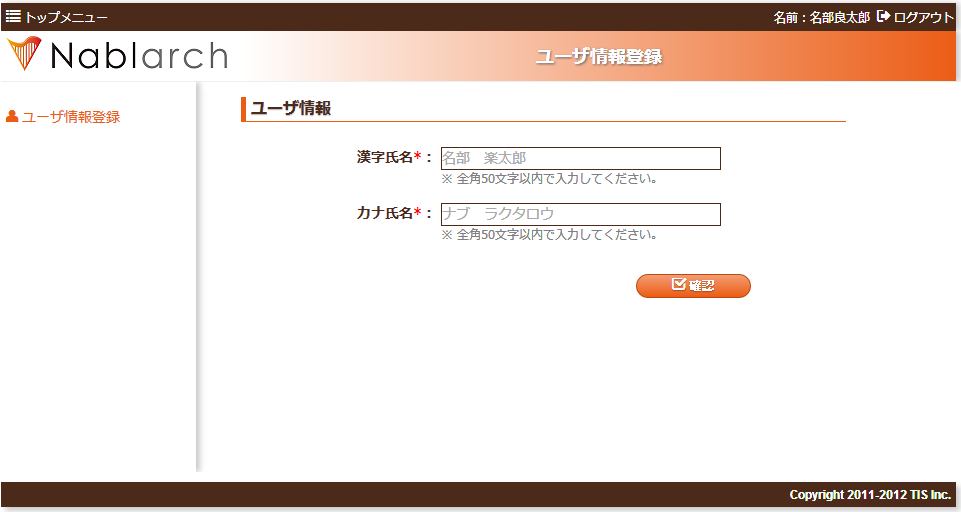
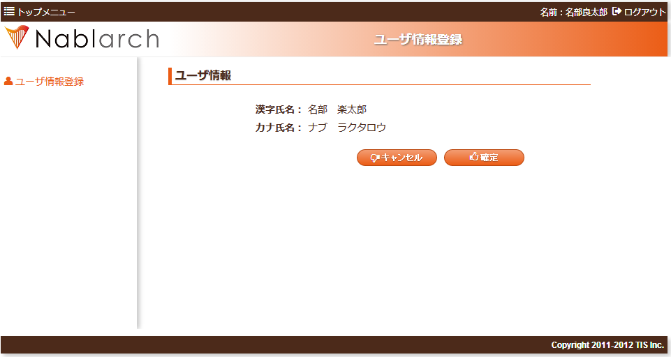
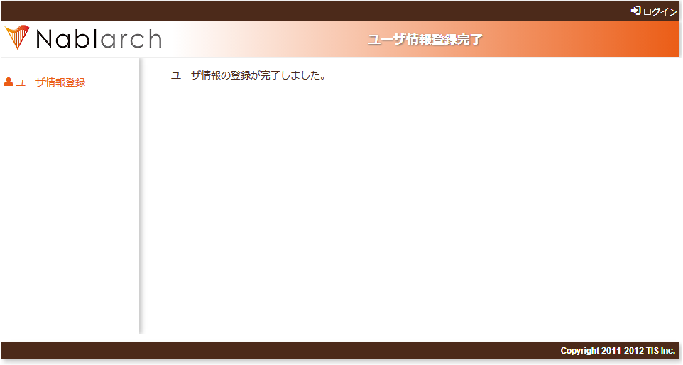

# 説明に使用する機能について

先に示した通り、本チュートリアルでは簡単なユーザ情報登録機能を実装しながら、Nablarch を使用したアプリケーション開発の手順を説明する。

## ユーザ情報登録機能の概要

これからの説明では、以下に示す通り、チュートリアル用のユーザ登録機能を実装していく。
画面遷移図からわかる通り、追加する機能は非常に簡易な登録機能のみである。

追加するユーザ情報登録機能では、新規ユーザを作成し以下の情報をデータベースに永続化する。

* 登録するユーザ情報

  | 項目名 | 意味 |
  |---|---|
  | ユーザID | 各ユーザ毎に自動採番されるシステムで一意の値 |
  | 漢字氏名 | ユーザ氏名（全角文字） |
  | カナ氏名 | ユーザ氏名の読み（全角カタカナ） |

ユーザ情報を登録する際の画面遷移は以下のようになる。

なお、画面遷移図上は登録確認画面から「キャンセル」の遷移が存在するが、本チュートリアルでは実装しない。

* 画面遷移図

  

## ユーザ情報登録機能の仕様

1. 画面仕様・イメージ

  下記の画面イメージについては、 `main/web/` 直下の「画面ID.jsp」ファイルを
  Firefoxで開くことで、実際にブラウザで確認することができる。

  **ユーザ情報登録画面**

  ユーザの新規登録フォームを表示する。

  「確認」ボタン押下時に登録画面の入力項目に対して精査を行う。

  精査がOKの場合に登録確認画面に登録内容(登録画面で入力された値)を表示する。

  精査がNGの場合は、登録画面に遷移し、エラーメッセージを表示する。

  

  **ユーザ情報登録確認画面**

  ユーザの入力内容を表示する。

  「確定」ボタン押下時に入力項目に対して精査を行い、精査がOKの場合には、登録内容をデータベースへ反映する。

  精査がNGの場合は、登録画面に遷移し、エラーメッセージを表示する。

  

  **ユーザ情報登録完了画面**

  登録完了画面を表示する。

  
2. 画面情報

  | 画面ID | 画面名称 | リクエスト |  |
  |---|---|---|---|
  | W11AC0201 | ユーザ情報登録画面 | RW11AC0201 | 登録画面初期表示処理 |
  | W11AC0202 | ユーザ情報登録確認画面 | RW11AC0202 | 登録入力確認処理 |
  | W11AC0203 | ユーザ情報登録完了画面 | RW11AC0204 | 登録処理 |
3. 登録対象テーブルの仕様

  3)-1 テーブル情報

  テーブル論理名：ユーザ

  テーブル物理名：USERS

  | カラム論理名 | カラム物理名 |
  |---|---|
  | ユーザID | USER_ID |
  | 漢字氏名 | KANJI_NAME |
  | カナ氏名 | KANA_NAME |

  3)-2 画面入力項目に対する精査仕様

  単項目精査

  | 論理名 | 精査内容 | メッセージID |
  |---|---|---|
  | 漢字氏名 | 必須 | デフォルト |
  |  | 文字種(全角) | デフォルト |
  |  | 文字列長(50桁以下) | デフォルト |
  | カナ氏名 | 必須 | デフォルト |
  |  | 文字種(全角カナ) | デフォルト |
  |  | 文字列長(50桁以下) | デフォルト |

  > **Note:**
> 上記表の「メッセージID」は、 Nablarch を使用したアプリケーション中で画面等アプリケーションからユーザに
  > 通知するメッセージを一意に特定するものである。
  > 「メッセージID」を使用することで、画面上に表示するメッセージを容易に管理できる。
4. 登録処理仕様

  登録対象カラム

  | カラム論理名 | カラム物理名 | 登録する値 |
  |---|---|---|
  | 漢字氏名 | KANJI_NAME | 入力項目.漢字氏名 |
  | カナ氏名 | KANA_NAME | 入力項目.カナ氏名 |
  | 作成者ID | INSERT_USER_ID | 実行ユーザ（NAFにより自動設定される。） |
  | 作成日時 | INSERT_DATE | システム日時（NAFにより自動設定される。） |
  | 更新者ID | UPDATED_USER_ID | 実行ユーザ（NAFにより自動設定される。） |
  | 更新日時 | UPDATED_DATE | システム日時（NAFにより自動設定される。） |
