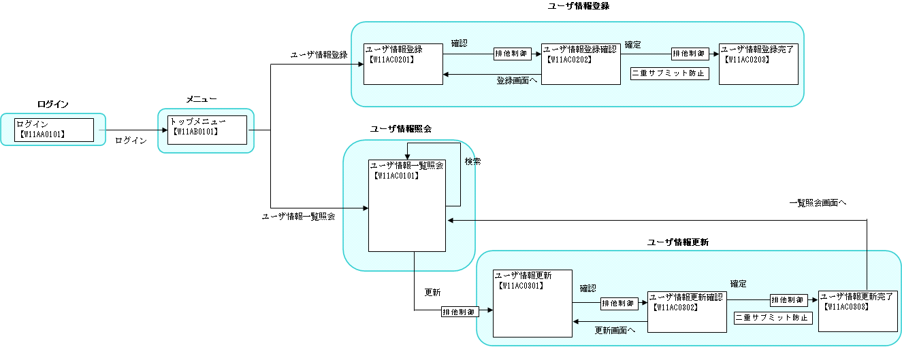
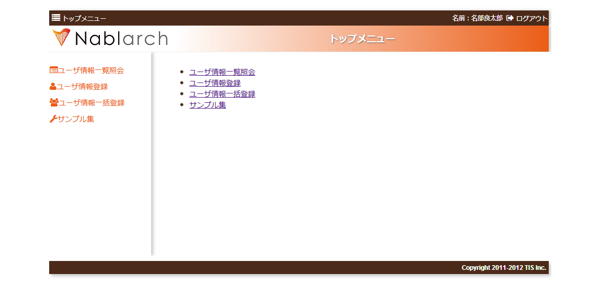

# サンプルアプリケーションの概要

## 画面遷移

サンプルアプリケーションの機能一覧: ログイン機能、メニュー機能、ユーザ情報照会機能、ユーザ情報登録機能、ユーザ情報更新機能、ユーザ情報削除機能、ユーザ情報一括削除機能

本書で説明する機能: ユーザ情報照会機能（一覧検索）、ユーザ情報登録機能（入力精査・画面遷移・DB挿入）、ユーザ情報更新機能（排他制御）

keywords

画面遷移, サンプルアプリケーション概要, ユーザ情報照会機能, ユーザ情報登録機能, ユーザ情報更新機能, ユーザ情報削除機能, ログイン機能, メニュー機能

## サンプルアプリケーションの機能と説明する処理

各機能で説明する処理パターン:

| 機能 | 処理 |
|---|---|
| ユーザ情報照会機能 | [画面初期表示(初期表示に必要な情報をデータベースから取得し、画面を表示する)](web-application-02_basic.md)、:ref:`一覧検索 <listSearch>` |
| ユーザ情報登録機能 | [入力内容の精査](web-application-04_validation.md)、:ref:`画面遷移 <screenTransition>`、:ref:`入力画面と確認画面の共通化 <sharingInputAndConfirmationJsp>`、[データベースへの挿入、二重サブミットの防止](web-application-07_insert.md) |
| ユーザ情報更新機能 | :ref:`一覧表示から個別の情報を扱う画面への遷移<submitParameter>`、:ref:`排他制御<exclusiveControl>` |

keywords

処理パターン, 画面初期表示, 一覧検索, 入力精査, 画面遷移, 二重サブミット防止, 排他制御, basic, listSearch, how_to_validate, sharingInputAndConfirmationJsp, insert, submitParameter, exclusiveControl

## ユーザ情報照会機能の仕様

**検索条件**: ログインID、漢字氏名、カナ氏名、グループ（ドロップダウン、表示の度に最新取得）、ユーザIDロック（ドロップダウン、表示の度に最新取得）

**精査**:
- 単項目精査を行う
- 検索条件は最低1つ必須

**検索動作**:
- 検索上限件数以内の場合、一覧画面に結果表示
- 1ページ表示上限を超えた場合、ページング機能でページ遷移可能
- ソート可能項目: ログインID、漢字氏名、カナ氏名

**詳細表示**: ログインIDリンクから以下を表示: ログインID、漢字氏名、カナ氏名、メールアドレス、内線番号、携帯電話番号、グループ、認可単位

keywords

ユーザ情報照会, 一覧検索, ページング, ソート, 検索条件精査, ドロップダウン, ユーザIDロック, グループ, 検索上限件数

## ユーザ情報登録機能の仕様

**登録フィールド**:
- ログインID（必須）、パスワード（必須）、パスワード確認用（必須）
- 漢字氏名（必須）、カナ氏名（必須）、メールアドレス（必須）
- 内線番号（ビル番号・個人番号、必須）
- 携帯電話番号（市外・市内・加入番号、任意）
- グループ（ドロップダウン、表示の度に最新取得、必須）
- 認可単位（ドロップダウン、表示の度に最新取得、任意）

**精査ルール**:
- 単項目精査
- パスワードとパスワード（確認用）は一致必須
- 携帯電話番号は全項目入力または全項目未入力
- ログインIDは既登録のものは使用不可
- グループ・認可単位はシステムに登録済みであること

**画面フロー**:
- 精査エラー時: 登録画面にエラーメッセージ表示
- 精査成功時: 確認画面を表示し、登録指示でDBに登録

keywords

ユーザ情報登録, 入力精査, 二重サブミット防止, 確認画面, パスワード確認, 携帯電話番号バリデーション, ログインID重複チェック, 認可単位, グループ

## ユーザ情報更新機能の仕様

**初期表示項目**: ログインID、漢字氏名、カナ氏名、メールアドレス、内線番号、携帯電話番号、グループ（ドロップダウン、表示の度に最新取得）、認可単位（ドロップダウン、表示の度に最新取得）

**更新フィールド**:
- 漢字氏名（必須）、カナ氏名（必須）、メールアドレス（必須）
- 内線番号（ビル番号・個人番号、必須）
- 携帯電話番号（市外・市内・加入番号、任意）
- グループ（ドロップダウン、表示の度に最新取得、必須）
- 認可単位（ドロップダウン、表示の度に最新取得、任意）

**精査ルール**:
- 単項目精査
- 携帯電話番号は全項目入力または全項目未入力
- グループ・認可単位はシステムに登録済みであること

**画面フロー**:
- 精査エラー時: 更新画面にエラーメッセージ表示
- 精査成功時: 確認画面を表示し、更新指示でDBを更新
- 排他制御を実施。排他制御エラー時はユーザ情報詳細画面にエラーメッセージ表示

keywords

ユーザ情報更新, 排他制御, 入力精査, 確認画面, 携帯電話番号バリデーション, 認可単位, グループ, 初期表示

## サンプルアプリケーションの実行方法

1. 開発環境構築ガイドに従いログインする
2. トップメニューで使用したい機能をクリックする

以下の機能はユーザ情報一覧照会の結果から実行できる: ユーザ情報更新機能、ユーザ情報削除機能、ユーザ情報一括削除機能

keywords

サンプルアプリ実行, トップメニュー, 開発環境, ログイン, ユーザ情報一覧照会

