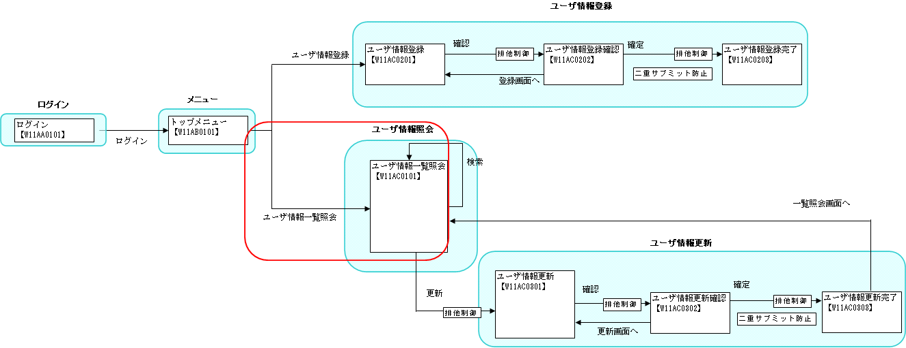

# 画面初期表示

## 本項で説明する内容

### 説明内容

本項では、以下の内容を説明する。

* 画面上のリンクやボタンを押下後、ビジネスロジックを実行して次の画面へ遷移するまでの処理
* 基本的なデータベースアクセス処理

### 作成内容

本項で説明するのは、下記画面遷移図の赤丸の部分である。



取りあげるソースコードは以下のとおり。

| 名称(右クリック->保存でダウンロード) | ステレオタイプ | 処理内容 |
|---|---|---|
| [CM311AC1Component.java](../../../knowledge/assets/web-application-02-basic/CM311AC1Component.java) | Component | ユーザ一覧照会画面に表示する、検索条件のグループ欄ドロップダウンリストに使用するグループの一覧をデータベースから取得する。  本クラスから使用するSQLファイルは、下記リンク先のファイルを参照すること。 (右クリック->保存でダウンロード)  [CM311AC1Component.sql](../../../knowledge/assets/web-application-02-basic/CM311AC1Component.sql) |
| [W11AC01Action.java](../../../knowledge/assets/web-application-02-basic/W11AC01Action.java) | Action | 作成した上記Componentのメソッドを呼び出し、結果をリクエストスコープに格納、JSPに遷移させる。 |
| [W11AC0101.jsp](../../../knowledge/assets/web-application-02-basic/W11AC0101.jsp) | View | ユーザ一覧照会画面を表示する。 |

ステレオタイプについては [業務コンポーネントの責務配置](../../about/about-nablarch/about-nablarch-01-NablarchOutline.md#stereotype) を参照。

## 作成手順

### ビジネスロジック(Component)の作成

*CM311AC1Componentクラス* を作成し、以下のメソッドを追加する。
このメソッドの目的は、検索条件のグループ欄ドロップダウンリストに使用する
グループの一覧をデータベースから取得することである。

追加するメソッド
`SqlResultSet getUserGroups()`

> **Note:**
> サンプルアプリケーションでは、このメソッドをユーザ一覧照会機能、ユーザ情報登録機能の両機能で共用しているため、実装はComponentで行っている。
> 一つの機能のみで使用する（1つのActionクラスからしか呼ばれない）ロジックの場合、その機能(Actionクラス)に実装すること。

処理内容は以下のとおり。
プリペアドステートメントの作成。(プリペアドステートメントは、DbAccessSupportで提供されるヘルパーメソッドを使用して生成する）

検索を実行し、結果を返す。

* CM311AC1Component.sql

```sql
-- ユーザグループ全件検索（表示）
SELECT_ALL_UGROUPS=
SELECT
    UGROUP_ID,
    UGROUP_NAME
FROM
    UGROUP
ORDER BY
    UGROUP_ID
```

* CM311AC1Component.java

```java
// 【説明】
// DbAccessSupportクラスを継承する。
class CM311AC1Component extends DbAccessSupport {

    /**
     * ユーザグループの検索を実行する。
     *
     * @return 検索結果
     */
     SqlResultSet getUserGroups() {
        // 【説明】プリペアドステートメントの作成
        // SQL_IDには、上記のCM311AC1Component.sqlで定義している「SELECT_ALL_UGROUPS」を指定する。
        SqlPStatement statement = getSqlPStatement("SELECT_ALL_UGROUPS");

        // 【説明】検索実行
        return statement.retrieve();
    }
}
```

( [記載しているサンプルプログラムソースコードの注意事項](../../about/about-nablarch/about-nablarch-aboutThis.md#sourcecode) 参照)

### ビジネスロジックを呼び出す処理(Action)の作成

#### Actionのメソッド名命名方法

Actionのメソッド名は次のようにする。
"do" + リクエストID

例を以下に示す。

リクエストID:

```
RW11AC0101
```

Actionのメソッド名:

```
doRW11AC0101
```

> **Note:**
> 厳密には以下のようなルールになっている。

> リクエストURI:http://サーバアドレス/action/△△△/・・・/×××/□□□の時、

> **/△△△/・・・/×××/**:

> ```
> Actionのパッケージ名のss11AA以降の部分+Action名(×××)。Actionを示す。
> ```

> **□□□**:

> ```
> リクエストID。Actionのメソッド名(の一部)を示す。実際に呼び出されるActionのメソッドは以下のとおり。
> 
>   (リクエストのHTTPメソッド名、もしくは"do")+□□□
> ```

> 以下に例を示す。太字部分が対応している。

> URI
> http://localhost:8080/action/**ss11AA/W11AA01Action/RW11AA0101**
> クラス
> nablarch.sample. **ss11AC.W11AC01Action#doRW11AC0101**

#### Actionの作成

*W11AC01Actionクラス* を作成し、 [Actionのメソッド名命名方法](../../guide/web-application/web-application-02-basic.md#actionclassmethodname) に従い以下のメソッドを追加する。

`HttpResponse doRW11AC0101(HttpRequest req, ExecutionContext ctx)`

処理内容は以下のとおり。
Componentのインスタンス化。

ビジネスロジックの呼び出し。

ビジネスロジックの戻り値をリクエストスコープに格納。

/ss11AC/W11AC0101.jspへ遷移させる。 [1]

```java
/**
 * ユーザ一覧照会画面を表示する。<br/>
 *
 * @param req リクエストコンテキスト
 * @param ctx HTTPリクエストの処理に関連するサーバ側の情報
 * @return HTTPレスポンス
 */
public HttpResponse doRW11AC0101(HttpRequest req, ExecutionContext ctx) {
    CM311AC1Component function = new CM311AC1Component(); // 【説明】Componentのインスタンス化
    SqlResultSet ugroupList = function.getUserGroups();   // 【説明】ビジネスロジックの呼び出し
    /* 【説明】
       ビジネスロジックの戻り値をリクエストスコープに格納。第1引数はキー名、第2引数は格納するオブジェクト。
       JSPでは、この第1引数で指定したキーで第2引数に渡したオブジェクトを取得する。 */
    ctx.setRequestScopedVar("ugroupList", ugroupList);

    /* 【説明】/ss11AC/W11AC0101.jspへ遷移させる。
        JSPに遷移させる場合は、servlet://"JSPのパス"と記述する。
        別のリクエストID(他の処理、メソッド)を実行させるときは、forward://"リクエストIDのパス"と記述する。
        servletやforwardのどちらも書かなかった場合のデフォルトはservlet://である。 */
    return new HttpResponse("/ss11AC/W11AC0101.jsp");
}
```

( [記載しているサンプルプログラムソースコードの注意事項](../../about/about-nablarch/about-nablarch-aboutThis.md#sourcecode) 参照)

遷移させるJSPファイルのパスは、基本的にアプリケーションの web ルートディレクトリからの絶対パスで記述する。
ただし、言語によって遷移先のファイルを切り替える場合に、web ルート直下に言語フォルダを配置してその言語フォルダ配下にJSPファイルを配置することがある。
この場合、言語フォルダからの絶対パスで記述する。

ここで示した例は後者の場合であり、
W11AC0101.jspを「<webルートディレクトリ>/<言語>/ss11AC/W11AC0101.jsp」に配置した場合のものである。

※ <言語>の箇所にはユーザが選択した言語("ja"や"en")が自動的に設定される。
これはアプリケーションの国際化にあたり、言語ごとに異なるJSPファイルを配置するための機能である。
なお、通常のプロジェクトではプロジェクトが決めた国際化の方針に従いJSPファイルを配置すること。
国際化の詳細については、 [アーキテクチャ解説書](../../../fw/reference/01_SystemConstitution/02_I18N.html) を参照のこと。

### View(JSP)の作成

以下の内容で *W11AC0101.jsp* を作成する。

JSPの動的な部分は、フレームワークが提供するカスタムタグライブラリ及びサンプル提供されるタグファイルを使用して作成する。
カスタムタグライブラリのネームスペースには「n」を付け、タグファイルのネームスペースにはタグファイルの配置ディレクトリ名を付ける。

> **Note:**
> 本ガイドでは、サンプルで提供される以下タグファイルを使用している。

> * >   template
> * >   button
> * >   column
> * >   field
> * >   link
> * >   tab
> * >   table

> サンプルとして提供されるタグファイルは、Nablarch導入プロジェクトのアーキテクの判断により変更（追加、削除含む）が行われる。
> このため、Nablarch導入プロジェクトでは本ガイドではなくアーキテクトより提供されるガイドなどを元にJSPを作成すること。

取得したグループの一覧は、サンプルタグファイルの **field:pulldown** を使用してドロップダウンとして画面出力する。

```./_source/02/W11AC0101.jsp

```

( [記載しているサンプルプログラムソースコードの注意事項](../../about/about-nablarch/about-nablarch-aboutThis.md#sourcecode) 参照)

> **Note:**
> 上記サンプルコードでは、検索結果(ugroupList)からugroupNameとugroupIdという名前で値を取得している。
> この点については、 [データベースアクセス実装例集](../../guide/web-application/web-application-01-DbAccessSpec-Example.md) の『 [取得したSqlResultSetの使用方法](../../guide/web-application/web-application-01-DbAccessSpec-Example.md#how-to-use-sql-result-set) 』を参照

## 次に読むもの

* [データベースアクセス処理を詳しく知りたい時](../../../fw/reference/02_FunctionDemandSpecifications/01_Core/04_DbAccessSpec.html)
* [データベースアクセス処理の実例を知りたい時](./DB/01_DbAccessSpec_Example.html)
* [Actionのメソッド名とURIの関係を詳しく知りたい時](../../../fw/reference/handler/HttpMethodBinding.html#http-dispatch)
* [カスタムタグの使用方法を詳しく知りたい時](../../../fw/reference/02_FunctionDemandSpecifications/03_Common/07_WebView.html)
* [言語ごとにJSPファイルおよび静的ファイルを切り替える方法を詳しく知りたい時](../../../fw/reference/01_SystemConstitution/02_I18N.html)
