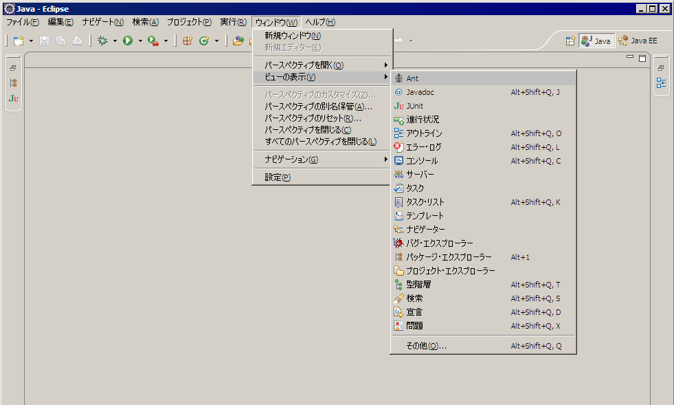
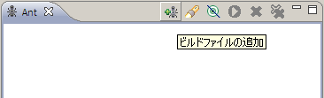
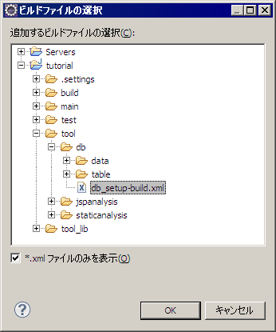
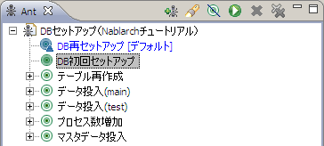

# マスタデータのセットアップ

> **Note:**
> マスタデータとは以下のようなデータを意味する。

> * >   「コードテーブル」や「メッセージテーブル」のようなプロジェクトで共通的に使用できるようなデータ
> * >   認可チェック機能に必要なデータ
> * >   採番機能に必要なデータ

> 上記データのほとんどは、プロジェクトの共通データとして提供されているため、プログラマが個別に追加する必要はない。
> しかし「認可チェック機能に必要なデータ」については、実装時に追加する運用のほうが容易な場合があるため、プログラマが修正する
> 運用のプロジェクトもある。
> 開発時にマスタデータの編集が必要であるか否かは、プロジェクトのアーキテクトに確認すること。

> **Warning:**
> 実際に開発を進める上ではマスタデータについて、以下の点に注意すること。

> * >   開発時はマスタデータがDBに登録されていることを前提に作成する。つまり、単体テストで改めて定義しないこと
> * >   マスタデータが更新されたらすぐに取り込むこと

## マスタデータのセットアップを行うAntターゲット

| Antビルドファイル | 実行するターゲット |
|---|---|
| tool/db/db_setup-build.xml | DB初回セットアップ（2回目以降は「DB再セットアップ」） |

## Eclipseからマスタデータセットアップツールを実行する。

1. Antビューを表示する。

  
2. Antビューの「ビルドファイルの追加」を選択する。

  
3. 追加するビルドファイルに、上記のAntビルドファイルを選択する。

  
4. マスタデータセットアップのターゲットを実行する。

  

以降は、Antビューに登録された「DB再セットアップ」ターゲットを実行すれば、
データベースにマスタデータが反映される。

詳細は [マスタデータ投入ツール](../../development-tools/toolbox/toolbox-01-MasterDataSetupTool.md#master-data-setup-tool) を参照。
