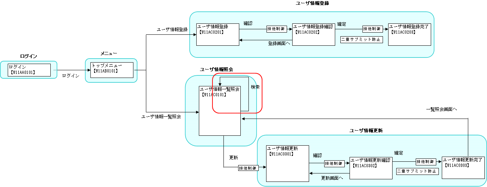

# 一覧検索

**公式ドキュメント**: [一覧検索]()

## 

一覧検索の実装で作成・編集するファイル:

| ファイル | ステレオタイプ | 処理内容 |
|---|---|---|
| [W11AC01Action.java](../../../knowledge/guide/web-application/assets/web-application-03_listSearch/W11AC01Action.java) | Action | 検索条件に一致するデータをDBから取得し、リクエストスコープに格納してJSPに遷移。SQLファイル: [W11AC01Action.sql](../../../knowledge/guide/web-application/assets/web-application-03_listSearch/W11AC01Action.sql) |
| [W11AC0101.jsp](../../../knowledge/guide/web-application/assets/web-application-03_listSearch/W11AC0101.jsp) | View | 検索結果を表示 |



**クラス**: `W11AC01Action`（`DbAccessSupport`継承）

SQL定義（W11AC01Action.sql）、SQL ID: `SELECT_USER_BY_CONDITION`

**条件可変SQL機能（`$if`構文）**: `search`実行時に渡すオブジェクトのフィールドがnullでも空文字でなければ`{}`内の条件がWHERE句に組み込まれる。

```sql
$if (loginId) {SA.LOGIN_ID = :loginId}
AND $if (kanjiName) {USR.KANJI_NAME LIKE :%kanjiName%}
AND $if (kanaName) {USR.KANA_NAME  LIKE :%kanaName%}
AND $if (ugroupId) {UGRP.UGROUP_ID = :ugroupId}
AND $if (userIdLocked) {SA.USER_ID_LOCKED = :userIdLocked}
```

**LIKE検索機能（`:%field%`構文）**: LIKE検索時のエスケープ処理・`%`付加のJavaコードは不要。

**動的ORDER BY機能（`$sort`構文）**: フィールド値に応じたORDER BY条件が組み込まれる。

```sql
$sort (sortId) {
    (1 SA.LOGIN_ID)
    (2 SA.LOGIN_ID DESC)
    (3 USR.KANJI_NAME, SA.LOGIN_ID)
    (4 USR.KANJI_NAME DESC, SA.LOGIN_ID)
    (5 USR.KANA_NAME, SA.LOGIN_ID)
    (6 USR.KANA_NAME DESC, SA.LOGIN_ID)
}
```

**検索メソッド実装**:

```java
private SqlResultSet selectByCondition(W11AC01SearchForm condition) {
    return search("SELECT_USER_BY_CONDITION", condition);
}
```

`search`を使う場合、LIKE検索のエスケープや`%`付加のJavaコードは不要。

> **注意**: [03_field](#s5) を明示的に使用する場合（`getParameterizedSqlStatement`使用時）、第2引数と`retrieve`の引数には**同じインスタンス**を渡すこと。異なるインスタンスを渡すと意図した条件で検索されない。

`getParameterizedSqlStatement`使用時の実装例:

```java
ParameterizedSqlPStatement statement = getParameterizedSqlStatement("SELECT_USER_BY_CONDITION", condition);
return statement.retrieve(condition);
```

<details>
<summary>keywords</summary>

W11AC01Action, W11AC0101, 一覧検索, 検索画面, 画面遷移図, DbAccessSupport, SqlResultSet, selectByCondition, search, 条件可変SQL, LIKE検索, 動的ORDER BY, $if構文, $sort構文, getParameterizedSqlStatement, ParameterizedSqlPStatement

</details>

## 本項で説明する内容

本ガイドで説明する内容:

- 条件を指定した一覧検索処理
- 一覧検索結果を表示するJSPの作成方法

`W11AC01Action`にリクエスト処理メソッド`doRW11AC0102`を追加する。

**アノテーション**: `@OnError(type = ApplicationException.class, path = "/ss11AC/W11AC0101.jsp")`

**バリデーション**:

```java
ValidationContext<W11AC01SearchForm> searchConditionCtx =
    ValidationUtil.validateAndConvertRequest("11AC_W11AC01", W11AC01SearchForm.class, req, "search");
searchConditionCtx.abortIfInvalid();
```

検索条件入力チェックは [how_to_validate](web-application-04_validation.md) を参照。

**例外処理**: `TooManyResultException`（検索結果が上限超過時にスロー）は`ApplicationException`に変換し、`MessageUtil.createMessage(MessageLevel.ERROR, "MSG00035", e.getMaxResultCount())`でエラーメッセージを生成。

**検索結果のリクエストスコープ設定**:

```java
ctx.setRequestScopedVar("searchResult", searchResult);
ctx.setRequestScopedVar("resultCount", condition.getResultCount());
```

**View (JSP)**: 一覧表示用カスタムタグを使用するため、JSP内でのループ処理は不要。検索結果はリスト-マップ形式（1レコード=Map、全体=List）で取得できる。カスタムタグの使用方法は :ref:`custom_tag_paging` を参照。

<details>
<summary>keywords</summary>

一覧検索処理, JSP作成, 条件指定検索, 一覧検索, @OnError, ValidationUtil, validateAndConvertRequest, ValidationContext, TooManyResultException, ApplicationException, HttpResponse, W11AC01SearchForm, doRW11AC0102, MessageUtil, バリデーション, 一覧表示カスタムタグ

</details>

## 

検索条件を保持するFormクラス作成のポイント:

- **`ListSearchInfo`** クラスを継承することで、ページングや検索結果の並び替えを容易に実現できる
- `ListSearchInfo`を継承した場合、使用する機能によって実装を追加する必要がある

- [データベースアクセス処理を詳しく知りたい時](../../../fw/reference/02_FunctionDemandSpecifications/01_Core/04_DbAccessSpec.html)
- [データベースアクセス処理の実例を知りたい時](./DB/01_DbAccessSpec_Example.html)
- [カスタムタグの使用方法を詳しく知りたい時](../../../fw/reference/02_FunctionDemandSpecifications/03_Common/07_WebView.html)

<details>
<summary>keywords</summary>

ListSearchInfo, SearchForm, ページング, 並び替え, 検索条件フォーム, データベースアクセス, カスタムタグ, 一覧表示

</details>

## Formクラスの作成

**クラス**: `W11AC01SearchForm`（`ListSearchInfo`を継承）

`ListSearchInfo`継承時の検索条件Formクラス実装ポイント:

1. コンストラクタで`Map<String, Object> params`から検索条件を設定し、`ListSearchInfo`のプロパティ（`pageNumber`、`sortId`）もコンストラクタ内でセット:

```java
public W11AC01SearchForm(Map<String, Object> params) {
    loginId = (String) params.get("loginId");
    kanjiName = (String) params.get("kanjiName");
    kanaName = (String) params.get("kanaName");
    ugroupId = (String) params.get("ugroupId");
    userIdLocked = (String) params.get("userIdLocked");
    systemAccount = (SystemAccountEntity) params.get("systemAccount");

    // ListSearchInfoのプロパティへの設定
    setPageNumber((Integer) params.get("pageNumber"));
    setSortId((String) params.get("sortId"));
}
```

2. 精査対象プロパティ（`SEARCH_COND_PROPS`）にListSearchInfoのプロパティ（`pageNumber`、`sortId`）を含める:

```java
private static final String[] SEARCH_COND_PROPS =
    new String[] {"loginId", "kanjiName", "kanaName", "ugroupId", "userIdLocked", "pageNumber", "sortId"};
```

3. ListSearchInfoのセッターをオーバーライドし、アノテーションで精査ルールを定義:

```java
@PropertyName("開始ページ")
@Required
@NumberRange(max = 10, min = 1)
@Digits(integer = 2)
public void setPageNumber(Integer pageNumber) {
    super.setPageNumber(pageNumber);
}

@PropertyName("ソートID")
@Required
public void setSortId(String sortId) {
    super.setSortId(sortId);
}
```

4. `@ValidateFor("search")` で単項目精査→項目間精査の順で実施:

```java
@ValidateFor("search")
public static void validateForSearch(ValidationContext<W11AC01SearchForm> context) {
    ValidationUtil.validate(context, SEARCH_COND_PROPS);
    if (!context.isValid()) {
        return;
    }
    // 項目間精査（isValidSearchConditionで検証）
}
```

<details>
<summary>keywords</summary>

W11AC01SearchForm, ListSearchInfo, SystemAccountEntity, @PropertyName, @Required, @NumberRange, @Digits, @ValidateFor, ValidationContext, ValidationUtil, SEARCH_COND_PROPS, 精査対象プロパティ

</details>

## ビジネスロジック(Action)の作成

一覧検索のビジネスロジックで使用するDBアクセス機能:

- [03_field](#s5) — Javaオブジェクトのフィールドの値をバインド変数に設定する機能
- :ref:`03_SQL` — 条件が可変のSQL文を組み立てる機能
- [03_like](#s7) — LIKE検索を簡易的に実装できる機能
- :ref:`03_orderBy` — ORDER BY句を動的に変更する機能

> **注意**: 本処理のビジネスロジックは他の処理で使用しないため、ComponentクラスではなくActionクラスに作成する。

<details>
<summary>keywords</summary>

ParameterizedSqlPStatement, DbAccessSupport, ビジネスロジック, Actionクラス, データベースアクセス

</details>

## Javaオブジェクトのフィールドの値をバインド変数に設定する機能

**クラス**: `ParameterizedSqlPStatement`

Javaオブジェクトのフィールド値をSQLバインド変数に一括設定する機能の使用方法:

1. `SqlPStatement`の代わりに`ParameterizedSqlPStatement`を使用（`DbAccessSupport#getParameterizedSqlStatement`で取得）
2. バインド変数は`?`ではなく`:フィールド名`で指定
3. `ParameterizedSqlPStatement#retrieve`の引数にJavaオブジェクトを渡すと、対応するフィールドの値が自動的にバインド変数に設定される

<details>
<summary>keywords</summary>

ParameterizedSqlPStatement, DbAccessSupport, getParameterizedSqlStatement, retrieve, バインド変数, オブジェクトフィールドバインド

</details>

## 条件が可変のSQL文を組み立てる機能

可変条件のSQL文を自動生成する機能。指定フィールドの値がnullまたは空文字(`""`)の場合は検索条件から除外し、値がある場合のみ条件に組み込む。

```sql
-- loginIdがnullもしくは空文字でない場合のみ検索条件に組み込まれる
WHERE $if (loginId) {LOGIN_ID = :loginId}
```

- nullか空文字かの判断は`DbAccessSupport#getParameterizedSqlStatement`実行時に引き渡すオブジェクトのフィールド値による
- `:loginId`に設定される値は`ParameterizedSqlPStatement#retrieve`実行時に引き渡すオブジェクトのフィールド値

<details>
<summary>keywords</summary>

$if, 可変条件SQL, 動的WHERE句, getParameterizedSqlStatement, ParameterizedSqlPStatement

</details>

## LIKE検索を簡易的に実装できる機能

LIKE検索の簡易実装機能:

- アプリケーションプログラマはLIKE条件のエスケープ処理を実装不要
- Javaコードに`%`を付加する処理は不要（SQL文に`%`を記述）

```sql
-- kanjiNameフィールドの値で中間一致検索（エスケープ処理・%付加の実装不要）
WHERE USR.KANJI_NAME LIKE :%kanjiName%
```

<details>
<summary>keywords</summary>

LIKE検索, 中間一致検索, エスケープ処理不要, :%kanjiName%, LIKE条件

</details>

## ORDER BY句を動的に変更する機能

`$sort`を使用してORDER BY句を動的に変更する機能。フィールドに設定した値に対応するORDER BY条件が自動的に組み込まれる。

```sql
-- sortIdの値でORDER BY句を切り替える（例: sortId=2 → ORDER BY SA.LOGIN_ID DESC）
$sort (sortId) {
    (1 SA.LOGIN_ID)
    (2 SA.LOGIN_ID DESC)
    (3 USR.KANJI_NAME, SA.LOGIN_ID)
    (4 USR.KANJI_NAME DESC, SA.LOGIN_ID)
    (5 USR.KANA_NAME, SA.LOGIN_ID)
    (6 USR.KANA_NAME DESC, SA.LOGIN_ID)
}
```

<details>
<summary>keywords</summary>

$sort, ORDER BY, 動的ソート, sortId, 並び替え

</details>
