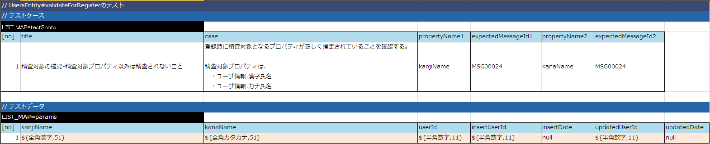

# Entityクラス（精査処理）の実装

ユーザ登録時に画面から入力される項目を精査する処理をEntityに実装する。

Entityクラスに以下のフローで精査処理を実装する。

* Entityクラスに実装する精査処理の単体テストを作成
* Entityクラスの単体テストを実行
* Entityクラスに精査処理を実装
* Entityクラスの単体テストを実行

## Entityクラスに実装する精査処理の単体テストを作成

1. Entity単体テストデータの作成

  Entityに実装する精査処理の単体テストでは、以下を検証する。 [1]

  * 精査対象となっているプロパティに対して、精査が行われていること。
  * 精査対象となっていないプロパティに対して、精査が行われていないこと。

  | データシート格納フォルダ | データシートファイル名 | シート名 |
  |---|---|---|
  | test/java/nablarch/sample/ss11/entity/ | UsersEntityTest.xlsx | testValidateForRegister |

  以下に、テストデータの例を示しておく。（詳細は、 [Form/Entityのクラス単体テスト](../../development-tools/testing-framework/testing-framework-01-entityUnitTest.md#entityunittest) 参照）

  

  各プロパティが精査仕様に従って正しく精査されることは、Entityを自動生成する、
  もしくはEntityの単項目精査テストで検証する、などの方法で担保されている。

1. Entity単体テストコードの作成

  Entityの精査処理は、自動生成されたEntity（Abstractクラスとなっている）を拡張したクラスに実装するため、
  まずは、精査処理を実装するためのEntityクラスを準備する。

  | ソース格納フォルダ | ソースファイル名 |
  |---|---|
  | main/java/nablarch/sample/ss11/entity/ | UsersEntity.java |

  ```java
  /**
   * ユーザテーブルの情報を保持するクラス。（精査処理を実装）
   *
   * @author Nablarch taro
   * @since 1.0
   */
  public class UsersEntity extends AbstractUsersEntity {
  
      /**
       * Mapを引数にとるコンストラクタ。
       *
       * @param params 項目名をキーとし、項目値を値とするMap。
       */
      public UsersEntity(Map<String, Object> params) {
          super(params);
      }
  
  }
  ```

  チュートリアルアプリケーションで提供しているEntityクラスの単体テストコードとして
  登録機能用のテストメソッド(`testValidateForRegister`)を追加する。

  | ソース格納フォルダ | ソースファイル名 | メソッド名 |
  |---|---|---|
  | test/java/nablarch/sample/ss11/entity/ | UsersEntityTest.java | testValidateForRegister |

  ```java
  /**
   * {@link UsersEntity}の単体テストクラス。
   *
   * テスト内容はエクセルシート参照のこと。
   *
   * @author Nablarch taro
   * @since 1.0
   */
  public class UsersEntityTest extends EntityTestSupport {
  
      /**
       * {@link UsersEntity#validateForRegister(nablarch.core.validation.ValidationContext)} のテスト。
       */
      @Test
      public void testValidateForRegister() {
          testValidateAndConvert(UsersEntity.class, "testValidateForRegister", "register");
      }
  
  }
  ```

## Entityクラスの単体テストを実行

単体テストを実行し、テストが失敗することを確認する。（精査メソッドを実装していない為）

> **Note:**
> クラス単体テストの実行方法は、テスト対象のクラス(～Test.java)を右クリックし、[実行]→[Junitテスト]を選択する。
> テスト失敗時には下記のように JUnit ビューにエラーが表示される。

> 

## Entityクラスに精査処理を実装

| ソース格納フォルダ | ソースファイル名 | メソッド名 |
|---|---|---|
| main/java/nablarch/sample/ss11/entity/ | UsersEntity.java | validateForRegister |

単項目精査の対象とするプロパティ名の配列を引数として、
単項目精査を実行するメソッド(`ValidationUtil#validate(ValidationContext, String[])`)を呼び出す。

```java
/**
 * ユーザ情報登録時に実施するバリデーション
 *
 * @param context バリデーションの実行に必要なコンテキスト
 */
@ValidateFor("register")
public static void validateForRegister(ValidationContext<UsersEntity> context) {

    // 【説明】①単項目精査対象となるプロパティ名を設定する。
    ValidationUtil.validate(context, new String[] {"kanjiName", "kanaName"});
}
```

## Entityクラスの単体テストを実行

単体テストを実行し、精査対象プロパティのみに対して精査が行われていることを確認する。

テストが成功した際は、下記のように JUnit ビューの結果に緑のバーが表示される（エラーは表示されない）。


