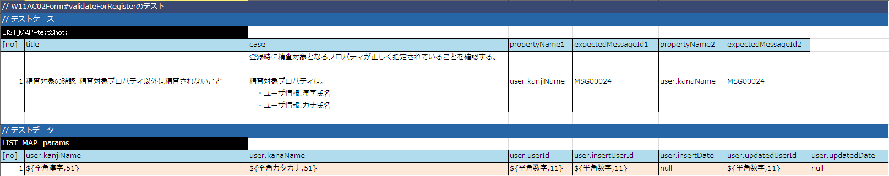

# Formクラスの実装

ユーザ登録画面に対応するFormクラスを以下のステップで実装する。

* Formクラスのプロパティの実装
* Formクラスの精査処理実装

  * Formクラスに実装する精査処理の単体テストを作成
  * Formクラスの単体テストを実行
  * Formクラスに精査処理を実装
  * Formクラスの単体テストを実行

Formクラスの精査処理実装は [Entityの精査処理実装フロー](../../guide/web-application/web-application-04-create-entity.md#entityクラス精査処理の実装) と同じフローで行う。

## Formクラスのプロパティの実装

本機能で使用するFormクラスを作成し、プロパティを実装する。

なお、Formクラスについては、コンストラクタ、ゲッター/セッターのテストはActionクラスの
リクエスト単体テストでカバーできるため、ここではテストを作成しない。

| ソース格納フォルダ | クラス名 |
|---|---|
| main/java/nablarch/sample/ss11AC | W11AC02Form |

1. Formのプロパティとしてuser（型：UsersEntity）を実装
2. コンストラクタを実装
3. ゲッター/セッターを実装

```java
/**
 * ユーザ情報登録で使用するユーザ情報を保持するフォーム。
 *
 * @author Nablarch Taro
 * @since 1.0
 */
public class W11AC02Form {

    /**
     * ユーザエンティティ
     */
    private UsersEntity user;

    /**
     * Mapを引数に取るコンストラクタ。
     *
     * @param data 各プロパティのデータを保持したMap
     */
    public W11AC02Form(Map<String, Object> data) {
        user = (UsersEntity) data.get("user");
    }

    /**
     * 登録対象のユーザ情報を取得する。
     *
     * @return 登録対象のユーザ情報
     */
    public UsersEntity getUser() {
        return user;
    }

    /**
     * 登録対象のユーザ情報を設定する。
     *
     * @param user 登録対象のユーザ情報
     */
    public void setUser(UsersEntity user) {
        this.user = user;
    }

}
```

## Formクラスの精査処理実装

### Formクラスに実装する精査処理の単体テストを作成

1. Form単体テストデータの作成
  Formクラスに登録機能の精査処理を実装するために、精査処理の単体テストデータを作成する。

  [Entity単体テストのテストデータ](../../guide/web-application/web-application-04-create-entity.md#entityクラスに実装する精査処理の単体テストを作成) と同じ観点で作成すればよい。

  今回の場合は、 `user` プロパティに対して、「漢字氏名」と「カナ氏名」の精査が行われていることのみ確認できればよい。

  | データシート格納フォルダ | データシートファイル名 | シート名 |
  |---|---|---|
  | test/java/nablarch/sample/ss11AC | W11AC02FormTest.xlsx | testValidateForRegister |

  以下に、テストデータの例を示しておく。（詳細は、 [Form/Entityのクラス単体テスト](../../development-tools/testing-framework/testing-framework-01-entityUnitTest.md#formentityのクラス単体テスト) 参照）

  
2. Form単体テストコードの作成

  | テストクラス格納フォルダ | テストクラス名 | テストメソッド名 |
  |---|---|---|
  | test/java/nablarch/sample/ss11AC | W11AC02FormTest | testValidateForRegister |

  ```java
  /**
   * {@link W11AC02Form}のテスト。
   *
   * @author Nablarch Taro
   * @since 1.0
   */
  public class W11AC02FormTest extends EntityTestSupport {
  
      /**
       * {@link W11AC02Form#validateForRegister(nablarch.core.validation.ValidationContext)} のテスト。
       */
      @Test
      public void testValidateForRegister() {
          testValidateAndConvert(W11AC02Form.class, "testValidateForRegister", "register");
      }
  }
  ```

### Formクラスの単体テストを実行

単体テストを実行し、テストが失敗することを確認する。（精査メソッドを実装していない為）

### Formクラスに精査処理を実装

| ソース格納フォルダ | クラス名 | メソッド名 |
|---|---|---|
| main/java/nablarch/sample/ss11AC | W11AC02Form | validateForRegister |

1. 単項目精査を実施するプロパティに、精査用のアノテーションを付与

  | プロパティ | アノテーション |
  |---|---|
  | user | nablarch.core.validation.ValidationTarget |
2. 単項目精査を実行するメソッド(`ValidationUtil#validate(ValidationContext, String[])`)の引数として上記プロパティを指定

  ```java
  /**
   * 登録対象のユーザ情報を設定する。
   *
   * @param user 登録対象のユーザ情報
   */
  // 【説明】①単項目精査を実施するプロパティ「user」に@ValidationTargetを付与
  @ValidationTarget
  public void setUser(UsersEntity user) {
      this.user = user;
  }
  
  /**
   * ユーザ情報登録時に実施するバリデーション
   *
   * @param context バリデーションの実行に必要なコンテキスト
   */
  @ValidateFor("register")
  public static void validateForRegister(ValidationContext<W11AC02Form> context) {
  
      // 【説明】②単項目精査対象項目変数のセット
      // プロパティとして設定したエンティティ内の単項目精査を実行する。
      ValidationUtil.validate(context, new String[] {"user"});
  }
  ```

### Formクラスの単体テストを実行

Form単体テストを実行し、UsersEntityの単項目精査呼び出しが行われていることを確認する。
