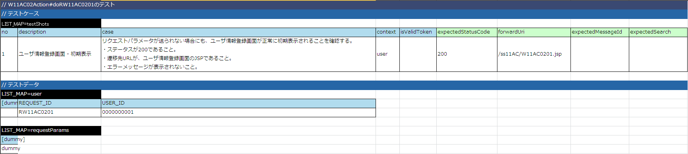

# 登録画面初期表示の実装

登録画面の初期表示は、以下のステップで実装する。

* Actionクラスの実装

  * リクエスト単体テストクラスの作成
  * リクエスト単体テストデータシートの作成
  * リクエスト単体テスト実施
  * Actionクラスの新規作成
  * リクエスト単体テスト実施
* JSPの実装

  * JSPの作成
  * JSPの表示確認
  * JSP静的チェックツールの実行

## Actionクラスの実装

### リクエスト単体テストクラスの作成

| テストクラス作成フォルダ | テストクラス名 | リクエスト単体テスト親クラス名 |
|---|---|---|
| test/java/nablarch/sample/ss11AC | W11AC02ActionRequestTest | BasicHttpRequestTestTemplate |

リクエスト単体テストを作成するに当たり、テスト対象クラスへアクセスされる際のURLを指定する必要がある。

チュートリアルアプリケーションでは、Nablarchの機能によりURIは以下の形式で解釈される。

```
/action/`パッケージ名`/`アクションクラス名`/`メソッド名からdoを除いた文字列`
```

なお、パッケージ名は、 nablarch.sample.までは無視され、それ以降の . が / に置換されてURIとなる。

| テスト対象クラス | ベースURI |
|---|---|
| nablarch.sample.ss11AC.W11AC02Action | /action/ss11AC/W11AC02Action/ |

リクエスト単体テストは、 `AbstractHttpRequestTestTemplate#execute(String)` に、テストデータの記載されているシート名を指定して実行する。

```java
/**
 * {@link W11AC02Action}のテスト
 *
 * @author Nablarch Taro
 * @since 1.0
 */
public class W11AC02ActionRequestTest extends BasicHttpRequestTestTemplate {

    // 【説明】①ターゲットクラスのベースURIを返却する
    @Override
    protected String getBaseUri() {
        return "/action/ss11AC/W11AC02Action/";
    }

    // 【説明】②リクエスト単体テストを実行

    /**
     * {@link W11AC02Action#doRW11AC0201(nablarch.fw.web.HttpRequest, nablarch.fw.ExecutionContext)} のテスト
     */
    @Test
    public void testRW11AC0201() {
        execute("testRW11AC0201");
    }

}
```

### リクエスト単体テストデータシートの作成

ここでは、以下を検証するためのテストデータを作成する。（ [リクエスト単体テストデータシートの書き方](../../development-tools/testing-framework/testing-framework-02-requestunittest-index.md#テストケース一覧) ）

* 登録画面の初期表示に必要なパラメータがリクエストに格納されていること。
* 表示するJSPが、登録画面のものであること。
* レスポンスのステータスが `OK` であること。

| ブック名 | シート名 |
|---|---|
| W11AC02ActionRequestTest.xlsx | testRW11AC0201 |



> **Warning:**
> 現在のリクエスト単体テストでは、テストデータとしてテスト共通データシート(シート名：setUpDb)が必須である為、データのセットアップが不要な場合でもシートを作成すること。シート内には何も書かなくてよい。

### リクエスト単体テスト実施

リクエスト単体テストを実施し、テストが失敗することを確認する。（Actionクラスを作成していない為）

コンソールログに以下の内容が出力されれば良い。

ステータスコード404の箇所で処理がENDしていること。

＜出力内容＞

```none
2011-09-28 18:25:28.041 -INFO- root [201109281825279950001] boot_proc = [] proc_sys = [] req_id = [RW11AC0201] usr_id = [0000000001] @@@@ END @@@@ rid = [RW11AC0201] uid = [0000000001] sid = [15dbmk0lzycbo1ajvrs2pqesk1] url = [http://127.0.0.1/action/ss11AC/W11AC02Action/RW11AC0201] status_code = [404] content_path = [/PAGE_NOT_FOUND_ERROR.jsp]
```

### Actionクラスの新規作成

| ソース格納フォルダ | クラス名 | メソッド名 |
|---|---|---|
| main/java/nablarch/sample/ss11AC | W11AC02Action | "do" ＋ RW11AC0201（登録画面初期表示のリクエストID） |

ユーザ情報登録画面のJSP：W11AC0201.jspを指定して、 `HttpResponse` を作成し返却する。

```java
/**
 * ユーザー登録機能のアクションクラス。
 *
 * @author Nablarch Taro
 * @since 1.0
 */
public class W11AC02Action extends DbAccessSupport {

    /**
     * ユーザの新規登録フォームを表示する。
     *
     * @param req HTTPリクエスト
     * @param ctx 実行時コンテキスト
     * @return HTTPレスポンス
     */
    public HttpResponse doRW11AC0201(HttpRequest req, ExecutionContext ctx) {

        // 【説明】①ユーザ情報登録画面へ遷移
        return new HttpResponse("/ss11AC/W11AC0201.jsp");
    }

}
```

### リクエスト単体テスト実施

リクエスト単体テストを実施し、Actionクラスまで処理が到達していることを確認する。

コンソールログに以下の内容が出力されれば良い。

* Actionクラスまで処理到達

  ログ中の「@@@@ DISPATCHING CLASS @@@@」の次に「BEFORE ACTION」が出力されていれば、Actionまで処理が到達している。

  ＜出力内容＞

  ```none
    2011-09-28 18:26:39.163 -INFO- root [201109281826391630001] boot_proc = [] proc_sys = [] req_id = [RW11AC0201] usr_id = [0000000001] @@@@ DISPATCHING CLASS @@@@ class = [nablarch.sample.ss11AC.W11AC02Action]
  2011-09-28 18:26:39.179 -DEBUG- root [201109281826391630001] boot_proc = [] proc_sys = [] req_id = [RW11AC0201] usr_id = [0000000001] **** BEFORE ACTION ****
  ```
* JSPファイルNOT FOUND

  ＜出力内容＞

  ```none
  ERROR: PWC6117: File "C:\tisdev\workspace\Nablarch_sample\main\web\ss11AC\W11AC0201.jsp" not found
  ```

> **Note:**
> テストを繰り返しながらActionクラスを徐々に完成させる。

## JSPの実装

### JSPの作成

外部設計で作成されているJSPファイルを、実装用のディレクトリに移動する。

| コピー元 | コピー先 |
|---|---|
| main/web/W11AC0201.jsp | main/web/ss11AC/W11AC0201.jsp |

### JSPの表示確認

外部設計で作成された業務画面JSPでは、外部設計時に最低限必要な項目のみ設定されているため、以下の修正を行う。

① n:formタグで囲み、ウィンドウプレフィックスを指定する。
② 入力項目・表示項目のname属性の設定
③ ボタン項目・リンク項目のuri属性の設定

① `n:form` タグの追加

この画面では、formは一つしかないため、業務領域(`<jsp:attribute name="contentHtml">`)の内側
すべてを `n:form` で囲み、windowScopePrefixesに値を設定する。

ここでは登録取引を行う取引IDから"W11AC02"というプレフィックスを使用する。

```jsp
<n:form windowScopePrefixes="W11AC02">
```

> **Note:**
> ウィンドウスコープについては、以下のリンク先を参照

> * >   [ウィンドウスコープの概念](../../../fw/reference/architectural_pattern/concept.html#windowscope)
> * >   カスタムタグ実装例集 - [ウィンドウスコープの使用法](../../guide/web-application/web-application-basic.md#ウィンドウスコープの使用法)

②入力項目・出力項目のname属性を指定する。

入力項目・出力項目に表示する内容を指定するための `name` 属性を指定する。

この画面の情報はすべてウィンドウスコープで持回るため、name属性は以下のルールに従って指定する。

```
"ウィンドウスコーププレフィックス"."フォーム内のプロパティ名"
```

今回のようにフォームがエンティティや別のフォームを保持している場合、"."を利用して連結すれば、
内部のエンティティやフォームのプロパティを指定できる。

```
"ウィンドウスコーププレフィックス"."フォーム内のエンティティのプロパティ名"."エンティティ内のプロパティ名"
```

漢字氏名の入力エリアのタグ修正例を以下に示す。

＜修正前＞

```jsp
<field:text title="漢字氏名"
            name=""
            hint="全角50文字以内で入力してください。"
            required="true"
            example="名部　楽太郎"
            sample="名部　楽太郎">
</field:text>
```

＜修正後＞

```jsp
<field:text title="漢字氏名"
<%-- 【説明】field:textのname属性を修正する --%>
            name="W11AC02.user.kanjiName"
            hint="全角50文字以内で入力してください。"
            required="true"
            example="名部　楽太郎"
            sample="名部　楽太郎">
</field:text>
```

③ボタン項目・リンク項目にuri属性を指定する。

/[リクエスト単体テストクラスの作成](../../guide/web-application/web-application-06-initial-view.md#リクエスト単体テストクラスの作成) で説明したベースURI/`リクエストID`

①~③の結果作成されるJSPは以下のようになる。

```jsp
<!DOCTYPE HTML PUBLIC "-//W3C//DTD HTML 4.01 Transitional//EN" "http://www.w3.org/TR/html4/loose.dtd"><%--<script src="js/devtool.js"></script>--%>

<%@ taglib prefix="n" uri="http://tis.co.jp/nablarch" %>
<%@ taglib prefix="c" uri="http://java.sun.com/jsp/jstl/core" %>
<%@ taglib prefix="t" tagdir="/WEB-INF/tags/template" %>
<%@ taglib prefix="field" tagdir="/WEB-INF/tags/widget/field" %>
<%@ taglib prefix="button" tagdir="/WEB-INF/tags/widget/button" %>
<%@ page language="java" contentType="text/html; charset=UTF-8" pageEncoding="UTF-8" %>

<t:page_template title="ユーザ情報登録" confirmationPageTitle="ユーザ情報登録確認">

  <jsp:attribute name="contentHtml">
    <n:form windowScopePrefixes="W11AC02">
      <field:block title="ユーザ情報">
        <field:text title="漢字氏名"
                    name="W11AC02.user.kanjiName"
                    hint="全角50文字以内で入力してください。"
                    required="true"
                    maxlength="50"
                    example="名部　楽太郎"
                    sample="名部　楽太郎">
        </field:text>
        <field:text title="カナ氏名"
                    name="W11AC02.user.kanaName"
                    hint="全角カタカナ50文字以内で入力してください。"
                    required="true"
                    maxlength="50"
                    example="ナブ　ラクタロウ"
                    sample="ナブ　ラクタロウ">
        </field:text>
      </field:block>
      <button:block>
        <n:forInputPage>
          <button:check uri="/action/ss11AC/W11AC02Action/RW11AC0202" dummyUri="W11AC0202.jsp">
          </button:check>
        </n:forInputPage>
        <n:forConfirmationPage>
          <button:cancel uri="/action/ss11AC/W11AC02Action/RW11AC0203" dummyUri="W11AC0201.jsp">
          </button:cancel>
          <button:confirm uri="/action/ss11AC/W11AC02Action/RW11AC0204" dummyUri="W11AC0203.jsp">
          </button:confirm>
        </n:forConfirmationPage>
      </button:block>
    </n:form>
  </jsp:attribute>

</t:page_template>
```

④リクエスト単体テストを実行し、HTML(JSP)が出力されること、HTTPステータスコード：200が返却されることを確認する。

出力されたHTMLをWebブラウザで開き、登録画面であることを確認する。

HTMLの出力先フォルダ：tmp/html_dump/W11AC02ActionRequestTest 配下

### JSP静的チェックツールの実行

[JSP静的解析ツール](../../development-tools/java-static-analysis/java-static-analysis-01-JspStaticAnalysis.md#jsp静的解析ツール) を実行し、該当ファイルに静的チェックエラーがないことを確認する。

JSP静的解析ツールは、マスターデータセットアップツールと同様の方法でEclipseの
Antビューに追加して実行する。

| Antビルドファイル | 実行するターゲット |
|---|---|
| tool/jspanalysis/jsp-analysis-build.xml | JSP解析(HTMLレポート出力) |

> **Note:**
> 静的チェックでエラーが出る実装は、クロスサイトスクリプティングの脆弱性を含む可能性があるため、
> 必ず対処が必要になる。
> アプリケーションの機能制約などから、どうしても静的チェックのエラーが回避できない場合は、
> 必ずプロジェクトのアーキテクトに確認し、対処方法を検討すること。
