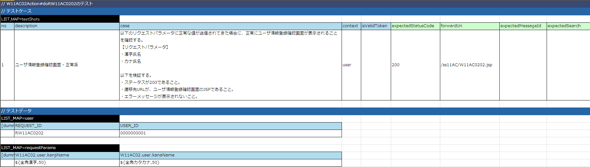
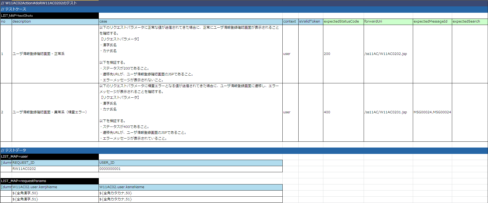

# 確認画面の実装

更新確認画面は、以下のステップで実装する。

* 登録確認画面の実装

  * Actionクラスの実装
  * JSPの実装
* 精査処理呼び出し実装

  * Actionクラスの作成

## 登録確認画面の実装

### Actionクラスの実装

1. リクエスト単体テストコードの追加

  登録画面初期表示の実装- [Actionクラスの作成](../../guide/web-application/web-application-06-initial-view.md#register-view-action) で作成した以下のテストクラスに対して登録確認画面表示リクエストのテスト実行メソッドを追加する。

  | ソース格納フォルダ | テストクラス名 | メソッド名 |
  |---|---|---|
  | test/java/nablarch/sample/ss11AC | W11AC02ActionRequestTest | void testRW11AC0202() |

  ```java
  // ～前略～
  
  @Test
  public void testRW11AC0202() {
      execute("testRW11AC0202");
  }
  
  // ～後略～
  ```
2. リクエスト単体テストデータシートの作成

  登録画面初期表示の実装- [Actionクラスの作成](../../guide/web-application/web-application-06-initial-view.md#register-view-action) で作成したリクエスト単体テストデータシート(Excelファイル)に確認画面表示リクエスト用のシートを追加する。（ [リクエスト単体テストデータシートの書き方](../../development-tools/testing-framework/testing-framework-02-requestunittest-index.md#request-test-testcases) ）

  | ブック名 | シート名 |
  |---|---|
  | W11AC02ActionRequestTest.xlsx | testRW11AC0202 |

  
3. リクエスト単体テスト実施

  リクエスト単体テストを実施し、テストが失敗することを確認する。（Actionクラスにメソッドを追加していない為）
4. Actionクラスの修正

  登録画面初期表示の実装- [Actionクラスの作成](../../guide/web-application/web-application-06-initial-view.md#register-view-action) で作成したActionクラスに確認画面表示のメソッドを追加する。

  | Actionクラス名 | メソッド名 |
  |---|---|
  | W11AC02Action | "do" ＋ RW11AC0202（確認画面表示のリクエストID） |

  ```java
  // ～前略～
  
  /**
   * 登録画面の入力項目に対して精査を行う。
   * <p/>
   * 精査がOKの場合に登録確認画面に登録内容(登録画面で入力された値)を表示する。<br />
   * 精査がNGの場合は、登録画面に遷移し、エラーメッセージを表示する。
   *
   * @param req HTTPリクエスト
   * @param ctx 実行時コンテキスト
   * @return HTTPレスポンス
   */
  // 【説明】精査エラー時の遷移先の指定
  @OnError(type = ApplicationException.class, path = "/ss11AC/W11AC0201.jsp")
  public HttpResponse doRW11AC0202(HttpRequest req, ExecutionContext ctx) {
  
      return new HttpResponse("/ss11AC/W11AC0202.jsp");
  }
  
  // ～後略～
  ```
5. リクエスト単体テスト実施

  リクエスト単体テストを実施し、Actionクラスまで処理が到達していることを確認する。

  コンソールログに以下の内容が出力されれば良い。

  * Actionクラスまで処理到達

    ログ中の「@@@@ DISPATCHING CLASS @@@@」の次に「BEFORE ACTION」が出力されていれば、Actionまで処理が到達している。
  * JSPファイルNOT FOUND

    ＜出力内容＞

    ```none
    ERROR: PWC6117: File "C:\tisdev\workspace\Nablarch_sample\main\web\ss11AC\W11AC0202.jsp" not found
    ```

### JSPの実装

1. JSPの作成

  外部設計で作成されているJSPファイルを、実装用のディレクトリに移動する。

  | コピー元 | コピー先 |
  |---|---|
  | main/web/W11AC0202.jsp | main/web/ss11AC/W11AC0202.jsp |
2. JSPの修正

  確認画面は入力画面と確認画面の共通化の機能を利用する。この共通化は、すでに外部設計で実装されているため
  確認画面については実装を修正する必要はない。
3. JSPの表示確認

  更新確認画面が表示されることを確認する。

  なお、この時点ではリクエスト単体でデータシートにセットしたリクエスト内容がそのまま表示される [1]。

  本来であれば精査処理を行い、精査OKの場合に確認画面が表示される。
4. JSP静的チェックツールの実行

  [JSP静的解析ツール](../../development-tools/java-static-analysis/java-static-analysis-01-JspStaticAnalysis.md#jsp-static-analysis-tool) を実行し、該当ファイルに静的チェックエラーがないことを確認する。

## 精査処理呼び出し実装

### Actionクラスの作成

1. リクエスト単体データシートの修正

  Actionクラスに精査処理を実装するために、リクエスト単体テストに精査確認用データを追加する。

  リクエスト単体テストでは、Formクラスの適切な精査処理が呼び出されることを確認すればよいので、
  そのために必要なデータを準備すればよい。（ [リクエスト単体テストデータシートの書き方](../../development-tools/testing-framework/testing-framework-02-requestunittest-index.md#request-test-testcases) ）

  
2. リクエスト単体テストの実行

  リクエスト単体テストを実施し、テストが失敗することを確認する。（Actionクラスに精査処理を実装していないため。）
3. 精査処理の呼び出し実装

  登録確認画面の実装- [Actionクラスの実装](../../guide/web-application/web-application-07-confirm-view.md#register-confirm-action) で作成したActionクラスに対して、 [Entityクラス（精査処理）の実装](../../guide/web-application/web-application-04-create-entity.md#process-register-validate-entity) と [Formクラスの実装](../../guide/web-application/web-application-05-create-form.md#process-register-validate-form) で作成した精査処理の呼び出し、精査エラー時の遷移先指定を実装する。

  ```java
  /**
   * 登録画面の入力項目に対して精査を行う。
   * <p/>
   * 精査がOKの場合に登録確認画面に登録内容(登録画面で入力された値)を表示する。<br />
   * 精査がNGの場合は、登録画面に遷移し、エラーメッセージを表示する。
   *
   * @param req HTTPリクエスト
   * @param ctx 実行時コンテキスト
   * @return HTTPレスポンス
   */
  // 【説明】精査エラー時の遷移先の指定
  @OnError(type = ApplicationException.class, path = "/ss11AC/W11AC0201.jsp")
  public HttpResponse doRW11AC0202(HttpRequest req, ExecutionContext ctx) {
  
      // 【説明】精査処理の呼び出し実装
      validateAndConvertForResister(req);
  
      return new HttpResponse("/ss11AC/W11AC0202.jsp");
  }
  
  /**
   * HTTPリクエストパラメータに対して精査処理を行い、{@link W11AC02Form}を生成する。
   * <p/>
   * {@link W11AC02Form}の `register` 精査を実施する。
   * 精査エラーとなった場合には、精査エラーとなった項目に対するエラーメッセージを含む{@link ApplicationException}を送出する。
   *
   * @param req HTTPリクエスト
   * @return HTTPリクエストパラメータから生成された{@link W11AC02Form}
   */
  private static W11AC02Form validateAndConvertForResister(HttpRequest req) {
      ValidationContext<W11AC02Form> formCtx = ValidationUtil.validateAndConvertRequest("W11AC02", W11AC02Form.class, req, "register");
      formCtx.abortIfInvalid();
      return formCtx.createObject();
  }
  ```
4. リクエスト単体実施

  リクエスト単体テストを実施し、以下のようになることを確認する。

  精査OKの場合に登録確認画面が出力される。
  ⇒実行結果が成功であり、登録確認画面のHTMLが出力されること。

  精査NGの場合に登録画面が出力される。
  ⇒実行結果が成功であり、登録画面のHTMLが出力され、エラーメッセージも出力されていること。
