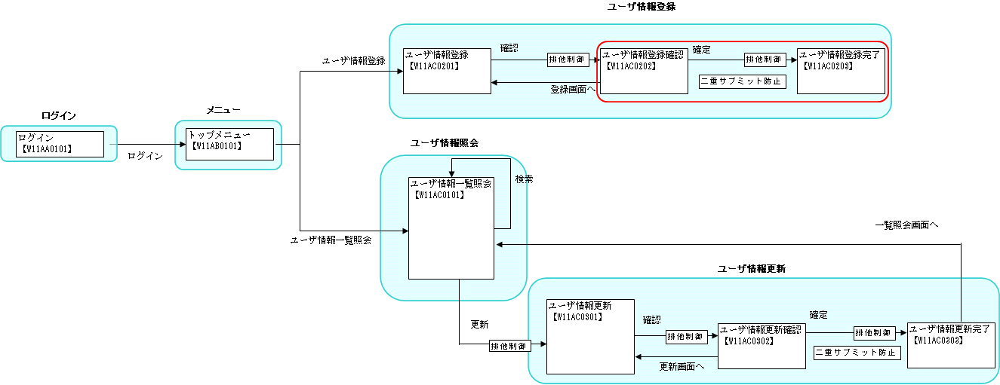

# 登録処理

## 本項で説明する内容

### 説明内容

本項では、以下の内容を説明する。

* 二重サブミットの防止
* データベースに対する挿入処理

### 作成内容

本項で作成するのは、下記画面遷移図の赤丸の部分である。



編集するソースコードは以下のとおり。

| 名称(右クリック->保存でダウンロード) | ステレオタイプ | 処理内容 |
|---|---|---|
| [CM311AC1Component.java](../../../knowledge/assets/web-application-07-insert/CM311AC1Component.java) | Component | ユーザ情報登録確認画面に表示されている情報を、データベースに登録する。  本クラスから使用するSQLファイルは、下記リンク先のファイルを参照すること。 (右クリック->保存でダウンロード)  [CM311AC1Component.sql](../../../knowledge/assets/web-application-07-insert/CM311AC1Component.sql) |
| [W11AC02Action.java](../../../knowledge/assets/web-application-07-insert/W11AC02Action.java) | Action | 作成した上記Componentのメソッドを呼び出し、結果をリクエストスコープに格納、セッションをクリアしJSPに遷移させる。 |
| [W11AC0201.jsp](../../../knowledge/assets/web-application-07-insert/W11AC0201.jsp) [W11AC0202.jsp](../../../knowledge/assets/web-application-07-insert/W11AC0202.jsp) | View | ユーザ情報登録画面に入力した内容及び、登録画面に戻るボタンと、登録処理を行うボタンを表示する。W11AC0202.jsp内でW11AC0201.jspを取り込んでいる。 |

ステレオタイプについては [業務コンポーネントの責務配置](../../about/about-nablarch/about-nablarch-01-NablarchOutline.md#業務コンポーネントの責務配置) を参照。

## 作成手順

まず、 [二重サブミットの防止](../../guide/web-application/web-application-07-insert.md#二重サブミットの防止) について説明する。次に各ステレオタイプごとの作成手順を説明する(この中の [Actionの作成](../../guide/web-application/web-application-07-insert.md#actionの作成)
と [JSPの作成](../../guide/web-application/web-application-07-insert.md#jspの作成) で [二重サブミット防止](../../guide/web-application/web-application-07-insert.md#二重サブミットの防止) の具体例を説明する)。

### 二重サブミットの防止

#### JavaScriptを使用した二重サブミットの防止

JavaScriptを使用した二重サブミットの防止とは、ユーザが誤ってボタンをダブルクリックした場合やサーバ側からのレスポンスが返ってこないので何度も同じボタンをクリックした場合に、
リクエストを2回以上サーバ側に送信するのを防止する機能である。DBの登録や更新処理を行う際、二重サブミットが起こると、登録や更新処理が2度実行されてしまうため、
二重サブミットを防止する必要がある。アプリケーションフレームワークでは、サンプル提供のbuttonタグのallowDoubleSubmission属性にfalseを指定することで二重サブミットを
防止することができる。具体例は [JSPの作成](../../guide/web-application/web-application-07-insert.md#jspの作成) を参照。

#### トークンを使用した二重サブミットの防止

トークンを使用した二重サブミットの防止とは、サーバ側で発行した一意なトークンをサーバ側(セッション)とクライアント側(hiddenタグ)に保持し、サーバ側で突合することで、二重サブミットを防止する機能である。
例えば、以下のような画面遷移で2回目のサブミットを検知し、入力画面にエラーメッセージを表示したい場合などに使用する。

登録確認画面で登録ボタン押下

登録処理実行

登録完了画面表示

ブラウザの戻るボタンで戻る

再度登録ボタン押下(2回目のサブミット)

トークンを使用した二重サブミットの防止では、JSP(トークンの設定)とアクション(トークンのチェック)の両方に実装する。

##### JSP

二重サブミットを防止したいn:formタグのuseToken属性にtrueを設定する。具体例は [JSPの作成](../../guide/web-application/web-application-07-insert.md#jspの作成) を参照。
ただし、 [入力画面と確認画面の共通化](../../guide/web-application/web-application-06-sharingInputAndConfirmationJsp.md) を使用している場合は、確認画面ではuseToken属性にtrueを設定しなくてもトークンを設定する。

##### Action

トークンをチェックしたいメソッドにOnDoubleSubmissionアノテーションを付与する。具体例は [Actionの作成](../../guide/web-application/web-application-07-insert.md#actionの作成) を参照。

> **Note:**
> トークンを使用して二重サブミットを防止する場合にアプリケーションプログラマが記述する内容を整理すると、以下のようになる。

> | > 入力画面と確認画面の共通化 | > formタグのuseToken属性の設定 | > メソッドへのアノテーションの付与 |
> |---|---|---|
> | > 共有化している | > 設定不要(自動的にトークンが設定される) | > 必要 |
> | > 共有化していない | > trueを設定する | > 必要 |

> 例えば、パスワード変更画面のように、DBの更新は発生する(二重サブミットを防止したい)が、入力画面しかない(確認画面がない)場合は、入力画面のformタグのuseToken属性にtrueを設定し、
> submitされたときに実行されるActionのメソッドに、OnDoubleSubmissionアノテーションを付与すればよい。

#### まとめ

アプリケーションフレームワークが提供する二重サブミット防止機能を下図にまとめる。


### 自動設定項目の指定(Entityの編集)

ログインユーザIDとタイムスタンプは、Entityの対応するメンバ変数にアノテーションを付与することで、値を設定しなくてもデータベースへ登録することができる。

| アノテーション | 説明 |
|---|---|
| @UserId | ログインユーザIDを自動設定したいメンバ変数に付与する。 |
| @CurrentDateTime | タイムスタンプを自動設定したいメンバ変数に付与する。 |

例として、SystemAccountEntityの記述を以下に示す。

```java
/**
 * 登録者ユーザID。
 */
@UserId           // 【説明】ログインユーザIDを設定するメンバ変数には"@UserIdアノテーション"を付与する
private String insertUserId;

/**
 * 登録日時。
 */
@CurrentDateTime  // 【説明】タイムスタンプを設定するメンバ変数には"@CurrentDateTimeアノテーション"を付与する
private Timestamp insertDate;

/**
 * 更新者ユーザID。
 */
@UserId           // 【説明】ログインユーザIDを設定するメンバ変数には"@UserIdアノテーション"を付与する
private String updatedUserId;

/**
 * 更新日時。
 */
@CurrentDateTime  // 【説明】タイムスタンプを設定するメンバ変数には"@CurrentDateTimeアノテーション"を付与する
private Timestamp updatedDate;
```

( [記載しているサンプルプログラムソースコードの注意事項](../../about/about-nablarch/about-nablarch-aboutThis.md#注意事項) 参照)

### ビジネスロジック(Component)の作成

*CM311AC1Componentクラス* に以下のメソッドを追加する。このメソッドの目的は、入力された情報をデータベースに格納することである。データベースへの挿入処理は以下のような流れになる。

データベースに登録する値を設定したEntityのインスタンスを生成する。

ParameterizedSqlPStatementを作成する( [Javaオブジェクトのフィールドの値をバインド変数に設定する機能](../../guide/web-application/web-application-03-listSearch.md#javaオブジェクトのフィールドの値をバインド変数に設定する機能) 参照)。

ParameterizedSqlPStatement#executeUpdateByObjectを使用して挿入実行。

> **Note:**
> 本処理を外出ししているのは、複数の取引から利用されることを想定しているためである。
> そのため、取引単位で作成するFormを引数としていない。

> 他の取引での使用を想定しないのであれば、ビジネスロジックは基本的にAction内に実装する。

特定のエンティティに繰り返し挿入する場合(バッチ挿入)は、addBatchObjectを使用して一括実行する。

データベースに登録する値を設定したEntityのインスタンスを生成する。

ParameterizedSqlPStatementの作成。

ParameterizedSqlPStatement#addBatchObjectを使用してエンティティを登録。挿入対象のエンティティ分だけ繰り返し実行する。

ParameterizedSqlPStatement#executeBatchを使用して一括実行。

> **Warning:**
> 大量のデータを一括処理する場合は、適宜ParameterizedSqlPStatement#executeBatchを実行すること。この処理を行わないと、メモリ不足、gc頻発による性能劣化の原因となることがある。
> なお、この実施間隔は方式設計にて設計されるものである。アプリケーションプログラマがバッチ挿入処理を行う場合は、ParameterizedSqlPStatement#executeBatchの実施間隔について必ず
> 方式設計書を確認すること。

* CM311AC1Component.sqlの内容

```sql
-- システムアカウント挿入用SQL
INSERT_SYSTEM_ACCOUNT=
INSERT INTO
  SYSTEM_ACCOUNT
  (
  USER_ID,
  LOGIN_ID,
  PASSWORD,
  USER_ID_LOCKED,
  PASSWORD_EXPIRATION_DATE,
  FAILED_COUNT,
  EFFECTIVE_DATE_FROM,
  EFFECTIVE_DATE_TO,
  INSERT_USER_ID,           -- 【説明】自動設定されるのは値なので、項目の指定は必要
  INSERT_DATE,              -- 【説明】自動設定されるのは値なので、項目の指定は必要
  UPDATED_USER_ID,          -- 【説明】自動設定されるのは値なので、項目の指定は必要
  UPDATED_DATE              -- 【説明】自動設定されるのは値なので、項目の指定は必要
  )
VALUES                      -- 【説明】VALUESに挿入する値を持つEntityのフィールド名を ":フィールド名" として記述
    (
    :userId,
    :loginId,
    :password,
    :userIdLocked,
    :passwordExpirationDate,
    :failedCount,
    :effectiveDateFrom,
    :effectiveDateTo,
    :insertUserId,          -- 【説明】自動設定されるのは値なので、項目の指定は必要
    :insertDate,            -- 【説明】自動設定されるのは値なので、項目の指定は必要
    :updatedUserId,         -- 【説明】自動設定されるのは値なので、項目の指定は必要
    :updatedDate            -- 【説明】自動設定されるのは値なので、項目の指定は必要
    )

-- システムアカウント権限挿入用SQL
INSERT_SYSTEM_ACCOUNT_AUTHORITY=
INSERT INTO
  SYSTEM_ACCOUNT_AUTHORITY
  (
  USER_ID,
  PERMISSION_UNIT_ID,
  INSERT_USER_ID,
  INSERT_DATE,
  UPDATED_USER_ID,
  UPDATED_DATE
  )
VALUES
    (
    :userId,
    :permissionUnitId,
    :insertUserId,
    :insertDate,
    :updatedUserId,
    :updatedDate
    )
```

* CM311AC1Component.javaの内容

```java
// 【説明】
// DbAccessSupportクラスを継承する。
class CM311AC1Component extends DbAccessSupport {

    /**
     * ユーザを登録する。
     *
     * @param systemAccount 画面入力された情報を持つ{@link SystemAccountEntity}
     * @param plainPassword 暗号化されていないパスワード
     * @param users 画面入力された情報を持つ{@link UsersEntity}
     * @param ugroupSystemAccount 画面入力された情報を持つ{@link UgroupSystemAccountEntity}
     */
    // 【説明】異なる取引で共用するため、Formを引数としていない。
    void registerUser(SystemAccountEntity systemAccount, String plainPassword, UsersEntity users,
            UgroupSystemAccountEntity ugroupSystemAccount) {

        // ～中略～

        // システムアカウントの登録
        registerSystemAccount(systemAccount);

        // ～中略～

        // システムアカウント権限の登録
        if (!StringUtil.isNullOrEmpty(systemAccount.getPermissionUnit())) {
            CM311AC1Component function = new CM311AC1Component();
            function.registerSystemAccountAuthority(systemAccount);
        }
    }

    /**
     * システムアカウントテーブルに1件登録する。<br>
     *
     * @param sysAcctEntity 登録する情報を保持した{@link SystemAccountEntity}
     */
    private void registerSystemAccount(SystemAccountEntity systemAccount) {

        // SQL文の作成
        // 【説明】
        // Prepare Parameterizedステートメントの作成。挿入実行時に1項目ずつ値を指定しなくても、オブジェクトを
        // 指定してその値をデータベースにデータを登録できる。
        // SQL_IDには、上記のCM311AC1Component.sqlで定義している「INSERT_SYSTEM_ACCOUNT」を指定する。
        ParameterizedSqlPStatement statement = getParameterizedSqlStatement("INSERT_SYSTEM_ACCOUNT");

        // システムアカウントに同じログインIDで既に登録されていたら例外を返す。
        try {
            /* 【説明】
                挿入の実行。Prepare Parameterizedステートメントに指定した項目名をフィールドとして持つEntityの
                インスタンスを渡す */
            statement.executeUpdateByObject(systemAccount);
        } catch (DuplicateStatementException de) {
            throw new ApplicationException(
                    MessageUtil.createMessage(MessageLevel.ERROR, "MSG00001"));
        }
    }

    // ～中略～

    /**
     * システムアカウント権限に登録する。
     *
     * @param systemAccount システムアカウント
     */
    void registerSystemAccountAuthority(SystemAccountEntity systemAccount) {

        SystemAccountAuthorityEntity systemAccountAuthority = new SystemAccountAuthorityEntity();
        systemAccountAuthority.setUserId(systemAccount.getUserId());

        ParameterizedSqlPStatement statement = getParameterizedSqlStatement("INSERT_SYSTEM_ACCOUNT_AUTHORITY");

        for (String permissionUnit : systemAccount.getPermissionUnit()) {
            /* 【説明】
                特定のエンティティに繰り返し挿入する場合(バッチ挿入)はaddBatchObjectを使用して一括実行する。
                引数にEntityのインスタンスを渡すところは通常のexecuteUpdateByObjectと同じ */
            systemAccountAuthority.setPermissionUnitId(permissionUnit);
            statement.addBatchObject(systemAccountAuthority);

            /* 【説明】
                大量のデータを一括処理する場合は適宜executeBatchが必要。メモリ不足、gc頻発による性能劣化の原因と
                なることがある */

        }
        statement.executeBatch();
    }
}
```

( [記載しているサンプルプログラムソースコードの注意事項](../../about/about-nablarch/about-nablarch-aboutThis.md#注意事項) 参照)

### Actionの作成

[トークンを使用した二重サブミットの防止](../../guide/web-application/web-application-07-insert.md#トークンを使用した二重サブミットの防止) を参照し、 *W11AC02Actionクラス* に以下のメソッドを追加する。

入力データは、カスタムタグを使用することでクライアント側(hiddenタグ)に保持しているため、リクエストパラメータから取得する。
このため、確認画面から遷移した場合でも入力データは改竄される恐れがあるため、本メソッドにおいて再度バリデーションを行う必要がある。

トークンのチェックでは、二重サブミットと判定した場合、RW11AC0201にフォワードする(path = "forward://RW11AC0201")。

```java
/**
 * ユーザ情報登録確認画面の「確定」イベントの処理を行う。
 *
 * @param req リクエストコンテキスト
 * @param ctx HTTPリクエストの処理に関連するサーバ側の情報
 * @return HTTPレスポンス
 */
@OnError(type = ApplicationException.class, path = "forward://RW11AC0201")
/* 【説明】
    二重サブミットと判定した場合の画面遷移を指定するアノテーション
    このメソッドが呼ばれる前にトークンをチェックし、二重サブミットかを判定する */
@OnDoubleSubmission(
    path = "forward://RW11AC0201"  // 【説明】二重サブミットと判定した場合の遷移先のリソースパス
)
public HttpResponse doRW11AC0204(HttpRequest req, ExecutionContext ctx) {

    // 精査とフォーム生成
    W11AC02Form form = validate(req);  /* 【説明】 入力データを取得する場合は、毎回バリデーションを行う */

    // ～中略～

    CM311AC1Component component = new CM311AC1Component();

    // ～中略～

    return new HttpResponse("/ss11AC/W11AC0203.jsp");
}
```

( [記載しているサンプルプログラムソースコードの注意事項](../../about/about-nablarch/about-nablarch-aboutThis.md#注意事項) 参照)

### JSPの作成

[JavaScriptを使用した二重サブミットの防止](../../guide/web-application/web-application-07-insert.md#javascriptを使用した二重サブミットの防止) と [トークンを使用した二重サブミットの防止](../../guide/web-application/web-application-07-insert.md#トークンを使用した二重サブミットの防止) を参照し、以下の内容で *W11AC0201.jsp* を作成する。
サンプルアプリケーションでは、入力画面と確認画面のJSPを共通化する機能を使用しているので、useToken属性を指定しなくてよい。

* W11AC0201.jsp

```./_source/07/W11AC0201.jsp

```

( [記載しているサンプルプログラムソースコードの注意事項](../../about/about-nablarch/about-nablarch-aboutThis.md#注意事項) 参照)

## 次に読むもの

* [データベースアクセス処理を詳しく知りたい時](../../../fw/reference/02_FunctionDemandSpecifications/01_Core/04_DbAccessSpec.html)
* [データベースアクセス処理の実例を知りたい時](./DB/01_DbAccessSpec_Example.html)
* [二重サブミット防止、不正画面遷移のチェックについて詳しく知りたい時](../../../fw/reference/02_FunctionDemandSpecifications/03_Common/07/07_CustomTag.html)
