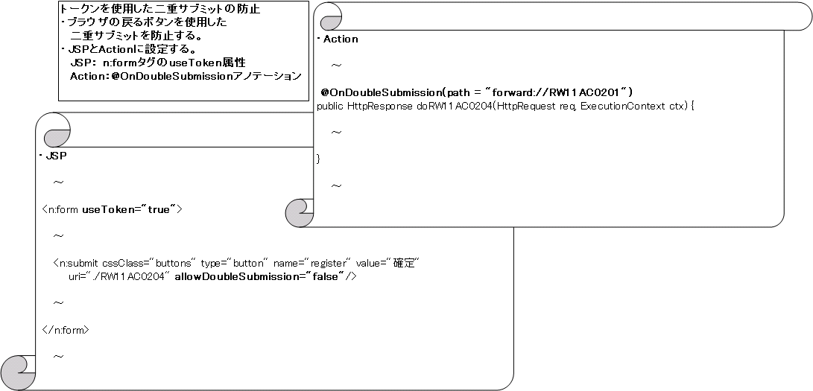

# 登録処理

## 本項で説明する内容

本項の説明内容:
- 二重サブミットの防止
- データベースに対する挿入処理

作成対象ファイル:

| 名称 | ステレオタイプ | 処理内容 |
|---|---|---|
| CM311AC1Component.java | Component | ユーザ情報登録確認画面の情報をDBに登録する。使用するSQLファイルは CM311AC1Component.sql 参照。 |
| W11AC02Action.java | Action | Componentのメソッドを呼び出し、結果をリクエストスコープに格納、セッションをクリアしJSPに遷移させる。 |
| W11AC0201.jsp, W11AC0202.jsp | View | ユーザ情報登録画面に入力した内容と、登録画面に戻るボタン・登録処理を行うボタンを表示する。W11AC0202.jsp内でW11AC0201.jspを取り込んでいる。 |

ステレオタイプについては :ref:`stereoType` 参照。

<details>
<summary>keywords</summary>

CM311AC1Component, W11AC02Action, W11AC0201.jsp, W11AC0202.jsp, 登録処理, 二重サブミット防止, データベース挿入, Component, Action, View, ステレオタイプ

</details>

## 作成手順

まず [二重サブミットの防止](#s2) について説明する。次に各ステレオタイプごとの作成手順を説明する（:ref:`07_actionClassCreate` と [07_jsp](#s5) で [二重サブミット防止](#s2) の具体例を説明する）。

<details>
<summary>keywords</summary>

作成手順, 二重サブミット防止, ステレオタイプ別作成手順

</details>

## JavaScriptを使用した二重サブミットの防止

DBの登録・更新処理で二重サブミットが発生すると処理が2度実行される。

**実装方法**: buttonタグの `allowDoubleSubmission` 属性に `false` を指定することで二重サブミットを防止できる。具体例は [07_jsp](#s5) 参照。

<details>
<summary>keywords</summary>

allowDoubleSubmission, JavaScriptによる二重サブミット防止, buttonタグ, 二重サブミット防止

</details>

## トークンを使用した二重サブミットの防止

サーバ側で発行した一意なトークンをセッション（サーバ側）とhiddenタグ（クライアント側）に保持し、突合することで二重サブミットを防止する。

**使用例**: 登録確認画面で登録ボタン押下→登録実行→完了画面→ブラウザ戻る→再度登録ボタン押下（2回目のサブミット）を検知し、入力画面にエラーを表示するケースなどで使用。

**JSP実装**: 二重サブミットを防止したい `n:form` タグの `useToken` 属性に `true` を設定する。ただし [./06_sharingInputAndConfirmationJsp](web-application-06_sharingInputAndConfirmationJsp.md) を使用（入力・確認画面のJSPを共通化）している場合は、確認画面では `useToken` 属性をtrueに設定しなくてもトークンが自動設定される。

**Action実装**: トークンをチェックしたいメソッドに `@OnDoubleSubmission` アノテーションを付与する。具体例は :ref:`07_actionClassCreate` 参照。

> **注意**: 入力画面と確認画面の共通化有無によるuseToken属性とアノテーション付与の方法:

| 入力画面と確認画面の共通化 | formタグのuseToken属性の設定 | メソッドへのアノテーションの付与 |
|---|---|---|
| 共有化している | 設定不要（自動的にトークンが設定される） | 必要 |
| 共有化していない | trueを設定する | 必要 |

例：DBの更新は発生するが確認画面がない（入力画面のみ）場合は、入力画面のformタグの `useToken` 属性に `true` を設定し、submitされたときに実行されるActionのメソッドに `@OnDoubleSubmission` アノテーションを付与する。

<details>
<summary>keywords</summary>

@OnDoubleSubmission, useToken, n:form, OnDoubleSubmission, トークンによる二重サブミット防止, セッション, hiddenタグ

</details>

## まとめ

アプリケーションフレームワークが提供する二重サブミット防止機能の概要:



<details>
<summary>keywords</summary>

二重サブミット防止機能まとめ, 機能概要, 二重サブミット防止

</details>

## 自動設定項目の指定(Entityの編集)

ログインユーザIDとタイムスタンプは、Entityの対応するメンバ変数にアノテーションを付与することで、値を設定しなくてもデータベースへ登録できる。

| アノテーション | 説明 |
|---|---|
| `@UserId` | ログインユーザIDを自動設定したいメンバ変数に付与する。 |
| `@CurrentDateTime` | タイムスタンプを自動設定したいメンバ変数に付与する。 |

SystemAccountEntityの記述例:

```java
/**
 * 登録者ユーザID。
 */
@UserId           // ログインユーザIDを設定するメンバ変数には"@UserIdアノテーション"を付与する
private String insertUserId;

/**
 * 登録日時。
 */
@CurrentDateTime  // タイムスタンプを設定するメンバ変数には"@CurrentDateTimeアノテーション"を付与する
private Timestamp insertDate;

/**
 * 更新者ユーザID。
 */
@UserId           // ログインユーザIDを設定するメンバ変数には"@UserIdアノテーション"を付与する
private String updatedUserId;

/**
 * 更新日時。
 */
@CurrentDateTime  // タイムスタンプを設定するメンバ変数には"@CurrentDateTimeアノテーション"を付与する
private Timestamp updatedDate;
```

> **重要**: 自動設定されるのは**値**のみである。アノテーションを付与したフィールドであっても、SQLのINSERT文には列名と `:フィールド名` バインディングを明示的に記述する必要がある。

SQL例（CM311AC1Component.sql）:

```sql
INSERT_SYSTEM_ACCOUNT=
INSERT INTO
  SYSTEM_ACCOUNT
  (
  ...
  INSERT_USER_ID,           -- 自動設定されるのは値なので、項目の指定は必要
  INSERT_DATE,              -- 自動設定されるのは値なので、項目の指定は必要
  UPDATED_USER_ID,          -- 自動設定されるのは値なので、項目の指定は必要
  UPDATED_DATE              -- 自動設定されるのは値なので、項目の指定は必要
  )
VALUES
    (
    ...
    :insertUserId,          -- 自動設定されるのは値なので、項目の指定は必要
    :insertDate,            -- 自動設定されるのは値なので、項目の指定は必要
    :updatedUserId,         -- 自動設定されるのは値なので、項目の指定は必要
    :updatedDate            -- 自動設定されるのは値なので、項目の指定は必要
    )
```

<details>
<summary>keywords</summary>

@UserId, @CurrentDateTime, 自動設定項目, ログインユーザID自動設定, タイムスタンプ自動設定, insertUserId, insertDate, updatedUserId, updatedDate, SystemAccountEntity, アノテーション

</details>

## ビジネスロジック(Component)の作成

CM311AC1ComponentクラスにDBへの挿入処理メソッドを実装する。

> **備考**: 処理を外出ししているのは複数の取引から利用されることを想定しているためである。そのため、取引単位で作成するFormを引数としていない。他の取引での使用を想定しないのであれば、ビジネスロジックは基本的にAction内に実装する。

**単件挿入の流れ**:
1. DBに登録する値を設定したEntityのインスタンスを生成する。
2. `getParameterizedSqlStatement` でParameterizedSqlPStatementを作成する。
3. `ParameterizedSqlPStatement#executeUpdateByObject` を使用して挿入実行。

**バッチ挿入の流れ**（特定のエンティティに繰り返し挿入する場合）:
1. DBに登録する値を設定したEntityのインスタンスを生成する。
2. `getParameterizedSqlStatement` でParameterizedSqlPStatementを作成する。
3. `ParameterizedSqlPStatement#addBatchObject` を使用してエンティティを登録。挿入対象のエンティティ分だけ繰り返し実行する。
4. `ParameterizedSqlPStatement#executeBatch` を使用して一括実行。

> **警告**: 大量のデータを一括処理する場合は、適宜 `ParameterizedSqlPStatement#executeBatch` を実行すること。この処理を行わないと、メモリ不足・gc頻発による性能劣化の原因となることがある。実施間隔は方式設計にて設計されるものであるため、アプリケーションプログラマはバッチ挿入処理を行う場合、`executeBatch` の実施間隔について必ず方式設計書を確認すること。

CM311AC1Component.sqlの内容:

```sql
-- システムアカウント挿入用SQL
INSERT_SYSTEM_ACCOUNT=
INSERT INTO
  SYSTEM_ACCOUNT
  (
  USER_ID,
  LOGIN_ID,
  PASSWORD,
  USER_ID_LOCKED,
  PASSWORD_EXPIRATION_DATE,
  FAILED_COUNT,
  EFFECTIVE_DATE_FROM,
  EFFECTIVE_DATE_TO,
  INSERT_USER_ID,
  INSERT_DATE,
  UPDATED_USER_ID,
  UPDATED_DATE
  )
VALUES  -- VALUESに挿入する値を持つEntityのフィールド名を ":フィールド名" として記述
    (
    :userId,
    :loginId,
    :password,
    :userIdLocked,
    :passwordExpirationDate,
    :failedCount,
    :effectiveDateFrom,
    :effectiveDateTo,
    :insertUserId,
    :insertDate,
    :updatedUserId,
    :updatedDate
    )

-- システムアカウント権限挿入用SQL
INSERT_SYSTEM_ACCOUNT_AUTHORITY=
INSERT INTO
  SYSTEM_ACCOUNT_AUTHORITY
  (
  USER_ID,
  PERMISSION_UNIT_ID,
  INSERT_USER_ID,
  INSERT_DATE,
  UPDATED_USER_ID,
  UPDATED_DATE
  )
VALUES
    (
    :userId,
    :permissionUnitId,
    :insertUserId,
    :insertDate,
    :updatedUserId,
    :updatedDate
    )
```

CM311AC1Component.javaの内容:

```java
// DbAccessSupportクラスを継承する
class CM311AC1Component extends DbAccessSupport {

    // 異なる取引で共用するため、Formを引数としていない
    void registerUser(SystemAccountEntity systemAccount, String plainPassword,
            UsersEntity users, UgroupSystemAccountEntity ugroupSystemAccount) {
        // ～中略～
        registerSystemAccount(systemAccount);
        // ～中略～
        if (!StringUtil.isNullOrEmpty(systemAccount.getPermissionUnit())) {
            CM311AC1Component function = new CM311AC1Component();
            function.registerSystemAccountAuthority(systemAccount);
        }
    }

    private void registerSystemAccount(SystemAccountEntity systemAccount) {
        // Prepare Parameterizedステートメントの作成。オブジェクトを指定してDBにデータを登録できる。
        // SQL_IDにはCM311AC1Component.sqlで定義している「INSERT_SYSTEM_ACCOUNT」を指定する。
        ParameterizedSqlPStatement statement = getParameterizedSqlStatement("INSERT_SYSTEM_ACCOUNT");

        // システムアカウントに同じログインIDで既に登録されていたら例外を返す
        try {
            // 挿入の実行。Prepare Parameterizedステートメントに指定した項目名をフィールドとして持つEntityのインスタンスを渡す
            statement.executeUpdateByObject(systemAccount);
        } catch (DuplicateStatementException de) {
            throw new ApplicationException(
                    MessageUtil.createMessage(MessageLevel.ERROR, "MSG00001"));
        }
    }

    void registerSystemAccountAuthority(SystemAccountEntity systemAccount) {
        SystemAccountAuthorityEntity systemAccountAuthority = new SystemAccountAuthorityEntity();
        systemAccountAuthority.setUserId(systemAccount.getUserId());

        ParameterizedSqlPStatement statement =
                getParameterizedSqlStatement("INSERT_SYSTEM_ACCOUNT_AUTHORITY");

        for (String permissionUnit : systemAccount.getPermissionUnit()) {
            // 特定のエンティティに繰り返し挿入する場合(バッチ挿入)はaddBatchObjectを使用して一括実行する
            systemAccountAuthority.setPermissionUnitId(permissionUnit);
            statement.addBatchObject(systemAccountAuthority);
            // 大量のデータを一括処理する場合は適宜executeBatchが必要
            // メモリ不足、gc頻発による性能劣化の原因となることがある
        }
        statement.executeBatch();
    }
}
```

<details>
<summary>keywords</summary>

CM311AC1Component, DbAccessSupport, ParameterizedSqlPStatement, executeUpdateByObject, addBatchObject, executeBatch, getParameterizedSqlStatement, バッチ挿入, DuplicateStatementException, INSERT_SYSTEM_ACCOUNT, INSERT_SYSTEM_ACCOUNT_AUTHORITY, registerSystemAccount, registerSystemAccountAuthority, SystemAccountAuthorityEntity, OutOfMemoryError, 大量データ挿入, メモリ不足

</details>

## Actionの作成

:ref:`double_submit_use_Token` を参照し、W11AC02ActionクラスにdoRW11AC0204メソッドを追加する。

> **重要**: 入力データは、カスタムタグを使用することでクライアント側（hiddenタグ）に保持しているため、リクエストパラメータから取得する。このため、確認画面から遷移した場合でも入力データは改竄される恐れがあるため、本メソッドにおいて**再度バリデーション（`validate(req)`）を行う必要がある**。

トークンのチェックでは、二重サブミットと判定した場合、`RW11AC0201` にフォワードする（`path = "forward://RW11AC0201"`）。

```java
/**
 * ユーザ情報登録確認画面の「確定」イベントの処理を行う。
 */
@OnError(type = ApplicationException.class, path = "forward://RW11AC0201")
// 二重サブミットと判定した場合の画面遷移を指定するアノテーション
// このメソッドが呼ばれる前にトークンをチェックし、二重サブミットかを判定する
@OnDoubleSubmission(
    path = "forward://RW11AC0201"  // 二重サブミットと判定した場合の遷移先のリソースパス
)
public HttpResponse doRW11AC0204(HttpRequest req, ExecutionContext ctx) {

    // 精査とフォーム生成
    W11AC02Form form = validate(req);  // 入力データを取得する場合は、毎回バリデーションを行う

    // ～中略～

    CM311AC1Component component = new CM311AC1Component();

    // ～中略～

    return new HttpResponse("/ss11AC/W11AC0203.jsp");
}
```

<details>
<summary>keywords</summary>

W11AC02Action, W11AC02Form, doRW11AC0204, @OnDoubleSubmission, @OnError, ApplicationException, 再バリデーション, validate, hiddenタグ改竄, forward://RW11AC0201, 二重サブミット防止Action実装

</details>

## JSPの作成

:ref:`double_submit_use_JavaScript` と :ref:`double_submit_use_Token` を参照し、W11AC0201.jspを作成する。

> **注意**: サンプルアプリケーションでは、入力画面と確認画面のJSPを共通化する機能（[./06_sharingInputAndConfirmationJsp](web-application-06_sharingInputAndConfirmationJsp.md)）を使用しているので、`useToken` 属性を指定しなくてよい（共通化している場合は自動的にトークンが設定されるため）。

<details>
<summary>keywords</summary>

W11AC0201.jsp, useToken, JSP二重サブミット防止, 入力確認画面共通化, 06_sharingInputAndConfirmationJsp, allowDoubleSubmission

</details>
