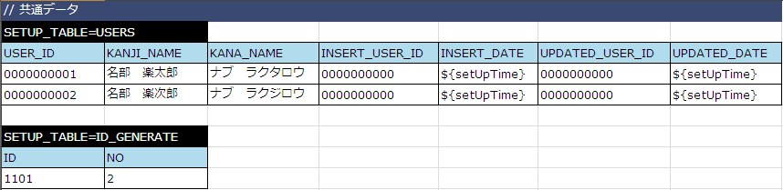
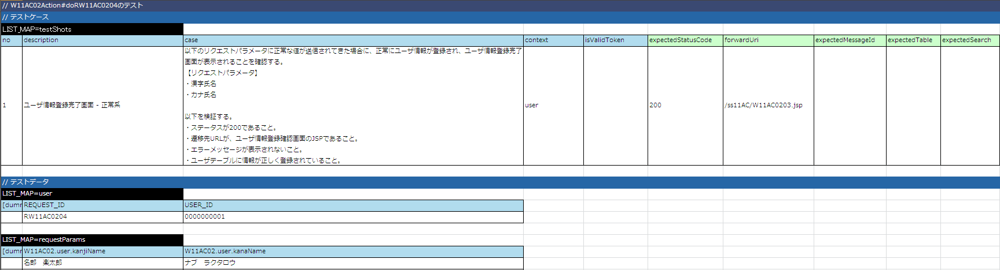
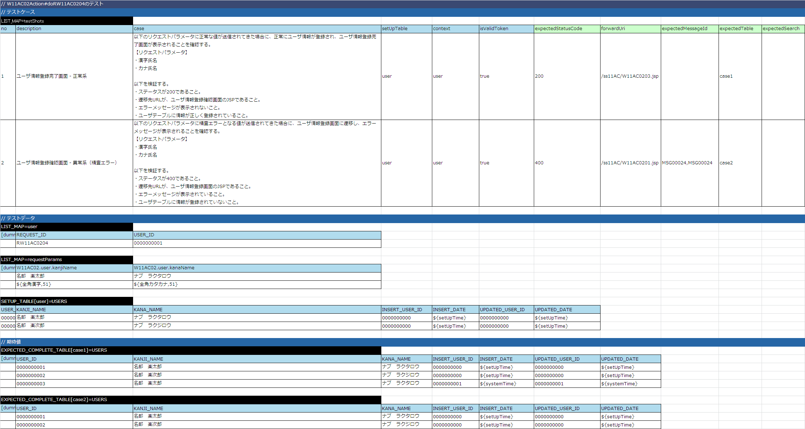

# 完了画面の実装

更新完了画面は、以下のステップで実装する。

* 登録完了画面の表示

  * Actionクラスの実装
  * JSPの実装
* DB更新処理実装

  * Actionクラスの実装

## 登録完了画面の表示

### Actionクラスの実装

1. リクエスト単体テストコードの追加

  登録画面初期表示の実装- [Actionクラスの作成](../../guide/web-application/web-application-06-initial-view.md#register-view-action) で作成した以下のテストクラスに対して完了画面表示リクエストのテスト実行メソッドを追加する。

  | テストクラス名 | メソッド名 |
  |---|---|
  | W11AC02ActionRequestTest | void testRW11AC0204() |

  ```java
  // ～前略～
  
  @Test
  public void testRW11AC0204() {
      execute("testRW11AC0204");
  }
  
  // ～後略～
  ```
2. リクエスト単体テストデータシートの作成

  登録画面初期表示の実装- [Actionクラスの作成](../../guide/web-application/web-application-06-initial-view.md#register-view-action) で作成したリクエスト単体テストデータシート(Excelファイル)に完了画面表示リクエスト用のシートを追加する。（ [リクエスト単体テストデータシートの書き方](../../development-tools/testing-framework/testing-framework-02-requestunittest-index.md#request-test-testcases) ）

  | ブック名 | シート名 |
  |---|---|
  | W11AC02ActionRequestTest.xlsx | setUpDb |

  

  | ブック名 | シート名 |
  |---|---|
  | W11AC02ActionRequestTest.xlsx | testRW11AC0204 |

  
3. リクエスト単体テスト実施

  リクエスト単体テストを実施し、テストが失敗することを確認する。（Actionクラスにメソッドを追加していない為）
4. Actionクラスの修正

  登録画面初期表示の実装- [Actionクラスの作成](../../guide/web-application/web-application-06-initial-view.md#register-view-action) で作成したActionクラスに完了画面表示のメソッドを追加する。

  | Actionクラス名 | メソッド名 |
  |---|---|
  | W11AC02Action | "do" ＋ RW11AC0204（完了画面表示のリクエストID） |

  ```java
  // ～前略～
  
  /**
   * 登録内容をデータベースへ反映し、登録完了画面を表示する。
   *
   * @param req HTTPリクエスト
   * @param ctx 実行時コンテキスト
   * @return HTTPレスポンス
   */
  @OnError(type = ApplicationException.class, path = "forward:///action/ss11AC/W11AC02Action/RW11AC0201")
  @OnDoubleSubmission(path = "forward:///action/ss11AC/W11AC02Action/RW11AC0201")
  public HttpResponse doRW11AC0204(HttpRequest req, ExecutionContext ctx) {
  
      return new HttpResponse("/ss11AC/W11AC0203.jsp");
  }
  
  // ～後略～
  ```
5. リクエスト単体テスト実施

リクエスト単体テストを実施し、Actionクラスまで処理が到達していることを確認する。

コンソールログに以下の内容が出力されれば良い。

* Actionクラスまで処理到達

  ログ中の「@@@@ DISPATCHING CLASS @@@@」の次に「BEFORE ACTION」が出力されていれば、Actionまで処理が到達している。
* JSPファイルNOT FOUND

  ＜出力内容＞

  ```none
  ERROR: PWC6117: File "C:\tisdev\workspace\Nablarch_sample\main\web\ss11AC\W11AC0203.jsp" not found
  ```

### JSPの実装

1. JSPの作成

JSPの実装については、登録画面初期表示の実装時と同じ手順のため、 [JSPの実装](../../guide/web-application/web-application-06-initial-view.md#register-view-jsp) を参照して行う。

| コピー元 | コピー先 |
|---|---|
| main/web/W11AC0203.jsp | main/web/ss11AC/W11AC0203.jsp |

1. 登録完了画面の表示確認

リクエスト単体テストを実行し、登録完了画面が出力されることを確認する。

ただし、この時点では更新処理を実装していない為、DBの更新は行われていない。

1. JSP静的チェックツールの実行

[JSP静的解析ツール](../../development-tools/java-static-analysis/java-static-analysis-01-JspStaticAnalysis.md#jsp-static-analysis-tool) を実行し、該当ファイルに静的チェックエラーがないことを確認する。

## DB更新処理実装

### Actionクラスの実装

1. リクエスト単体テストデータシートの作成

  登録完了画面の表示- [Actionクラスの実装](../../guide/web-application/web-application-08-complete.md#register-complete-action) で作成した以下のテストデータシートに対して、登録結果のデータを追加する。（ [リクエスト単体テストデータシートの書き方](../../development-tools/testing-framework/testing-framework-02-requestunittest-index.md#request-test-testcases) ）

  | ブック名 | シート名 |
  |---|---|
  | W11AC02ActionRequestTest.xlsx | testRW11AC0204 |

  

  > **Note:**
> 更新結果の期待値では、漢字氏名、カナ氏名以外にも、登録ユーザID(INSERT_USER_ID)、登録日付(INSERT_DATE)、
  > 更新ユーザID(REGISTER_USER_ID)と更新日付(UPDATE_DATE)も更新対象としている。

  > **登録ユーザID・更新ユーザID**

  > 事前準備データのUSER_ID欄に記載したユーザIDで更新される。

  > **登録日付・更新日付**

  > コンポーネント設定ファイルに記載された固定のシステム日付で更新される（実行タイミングによって日付が変わると検証ができない為、固定値を使用）。
2. リクエスト単体テスト実施

  リクエスト単体テストを実施し、テストが失敗することを確認する。（Actionクラスに登録処理を実装していない為）
3. 登録処理の実装

  登録確認画面に表示した内容をUsersテーブルに登録する処理をActionクラスに実装する。

  なお、今回はチュートリアルであることと、非常に簡易なSQLでありリクエスト単体テストで十分にテスト可能であることから、
  Componentクラスは作成していない。

  ①ユーザテーブル登録用のSQL文の追加

  | 格納ディレクトリ | SQLファイル名 |
  |---|---|
  | main/java/nablarch/sample/ss11AC | W11AC01Action.sql |

  ＜登録SQL文＞

  ```sql
  -- ユーザテーブル更新SQL
  REGISTER_USERS=
  INSERT INTO
      USERS (
          USER_ID,
          KANJI_NAME,
          KANA_NAME,
          INSERT_USER_ID,
          INSERT_DATE,
          UPDATED_USER_ID,
          UPDATED_DATE
      )
      VALUES (
          :userId,
          :kanjiName,
          :kanaName,
          :insertUserId,
          :insertDate,
          :updatedUserId,
          :updatedDate
      )
  ```

  ②ActionクラスでSQL実行

  | Actionクラス名 | メソッド名 |
  |---|---|
  | W11AC02Action | "do" ＋ RW11AC0204（完了画面表示のリクエストID） |

  ①前画面より渡されるパラメータ(ユーザID、漢字氏名、カナ氏名）の単項目精査

  ②①のパラメータを保持するFormの生成

  ③ユーザIDを自動採番し、FormにユーザIDを設定

  ④登録SQLの実行

  ```java
  // ～前略～
  
  /**
   * 登録内容をデータベースへ反映し、登録完了画面を表示する。
   *
   * @param req HTTPリクエスト
   * @param ctx 実行時コンテキスト
   * @return HTTPレスポンス
   */
  @OnError(type = ApplicationException.class, path = "forward:///action/ss11AC/W11AC02Action/RW11AC0201")
  @OnDoubleSubmission(path = "forward:///action/ss11AC/W11AC02Action/RW11AC0201")
  public HttpResponse doRW11AC0204(HttpRequest req, ExecutionContext ctx) {
  
      // 【説明】①精査処理の呼び出し実装
      // 【説明】②登録パラメータを持つFormを生成
      W11AC02Form form = validateAndConvertForResister(req);
  
      UsersEntity users = form.getUser();
      // 【説明】③ユーザIDを自動採番し、FormのユーザIDに設定。
      users.setUserId(IdGeneratorUtil.generateUserId());
      // 【説明】④登録実行
      getParameterizedSqlStatement("REGISTER_USERS").executeUpdateByObject(users);
  
      return new HttpResponse("/ss11AC/W11AC0203.jsp");
  }
  
  // ～後略～
  ```

  > **Note:**
> @OnDoubleSubmissionを指定することで、
  >  [二重サブミット](../../../fw/reference/02_FunctionDemandSpecifications/03_Common/07/07_SubmitTag.html#prevent-double-submission)  を防ぐことができる。

1. リクエスト単体テスト実施

  リクエスト単体テストを実行し、登録結果のアサートが成功することを確認する。
