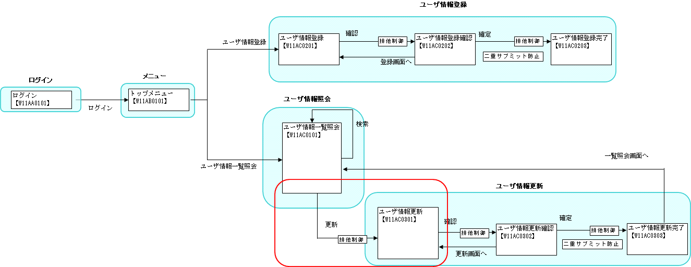
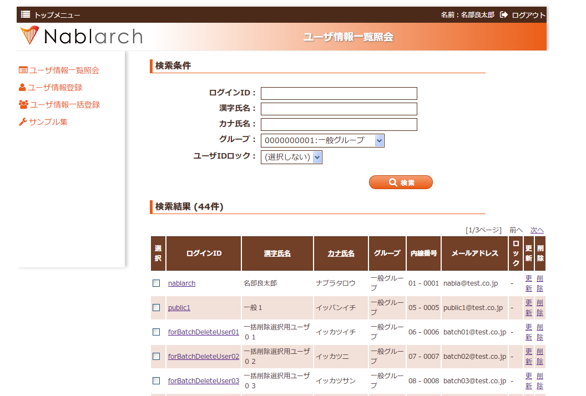

# 一覧表示から個別の情報を扱う画面への遷移

## 本項で説明する内容

一覧表示から個別情報画面への遷移における実装ファイル:

| 名称 | ステレオタイプ | 処理内容 |
|---|---|---|
| [W11AC03Action.java](../../../knowledge/guide/web-application/assets/web-application-10_submitParameter/W11AC03Action.java) | Action | 一覧から送られてきたパラメータを元に検索を行う。検索結果をリクエストに格納、更新画面への遷移を行う。 |
| [W11AC0101.jsp](../../../knowledge/guide/web-application/assets/web-application-10_submitParameter/W11AC0101.jsp) | View | 検索結果の一覧表示および個別の情報のサブミット。 |
| [W11AC0301.jsp](../../../knowledge/guide/web-application/assets/web-application-10_submitParameter/W11AC0301.jsp) | View | 更新画面に検索結果を初期値として表示。 |

ステレオタイプについては :ref:`stereoType` を参照。



<details>
<summary>keywords</summary>

W11AC03Action, W11AC0101.jsp, W11AC0301.jsp, 一覧表示, パラメータ送信, 画面遷移, 個別情報画面遷移

</details>

## 作成手順

### View(JSP)の作成（W11AC0101.jsp）

リンク毎に異なるパラメータを送る実装方法:
1. `column:link` タグでサブミット用のリンクを作成する
2. `column:link` タグの内容として `<n:param>` タグを記述する

対象ファイル: [W11AC0101.jsp](../../../knowledge/guide/web-application/assets/web-application-10_submitParameter/W11AC0101.jsp)



### 更新画面初期表示の実装（W11AC03Action / W11AC0301.jsp）

更新画面の初期表示までの処理手順:
1. 送られてきたパラメータの取得
2. パラメータをキーとした検索
3. 検索結果をリクエストスコープに格納
4. 更新画面へ遷移

**クラス**: `W11AC03Action`, `W11AC03Form`, `CM311AC1Component`, `DbAccessSupport`
**アノテーション**: `@OnError(type = ApplicationException.class, ...)`

```java
@OnError(type = ApplicationException.class,
         path = "forward:///action/ss11AC/W11AC01Action/RW11AC0102")
public HttpResponse doRW11AC0301(HttpRequest req, ExecutionContext ctx) {
    ValidationContext<W11AC03Form> userSearchFormContext =
        ValidationUtil.validateAndConvertRequest("W11AC03", W11AC03Form.class, req, "selectUserInfo");

    // hidden暗号化を行っていれば発生しないエラー
    userSearchFormContext.abortIfInvalid();

    String userId = userSearchFormContext.createObject().getSystemAccount().getUserId();

    CM311AC1Component comp = new CM311AC1Component();
    SqlResultSet sysAcct = comp.selectSystemAccount(userId);
    SqlResultSet users = comp.selectUsers(userId);
    SqlResultSet permissionUnit = comp.selectPermissionUnit(userId);
    SqlResultSet ugroup = comp.selectUgroup(userId);

    ctx.setRequestScopedVar("W11AC03", getWindowScopeObject(sysAcct, users, permissionUnit, ugroup));
    return new HttpResponse("/ss11AC/W11AC0301.jsp");
}
```

対象ファイル: [W11AC0301.jsp](../../../knowledge/guide/web-application/assets/web-application-10_submitParameter/W11AC0301.jsp)

<details>
<summary>keywords</summary>

column:link, n:param, W11AC03Action, W11AC03Form, CM311AC1Component, DbAccessSupport, ValidationUtil, ValidationContext, SqlResultSet, @OnError, ApplicationException, HttpResponse, HttpRequest, ExecutionContext, パラメータ取得, 更新画面初期表示, リクエストスコープ

</details>

## 次に読むもの

- [データベースアクセス処理の詳細](../../../fw/reference/02_FunctionDemandSpecifications/01_Core/04_DbAccessSpec.html)
- [データベースアクセス処理の実例](./DB/01_DbAccessSpec_Example.html)
- [カスタムタグの使用方法の詳細](../../../fw/reference/02_FunctionDemandSpecifications/03_Common/07_WebView.html)

<details>
<summary>keywords</summary>

データベースアクセス, カスタムタグ, 関連ドキュメント

</details>
