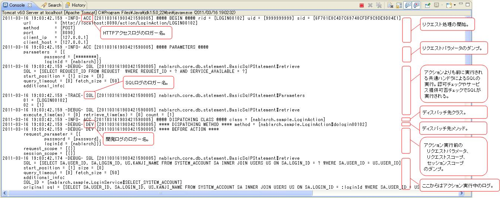
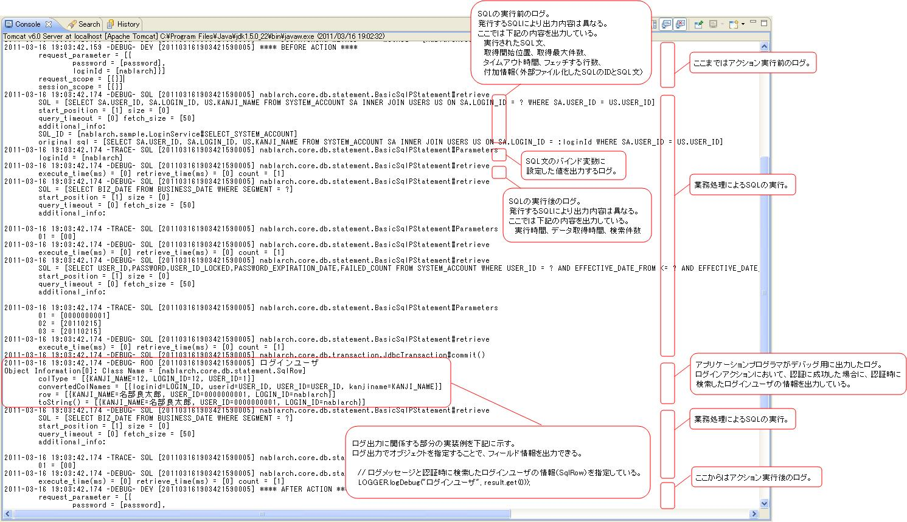
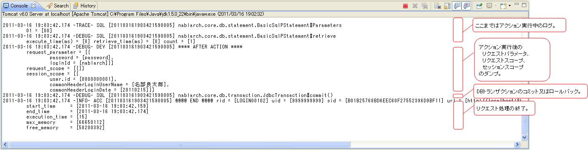
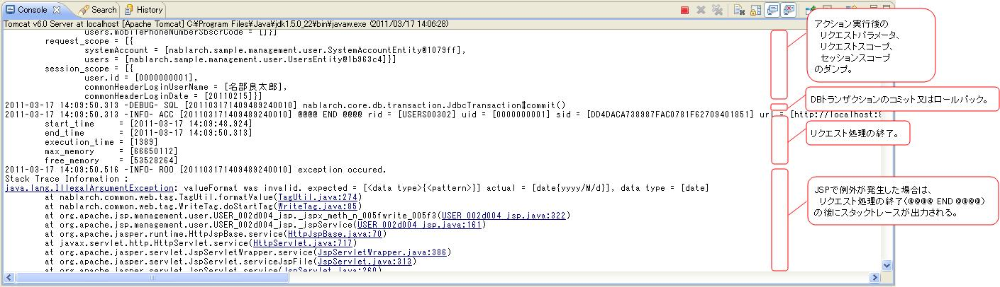

# ログ出力の設定方法とログの見方(画面オンライン処理編)

## ログの種類

画面オンライン処理の開発時に出力するログの種類：

| ログの種類 | 説明 |
|---|---|
| HTTPアクセスログ | 実行状況・性能測定・負荷測定情報を出力。全リクエスト・レスポンス情報を出力する証跡ログとしても使用 |
| SQLログ | SQL実行時間とSQL文を出力（パフォーマンスチューニング用） |
| 開発ログ | アプリプログラマが開発時に必要な情報をDEBUGレベルで出力 |

HTTPアクセスログとSQLログの詳細は :ref:`HttpAccessLog`、:ref:`SqlLog` を参照。

<details>
<summary>keywords</summary>

HTTPアクセスログ, SQLログ, 開発ログ, ログの種類, 証跡ログ, 性能測定, パフォーマンスチューニング, DEBUGレベル

</details>

## 開発時のログ出力の設定方法

開発時は標準出力（EclipseのConsoleビュー）にログを出力する。設定で指定する項目：

1. 出力先として標準出力を追加
2. デバッグ用ログを標準出力に出力
3. HTTPアクセスログを標準出力に出力
4. SQLログを標準出力に出力
5. 開発ログを標準出力に出力


<details>
<summary>keywords</summary>

ログ出力設定, 標準出力, Eclipseコンソール, 開発時設定, DEBUGログ出力

</details>

## 開発時のログの見方

サンプルアプリケーションを使用したログの見方。取り上げるケース：正常完了、JSP例外、アクション未検出、メソッド未検出。

> **注意**: エラーが発生するケースについては、あくまで一例であり、全てのケースを網羅しているわけではない。実際の開発時は、「リクエスト処理を正常に完了した場合」を参考に、デバッグ作業に必要な情報を収集する。

## リクエスト処理を正常に完了した場合

ログイン処理を例に、1回のリクエスト処理で出力されるログの順番と内容を示す。

**ログイン処理の画面遷移**：


**アクション実行前**：


**アクション実行中**：


**アクション実行後**：


> **注意**: HTTPアクセスログとSQLログはデフォルトフォーマット使用時の出力例。

## JSPで例外が発生した場合

JSPで例外が発生した場合は、「リクエスト処理の終了（END）」の後にスタックトレースが出力される。



## リクエストURLに対応するアクションが見つからない場合

「ディスパッチ先クラス（DISPATCHING CLASS）」の後にスタックトレースが出力される。


## リクエストURLに対応するアクションのメソッドが見つからない場合

「ディスパッチ先メソッド（DISPATCHING METHOD）」にエラーメッセージが出力される。


エラーメッセージ例：

```bash
method not found. class = [nablarch.sample.management.user.UserSearchAction], method signature = [HttpResponse dousers00101(HttpRequest, ExecutionContext)]
```

<details>
<summary>keywords</summary>

ログの見方, スタックトレース, DISPATCHING CLASS, DISPATCHING METHOD, JSP例外, アクション未検出, メソッド未検出, method not found, UserSearchAction, HttpResponse, HttpRequest, ExecutionContext

</details>
