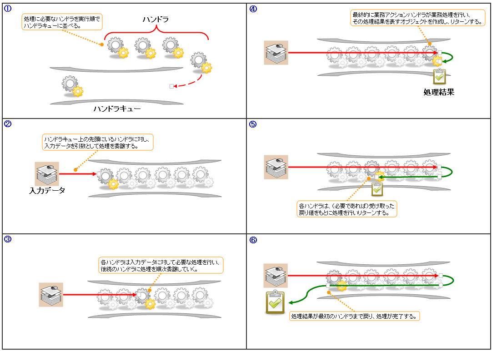
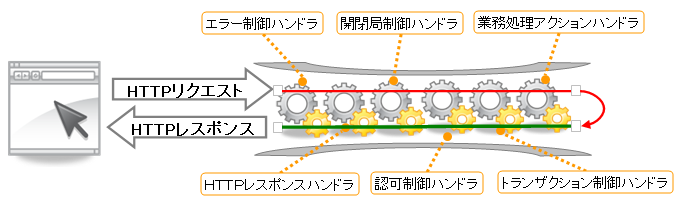

# NAF基本アーキテクチャ

## NAFのアプリケーション動作モデル

## NAFのアプリケーション動作モデル

- **リクエスト**: 「処理」と「データ」から構成される処理の最小単位。画面オンライン処理ではHTTPリクエスト、バッチ処理ではファイル/DBのデータレコードが最小単位となる。

**ハンドラキュー** (:ref:`handlerQueue`):

NAFアプリケーションの処理は「トランザクション制御」や「応答電文の送信」といったステップごとに**ハンドラ**と呼ばれるモジュールに分割される。ハンドラはあらかじめ定められた順序で並べられ**ハンドラキュー**を構成する。

処理フロー:
1. リクエストを引数としてハンドラキューの先頭ハンドラから順次呼び出し
2. 最終的に**業務アクションハンドラ**が業務処理を実行し処理結果をリターン
3. 処理結果はハンドラキューをリクエストとは逆方向に遡り、先頭ハンドラまで戻った時点で処理完了



<details>
<summary>keywords</summary>

ハンドラキュー, 業務アクションハンドラ, リクエスト処理モデル, handlerQueue, 処理結果の返却フロー, NAFアプリケーション基本構造

</details>

## 標準ハンドラ構成

## 標準ハンドラ構成

NAFの機能はハンドラの組み合わせで実現される。主なハンドラ:

**汎用ハンドラ**:
- [../handler/TransactionManagementHandler](../../component/handlers/handlers-TransactionManagementHandler.md)
- [../handler/RequestPathJavaPackageMapping](../../component/handlers/handlers-RequestPathJavaPackageMapping.md)
- [../handler/PermissionCheckHandler](../../component/handlers/handlers-PermissionCheckHandler.md)
- [../handler/ServiceAvailabilityCheckHandler](../../component/handlers/handlers-ServiceAvailabilityCheckHandler.md)

**画面オンライン処理固有**:
- [../handler/HttpResponseHandler](../../component/handlers/handlers-HttpResponseHandler.md)
- [../handler/HttpAccessLogHandler](../../component/handlers/handlers-HttpAccessLogHandler.md)
- [../handler/NablarchTagHandler](../../component/handlers/handlers-NablarchTagHandler.md)

**バッチ処理固有**:
- [../handler/MultiThreadExecutionHandler](../../component/handlers/handlers-MultiThreadExecutionHandler.md)
- [../handler/DuplicateProcessCheckHandler](../../component/handlers/handlers-DuplicateProcessCheckHandler.md)

**メッセージング処理固有**:
- [../handler/MessageReplyHandler](../../component/handlers/handlers-MessageReplyHandler.md)
- [../handler/MessageResendHandler](../../component/handlers/handlers-MessageResendHandler.md)

標準ハンドラ構成（用途ごとの標準的なハンドラキュー構成）は処理形態によって異なる:
- 画面オンライン処理: 
- バッチ処理: 

各処理形態の詳細ハンドラ構成: [web_gui](../../processing-pattern/web-application/web-application-web_gui.md)、[batch_single_shot](../../processing-pattern/nablarch-batch/nablarch-batch-batch_single_shot.md)、[batch_resident](../../processing-pattern/nablarch-batch/nablarch-batch-batch_resident.md)、[messaging_request_reply](../../processing-pattern/mom-messaging/mom-messaging-messaging_request_reply.md)、[messaging_receive](../../processing-pattern/mom-messaging/mom-messaging-messaging_receive.md)、[messaging_http](../../processing-pattern/http-messaging/http-messaging-messaging_http.md)

<details>
<summary>keywords</summary>

TransactionManagementHandler, RequestPathJavaPackageMapping, HttpResponseHandler, HttpAccessLogHandler, MultiThreadExecutionHandler, MessageReplyHandler, MessageResendHandler, PermissionCheckHandler, DuplicateProcessCheckHandler, ServiceAvailabilityCheckHandler, NablarchTagHandler, 標準ハンドラ構成, ハンドラキュー構成

</details>

## アプリケーションの実行と初期化処理

## アプリケーションの実行と初期化処理

**リポジトリによるハンドラキューの初期化**

NAFはDIベースのオブジェクト管理機構（リポジトリ）でハンドラキューを含む全オブジェクトを生成・初期化する。

バッチ処理のハンドラ構成定義例:
```xml
<list name="handlerQueue">
  <component class="nablarch.fw.handler.StatusCodeConvertHandler" />
  <component class="nablarch.fw.handler.GlobalErrorHandler" />
  <component-ref name="threadContextHandler" />
  <component-ref name="duplicateProcessCheckHandler" />
  <component-ref name="dbConnectionManagementHandler" />
  <component-ref name="transactionManagementHandler" />
  <component class="nablarch.fw.handler.RequestPathJavaPackageMapping">
    <property name="basePackage" value="nablarch.sample" />
    <property name="immediate" value="false" />
  </component>
  <component class="nablarch.fw.handler.MultiThreadExecutionHandler">
    <property name="concurrentNumber" value="${threadCount}" />
    <property name="commitLogger" ref="commitLogger" />
  </component>
  <component-ref name="dbConnectionManagementHandler" />
  <component class="nablarch.fw.handler.LoopHandler">
    <property name="commitInterval" value="${commitInterval}" />
    <property name="transactionFactory" ref="transactionFactory" />
  </component>
  <component-ref name="processStopHandler" />
  <component class="nablarch.fw.handler.DataReadHandler">
    <property name="maxCount" value="${maxCount}" />
  </component>
</list>
```

**実行方法**:
- **画面オンライン処理** ([web_gui](../../processing-pattern/web-application/web-application-web_gui.md)): サーブレットコンテナにデプロイして実行
- **バッチ処理など** ([batch](../../processing-pattern/nablarch-batch/nablarch-batch-batch-architectural_pattern.md)): javaコマンドで直接起動

**サーブレットコンテナでの実行**: [../handler/NablarchServletContextListener](../../component/handlers/handlers-NablarchServletContextListener.md) および [../handler/WebFrontController](../../component/handlers/handlers-WebFrontController.md) をデプロイ。
- [../handler/NablarchServletContextListener](../../component/handlers/handlers-NablarchServletContextListener.md): デプロイ時にweb.xmlのリポジトリ設定ファイルを読み込みリポジトリ初期化（ハンドラキュー構築含む）
- [../handler/WebFrontController](../../component/handlers/handlers-WebFrontController.md): 全HTTPリクエストをハンドラキューの入力として処理

web.xml設定例:
```xml
<web-app>
  <context-param>
    <param-name>di.config</param-name>
    <param-value>web-component-configuration.xml</param-value>
  </context-param>
  <listener>
    <listener-class>nablarch.fw.web.servlet.NablarchServletContextListener</listener-class>
  </listener>
  <filter>
    <filter-name>controller</filter-name>
    <filter-class>nablarch.fw.web.servlet.RepositoryBasedWebFrontController</filter-class>
  </filter>
  <filter-mapping>
    <filter-name>controller</filter-name>
    <url-pattern>/*</url-pattern>
  </filter-mapping>
</web-app>
```

**Javaコマンドでの実行**: [../handler/Main](../../component/handlers/handlers-Main.md) のメイン関数を実行。起動引数 `-diConfig` でリポジトリ設定ファイルを指定。

```sh
java                                                 \
    -Xmx128m                                         \
    -DcommitInterval=100                             \
    -DmaxExecutionCount=100000                       \
nablarch.fw.launcher.Main                            \
    -diConfig    file:./batch-config.xml             \
    -requestPath admin.DataUnloadBatchAction/BC0012  \
    -userId      batchUser012
```

<details>
<summary>keywords</summary>

NablarchServletContextListener, WebFrontController, LoopHandler, DataReadHandler, StatusCodeConvertHandler, GlobalErrorHandler, RepositoryBasedWebFrontController, Main, リポジトリ初期化, ハンドラキュー構築, サーブレットコンテナ, Javaコマンド起動, -diConfig

</details>
