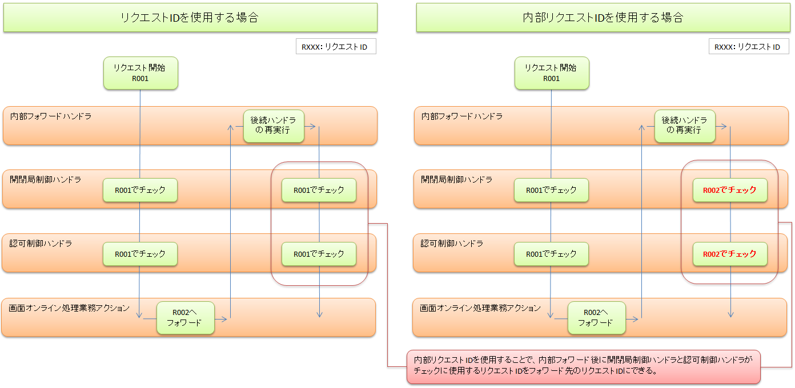

# ハンドラの構造と実装

**公式ドキュメント**: [ハンドラの構造と実装]()

## ハンドラの構造と実装

**インターフェース**: `nablarch.fw.Handler<TData, TResult>`

ハンドラクラスはこのインターフェースを実装する。唯一のメソッド `handle(TData data, ExecutionContext context)` にすべての責務を実装する。

> **注意**: 業務アクションハンドラを実装する場合は、Handlerインターフェースを直接実装せず、テンプレートクラスを利用すること。参照: [action_handler_template](../../component/handlers/handlers-handler.md)

**型変数による分類（[web_gui](../../processing-pattern/web-application/web-application-web_gui.md) 向け）:**

| 型変数 | ハンドラの処理内容 | ハンドラ例 |
|---|---|---|
| `Object` | DBトランザクション制御などリクエスト内容に直接依存しない処理 | [../handler/TransactionManagementHandler](../../component/handlers/handlers-TransactionManagementHandler.md)、[../handler/ServiceAvailabilityCheckHandler](../../component/handlers/handlers-ServiceAvailabilityCheckHandler.md) |
| `Request` | 業務アクションハンドラのディスパッチなどリクエスト内容に沿った共通処理 | [../handler/RequestPathJavaPackageMapping](../../component/handlers/handlers-RequestPathJavaPackageMapping.md)、[../handler/RequestHandlerEntry](../../component/handlers/handlers-RequestHandlerEntry.md) |
| `HttpRequest` | HTTPアクセスログ記録などHTTPリクエストに直接依存した処理 | [../handler/HttpResponseHandler](../../component/handlers/handlers-HttpResponseHandler.md)、[../handler/HttpAccessLogHandler](../../component/handlers/handlers-HttpAccessLogHandler.md) |

- `Object`型・`Request`型のハンドラは [web_gui](../../processing-pattern/web-application/web-application-web_gui.md)、[batch](../../processing-pattern/nablarch-batch/nablarch-batch-batch-architectural_pattern.md)、[messaging](../../processing-pattern/mom-messaging/mom-messaging-messaging.md) で共用可能
- `HttpRequest`型のハンドラは [web_gui](../../processing-pattern/web-application/web-application-web_gui.md) 以外では使用不可

第二引数の**実行コンテキスト**には以下が含まれる:
- :ref:`ハンドラキュー<handlerQueue>`
- [リクエストスコープ](about-nablarch-concept-architectural_pattern.md)
- [セッションスコープ](about-nablarch-concept-architectural_pattern.md)
- [データリーダ/データリーダファクトリ](about-nablarch-concept-architectural_pattern.md)

`handle()` メソッドはその戻り値として、ハンドラの処理結果を表すオブジェクトを返す。**処理結果オブジェクトの型もリクエストと同様、処理方式ごとに異なるため、ハンドラごとに型変数として宣言する必要がある。**

**ハンドラ処理フロー（3ブロック）:**

1. **往路処理**: `handle()` 開始から後続ハンドラへの委譲まで（例: 権限チェック、トランザクション開始、アクセスログ出力）
2. **復路処理**: 後続ハンドラの正常終了後から `handle()` 終了まで（例: 応答送信、トランザクションコミット、リソース解放）
3. **例外処理**: 当該または後続ハンドラで例外発生時（例: エラー応答送信、障害ログ出力、トランザクションロールバック、リソース解放）

後続ハンドラへの委譲は `ExecutionContext#handleNext()` で行う。`handle()` はチェック例外を送出しないため、`RuntimeException` または `Error` をキャッチする。

```java
public class TransactionHandler implements Handler<Request, Result> {
    public Result handle(Request request, ExecutionContext context) {
        try {
            beginTransaction(request, context);           // 1. 往路処理
            Result result = context.handleNext(request); // 後続ハンドラへ委譲
            commitTransaction(result, request, context);  // 2. 復路処理
            return result;
        } catch (RuntimeException e) {
            rollbackTransaction(e, request, context);     // 3. 例外処理
            throw e;
        } catch (Error e) {  // 通常の用途ではjava.lang.Errorを捕捉する必要はない。
            rollbackTransaction(e, request, context);     // 3. 例外処理
            throw e;
        } finally {
            endTransaction(request, context);             // 終端処理
        }
    }
}
```

**インターフェース**: `Result`

```java
public interface Result {
    int getStatusCode();
    String getMessage();
    @Published boolean isSuccess();
}
```

ハンドラの処理結果を返す方法は以下の4つ:

1. **後続のハンドラの結果をそのままリターンする。** 多くのハンドラはこの方式。
2. **処理結果オブジェクトを作成してリターンする。** リクエストが正常終了した場合。実行中のトランザクションは[../handler/TransactionManagementHandler](../../component/handlers/handlers-TransactionManagementHandler.md)によりコミットされる。
3. **処理結果オブジェクトを実行時例外として送出する。** リクエストが異常終了した場合。実行中のトランザクションは[../handler/TransactionManagementHandler](../../component/handlers/handlers-TransactionManagementHandler.md)によりロールバックされる。
4. **処理結果オブジェクトではない実行時例外を送出する。** トランザクションがロールバックされ、[web_gui](../../processing-pattern/web-application/web-application-web_gui.md)・[messaging_request_reply](../../processing-pattern/mom-messaging/mom-messaging-messaging_request_reply.md)・[messaging_http](../../processing-pattern/http-messaging/http-messaging-messaging_http.md)では既定のレスポンス処理が行われる（レスポンス内容は指定不可）。

正常終了時に返却するオブジェクト:

| 実行制御基盤 | 返却する型 | 内容 |
|---|---|---|
| [web_gui](../../processing-pattern/web-application/web-application-web_gui.md) | `HttpResponse` | 遷移先画面のパス等を設定したオブジェクト |
| [messaging_request_reply](../../processing-pattern/mom-messaging/mom-messaging-messaging_request_reply.md)、[messaging_http](../../processing-pattern/http-messaging/http-messaging-messaging_http.md) | `ResponseMessage` | 応答電文のフォーマットや内容を設定したオブジェクト |
| [batch](../../processing-pattern/nablarch-batch/nablarch-batch-batch-architectural_pattern.md)、[messaging_receive](../../processing-pattern/mom-messaging/mom-messaging-messaging_receive.md) | `Result.Success` | 正常終了を表すマーカオブジェクト（レスポンス処理なし） |

異常終了時に送出するオブジェクト:

| 実行制御基盤 | 送出する型 | 内容 |
|---|---|---|
| [web_gui](../../processing-pattern/web-application/web-application-web_gui.md) | `HttpErrorResponse` | エラー時遷移先画面のパス等を設定したオブジェクト |
| [messaging_request_reply](../../processing-pattern/mom-messaging/mom-messaging-messaging_request_reply.md)、[messaging_http](../../processing-pattern/http-messaging/http-messaging-messaging_http.md) | `ErrorResponseMessage` | エラー応答電文を設定したオブジェクト |
| [batch](../../processing-pattern/nablarch-batch/nablarch-batch-batch-architectural_pattern.md)、[messaging_receive](../../processing-pattern/mom-messaging/mom-messaging-messaging_receive.md) | `Result.Error`のサブクラス | 異常終了を表すマーカオブジェクト |

レスポンス処理は[../handler/HttpResponseHandler](../../component/handlers/handlers-HttpResponseHandler.md)、[../handler/MessageReplyHandler](../../component/handlers/handlers-MessageReplyHandler.md)が担当する。

<details>
<summary>keywords</summary>

Handler, nablarch.fw.Handler, ExecutionContext, handle()メソッド, 往路処理, 復路処理, 例外処理, ハンドラ実装, ハンドラインターフェース, TransactionHandler, ハンドラキュー, ハンドラ処理フロー, handleNext, TransactionManagementHandler, ServiceAvailabilityCheckHandler, RequestPathJavaPackageMapping, RequestHandlerEntry, HttpResponseHandler, HttpAccessLogHandler, 処理結果の識別, Result, HttpResponse, ResponseMessage, Result.Success, HttpErrorResponse, ErrorResponseMessage, Result.Error, レスポンス処理, 正常終了, 異常終了, MessageReplyHandler, 処理結果オブジェクト

</details>

## 

`method_binding` アンカー定義。このアンカーは [メソッドレベルバインディング](about-nablarch-concept-architectural_pattern.md) への参照ポイントとして機能する。対応するソースセクションは区切り記号のみで実質的なコンテンツはない。

ハンドラキュー上のハンドラ間でデータを共有する領域。共有範囲や存続期間が異なる以下の4種類が存在する。

**リクエストスコープ**: 各リクエストの開始から終了まで、スレッド毎に固有の変数を保持。実行コンテキスト上に保持され、`Map<String, Object>`インターフェースでアクセス可能。

**セッションスコープ**: 複数のリクエストを跨って存続し、各リクエストスレッド間で共有（共有範囲・存続期間は処理形態ごとに異なる）。実行コンテキストから`Map<String, Object>`でアクセス可能。セッションスコープをリクエストスレッドから変更する場合は、[../handler/SessionConcurrentAccessHandler](../../component/handlers/handlers-SessionConcurrentAccessHandler.md)を使用するなど何らかの同期化が必要。

**スレッドローカル**: [../handler/DbConnectionManagementHandler](../../component/handlers/handlers-DbConnectionManagementHandler.md)など一部のハンドラで使用。`java.lang.ThreadLocal`を経由してデータやオブジェクトを引き回す。DB接続のようにどこで使用するか予期できないデータの受け渡しに有効。

**スレッドコンテキスト**: スレッドローカル変数上に保持された変数スコープ（Map）。ユーザIDやリクエストIDのように、ログ出力やDB共通項目設定用のパラメータを格納。内容の多くは[../handler/ThreadContextHandler](../../component/handlers/handlers-ThreadContextHandler.md)によって設定される。業務アクションハンドラからも任意の変数を設定可能。

### ウィンドウスコープ

画面オンライン実行制御基盤で使用する変数スコープ。複数のリクエストを跨るデータを格納する。セッションスコープがアプリケーションサーバ上でデータを格納するのに対し、ウィンドウスコープは複数画面間をhiddenタグで持ちまわることで実現する。

- ブラウザで複数のウィンドウを立ち上げても並列動作が可能
- ブラウザのヒストリバックによる遷移が可能

> **注意**: ウィンドウスコープに格納された変数はカスタムタグを使用することで自動的にhiddenタグに変換される。**アプリケーションプログラマがJSPにhiddenタグを書く必要はない。**

画面オンライン制御基盤の画面間データ連携では、基本的にセッションスコープではなくウィンドウスコープを使用する。

詳細:
- [画面オンライン用業務アクションハンドラ:変数スコープの利用](../handler/HttpMethodBinding.html#web-scope)
- [カスタムタグ実装例集](../../../../app_dev_guide/guide/development_guide/04_Explanation/CustomTag/basic.html#howto-window-scope)

<details>
<summary>keywords</summary>

method_binding, ハンドラセクション区切り, 変数スコープ, リクエストスコープ, セッションスコープ, スレッドローカル, スレッドコンテキスト, ウィンドウスコープ, DbConnectionManagementHandler, SessionConcurrentAccessHandler, ThreadContextHandler, ThreadLocal, hiddenタグ, Map<String, Object>

</details>

## リクエストの識別と業務処理の実行

**リクエストID**: リクエストが依頼する「処理」を一意識別する情報。実装レベルではリクエストパスの一部に含まれる。

**実行時ID**: 各リクエスト実行ごとに割り振られる一意文字列。ログやDB上で個別業務処理を識別・トレースする目的で使用する。

**リクエストパス**: NAFが各リクエストを実行する業務アクションハンドラを特定するための文字列。リクエストIDを部分文字列として含み、1対1の関係を持つ。全リクエストに同一ハンドラを使う場合（例: 一般バッチ）は、起動引数にリクエストパスを指定すればよい（リクエスト内にリクエストパス/リクエストIDを含める必要はない）。

**実行制御基盤別のリクエストパス:**

| 実行制御基盤 | リクエストの種類 | リクエストパス |
|---|---|---|
| [web_gui](../../processing-pattern/web-application/web-application-web_gui.md) | HTTPリクエスト | リクエストURI（URIパス階層→パッケージ+クラスにマッピング） |
| [messaging](../../processing-pattern/mom-messaging/mom-messaging-messaging.md) | 処理要求電文(MOM) | FWヘッダ領域の特定フィールド（外部設定でパッケージ指定、階層構造なし） |
| [messaging](../../processing-pattern/mom-messaging/mom-messaging-messaging.md) | コマンドライン | 起動コマンドの特定パラメータ値（全電文を単一ハンドラで処理） |
| [messaging](../../processing-pattern/mom-messaging/mom-messaging-messaging.md) | 処理要求電文(HTTP) | FWヘッダの特定フィールド、またはリクエストURIから取得したリクエストID（FWヘッダ値で上書き可） |
| [batch](../../processing-pattern/nablarch-batch/nablarch-batch-batch-architectural_pattern.md) | データレコード | ファイル/DBテーブルの特定カラム値（レコード毎に個別ハンドラ実行可能） |
| [batch](../../processing-pattern/nablarch-batch/nablarch-batch-batch-architectural_pattern.md) | コマンドライン | 起動コマンドの特定パラメータ値（全レコードを単一ハンドラで処理） |

**リクエストパスとリクエストIDのマッピング例:**

| 形態 | リクエストパス | リクエストID |
|---|---|---|
| リクエストURI | http://www.example.com/app/admin/UserAction/WAA0010.do | WAA0010 |
| プロセス起動引数 | -requestPath admin.DataUnloadBatchAction/BC0012 | BC0012 |
| 処理要求電文 | RW0023 | RW0023 |

※ [messaging](../../processing-pattern/mom-messaging/mom-messaging-messaging.md) では、通常、リクエストIDとリクエストパスは同じ文字列となる。

- [../handler/ThreadContextHandler](../../component/handlers/handlers-ThreadContextHandler.md) がリクエストパスとリクエストIDの紐付けを行い、以降はスレッドコンテキスト上の変数として参照可能
- [../handler/RequestPathJavaPackageMapping](../../component/handlers/handlers-RequestPathJavaPackageMapping.md) がリクエストパス/リクエストIDと業務アクションハンドラのマッピングを行い、ハンドラキューに追加

**内部フォーワード処理と内部リクエストID:**
- 処理実行中に異なるリクエストパスでハンドラキューを再実行する処理（参照: [../handler/ForwardingHandler](../../component/handlers/handlers-ForwardingHandler.md)）
- リクエストパスは変更されるが、**リクエストIDと実行時IDは同一リクエスト処理中は不変**
- 変更後のリクエストパスのリクエストIDは「内部リクエストID」としてスレッドコンテキスト上の別変数に格納
- 内部リクエストIDを使用することで、フォワード先のリクエストIDで開閉局制御・認可制御が実施できる



- 内部リクエストIDを開閉局制御・認可制御に使用する場合の設定方法: [../handler/ServiceAvailabilityCheckHandler](../../component/handlers/handlers-ServiceAvailabilityCheckHandler.md)、[../handler/PermissionCheckHandler](../../component/handlers/handlers-PermissionCheckHandler.md) 参照

一部のハンドラでは特定のインタフェースを実装した後続ハンドラに対してコールバックを行う。代表例は[../handler/TransactionManagementHandler](../../component/handlers/handlers-TransactionManagementHandler.md)で、コミットまたはロールバックのタイミングでコールバックを行う。

**インターフェース**: `TransactionEventCallback<TData>`

```java
public interface TransactionEventCallback<TData> {
    void transactionNormalEnd(TData data, ExecutionContext ctx);
    void transactionAbnormalEnd(Throwable e, TData data, ExecutionContext ctx);
}
```

業務アクションハンドラがこのインターフェースを実装することで、業務トランザクションがロールバックされた場合の例外制御が可能。

コールバック制御を行うハンドラ:
- [../handler/TransactionManagementHandler](../../component/handlers/handlers-TransactionManagementHandler.md)
- [../handler/MultiThreadExecutionHandler](../../component/handlers/handlers-MultiThreadExecutionHandler.md)
- [../handler/LoopHandler](../../component/handlers/handlers-LoopHandler.md)

<details>
<summary>keywords</summary>

リクエストID, 実行時ID, リクエストパス, 業務処理ディスパッチ, ThreadContextHandler, RequestPathJavaPackageMapping, 内部フォーワード, 内部リクエストID, ForwardingHandler, ServiceAvailabilityCheckHandler, PermissionCheckHandler, ハンドライベントコールバック, TransactionEventCallback, transactionNormalEnd, transactionAbnormalEnd, TransactionManagementHandler, MultiThreadExecutionHandler, LoopHandler, コールバック

</details>

## 

**メソッドレベルバインディング**: ハンドラインターフェースを実装**していない**オブジェクトをハンドラキューに追加（またはディスパッチ）することで有効化される仕組み。フレームワークは実行コンテキスト上の `MethodBinding` モジュールを使って `handle()` に代わるメソッドを決定・実行する。

> **警告**: `MethodBinding` が実行コンテキストに未設定の状態でハンドラインターフェース非実装オブジェクトをハンドラキューに追加すると実行時エラーが送出される。

フレームワーク標準の `MethodBinder`:

| クラス名 | 概要 | 参照 |
|---|---|---|
| `nablarch.fw.web.HttpMethodBinding` | HTTPリクエストメソッド名(GET/POST/DELETE/PUT等)およびリソース名に応じてメソッドを呼び分ける | [../handler/HttpMethodBinding](../../component/handlers/handlers-HttpMethodBinding.md) |
| `nablarch.fw.handler.RecordTypeBinding` | 入力ファイルや電文データのレコード種別（ヘッダ/データ/トレーラ等）に応じてメソッドを呼び分ける | [../handler/FileBatchAction](../../component/handlers/handlers-FileBatchAction.md) |

外部リソース（ファイル、DB、メッセージキューなど）から1業務トランザクションの実行に必要な情報を読み込むコンポーネント。読み込まれたデータは後続ハンドラの入力として渡され、最終的に業務アクションハンドラが処理する。

> **注意**: [web_gui](../../processing-pattern/web-application/web-application-web_gui.md)ではHTTPリクエスト内に1業務トランザクションの情報が含まれるため、別途データリーダを使用する必要はない。

**インターフェース**: `DataReader<TData>`

```java
public interface DataReader<TData> {
    TData read(ExecutionContext ctx);
    boolean hasNext(ExecutionContext ctx);
    void close(ExecutionContext ctx);
}
```

複数のリクエストスレッドから並行アクセスされ得るため、各メソッドはスレッドセーフに実装する必要がある。

データリーダの作成責務とタイミング:

| 実行制御基盤 | 作成するコンポーネント | 作成するタイミング |
|---|---|---|
| [web_gui](../../processing-pattern/web-application/web-application-web_gui.md) | (使用しない) | N/A |
| [batch](../../processing-pattern/nablarch-batch/nablarch-batch-batch-architectural_pattern.md) | 業務アクションハンドラ | [../handler/MultiThreadExecutionHandler](../../component/handlers/handlers-MultiThreadExecutionHandler.md)の初期処理内（`DataReaderFactory`をコールバック） |
| [messaging](../../processing-pattern/mom-messaging/mom-messaging-messaging.md) | リポジトリ | リポジトリでの初期化処理内（オブジェクトキー名: **dataReader**） |

データリードハンドラ: [../handler/DataReadHandler](../../component/handlers/handlers-DataReadHandler.md)が実行コンテキスト上のデータリーダから1件分の業務処理データを読み込み、後続ハンドラに処理を委譲する。

<details>
<summary>keywords</summary>

メソッドレベルバインディング, MethodBinding, MethodBinder, HttpMethodBinding, RecordTypeBinding, nablarch.fw.web.HttpMethodBinding, nablarch.fw.handler.RecordTypeBinding, FileBatchAction, データリーダ, DataReader, DataReaderFactory, DataReadHandler, read, hasNext, close, ExecutionContext, バッチ, メッセージング, スレッドセーフ

</details>

## 

**インターフェース**: `nablarch.fw.Request<TParam>`

リクエストパスを定義する際に実装するインターフェース。このインターフェースを実装することでリクエスト毎に実行する業務処理を切り替えることが可能になる。

| メソッド名 | 説明 |
|---|---|
| `String getRequestPath()` | リクエストの種別を識別する文字列（リクエストパス）を返す |
| `Request<TParam> setRequestPath(String requestPath)` | リクエストパスを設定する |
| `TParam getParam(String name)` | 指定名のリクエストパラメータを取得する |
| `Map<String, TParam> getParamMap()` | リクエストパラメータのMapを返す |

業務処理を実装するハンドラで、業務アプリケーション開発担当者が実装する。

業務処理の流れ:

1. **入力データの取得**: 入力データはMap形式で取得する。
2. **入力精査**: フォーム定義に沿った精査処理を行う。フォームクラスの各項目に宣言的に精査仕様を設定できる。DB内容との比較などはビジネスロジックの一部として実装する。
3. **ビジネスロジックの実行**: 精査完了した入力データをフォームまたはエンティティオブジェクトとして取得し処理する。複数業務アクションから共用しうるロジックは共通コンポーネントとして実装することを推奨。
4. **処理結果の返却**: 正常終了時は処理結果オブジェクトを生成して返却。異常終了時は実行時例外を送出し、[../handler/TransactionManagementHandler](../../component/handlers/handlers-TransactionManagementHandler.md)により業務トランザクションがロールバックされる。

> **注意**: エンティティとは以下の特徴を持つフォームクラスの総称。テーブル定義に沿って作成される。(1) フォームクラスがRDBMSのテーブルと1対1にひもづく。(2) フォームクラスのプロパティとテーブルのカラムが1対1にひもづく。

<details>
<summary>keywords</summary>

リクエストインターフェース, nablarch.fw.Request, getRequestPath, setRequestPath, getParam, getParamMap, リクエストパス定義, 業務アクションハンドラ, フォーム, エンティティ, 入力精査, ビジネスロジック, 共通コンポーネント, TransactionManagementHandler, 処理結果返却, DataReaderFactory

</details>
