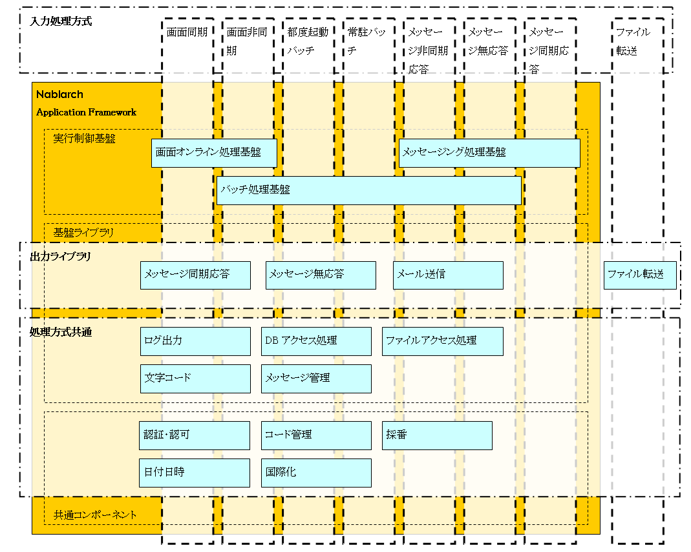

# NAF概要

## NAFの構成とNablarchアプリケーション処理方式の概要

## NAFの構成

NAFは以下の3つのモジュール群で構成される:

- **NAF実行制御基盤**: 外部からの処理要求に対して適切な業務処理を選択・実行するフレームワーク。[architectural_pattern/web_gui](../../processing-pattern/web-application/web-application-web_gui.md)、[architectural_pattern/batch](../../processing-pattern/nablarch-batch/nablarch-batch-batch-architectural_pattern.md)、[architectural_pattern/messaging](../../processing-pattern/mom-messaging/mom-messaging-messaging.md) に対応した実行制御基盤を提供
- **NAF基盤ライブラリ**: [ログ出力](../../component/libraries/libraries-01_Log.md)、[データベースアクセス](../../component/libraries/libraries-04_DbAccessSpec.md)、[core_library/enterprise_messaging_overview](../../component/libraries/libraries-enterprise_messaging_overview.md) などの独立した共通機能モジュール群
- **NAF共通コンポーネント**: NAF実行制御基盤・NAF基盤ライブラリを用いて実装した業務共通機能（[認可](../../component/libraries/libraries-04_Permission.md)、:ref:`開閉局<serviceAvailable>` など）

## Nablarchアプリケーション処理方式の概要

Nablarchアプリケーション処理方式（標準アプリケーションアーキテクチャ）は **入力処理方式**、**出力ライブラリ**、**処理方式共通** の3要素で構成される。NAFはこの処理方式を実現するよう設計・実装されているが、処理方式自体はNAFとは直接関係しない独立したアーキテクチャ定義である。例えば、Nablarchアプリケーション処理方式に対して、他のOSS製品群をベースとした実装系を実現することも可能である。

### 入力処理方式（8分類）

| No. | 大分類 | 入力インターフェース | 処理方式名称 | 概要 |
|---|---|---|---|---|
| 1 | オンライン | 画面 | 画面同期処理方式 | Webブラウザからのリクエストをもとにデータ照会・更新等を行い結果を返却 |
| 2 | オンライン | 画面 | 画面非同期処理方式 | 同期処理に加え、大量データ・長時間処理・外部非同期連携を遅延実行 |
| 3 | オンライン | メッセージ | メッセージ同期応答処理方式 | 他システムからの要求電文をもとに処理し、結果を送信元システムへ返却 |
| 4 | オンライン | メッセージ | メッセージ非同期応答処理方式 | 同期応答に加え、大量データ・長時間処理・外部非同期連携を遅延実行 |
| 5 | オンライン | メッセージ | メッセージ無応答処理方式 | 他システムからの要求電文をもとにデータ更新等を行う。送信元への応答なし、全て遅延実行 |
| 6 | オンライン | ファイル | ファイル転送処理方式 | 他システムからの転送ファイルをもとにデータ更新等を行う |
| 7 | オフライン | －（オフライン） | 都度起動バッチ処理方式 | ジョブスケジューラーからの定刻起動等により大量データを一括実行 |
| 8 | オフライン | －（オフライン） | 常駐バッチ処理方式 | プロセス常駐後にDBを常駐監視し、インプットデータ登録時に即時実行 |

### 出力ライブラリ（4分類）

| No. | 出力媒体 | 処理方式名 | 概要 |
|---|---|---|---|
| 1 | メッセージ | 同期応答メッセージ送信 | 他システムへ要求電文を送信し、処理結果を受信 |
| 2 | メッセージ | 無応答メッセージ送信 | 他システムへ要求電文を送信のみ（結果受信なし） |
| 3 | ファイル | ファイル転送 | 他システムへファイルを転送 |
| 4 | メール | メール送信 | 電子メール送信（外部メールASPサービス経由のSMTPリレー） |

### 処理方式共通

入力・出力処理方式を問わず共通的に実行される処理方式:
- ログ出力、データベースアクセス、ファイルアクセス、文字コード処理、メッセージ管理、認証・認可、コード管理、採番、日付・日時、国際化 等

keywords

NAF実行制御基盤, NAF基盤ライブラリ, NAF共通コンポーネント, 入力処理方式, 出力ライブラリ, 処理方式共通, 画面同期処理方式, 画面非同期処理方式, メッセージ同期応答処理方式, メッセージ非同期応答処理方式, メッセージ無応答処理方式, ファイル転送処理方式, 都度起動バッチ処理方式, 常駐バッチ処理方式, Nablarchアプリケーション処理方式

## NAFによるNablarchアプリケーション処理方式の実装

NAFはNablarchアプリケーション処理方式の大部分を実装している。ファイル転送入力処理方式など一部の例外はある。

keywords

NAF実装範囲, Nablarchアプリケーション処理方式, ファイル転送入力処理方式, NAF構成図

