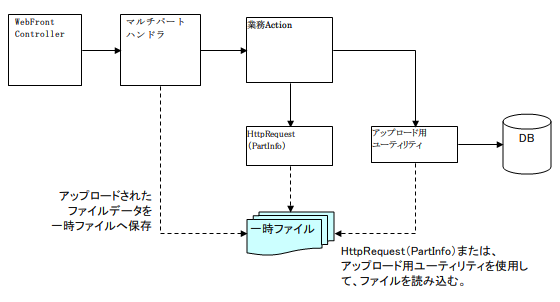

## マルチパートリクエストハンドラ

**クラス名:** `nablarch.fw.web.upload.MultipartHandler`

-----

-----

### 概要

本ハンドラは、HTTPリクエストボディがマルチパート形式であった場合にその内容を解析し、一時ファイルに保存する。
保存されたファイルは、アップロード用ユーティリティを使用することで、業務アクションハンドラから参照することが可能となる。



-----

**ハンドラ処理概要**

| ハンドラ | クラス名 | 入力型 | 結果型 | 往路処理 | 復路処理 | 例外処理 |
|---|---|---|---|---|---|---|
| HTTPレスポンスハンドラ | nablarch.fw.web.handler.HttpResponseHandler | HttpRequest | HttpResponse | - | HTTPレスポンスの内容に沿ってレスポンス処理かサーブレットフォーワードのいずれかを行う。 | 既定のエラー画面をレスポンス後、例外を再送出する。ただしサーブレットフォーワード処理中にエラーが発生した場合はログ出力のみを行なう。 |
| HTTPエラー制御ハンドラ | nablarch.fw.web.handler.HttpErrorHandler | HttpRequest | HttpResponse | - | HTTPレスポンスの内容が設定されていない場合は、ステータスコードに応じたデフォルトページを遷移先に設定する。 | 送出されたエラーに応じた遷移先のHTTPレスポンスオブジェクトを返却する。送出されたエラーはリクエストスコープに設定される。 |
| マルチパートリクエストハンドラ | nablarch.fw.web.upload.MultipartHandler | HttpRequest | HttpResponse | HTTPリクエストボディがマルチパート形式であった場合にその内容を解析し、一時ファイルに保存する。 | アップロードされた一時ファイルを全て削除する。 | アップロードされた一時ファイルを全て削除する。 |
| Nablarchカスタムタグ制御ハンドラ | nablarch.common.web.handler.NablarchTagHandler | HttpRequest | HttpResponse | Nablarchカスタムタグの動作に必要な事前処理を実施する。 | - | - |

**関連するハンドラ**

| ハンドラ | 内容 |
|---|---|
| [HTTPエラー制御ハンドラ](../../component/handlers/handlers-HttpErrorHandler.md) | 本ハンドラでは、アップロードされたファイルが許容上限サイズを越えた場合などに 例外が送出される可能性があるので、 [HTTPエラー制御ハンドラ](../../component/handlers/handlers-HttpErrorHandler.md) の後続に配置し、 適切なエラー画面が表示されるようにする必要がある。 |
| [Nablarchカスタムタグ制御ハンドラ](../../component/handlers/handlers-NablarchTagHandler.md) | このハンドラでは、HTTPリクエストオブジェクトのリクエストパラメータを使用するので、 POSTパラメータの解析の際にリクエストボディが読み込まれる。 そのため、本ハンドラを [Nablarchカスタムタグ制御ハンドラ](../../component/handlers/handlers-NablarchTagHandler.md) よりも上位に配置する必要がある。 |

> **Note:**
> 一般に、HTTPリクエストのリクエストボディの読みこみを行うハンドラは、必ず [マルチパートリクエストハンドラ](../../component/handlers/handlers-MultipartHandler.md)
> の後続に配置する必要がある。

> 具体的には、 [HTTPアクセスログハンドラ](../../component/handlers/handlers-HttpAccessLogHandler.md) を拡張し、特定のリクエストパラメータを出力するケースや、
> [スレッドコンテキスト変数管理ハンドラ](../../component/handlers/handlers-ThreadContextHandler.md) にリクエストパラメータの内容に依存したカスタムの属性を追加するようなケースがこれに該当する。

### ハンドラ処理フロー

**[往路処理]**

**1. (非マルチパートリクエストのスキップ)**

HTTPリクエストのCONTENT-TYPEヘッダー値を取得し、 **"multipart/form-data"** に一致しない場合は、
このハンドラでは何もせずに、後続のハンドラの実行結果をリターンして終了する。

**2. (マルチパートリクエストの解析)**

HTTPリクエストオブジェクトのメッセージボディを読み込み、マルチパートの解析を行い、アップロードされたファイルを
一時ファイルとして保存する。
保存先は、論理パス名 **"uploadFileTmpDir"** に設定されたパスとなる。
また、論理パスが設定されていない場合は、OS標準の一時ファイル保存先(Javaシステムプロパティ **"java.io.tmpdir"** の値)となる。

解析結果は、HTTPリクエストオブジェクト自体に格納され、アップロードファイルに関する情報は [HttpRequest.getPart()](../../javadoc/nablarch/fw/web/HttpRequest.html#getPart(java.lang.String)) で取得できる。
また、アップロードファイル以外のパラメータについては、通常どおり [HttpRequest.getParam()](../../javadoc/nablarch/fw/Request.html#getParam(java.lang.String)) 等で取得できる。

**3. (ログ出力)**

アップロードされたファイルに関する情報をログに出力する。(INFOレベル)

**4. (後続ハンドラに対する処理委譲)**

ハンドラキュー上の後続ハンドラに対して処理を委譲し、その結果を取得する。

**[復路処理]**

**5. (終端処理)**

アップロードされた一時ファイルを全て削除する。

**6. (正常終了)**

**4.** の結果をリターンして終了する。

**2a. (マルチパート形式エラー)**

アップロード中に、接続が切断されるなどの事由により、読み込んだリクエストボディの内容がマルチパートフォーマットに反した場合は、
実行時例外 [Result.BadRequest](../../javadoc/nablarch/fw/Result.BadRequest.html) を送出して終了する。(ステータスコード400)

**2b. (アップロード上限超過エラー)**

読み込んだデータのサイズが本ハンドラに設定されたアップロードサイズの上限値を超過した場合は、
実行時例外 [Result.BadRequest](../../javadoc/nablarch/fw/Result.BadRequest.html) を送出して終了する。(ステータスコード413)

**[例外処理]**

**4a. (終端処理)**

後続ハンドラの処理中に何らかの例外が発生した場合は、 **5.** の終端処理を実行し、例外を再送出する。

### 設定項目・拡張ポイント

本ハンドラの設定値は、 UploadSettingsに集約されており、その内容は以下の通りである。

| 設定項目 | プロパティ名 | データ型 | 備考 |
|---|---|---|---|
| アップロードサイズ上限 | contentLengthLimit | int | 任意設定。(単位:バイト) 1リクエストでアップロードできるデータの上限値 (ファイルサイズの上限ではない。) デフォルトは無制限。 |
| 一時ファイル自動削除の実施有無 | autoCleaning | boolean | 任意指定。デバッグや障害解析用に無効化する。 デフォルトはtrue(自動削除を実施)  > **Note:** > 一時ファイル保存中に例外が発生した場合には、 > 自動削除の設定がオフの場合でもファイルを削除する。  > これにより、不正な状態のファイル（空ファイルや途中まで > 保存されたファイル）が作成されることを防ぐことが出来る。  > ※一時ファイルが正常に保存でき、後続のハンドラに処理が > 移譲できた場合には、自動削除がオンの場合のみファイルを削除する。 |

**基本設定**

アップロードサイズの上限値を定めておくことを強く推奨する。
また、上限値はユーザ要望等の事由によって変更になる可能性があるので、設定パラメータとして外部化しておくこと。

```xml
<component class="nablarch.fw.web.upload.MultipartHandler" name="multipartHandler">
  <property name="uploadSettings">
    <component class="nablarch.fw.web.upload.UploadSettings">
      <!-- Content-Lengthの上限値 -->
      <property name="contentLengthLimit" value="${uploadSizeLimit}" />
    </component>
  </property>
</component>
```

**アップロードファイルの一時保存先の設定**

アップロードされたファイルの一時保存先を指定する場合は、論理パス名 **"uploadFileTmpDir"** を使用すること。
保存先のパスは環境依存値となるので、設定パラメータとして外部化しておくこと。

```xml
<component name="filePathSetting" class="nablarch.core.util.FilePathSetting">
  <property name="basePathSettings">
    <map>
      <!-- アップロードファイルの一時格納場所 -->
      <entry key="uploadFileTmpDir" value="${upload-file-tmp-dir}" />
    </map>
  </property>
</component>
```
