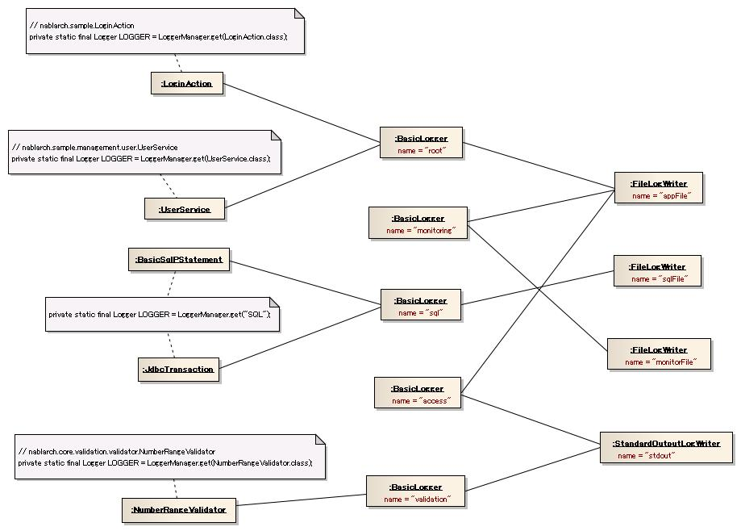
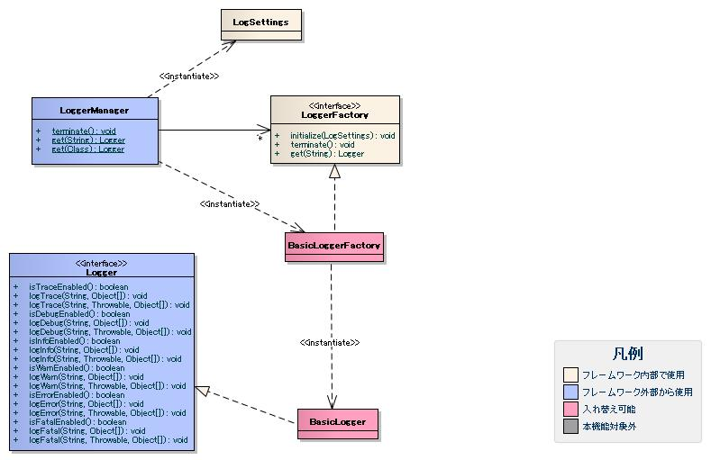

# ログ出力

**公式ドキュメント**: [ログ出力]()

## 概要

フレームワークおよびアプリケーションからのログ出力機能を提供する。明示的な初期処理は不要だが、出力先リソースを解放するため終了処理が必要。

- WebアプリケーションではNablarchServletContextListenerが終了処理を担当（[../../handler/NablarchServletContextListener](../handlers/handlers-NablarchServletContextListener.md) 参照）
- アプリケーションプログラマはログ出力方針に基づいてログを出力する（方法は :ref:`loggerUses` 参照）

**クラス**: `nablarch.core.log.basic.LogLevel`

ログレベルを表す列挙型。

**クラス**: `nablarch.core.log.basic.SynchronousFileLogWriter`

`nablarch.core.log.basic.FileLogWriter` を継承。ロックファイルを用いた排他制御でファイルにログを書き込む。複数プロセスから同一ファイルへのログ出力処理を直列化できる。

設定プロパティ:

| プロパティ名 | 説明 |
|---|---|
| filePath | 書き込み先ファイルパス |
| encoding | 文字エンコーディング |
| outputBufferSize | 出力バッファサイズ（KB、1KB=1000バイト、デフォルト8KB） |
| maxFileSize | ファイル最大サイズ（KB） |
| formatter.className | ログフォーマッタクラス名 |
| level | 出力するログレベルの下限（このレベル以上を出力） |
| lockFilePath | ロックファイルのパス |
| lockRetryInterval | ロック取得再試行間隔（ミリ秒） |
| lockWaitTime | ロック取得待機時間（ミリ秒） |
| failureCodeCreateLockFile | ロックファイル生成失敗時の障害通知コード |
| failureCodeReleaseLockFile | ロックファイル解放失敗時の障害通知コード |
| failureCodeForceDeleteLockFile | ロックファイル強制削除失敗時の障害通知コード |
| failureCodeInterruptLockWait | ロック待ち中割り込み発生時の障害通知コード |

設定例:

```bash
writerNames=monitorFile
writer.monitorFile.className=nablarch.core.log.basic.SynchronousFileLogWriter
writer.monitorFile.filePath=/var/log/app/monitor.log
writer.monitorFile.encoding=UTF-8
writer.monitorFile.outputBufferSize=8
writer.monitorFile.maxFileSize=50000
writer.monitorFile.formatter.className=nablarch.core.log.basic.BasicLogFormatter
writer.monitorFile.level=ERROR
writer.monitorFile.lockFilePath=/var/log/lock/monitor.lock
writer.monitorFile.lockRetryInterval=10
writer.monitorFile.lockWaitTime=3000
writer.monitorFile.failureCodeCreateLockFile=MSG00101
writer.monitorFile.failureCodeReleaseLockFile=MSG00102
writer.monitorFile.failureCodeForceDeleteLockFile=MSG00103
writer.monitorFile.failureCodeInterruptLockWait=MSG00104
```

上記設定例の場合、出力対象のログレベルが **ERROR** 以上なので初期処理後のログは出力されない。出力対象のログレベルに **INFO** レベルが含まれている場合は、以下のログが初期処理後に出力される（括弧内はデフォルト値の例）:

```
2012-04-18 11:56:27.137 -INFO- nablarch.core.log.basic.FileLogWriter [null] boot_proc = [] proc_sys = [] req_id = [null] usr_id = [null] initialized.
    WRITER NAME        = [monitorFile]
    WRITER CLASS       = [nablarch.core.log.basic.SynchronousFileLogWriter]
    FORMATTER CLASS    = [nablarch.core.log.basic.BasicLogFormatter]
    LEVEL              = [ERROR]
    FILE PATH          = [/var/log/app/monitor.log]
    ENCODING           = [UTF-8]
    OUTPUT BUFFER SIZE = [8000]
    FILE AUTO CHANGE   = [true]
    MAX FILE SIZE      = [50000000]
    CURRENT FILE SIZE  = [0]
    LOCK FILE PATH                      = [/var/log/lock/monitor.lock]
    LOCK RETRY INTERVAL                 = [1]
    LOCK WAIT TIME                      = [1800]
    FAILURE CODE CREATE LOCK FILE       = [MSG00101]
    FAILURE CODE RELEASE LOCK FILE      = [MSG00102]
    FAILURE CODE FORCE DELETE LOCK FILE = [MSG00103]
    FAILURE CODE INTERRUPT LOCK WAIT    = [MSG00104]
```

**障害が発生した場合の動作**:

- ロック取得待機時間を超えても取得できない場合: 強制的にロックファイルを削除し、自スレッド用ロックファイルを生成してログ出力
- 強制削除できない場合: ロックなし状態で強制ログ出力し、処理を終了する※
- ロックファイル生成失敗時・割り込み発生時: ロックなし状態で強制ログ出力し、処理を終了する※

※「処理を終了」とは、ログ出力処理を終了し呼び出し元に処理を正常に戻すことを意味する。アプリケーションがクラッシュするわけではない。

> **警告**: ロックなし状態での強制出力時に複数プロセスが競合すると、ログが正常に出力されない場合がある。

障害発生時は同一ログファイルに障害ログも出力される。障害コードをプロパティに設定することで障害通知ログフォーマット（障害コードを含む）で出力可能。これにより通常の障害監視と同じ方法で監視できるため、**障害コードの設定を推奨**。

> **警告**: 障害コードを設定した場合、障害通知ログのフォーマットで同一ログファイルに出力されるが、障害解析ログは出力されない。

障害ログ詳細（{0}にはロックファイルのパスが設定される）:

| 障害の種類 | ログレベル | プロパティ名 | メッセージ設定例 | デフォルトログ（障害コードなし時） |
|---|---|---|---|---|
| ロックファイルが生成できない | FATAL | failureCodeCreateLockFile | ロックファイルの生成に失敗しました。おそらくロックファイルのパスが間違っています。ロックファイルパス=[{0}]。 | failed to create lock file. perhaps lock file path was invalid. lock file path=[{0}]. |
| ロックファイルを解放（削除）できない | FATAL | failureCodeReleaseLockFile | ロックファイルの削除に失敗しました。ロックファイルパス=[{0}]。 | failed to delete lock file. lock file path=[{0}]. |
| ロックファイルを強制削除できない | FATAL | failureCodeForceDeleteLockFile | ロックファイルの強制削除に失敗しました。ロックファイルが不正に開かれています。ロックファイルパス=[{0}]。 | failed to delete lock file forcedly. lock file was opened illegally. lock file path=[{0}]. |
| ロック取得待ちで割り込みが発生 | FATAL | failureCodeInterruptLockWait | ロック取得中に割り込みが発生しました。 | interrupted while waiting for lock retry. |

`LogLevelLabelProvider`クラスを使用して、ログレベルを表す文言をプロパティファイルで変更できる。デフォルトはLogLevel列挙型の名称（FATAL, ERROR等）。`BasicLogFormatter`はこの変更をサポートしている。

プロパティキー形式: `writer.<ログライタ名>.formatter.label.<LogLevel列挙型名の小文字>=<文言>`

```properties
writer.appFile.formatter.label.fatal=F
writer.appFile.formatter.label.error=E
writer.appFile.formatter.label.warn=W
writer.appFile.formatter.label.info=I
writer.appFile.formatter.label.debug=D
writer.appFile.formatter.label.trace=T
```

**出力例（文言変更後）**:
```
2011-02-28 12:33:39.569 -F- root [null] boot_proc = [] req_id = [null] usr_id = [null] FATALメッセージ
2011-02-28 12:33:39.569 -E- root [null] boot_proc = [] req_id = [null] usr_id = [null] ERRORメッセージ
```

<details>
<summary>keywords</summary>

ログ出力, 初期化, 終了処理, NablarchServletContextListener, LoggerManager, LogLevel, nablarch.core.log.basic.LogLevel, ログレベル列挙型, SynchronousFileLogWriter, nablarch.core.log.basic.SynchronousFileLogWriter, FileLogWriter, 排他制御, ロックファイル, 複数プロセスログ出力, lockFilePath, lockRetryInterval, lockWaitTime, failureCodeCreateLockFile, failureCodeReleaseLockFile, failureCodeForceDeleteLockFile, failureCodeInterruptLockWait, LogLevelLabelProvider, BasicLogFormatter, ログレベル文言変更, ラベルカスタマイズ, formatter.label

</details>

## 特徴

## ログ出力機能の高い拡張性

以下3つの処理をそれぞれ差し替え可能:
- a) ログの書き込み処理
- b) ログのフォーマット処理
- c) アプリケーションからのログ出力要求受付処理

Log4J用のc（`nablarch.core.log.log4j.Log4JLoggerFactory`）は提供済み。

## 各種ログの出力機能

フレームワークが提供するログ出力機能（ログフォーマットは設定で変更可能）:
- :ref:`障害通知ログ<FailureLog>`
- :ref:`障害解析ログ<FailureLog>`
- :ref:`SQLログ<SqlLog>`
- :ref:`パフォーマンスログ<PerformanceLog>`
- :ref:`HTTPアクセスログ<HttpAccessLog>`
- :ref:`メッセージングログ<MessagingLog>`

**クラス**: `nablarch.core.log.basic.BasicLoggerFactory`

設定はロガーファクトリと同じプロパティファイルに記述する（参照: :ref:`loggerFactorySetting`、設定ルール: :ref:`propsSettingRules`）。

### ログライタ設定

`writerNames` に使用するログライタ名一覧をカンマ区切りで指定し、`writer.{名称}.className` にクラス名を指定する。

```bash
loggerFactory.className=nablarch.core.log.basic.BasicLoggerFactory
writerNames=appFile,sqlFile,monitorFile,stdout

# ファイル出力
writer.appFile.className=nablarch.core.log.basic.FileLogWriter
writer.appFile.filePath=/var/log/app/app.log

# 監視用（ロックファイルによる排他制御あり）
writer.monitorFile.className=nablarch.core.log.basic.SynchronousFileLogWriter
writer.monitorFile.filePath=/var/log/app/monitoring.log
writer.monitorFile.lockFilePath=/var/log/lock/monitor.lock
writer.monitorFile.failureCodeCreateLockFile=MSG00101
writer.monitorFile.failureCodeReleaseLockFile=MSG00102
writer.monitorFile.failureCodeForceDeleteLockFile=MSG00103
writer.monitorFile.failureCodeInterruptLockWait=MSG00104

# 標準出力
writer.stdout.className=nablarch.core.log.basic.StandardOutputLogWriter
```

### ロガー設定

`availableLoggersNamesOrder` に全ロガー設定名をカンマ区切りで指定し、各設定を `loggers.{名称}.*` で行う。

ロガー設定の3プロパティ:
- `<プレフィックス>.nameRegex`: 対象ロガーを絞り込む正規表現（`LoggerManager#get` の引数にマッチング）
- `<プレフィックス>.level`: 出力有無の基準とするログレベル
- `<プレフィックス>.writerNames`: 出力先ログライタ名（複数可）

`LoggerManager#get` メソッドでクラスを指定した場合は、FQCNがロガー名となる。そのため、パッケージやクラスを対象とする `nameRegex` にはFQCNに基づく正規表現を使用する（例: `nablarch\.core\.validation\..*`）。

```bash
availableLoggersNamesOrder=sql,monitoring,access,validation,root

# 全ロガーを対象にWARN以上をappFileに出力
loggers.root.nameRegex=.*
loggers.root.level=WARN
loggers.root.writerNames=appFile

# ロガー名「MONITOR」を対象にERROR以上をappFile,monitorFileに出力
loggers.monitoring.nameRegex=MONITOR
loggers.monitoring.level=ERROR
loggers.monitoring.writerNames=appFile,monitorFile

# ロガー名「SQL」を対象にDEBUG以上をsqlFileに出力
loggers.sql.nameRegex=SQL
loggers.sql.level=DEBUG
loggers.sql.writerNames=sqlFile

# 特定クラスを対象にINFO以上をappFile,stdoutに出力
loggers.access.nameRegex=app\\.user\\.UserManager
loggers.access.level=INFO
loggers.access.writerNames=appFile,stdout

# 特定パッケージ以下を対象にDEBUG以上をstdoutに出力
loggers.validation.nameRegex=nablarch\\.core\\.validation\\..*
loggers.validation.level=DEBUG
loggers.validation.writerNames=stdout
```

> **警告**: `availableLoggersNamesOrder` は記述順に意味がある。ロガー取得時、記述順にマッチングを行い最初にマッチしたロガーを返す。より限定的な正規表現のロガー設定を先に記述すること。例えば `root`（`.*`）を先頭に置くと全ロガーが `root` にマッチし、個別のロガー設定が無効になる。

> **警告**: `availableLoggersNamesOrder` と `loggers.*` のロガー設定名は必ず一致させること。`BasicLoggerFactory` 初期処理で一致チェックを行い、不一致の場合は例外をスローする。一方にのみ存在する設定名がある場合は両方から削除すること。

> **注意**: `nameRegex=.*` のようなキャッチオール設定を1つ用意し、`availableLoggersNamesOrder` の最後に指定することを推奨する。設定漏れがあっても重要なログが出力されるようにするため。

### システムプロパティによる上書き

プロパティファイルの設定はシステムプロパティの同キー名で上書き可能（`-D` オプション使用）。プロセス毎にログ出力設定を変えたい場合に利用できる。

```bash
java -Dloggers.root.level=INFO ...
```

`BasicLoggerFactory` は初期処理完了後、各ログライタに対してロガー設定情報をINFOレベルで出力する。

`LogWriterSupport` を継承するクラスでは、ログライタにおいてレベルに応じた出力制御が可能。

ロガー設定はロガー名毎の設定のため、同じロガー名で異なるレベルで別々のファイルに出力することはできない。ロガー設定にINFOレベルを指定し、特定のログライタ設定でERRORレベルを指定することで、同一ロガーからの出力を用途別ファイルに振り分けられる。

設定例（アプリログはINFO以上、監視ログはERROR以上のみ出力）:

```bash
writerNames=appFile,monitorFile

writer.appFile.className=nablarch.core.log.basic.FileLogWriter
writer.appFile.filePath=/var/log/app/app.log

writer.monitorFile.className=nablarch.core.log.basic.SynchronousFileLogWriter
writer.monitorFile.filePath=/var/log/app/monitor.log
writer.monitorFile.level=ERROR
writer.monitorFile.lockFilePath=/var/log/lock/monitor.lock
writer.monitorFile.failureCodeCreateLockFile=MSG00101
writer.monitorFile.failureCodeReleaseLockFile=MSG00102
writer.monitorFile.failureCodeForceDeleteLockFile=MSG00103
writer.monitorFile.failureCodeInterruptLockWait=MSG00104

availableLoggersNamesOrder=root

loggers.root.nameRegex=.*
loggers.root.level=INFO
loggers.root.writerNames=appFile,monitorFile
```

`appFile` はログレベル未指定のためロガー設定のINFO以上が出力される。`monitorFile` はERRORレベル指定のためERROR以上のみ出力される。

- 新しいログライタを追加する場合: `LogWriter`インタフェースを実装したクラスを作成する。
- ログフォーマッタを使用するログライタを作成する場合: `LogWriterSupport`クラスを継承することで共通処理を利用できる。

<details>
<summary>keywords</summary>

ログ出力拡張性, Log4J, FailureLog, SqlLog, PerformanceLog, HttpAccessLog, MessagingLog, 障害通知ログ, SQLログ, パフォーマンスログ, HTTPアクセスログ, メッセージングログ, BasicLoggerFactory, nablarch.core.log.basic.BasicLoggerFactory, availableLoggersNamesOrder, writerNames, nameRegex, FileLogWriter, SynchronousFileLogWriter, StandardOutputLogWriter, ロガー設定, ログライタ設定, プロパティファイル設定, LogWriterSupport, ログライタ レベル設定, ログレベル出力制御, level, LogWriter, ログライタカスタマイズ, ログライタ追加

</details>

## 要求

## 実装済み

- ログ出力機能の実装を差し替えることができる
- ログ毎にログレベルと出力先を設定できる
- パッケージ単位やクラス単位で設定対象のログを絞り込める
- 1つのログを複数の出力先に出力できる（障害解析用と監視用などを別々に収集可能）
- ログの出力先を変更できる
- ログをファイルに出力できる
- ログファイルが指定サイズに達したら出力ファイルを自動切り替えできる
- ログのフォーマットを変更できる
- ログレベルを表す文言を変更できる
- オブジェクト情報（クラス名とフィールド値）をログ出力できる
- エラー情報（例外クラスのエラーメッセージとスタックトレース）をログ出力できる
- ログのフォーマットを設定のみで変更できる
- 性能測定を目的としたログ集計ができる
- アクセスログを取得できる（リクエストパラメータ出力・特定項目マスク・処理結果出力対応）
- ログ監視ツール対応フォーマットでログを出力できる
- 複数プロセスから1つのログファイルに出力できる

## 未実装

- データベースにログを出力
- 日付毎に出力ファイルを自動切り替え

## 未検討

- リクエストID単位でのログ出力有無制御（[request_processing](../../about/about-nablarch/about-nablarch-concept-architectural_pattern.md) 参照）
- アプリケーション停止なしでの設定変更反映
- ログファイルの改竄防止
- ファイルパスへの置換文字使用
- ログ出力用スレッドのワーカスレッドからの独立化
- ログ出力機能の部分的差し替え（Log4Jのアペンダのみ使用など）
- 外部ツールからのログ出力ファイル切り替え
- スタックトレース内メッセージのマスク
- フレームワーク処理実行時間の測定
- リクエスト処理実行時間の上限値アラート
- SQLの発行回数上限値アラート

- ロガーのインスタンスはロガー設定毎に生成され、複数のログ出力を要求するインスタンスから共有される。
- ログライタのインスタンスはログライタの設定毎に生成され、複数のロガーから共有される。



**クラス**: `nablarch.core.log.basic.StandardOutputLogWriter`

標準出力にログを書き込むログライタ。開発時にコンソール上でログを確認する場合に使用できる。

設定例:

```bash
writerNames=stdout
writer.stdout.className=nablarch.core.log.basic.StandardOutputLogWriter
writer.stdout.formatter.className=nablarch.core.log.basic.BasicLogFormatter
```

> **警告**: 開発時のデバッグ設定のまま本番運用しないこと。

- 新しいログフォーマッタを追加する場合: `LogFormatter`インタフェースを実装したクラスを作成する。
- ログレベル文言を設定変更可能にする場合: `LogLevelLabelProvider`クラスを使用する。
- ログ出力時のパラメータを増やす場合: `Logger`インタフェースのログ出力メソッドのObject型可変長引数`options`を使用する。

```java
// Logger#logInfoメソッドのシグネチャ
public void logInfo(String message, Object... options)
public void logInfo(String message, Throwable cause, Object... options)
```

`options`引数を規定して使用することで、ログフォーマッタ側でパラメータを受け取れる。

<details>
<summary>keywords</summary>

実装済み機能, 未実装, 未検討, ログレベル制御, 出力先変更, アクセスログ, リクエストパラメータマスク, 複数出力先, ファイルログ, ロガーインスタンス, ログライタインスタンス, インスタンス構造, LoggerManager, StandardOutputLogWriter, nablarch.core.log.basic.StandardOutputLogWriter, 標準出力, コンソール出力, LogFormatter, LogLevelLabelProvider, options, ログフォーマッタカスタマイズ, 可変長引数, logInfo

</details>

## ログ出力要求受付処理

## クラス構成



### インタフェース

| インタフェース名 | 概要 |
|---|---|
| `nablarch.core.log.Logger` | ログを出力するインタフェース。ログ出力機能の実装毎に実装クラスを作成する（ロガー）。 |
| `nablarch.core.log.LoggerFactory` | ロガーを生成するインタフェース。フレームワーク内部でロガー生成に使用（ロガーファクトリ）。 |

### クラス（ロガー）

| クラス名 | 概要 |
|---|---|
| `nablarch.core.log.basic.BasicLogger` | ロガーの基本実装クラス |
| `nablarch.core.log.log4j.Log4JLogger` | Log4Jを使用してログ出力を行うクラス |

### クラス（ロガーファクトリ）

| クラス名 | 概要 |
|---|---|
| `nablarch.core.log.basic.BasicLoggerFactory` | BasicLoggerを生成するロガーファクトリの基本実装クラス |
| `nablarch.core.log.log4j.Log4JLoggerFactory` | Log4JLoggerを生成するクラス |

### その他のクラス

| クラス名 | 概要 |
|---|---|
| `nablarch.core.log.LoggerManager` | ログ出力機能全体を取りまとめるクラス（ロガーマネージャ）。設定で指定されたロガーファクトリを生成・保持し、初期処理・終了処理・ロガー生成をロガーファクトリに委譲する。 |
| `nablarch.core.log.LogSettings` | ログ出力機能の設定をロードして保持するクラス |

## ログレベルの定義

FATAL > ERROR > WARN > INFO > DEBUG > TRACE（FATALが最高レベル）。指定レベル以上のログをすべて出力する。

| レベル | 意味 |
|---|---|
| FATAL | アプリケーションの継続が不可能な深刻な問題。監視必須・即通報・即対応が必要。 |
| ERROR | アプリケーション継続に支障をきたす問題。監視必須だがFATALほどの緊急性はない。 |
| WARN | 放置するとアプリケーション継続に支障をきたす恐れがある事象。ERRORほどの緊急性はない。 |
| INFO | 本番運用時にアプリケーション情報を出力するレベル。アクセスログや統計ログが該当。 |
| DEBUG | 開発時のデバッグ情報出力レベル。SQLログや性能ログが該当。 |
| TRACE | DEBUGよりさらに細かい情報を出力する場合に使用。 |

> **警告**: FATAL/ERROR/WARN/INFOレベルは通常フレームワークが出力する。DEBUG/TRACEレベルは本番運用時に出力してはならない（性能劣化とログファイルの肥大化を招く）。

> **注意**: 本番運用時はINFOレベルでログを出力する。各プロジェクトで出力内容を規定してログファイルの肥大化を防ぐこと。

フレームワークが出力するログについては [fw_log_policy](#) を参照。

## ログ出力

アプリケーションからのログ出力はロガーマネージャからロガーを取得して使用する。

```java
// ロガーの取得（クラス変数に保持）
private static final Logger LOGGER = LoggerManager.get(UserManager.class);
```

```java
// ログ出力有無を事前チェックしてからログ出力
if (LOGGER.isDebugEnabled()) {
    String message = "userId[" + user.getId() + "],name[" + user.getName() + "]";
    LOGGER.logDebug(message);
}
```

- ロガー名の指定方法: クラス指定（FQCNをロガー名として使用）または文字列直接指定
- SQLログや監視ログなど特定用途は用途名（SQL, MONITORなど）を指定。それ以外はFQCNを指定。
- メッセージ組み立てが必要な場合は `Logger#is<ログレベル>Enabled` で事前チェックして性能劣化を防ぐ

> **注意**: 常にログ出力するレベル（例: INFOレベルまでを本番出力とする場合はFATAL〜INFO）は事前チェック不要。

## 初期処理と終了処理

初期処理はロガーマネージャが内部的に実行するが、終了処理は個別アプリケーションで明示的に呼び出す必要がある。

- アプリケーション終了時に `LoggerManager#terminate` メソッドを呼び出すこと
- WebアプリケーションではNablarchServletContextListenerが終了処理を担当

> **警告**: 終了処理を呼び出さないとアプリケーション終了後にメモリリークが発生する可能性がある。

## ロガーファクトリの設定方法

使用するロガーファクトリはプロパティファイルに `loggerFactory.className = {LoggerFactoryインタフェースの実装クラス}` で設定する。

```properties
# フレームワーク実装
loggerFactory.className=nablarch.core.log.basic.BasicLoggerFactory
```

```properties
# Log4J
loggerFactory.className=nablarch.core.log.log4j.Log4JLoggerFactory
```

プロパティファイルのパスはシステムプロパティ `nablarch.log.filePath` で指定（クラスパスまたはファイルシステムパス可）。未指定時はクラスパス直下の `log.properties` を使用。

```bash
java -Dnablarch.log.filePath=classpath:nablarch/core/log/log.properties ...
```

> **注意**: プロパティファイルが存在しない場合、ロガーマネージャが例外を送出する。

**クラス**: `nablarch.core.log.basic.FileLogWriter`

ファイルにログを書き込むログライタ。主な特徴:

- ログフォーマッタを設定で指定できる。
- ログファイルが指定サイズに達したら、出力ファイルを自動で切り替える。古いファイルは `<元ファイル名>.yyyyMMddHHmmssSSS.old` として同一ディレクトリにバックアップされる。
- 初期処理と終了処理、ログファイルの切り替え時に、書き込み先のログファイルにINFOレベルでメッセージを出力する。

### 設定プロパティ

| プロパティ名 | 型 | 必須 | デフォルト値 | 説明 |
|---|---|---|---|---|
| filePath | String | ○ | | 書き込み先ファイルパス |
| encoding | String | | | 書き込み時の文字エンコーディング |
| outputBufferSize | int | | 8 (KB) | 出力バッファサイズ（単位: KB、1000バイト=1KB） |
| maxFileSize | int | | | ファイル最大サイズ（単位: KB）。指定するとファイル自動切り替えが有効になる |
| formatter.className | String | | | ログフォーマッタのクラス名 |
| level | LogLevel | | | このライタの出力レベル。LogLevel列挙型の名称を指定し、指定したレベル以上のログを全て出力する |

設定例:

```bash
writer.appFile.className=nablarch.core.log.basic.FileLogWriter
writer.appFile.filePath=/var/log/app/app.log
writer.appFile.encoding=UTF-8
writer.appFile.outputBufferSize=8
writer.appFile.maxFileSize=50000
writer.appFile.formatter.className=nablarch.core.log.basic.BasicLogFormatter
writer.appFile.level=INFO
```

**クラス**: `nablarch.core.log.basic.BasicLogFormatter`

汎用ログフォーマッタ。以下の特徴を持つ:

- ログに最低限必要な情報（日時、リクエストID、ユーザIDなど）を出力できる
- システムプロパティで指定されたプロセス名（起動プロセス）をログに出力できる
- オブジェクトを指定してフィールド情報を出力できる
- 例外オブジェクトを指定してスタックトレースを出力できる
- フォーマットを設定のみで変更できる

出力できる追加項目: [boot_process](#)、[processing_system](#)、[execution_id](#)

`BasicLogFormatter`は`LogItem`インタフェースを使用して各プレースホルダに対応する出力項目を取得する。既存プレースホルダの変更・新規プレースホルダ追加をする場合: `LogItem`実装クラスと`BasicLogFormatter`継承クラスを作成し、`getLogItems`メソッドをオーバーライドする。

```java
// LogItemの実装例（ログフォーマッタの設定から起動プロセスを取得）
public class CustomBootProcessItem implements LogItem<LogContext> {
    private String bootProcess;
    public CustomBootProcessItem(ObjectSettings settings) {
        bootProcess = settings.getProp("bootProcess");
    }
    public String get(LogContext context) {
        return bootProcess;
    }
}

// BasicLogFormatterの継承例
public class CustomLogFormatter extends BasicLogFormatter {
    protected Map<String, LogItem<LogContext>> getLogItems(ObjectSettings settings) {
        Map<String, LogItem<LogContext>> logItems = super.getLogItems(settings);
        logItems.put("$bootProcess$", new CustomBootProcessItem(settings));
        return logItems;
    }
}
```

プロパティ設定例:
```properties
writer.appFile.formatter.className=nablarch.core.log.basic.CustomLogFormatter
writer.appFile.formatter.format=$logLevel$ $loggerName$ [$bootProcess$]
writer.appFile.formatter.bootProcess=CUSTOM_PROCESS
```

**出力例**: `INFO ROO [CUSTOM_PROCESS]`

<details>
<summary>keywords</summary>

Logger, LoggerFactory, LoggerManager, LogSettings, BasicLogger, Log4JLogger, BasicLoggerFactory, Log4JLoggerFactory, nablarch.core.log.Logger, nablarch.core.log.LoggerFactory, nablarch.core.log.LoggerManager, nablarch.core.log.LogSettings, nablarch.core.log.basic.BasicLogger, nablarch.core.log.log4j.Log4JLogger, ログレベル, FATAL, ERROR, WARN, INFO, DEBUG, TRACE, LoggerManager#terminate, loggerFactory.className, nablarch.log.filePath, FileLogWriter, nablarch.core.log.basic.FileLogWriter, filePath, maxFileSize, outputBufferSize, encoding, level, ファイルログライタ, ログファイル自動切り替え, BasicLogFormatter, nablarch.core.log.basic.BasicLogFormatter, ログフォーマッタ, 汎用フォーマッタ, LogItem, getLogItems, CustomBootProcessItem, ObjectSettings, ログ出力項目変更, プレースホルダ追加

</details>

## 各クラスの責務

書き込み処理とフォーマット処理の各クラス構成。


アプリケーションを起動した実行環境を特定するための名前。サーバ名とJOBIDなどの識別文字列を組み合わせることで、同一サーバの複数プロセスから出力されたログの実行環境を特定できる。プロジェクト毎にID体系を規定することを想定している。

- システムプロパティキー: `nablarch.bootProcess`
- 指定なしの場合: ブランク

設定例（javaコマンドの `-D` オプションで指定）:

```bash
java -Dnablarch.bootProcess=APP0001 ...
```

## ロガーファクトリの設定

| プロパティ名 | 説明 |
|---|---|
| `loggerFactory.className` | 生成するロガーファクトリのクラス名。LoggerFactoryを実装したクラスのFQCNを指定する。 |

<details>
<summary>keywords</summary>

書き込み処理, フォーマット処理, LogWriter, LogFormatter, ログライタ, ログフォーマッタ, 起動プロセス, nablarch.bootProcess, bootProcess, 実行環境識別, loggerFactory.className, LoggerFactory, ロガーファクトリ設定, プロパティファイル記述ルール

</details>

## インタフェース定義

| インタフェース名 | 概要 |
|---|---|
| `nablarch.core.log.basic.LogWriter` | ログを出力先に書き込むインタフェース。出力先の媒体毎に実装クラスを作成する（ログライタ）。 |
| `nablarch.core.log.basic.LogFormatter` | ログのフォーマットを行うインタフェース。フォーマットの種類毎に実装クラスを作成する（ログフォーマッタ）。 |

画面オンライン処理、バッチ処理、ディレード処理などを識別するための名前。プロジェクト毎に規定して使用する。

- プロパティファイルキー: `nablarch.processingSystem`
- 指定なしの場合: ブランク
- プロパティファイルのパス指定方法: :ref:`loggerFactorySetting` を参照

設定例:

```bash
nablarch.processingSystem=1
```

## ログライタの設定

| プロパティ名 | 必須 | 説明 |
|---|---|---|
| `writerNames` | ○ | 使用する全てのログライタの名称。カンマ区切りで複数指定可。`writer.<名称>`をキーのプレフィックスとして使用。 |
| `writer.<名称>.className` | ○ | ログライタのクラス名。LogWriterを実装したクラスのFQCNを指定する。 |
| `writer.<名称>.<プロパティ名>` | | ログライタ毎のプロパティ値。各ログライタのJavadocを参照。 |

## ロガーの設定

| プロパティ名 | 必須 | 説明 |
|---|---|---|
| `availableLoggersNamesOrder` | ○ | 使用する全てのロガー設定の名称。カンマ区切りで複数指定可。`loggers.<名称>`をキーのプレフィックスとして使用。 |
| `loggers.<名称>.nameRegex` | ○ | ロガー名とのマッチングに使用する正規表現。LoggerManager#getの引数に対してマッチングを行う。 |
| `loggers.<名称>.level` | ○ | ログレベルの名称。LogLevel列挙型の名称を指定。指定したレベル以上のログを全て出力する。 |
| `loggers.<名称>.writerNames` | ○ | 出力先ログライタの名称。カンマ区切りで複数指定可。指定した全てのログライタに書き込みを行う。 |

<details>
<summary>keywords</summary>

LogWriter, LogFormatter, nablarch.core.log.basic.LogWriter, nablarch.core.log.basic.LogFormatter, ログライタ, ログフォーマッタ, 書き込み処理, フォーマット処理, 処理方式, nablarch.processingSystem, processingSystem, バッチ処理識別, writerNames, availableLoggersNamesOrder, nameRegex, loggers.level, ログライタ設定, ロガー設定, writer.className

</details>

## クラス定義

### ログライタ

| クラス名 | 概要 |
|---|---|
| `nablarch.core.log.basic.LogWriterSupport` | ログライタの実装をサポートするクラス。ログレベルに応じた出力制御とフォーマットを行う。サブクラスでフォーマット済みログの書き込み処理を実装する。 |
| `nablarch.core.log.basic.FileLogWriter` | ファイルにログを書き込むクラス。ファイルサイズや日付以外の条件で自動切り替えが必要な場合はサブクラスを作成して差し替える。プロセス単位にログを出力する（複数プロセスから単一ファイルへの出力には `SynchronousFileLogWriter` を使用）。 |
| `nablarch.core.log.basic.SynchronousFileLogWriter` | 複数プロセスから単一ファイルにログを書き込むクラス。ロックファイルを使用してプロセス間同期を行う。出力頻度が低いログ（障害通知ログなど）にのみ使用すること。頻繁な出力ではロック取得待ちによる性能劣化が発生するため、アプリケーションログやアクセスログへの使用は推奨しない。 |
| `nablarch.core.log.basic.StandardOutputLogWriter` | 標準出力にログを書き込むクラス |

### ログフォーマッタ

| クラス名 | 概要 |
|---|---|
| `nablarch.core.log.basic.BasicLogFormatter` | ログフォーマッタの基本実装クラス。日時・ユーザID・リクエストIDなどの必須情報、オブジェクトのフィールド情報、例外のスタックトレースをフォーマットする。デバッグ情報・アクセスログ・障害解析ログなど多目的に使用可能。 |

### その他のクラス

| クラス名 | 概要 |
|---|---|
| `nablarch.core.log.basic.LogContext` | ログ出力に必要な情報（メッセージ、エラー情報、日時、ユーザID、リクエストID）を保持するクラス。ユーザIDとリクエストIDはThreadContextから取得する。 |
| `nablarch.core.log.basic.LogLevelLabelProvider` | ログに出力するログレベルを表す文言を提供するクラス |

リクエストIDに対するアプリケーションの個々の実行を識別するID。1つのリクエストIDに対して複数の実行時IDが発行される（1対多の関係）。複数ログを紐付けるために使用する。

各処理方式のThreadContextを初期化するタイミングで発行し、ThreadContextに設定される。

ID体系:

```
起動プロセス（指定時のみ付加）＋システム日時(yyyyMMddHHmmssSSS)＋連番(4桁)
```

## FileLogWriterの設定

| プロパティ名 | 必須 | デフォルト値 | 説明 |
|---|---|---|---|
| `writer.<名称>.level` | ○ | | LogLevel列挙型の名称。指定したレベル以上を出力。未指定時はレベル制御なし（全レベル出力）。 |
| `writer.<名称>.formatter.className` | | | ログライタで使用するログフォーマッタのクラス名。LogFormatterを実装したクラスのFQCNを指定する。 |
| `writer.<名称>.formatter.<プロパティ名>` | | | ログフォーマッタ毎のプロパティ値。 |
| `writer.<名称>.filePath` | ○ | | 書き込み先ファイルパス。 |
| `writer.<名称>.encoding` | | file.encodingシステムプロパティ | 書き込み時の文字エンコーディング。java.nio.charset.Charset#forNameと同じ形式で指定。 |
| `writer.<名称>.outputBufferSize` | | 8 (KB) | 出力バッファのサイズ（キロバイト、1KB=1000バイト）。1以上を指定。 |
| `writer.<名称>.maxFileSize` | | 自動切替なし | ファイルの最大サイズ（キロバイト）。0以下または非整数値は自動切替なし。古いファイル名: `<ファイル名>.yyyyMMddHHmmssSSS.old`。 |

## SynchronousFileLogWriterの設定

FileLogWriterの設定に加えて以下のプロパティを持つ。

| プロパティ名 | 必須 | デフォルト値 | 説明 |
|---|---|---|---|
| `writer.<名称>.lockFilePath` | ○ | | ロックファイルのパス。 |
| `writer.<名称>.lockRetryInterval` | | 1ミリ秒 | ロック取得失敗時の再試行間隔（ミリ秒）。 |
| `writer.<名称>.lockWaitTime` | | 1800ミリ秒 | ロック取得の待機時間（ミリ秒）。超過時は例外をスロー。 |
| `writer.<名称>.failureCodeCreateLockFile` | | | ロックファイル生成不可時の障害通知コード。未指定時: "failed to create lock file. perhaps lock file path was invalid. lock file path=[{0}]." |
| `writer.<名称>.failureCodeReleaseLockFile` | | | 生成したロックファイルを解放（削除）不可時の障害通知コード。未指定時: "failed to delete lock file. lock file path=[{0}]." |
| `writer.<名称>.failureCodeForceDeleteLockFile` | | | 解放されないロックファイルの強制削除不可時の障害通知コード。未指定時: "failed to delete lock file forcedly. lock file was opened illegally. lock file path=[{0}]." |
| `writer.<名称>.failureCodeInterruptLockWait` | | | ロック待ち中の割り込み発生時の障害通知コード。未指定時: "interrupted while waiting for lock retry." |

## BasicLogFormatterの設定

| プロパティ名 | 必須 | デフォルト値 | 説明 |
|---|---|---|---|
| `writer.<名称>.formatter.format` | | | フォーマット文字列。 |
| `writer.<名称>.formatter.datePattern` | | yyyy-MM-dd HH:mm:ss.SSS | 日時フォーマットパターン。 |
| `writer.<名称>.formatter.label.<LogLevel列挙型名の小文字>` | | LogLevel列挙型の名称 | ログレベルを表す文言。 |

<details>
<summary>keywords</summary>

LogWriterSupport, FileLogWriter, SynchronousFileLogWriter, StandardOutputLogWriter, BasicLogFormatter, LogContext, LogLevelLabelProvider, nablarch.core.log.basic.LogWriterSupport, nablarch.core.log.basic.FileLogWriter, nablarch.core.log.basic.SynchronousFileLogWriter, nablarch.core.log.basic.StandardOutputLogWriter, nablarch.core.log.basic.BasicLogFormatter, nablarch.core.log.basic.LogContext, nablarch.core.log.basic.LogLevelLabelProvider, 複数プロセス, ファイルログ, 標準出力, ThreadContext, 実行時ID, executionId, ログ紐付け, 実行識別子, filePath, maxFileSize, lockFilePath, outputBufferSize, formatter.format, formatter.datePattern, lockRetryInterval, lockWaitTime, encoding, failureCodeCreateLockFile, failureCodeReleaseLockFile, failureCodeForceDeleteLockFile, failureCodeInterruptLockWait, LogFormatter, formatter.className

</details>

## BasicLogFormatterのフォーマット指定

プレースホルダを使用してフォーマットを指定する。

| プレースホルダ | 説明 |
|---|---|
| $date$ | ログ出力を要求した時点の日時 |
| $logLevel$ | ログレベル（デフォルトはLogLevel列挙型の名称、文言変更可） |
| $loggerName$ | ロガー設定の名称 |
| $bootProcess$ | [boot_process](#) を識別する名前 |
| $processingSystem$ | [processing_system](#) を識別する名前 |
| $requestId$ | ログ出力を要求した時点のリクエストID |
| $executionId$ | ログ出力を要求した時点の [execution_id](#) |
| $userId$ | ログインユーザのユーザID |
| $message$ | ログのメッセージ（指定なしはブランク） |
| $information$ | オプション情報オブジェクトのフィールド情報。基本データ型のラッパクラス・CharSequenceインタフェース・Dateクラスの場合は toString() 結果のみ表示。それ以外のオブジェクトは全フィールドを個別表示。指定なしは非表示。 |
| $stackTrace$ | 例外オブジェクトのスタックトレース（指定なしは非表示） |

`$information$` と `$stackTrace$` は出力内容が複数行のため先頭に改行コードを付加して出力される。

フォーマットに改行・タブを含める場合は `\n`（改行）、`\t`（タブ）を使用（Java同様の記述）。改行コードはシステムプロパティ `line.separator` から取得するため、OSの改行コードが使用される。`BasicLogFormatter` は `\n` と `\t` という文字列そのものを出力することはできない。

デフォルトフォーマット:

```bash
$date$ -$logLevel$- $loggerName$ [$executionId$] boot_proc = [$bootProcess$] proc_sys = [$processingSystem$] req_id = [$requestId$] usr_id = [$userId$] $message$$information$$stackTrace$
```

`datePattern` プロパティで日時フォーマットのパターンを変更可能。ログレベルの文言変更は :ref:`logLevelLabelChanges` を参照。

本フレームワークが提供するログの種類:

| ログの種類 | 説明 |
|---|---|
| :ref:`障害通知ログ<FailureLog>` | 障害発生時に1次切り分け担当者を特定するのに必要な情報を出力する。 |
| :ref:`障害解析ログ<FailureLog>` | 障害原因の特定に必要な情報を出力する。 |
| :ref:`SQLログ<SqlLog>` | SQL文の実行時間とSQL文を出力する。 |
| :ref:`パフォーマンスログ<PerformanceLog>` | 任意の処理の実行時間とメモリ使用量を出力する。 |
| :ref:`HTTPアクセスログ<HttpAccessLog>` | 画面オンライン処理の実行状況・性能・負荷測定・証跡ログを出力する。 |
| :ref:`メッセージングログ<MessagingLog>` | メッセージング処理のメッセージ送受信状況を出力する。 |

障害通知ログと障害解析ログを合わせて障害ログと呼ぶ。

詳細: [01/01_FailureLog](libraries-01_FailureLog.md), [01/02_SqlLog](libraries-02_SqlLog.md), [01/03_PerformanceLog](libraries-03_PerformanceLog.md), [01/04_HttpAccessLog](libraries-04_HttpAccessLog.md), [01/05_MessagingLog](libraries-05_MessagingLog.md)

<details>
<summary>keywords</summary>

BasicLogFormatter, フォーマット プレースホルダ, $date$, $logLevel$, $loggerName$, $bootProcess$, $processingSystem$, $requestId$, $executionId$, $userId$, $message$, $information$, $stackTrace$, datePattern, 障害通知ログ, 障害解析ログ, SQLログ, パフォーマンスログ, HTTPアクセスログ, メッセージングログ, 各種ログ出力, FailureLog, SqlLog, PerformanceLog, HttpAccessLog, MessagingLog

</details>

## BasicLogFormatterの出力例

デフォルトフォーマット使用時の出力例:

システムプロパティ設定:
```bash
java -Dnablarch.bootProcess=APP0001
```

log.properties設定:
```bash
nablarch.processingSystem=1
```

ログの出力を依頼するコード（ThreadContext: ユーザID=0000000001、リクエストID=USERS00302、実行時ID=APP001201102041542175080001）:

```java
User user = new User(null, "山田太郎", 28);
String userId = null;
String name = "山田花子";
long price = 2000000;

try {
    doSomething(); // new IllegalArgumentException("error test.")が送出される。
} catch (IllegalArgumentException e) {
    // メッセージ、エラー情報、オプション情報(userからpriceまで)を指定している。
    LOGGER.logInfo("テストメッセージ", e, user, userId, name, price);
    throw e;
}
```

ログ出力例:
```bash
2011-02-14 16:01:37.578 -INFO- root [APP001201102041542175080001] boot_proc = [APP001] proc_sys = [1] req_id = [USERS00302] usr_id = [0000000001] テストメッセージ
Object Information[0]: Class Name = [nablarch.core.log.basic.User]
    id = [null]
    name = [山田太郎]
    age = [28]
    toString() = [nablarch.core.log.basic.User@10b4199]
Object Information[1]: null
Object Information[2]: Class Name = [java.lang.String]
    toString() = [山田花子]
Object Information[3]: Class Name = [java.lang.Long]
    toString() = [2000000]
Stack Trace Information : 
java.lang.IllegalArgumentException: error test.
    at my.log.BasicLogFormatterSample.doSomething(BasicLogFormatterSample.java:50)
```

フォーマット指定例（日時パターン変更・改行あり）:
```bash
writer.appFile.formatter.className=nablarch.core.log.basic.BasicLogFormatter
writer.appFile.formatter.datePattern=yyyy/MM/dd HH:mm:ss[SSS]
writer.appFile.formatter.format=$date$ -$logLevel$- $loggerName$ [$executionId$]\n\tboot_proc = [$bootProcess$]\n\tproc_sys = [$processingSystem$]\n\treq_id = [$requestId$]\n\tusr_id = [$userId$]\n\t$message$$information$$stackTrace$
```

出力例:
```bash
2011/02/14 16:08:55[107] -INFO- root [APP001201102041542175080001]
    boot_proc = [APP001]
    proc_sys = [1]
    req_id = [USERS00302]
    usr_id = [0000000001]
    テストメッセージ
```

## 各種ログの共通項目のフォーマット

各種ログの共通項目は :ref:`Log_BasicLogFormatter` の出力項目を使用する。フレームワーク以外のログ出力実装を使用する場合は、BasicLogFormatterと同等の出力項目を実装する必要がある。

各種ログのフォーマット構成:
1. **共通項目フォーマット**: BasicLogFormatterのフォーマット（`$date$`, `$requestId$` 等）
2. **個別項目フォーマット**: 各ログの個別フォーマット。BasicLogFormatterの`$message$`プレースホルダに埋め込まれる。

```properties
# 共通項目フォーマット例
$date$ req_id = [$requestId$] <$message$> usr_id = [$userId$]
# 個別項目フォーマット例（HTTPアクセスログ）
url:$url$ port:$port$ method:$method$
# 出力例
2011-02-07 19:07:30.970 req_id = [USERS00302] <url:/action/management/user/UserRegisterAction/USERS00302 port:8090 method:POST> usr_id = [0000000001]
```

## 各種ログの設定

各種ログの設定はプロパティファイルに記述する。ファイル名: `app-log.properties`（クラスパス直下に配置）。配置場所を変更する場合はシステムプロパティ`nablarch.appLog.filePath`を指定する。プロパティファイル内の設定値はプロパティ名と同じキー名のシステムプロパティで実行時に上書き可能。

```bash
java -Dnablarch.appLog.filePath=/var/log/app/app-log.properties ...
```

<details>
<summary>keywords</summary>

BasicLogFormatter, ログ出力例, フォーマット設定例, datePattern, app-log.properties, nablarch.appLog.filePath, 各種ログフォーマット, 共通項目フォーマット, 各種ログ設定, message

</details>

## フレームワークのログ出力方針

| ログレベル | 出力方針 |
|---|---|
| FATAL / ERROR | 原則として1件の障害に対して1件の障害ログを出力する。単一のハンドラ（例外を処理するハンドラ）により障害通知ログを出力する。詳細は :ref:`実行制御基盤<executionBase>` のハンドラ構成を参照。 |
| WARN | 障害発生時に連鎖して発生した例外など、障害ログとして出力できない例外をWARNレベルで出力する。例：業務処理の例外を障害ログに出力し、トランザクション終了処理の例外をWARNで出力。 |
| INFO | アプリケーションの実行状況に関連するエラー検知時に出力する。例：URLパラメータの改竄エラー、認可エラー。 |
| DEBUG | アプリケーション開発時のデバッグ情報を出力する。DEBUGレベルを設定することで開発に必要な情報が出力される。 |
| TRACE | フレームワーク開発時のデバッグ情報を出力する。アプリケーション開発での使用は想定していない。 |

<details>
<summary>keywords</summary>

FATAL, ERROR, WARN, INFO, DEBUG, TRACE, 障害ログ出力方針, ログレベル方針

</details>
