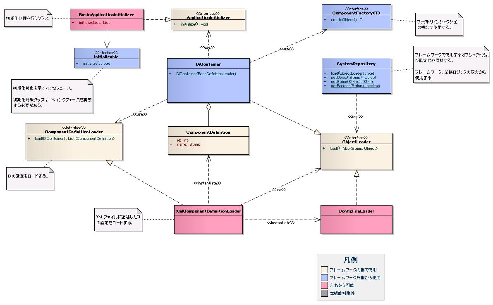

# リポジトリ

## 概要

リポジトリは、設定値やコンポーネントのインスタンスなどアプリケーションで広く使用されるオブジェクトを保持するDIコンテナ機能を持つ入れ物。

- プロジェクト・環境ごとに異なるロジック（生成するクラス、フィールドの値）を外部ファイルの設定通りにセットアップする
- コンポーネント間の関連を構築するためDIコンテナ機能を持つ
- 初期化処理はフレームワークが実施。Webアプリケーションでは :ref:`NablarchServletContextListener` により初期化が行われる
- アプリケーションプログラマは環境設定の取得に使用（取得方法: :ref:`repository_get_config`）

keywords

リポジトリ, DIコンテナ, SystemRepository, 初期化, 環境設定取得, NablarchServletContextListener, repository_get_config

## 特徴

**DIコンテナ機能**:
- セッタインジェクションおよびフィールドインジェクション
- 環境依存する設定項目の集約
- プロパティの簡易設定（文字列、boolean、int/long、文字列配列）
- インタフェースによる自動インジェクション
- プロパティ名による自動インジェクション

SpringFrameworkなど他のDIコンテナ実装を使用した場合にも本フレームワークのリポジトリ機能を使用できるよう、DIコンテナ機能とリポジトリ機能は分離されている。

DIコンテナに登録したコンポーネントはプロパティ設定後に独自の初期化処理を実行できる。初期化順序の指定も可能（詳細: :ref:`repository_initialize`）。

keywords

セッタインジェクション, フィールドインジェクション, 自動インジェクション, 環境依存設定, DIコンテナ機能, コンポーネント初期化順序, repository_initialize

## 要求

**実装済み**:
- ビジネスロジックのあらゆる箇所で設定値およびコンポーネントを取得できる
- ファイルから設定値を読み込める
- ディレクトリを指定して配下のファイルをまとめて読み込める
- 設定値を機能・方式ごとに複数ファイルに分割して定義できる
- 環境依存項目を環境設定ファイルに記述できる
- 設定値をJava起動オプション（-Dオプション）の値で上書きできる
- DIによりコンポーネント設定ファイルの定義を元にインスタンス間の関連を生成できる
- DIの実行時、プロパティに一致する型のインスタンスを自動的に設定できる（自動インジェクション）
- OSSやサードパーティのクラスをDIコンテナ上に作成するファクトリインジェクション機能を提供
- 複数のコンポーネント設定ファイルで同じ設定名を使用して設定値を上書きできる
- 設定名重複時に例外を送出するかワーニングログを出力するかの振る舞いを選択できる
- DIコンテナに登録したクラスの初期化処理を実行できる
- DIコンテナを変更できる

**未検討**:
- アプリケーションを停止せずに設定変更を反映する機能
- 暗号化鍵のようなバイナリデータの設定

keywords

設定値取得, 環境設定ファイル, ファクトリインジェクション, 設定上書き, DIコンテナ変更, 自動インジェクション, 設定名重複

## 構成

keywords

クラス図, リポジトリ構成

## インタフェース定義

| インタフェース名 | 概要 |
|---|---|
| `nablarch.core.repository.ObjectLoader` | SystemRepositoryに保持するオブジェクトを読み込む |
| `nablarch.core.repository.di.ComponentDefinitionLoader` | コンポーネントの定義を読み込む |
| `nablarch.core.repository.initialization.ApplicationInitializer` | コンポーネントの初期化を行う |
| `nablarch.core.repository.initialization.Initializable` | 初期化処理を行う |
| `nablarch.core.repository.initialization.ComponentFactory` | コンポーネントの作成を行う（FactoryInjectionで使用） |

keywords

ObjectLoader, ComponentDefinitionLoader, ApplicationInitializer, Initializable, ComponentFactory, インタフェース定義

## クラス定義

| クラス名 | 概要 |
|---|---|
| `nablarch.core.repository.SystemRepository` | 設定値およびコンポーネントを保持する |
| `nablarch.core.repository.ConfigFileLoader` | 環境設定ファイルから文字列の設定値を読み込む |
| `nablarch.core.repository.di.DiContainer` | DIコンテナの機能を実現する。コンポーネントの生成と、ObjectLoaderが読み出した設定値の読み込みを担う |
| `nablarch.core.repository.di.ComponentDefinition` | DiContainerがコンポーネントの生成に使用する定義を保持する |
| `nablarch.core.repository.di.config.xml.XmlComponentDefinitionLoader` | XMLファイルからコンポーネントの定義を読み込む |
| `nablarch.core.repository.initialization.BasicApplicationInitializer` | Initializableを実装したコンポーネントを指定した順序で初期化する |

keywords

SystemRepository, ConfigFileLoader, DiContainer, ComponentDefinition, XmlComponentDefinitionLoader, BasicApplicationInitializer, クラス定義

## リポジトリの設定方法と使用方法

リポジトリは設定ファイルに記載した内容を元にフレームワークが初期化することで使用できるようになる。設定ファイルの記述方法とリポジトリから設定値・コンポーネントを取得する方法: [02/02_01_Repository_config](libraries-02_01_Repository_config.md)

keywords

リポジトリ設定, 設定ファイル, コンポーネント取得, 02_01_Repository_config

## コンポーネント初期化機能

DIコンテナはプロパティ設定後に独自の初期化処理が必要なコンポーネントを初期化するコンポーネント初期化機能を提供する。詳細: [02/02_02_Repository_initialize](libraries-02_02_Repository_initialize.md)

keywords

コンポーネント初期化, Initializable, BasicApplicationInitializer, 初期化順序, 02_02_Repository_initialize

## ファクトリインジェクション

Java Beans として実装されていないフレームワーク外クラスをコンポーネントとして使用する場合は、ファクトリインジェクションを使用する。通常のリポジトリ設定では使用できないケースに対応。詳細: [02/02_03_Repository_factory](libraries-02_03_Repository_factory.md)

keywords

ファクトリインジェクション, ComponentFactory, JavaBeans非準拠, サードパーティクラス, 02_03_Repository_factory

## 設定の上書き

テスト時に本番環境向け設定の一部（スタブへの置き換えなど）を変更して実行できる設定上書き機能を提供。詳細: [02/02_04_Repository_override](libraries-02_04_Repository_override.md)

keywords

設定上書き, テスト, スタブ, 本番設定変更, 02_04_Repository_override

