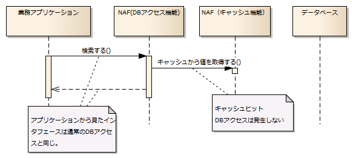
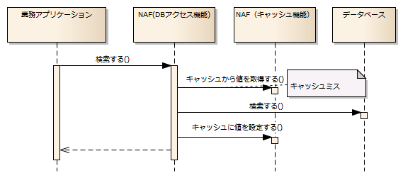
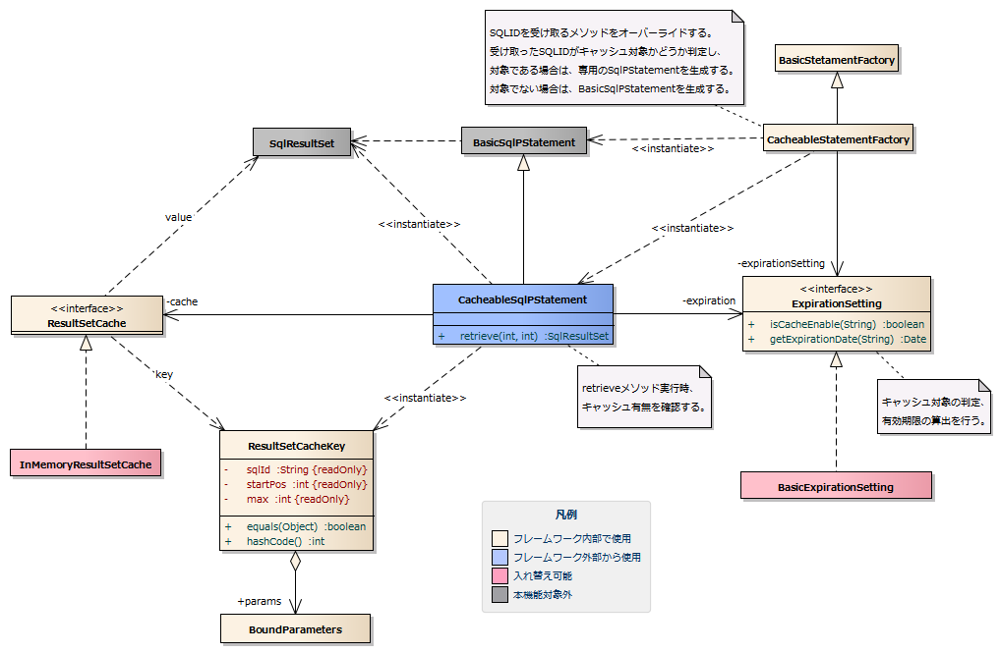
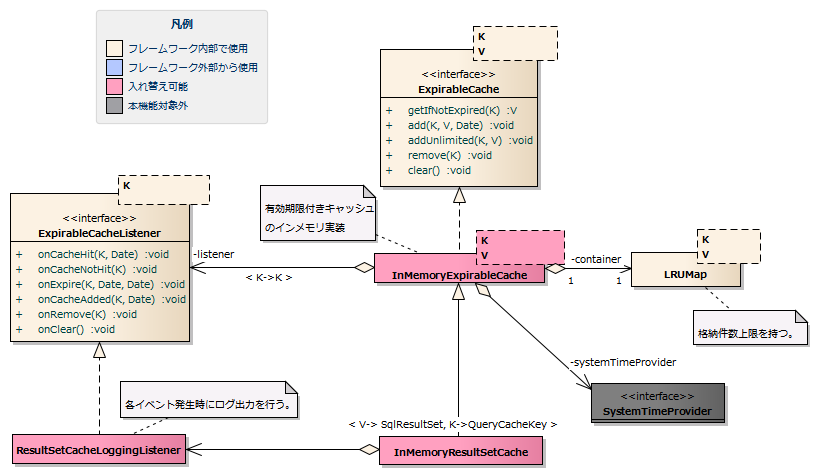
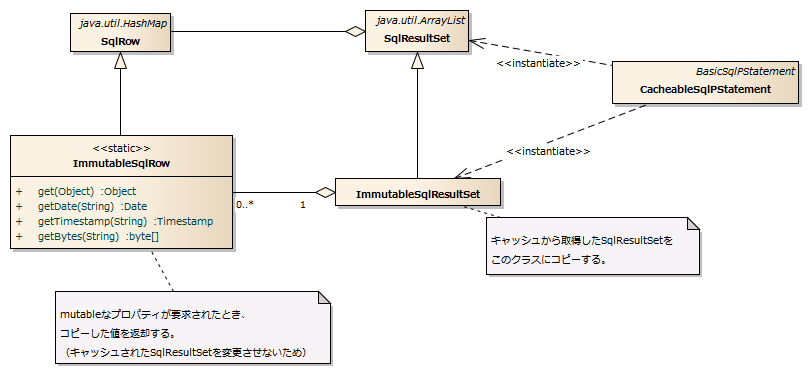
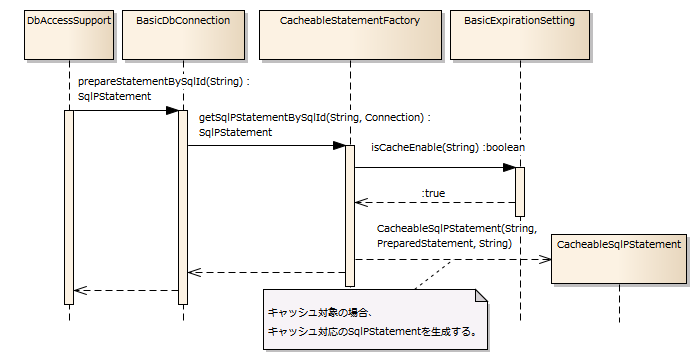
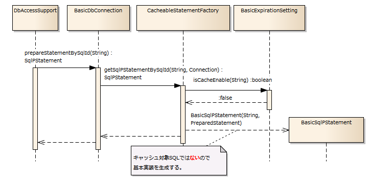
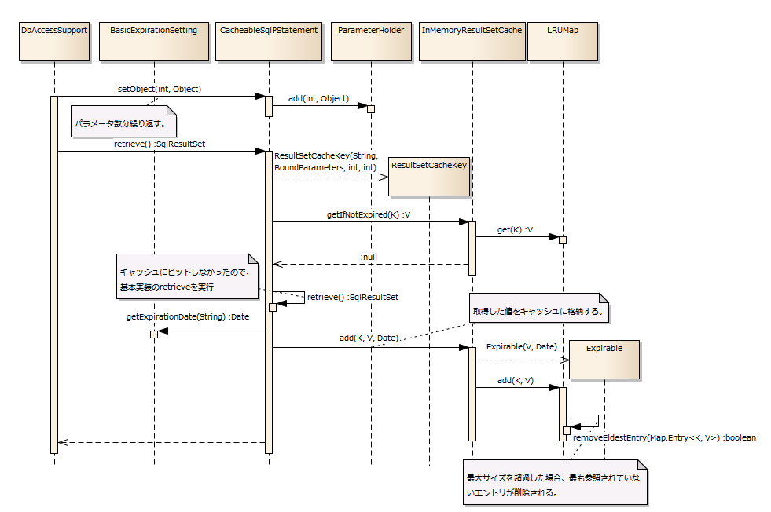
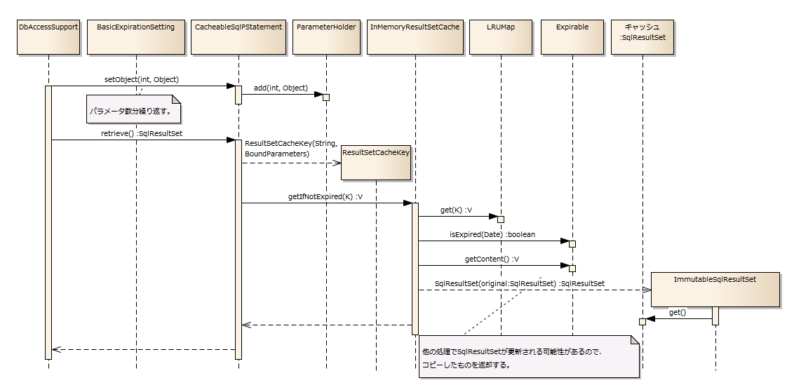
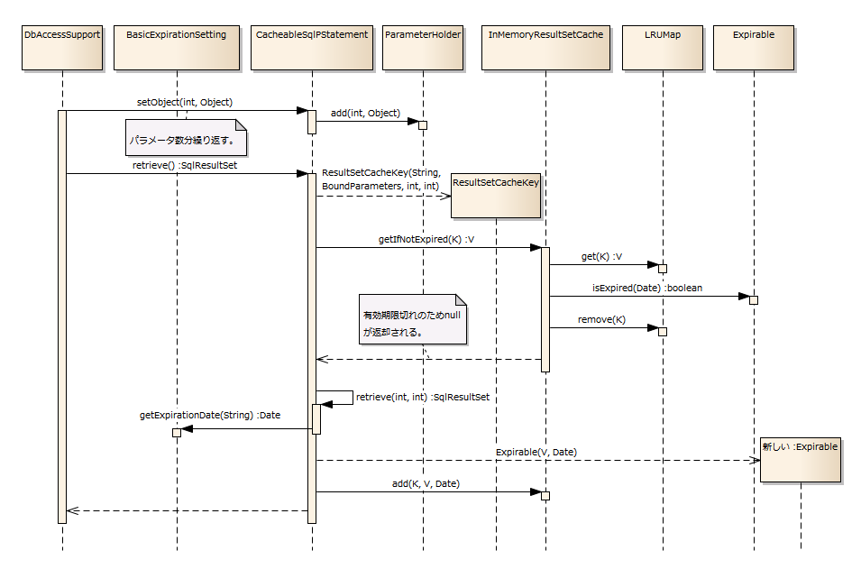

# SQLクエリ結果のキャッシュ

## 概要

SQLクエリ結果のキャッシュを行う。
SQL IDとパラメータが等価である参照系クエリに対して、キャッシュした結果を返却できる（DBアクセスが発生しない）。

本機能は、以下のようなクエリに対して使用することを想定している。

* トレンドを把握するためのクエリであり、結果が厳密に最新の値でなくても構わないクエリ（例：売れ筋ランキング）。
* データ更新のタイミングが予め分かっており、その期間中は毎回結果が同じになるクエリ（例：データが夜間バッチで更新される）。

このようなクエリに対して本機能を使用することで、DBアクセス回数を減らし、
システム負荷を軽減することができる。

このようなキャッシュ機構は、セッションやテンポラリテーブルなどに明示的に値をキャッシュすることでも実現可能であるが、
本機能を使用することで、そのような個別の作り込みを行わなくても、
データベースアクセスに対して透過的にキャッシュ機能を付加することができる。

**【キャッシュヒット時の動作イメージ】**



**【キャッシュミス時の動作イメージ】**



本機能と類似した機能としてRDBMSのクエリキャッシュが挙げられるが、
RDBMSのクエリキャッシュは、キャッシュアルゴリズムがRDBMS依存であり、
どのクエリがどのくらいの期間キャッシュに残るかというコントロールが難しい。

本機能では、アプリケーションおよび各クエリの特性を考慮した上で、キャッシュを柔軟に管理することができる。

> **Warning:**
> 本機能は、参照系のデータベースアクセスを、省略可能な場合に限り省略することにより、
> システム負荷を軽減することを目的としている。
> 本機能はデータベースアクセスそのものを高速化するものではない。
> よって、データベースアクセス高速化の目的で本機能を使用してはならない。
> （クエリやDBのチューニングで対処すること）

> **Warning:**
> 本機能では、データベースの更新を監視しておらず、データベースが更新された場合でもキャッシュの値は変更されない。
> よって、最新のデータが必要なクエリには、絶対に本機能を使用してはならない。
> 最新の値でなくても構わない場合、更新タイミングが完全にコントロール可能な場合にのみ使用すること。
> （すなわち、大半のクエリは本機能の対象とはならない）

> **本機能を適用するかどうかの判断はアーキテクトが行い、開発者が個別に判断しないようにすること。**

## 特徴

* SQL ID毎にキャッシュ要否を設定できる。
* SQL ID毎にキャッシュ有効期限を設定できる。
* アプリケーションプログラマが、キャッシュ機構を意識せずにプログラミングできる。

## 要求

### 実装済み

#### キャッシュ機能

* SQLクエリ結果をキャッシュできる。
* **SQL IDとパラメータが等価である**  [1] 参照系クエリに対して、キャッシュした結果を返却できる（DBアクセスが発生しない）。
* アプリケーションから、明示的にキャッシュをクリアすることができる。
* キャッシュ実装クラスを差し替えることができる。

正確には、以下の4要素が全て等価である場合に、同一のクエリと判定する。

* SQL ID
* パラメータ
* 検索開始位置
* 検索最大件数

同一SQL、同一パラメータであっても、開始位置、最大件数が異なる場合、クエリ結果も異なってくる。
よって、これらの値もクエリを同定するための要素としている。
ただし、開始位置、最大件数については省略可能である。省略時はそれぞれ1（開始位置先頭から）, 0（無制限）が使用される。
（SqlPStatement#retrieve()と同様）

#### 有効期限

* キャッシュの有効期限を設定できる。

> **Note:**
> 有効期限がないと、いつまでも古いデータを参照し続ける可能性があるため。

* SQL ID毎にキャッシュ要否、有効期限を設定できる。

> **Note:**
> これは、SQLによって用途やデータ更新頻度などが異なるためである。
> 通常、キャッシュ対象とするクエリは限られており、それ以外のクエリではキャッシュ機能は不要である。
> また、比較的最新に近いデータが必要な場合と、それほど精度が求められない場合とで有効期限を使い分けることができる。

#### キャッシュ保存先

* キャッシュ保存先を切り替えることができる。

> **Note:**
> キャッシュ実装クラスを差し替えることにより実現可能としている。
> キャッシュ保存先には、JVMヒープ、KVS等を想定。 基本実装 では、JVMヒープを使用する。

#### その他の要件

* キャッシュ対象外のSQL実行性能に影響を与えない。
* アプリケーションプログラマがキャッシュ機構を意識せずプログラミングできる。
* パフォーマンスチューニングに必要な情報が出力される。

> **Note:**
> 基本実装では、以下のイベント発生時にログ出力が行われる。

> * >   キャッシュに値取得の要求が来て、キャッシュにヒットした場合
> * >   キャッシュに値取得の要求が来て、キャッシュにヒットしなかった場合
> * >   キャッシュ有効期限切れが検知された場合
> * >   キャッシュに値が設定された場合
> * >   キャッシュに対して削除要求が発生した場合
> * >   キャッシュ全クリア要求が発生した場合
> * >   LRUアルゴリズムにより、古いエントリが削除された場合

#### 基本実装

* キャッシュ記憶領域をJVMヒープ上に持つ。
* キャッシュ保存上限件数を指定することができる。LRUアルゴリズムを使用してヒープ逼迫を防止する。
* キャッシュは同一アプリケーション内で共有される（アプリケーション、サーバを跨る共有はされない）。
* 有効期限切れの判定は遅延評価で行う（キャッシュ取得時に有効期限切れ判定を行う）。

### 未実装

* キャッシュ保存先にKVSを使用するキャッシュ実装。
* ソフト参照を使用したキャッシュ実装。

### 未検討

* キャッシュの有効期限判定をリアルタイムに行う（デーモンスレッド）。

> **Note:**
> 基本実装でも上限件数が設定できるので、遅延評価でもキャッシュが肥大化することはない。

## 構成

### クラス図

#### 全体図

StatementFactory実装クラスを差し替えることにより本機能を実現する。

このStatementFactory実装クラスは、
キャッシュ対象SQLの場合のみ、キャッシュ機能付きのSqlPStatementを生成し、
キャッシュ対象でない場合は基本実装(BasicSqlPStatement)を生成する。



##### インタフェース定義

| インタフェース名 | 概要 |
|---|---|
| nablarch.core.db.cache.ResultSetCache | クエリ結果を保持するキャッシュインタフェース。 |

##### クラス定義

| クラス名 | 概要 |
|---|---|
| nablarch.core.db.cache.statement.CacheableStatementFactory | キャッシュ可能なSqlPStatementを生成するStatementFactory実装クラス。 |
| nablarch.core.db.cache.statement.CacheableSqlPStatement | キャッシュ可能なSqlPStatement実装クラス。 |
| nablarch.core.db.cache.InMemoryResultSetCache | メモリ上にキャッシュを持つResultSetCache実装クラス（ 有効期限付きキャッシュ を参照）。 |
| nablarch.core.db.cache.ResultSetCacheKey | キャッシュのキーを表すクラス（SQL ID, パラメータ,開始位置,最大件数）。 |

#### 有効期限付きキャッシュ



##### インタフェース定義

| インタフェース名 | 概要 |
|---|---|
| nablarch.core.cache.expirable.ExpirableCache | 有効期限付きキャッシュのインタフェース。 |
| nablarch.core.cache.expirable.ExpirableCacheListener | イベント発生時にコールバックされるリスナーインタフェース |

##### クラス定義

| クラス名 | 概要 |
|---|---|
| nablarch.core.cache.expirable.InMemoryExpirableCache | キャッシュをメモリ上に保持する有効期限付きキャッシュ実装クラス |
| nablarch.core.db.cache.InMemoryResultSetCache | メモリ上にキャッシュを持つResultSetCache実装クラス。 各イベント発生時にログ出力を行う。 |
| nablarch.core.util.map.LRUMap | LRUアルゴリズムを持つ件数上限付きMap実装クラス |

#### キャッシュしたSqlResultSetの保護

キャッシュされたSqlResultSetをキャッシュから取り出す際、
専用のSqlResultSetサブクラスに値のコピーを行う。

また、以下のオブジェクトは変更可能であるため、
これらに対して取得要求が発生した場合、値をコピーして返却する。

* java.util.Date
* java.sql.Timestamp
* byte[]

これは、キャッシュから取得されたSqlResultSetが変更された場合に、
キャッシュが変更されることを防ぐためである。



##### クラス定義

| クラス名 | 概要 |
|---|---|
| nablarch.core.db.cache.statement.MutableGuardingSqlResultSet | 変更可能なプロパティが書き換えられることを防止するSqlResultSetサブクラス |
| nablarch.core.db.cache.statement.MutableGuardingSqlResultSet.MutableGuardingSqlRow | 変更可能なプロパティが書き換えられることを防止するSqlRowサブクラス |

### シーケンス図

#### SqlPStatementの生成

##### キャッシュ対象のSQL IDが指定された場合



##### キャッシュ対象でないSQL IDが指定された場合



#### キャッシュへのアクセス

##### キャッシュにヒットしない場合

* 指定されたSQLの検索結果をキャッシュから取得する。
* キャッシュから取得できないので、DBアクセスを行う。
* 有効期限を算出し、検索結果をキャッシュに格納する。



##### キャッシュにヒットする場合

* 指定されたSQLの検索結果をキャッシュから取得する。
* キャッシュから取得できたので、そのまま検索結果を返却する。



##### キャッシュにヒットするが有効期限切れの場合

* 指定されたSQLの検索結果をキャッシュから取得する。
* キャッシュに存在するが有効期限切れのため、キャッシュから削除する。
* キャッシュから取得できないので、DBアクセスを行う。
* 有効期限を算出し、検索結果をキャッシュに格納する。



## キャッシュ機能を有効にする設定方法

### クエリ結果キャッシュ実装クラスの登録

クエリ結果キャッシュ実装クラスをコンポーネント定義ファイルに登録する。

```xml
<!-- クエリ結果キャッシュ -->
<!-- キャッシュクラス -->
<component name="resultSetCache" class="nablarch.core.db.cache.InMemoryResultSetCache">
  <!-- キャッシュ上限件数 -->
  <property name="cacheSize" value="100"/>
  <property name="systemTimeProvider" ref="systemTimeProvider"/>
</component>
```

### StatementFactory実装クラスの差し替え

ConnectionFactorySupportサブクラスのプロパティ `statementFactory` に、
本機能が提供するCacheableStatementFactoryを設定する。

```xml
<!-- データベース接続用設定 -->
<component name="connectionFactory"
           class="nablarch.core.db.connection.BasicDbConnectionFactoryForDataSource">
  <property name="dataSource" ref="dataSource" />
  <!-- StatementFactory実装クラスを差し替え -->
  <property name="statementFactory" ref="cacheableStatementFactory" />
  <!-- 中略 -->
</component>

<!-- キャッシュ可能なステートメントを生成するStatementFactory実装クラス -->
<component name="cacheableStatementFactory"
           class="nablarch.core.db.cache.CacheableStatementFactory">

  <!-- 中略（BasicStatementFactoryと同じ) -->

  <!-- 有効期限設定 -->
  <property name="expirationSetting" ref="expirationSetting"/>
  <!-- キャッシュ実装 -->
  <property name="resultSetCache" ref="resultSetCache"/>
</component>
```

### SQL ID毎のキャッシュ設定

基本実装クラスでは、SQL ID毎に有効期限を設定する。

```xml
<!-- キャッシュ有効期限設定 -->
<component class="nablarch.core.cache.expirable.BasicExpirationSetting"
           name="expirationSetting">
  <property name="expiration">
    <map>
      <entry key="please.change.me.tutorial.ss11AA.W11AA01Action#SELECT" value="100ms"/>  <!-- 100ミリ秒 -->
      <entry key="please.change.me.tutorial.ss11AA.W11AA02Action#SELECT" value="30sec"/>  <!-- 30秒 -->
      <entry key="please.change.me.tutorial.ss11AA.W11AA03Action#SELECT" value="10min"/>  <!-- 10分 -->
      <entry key="please.change.me.tutorial.ss11AA.W11AA04Action#SELECT" value="1h"/>     <!-- 1時間 -->
    </map>
  </property>
</component>
```

> **Note:**
> 基本実装では以下の単位が使用できる。

> | > 単位表記 | > 意味 |
> |---|---|
> | > ms | > ミリ秒 |
> | > sec | > 秒 |
> | > min | > 分 |
> | > h | > 時 |

> **Note:**
> キャッシュ有効期限の設定をサブシステム毎に分割する場合、
> コンポーネント定義を以下のように分割する。

> ```xml
> <!-- キャッシュ有効期限設定 -->
> <component class="nablarch.core.cache.expirable.BasicExpirationSetting"
>            name="expirationSetting">
>   <property name="expirationList">
>     <list>
>       <component-ref name="expireSettingSS11AA"/>
>       <component-ref name="expireSettingSS11BB"/>
>       </map>
>     </list>
>   </property>
> </component>
> ```

> ```xml
> <!-- サブシステムSS11AAの設定(別ファイル) -->
> <map name="expireSettingSS11AA">
>   <entry key="please.change.me.tutorial.ss11AA.W11AA01Action#SELECT"
>          value="100ms"/>
> </map>
> ```

> ```xml
> <!-- サブシステムSS11BBの設定(別ファイル) -->
> <map name="expireSettingSS11BB">
>   <entry key="please.change.me.tutorial.ss11BB.W11BB01Action#SELECT"
>          value="1h"/>
> </map>
> ```

## キャッシュを明示的にクリアする方法

### 特定のエントリを削除する方法

システムリポジトリからキャッシュインスタンスを取得し、キーを指定して削除を依頼する。

```java
// リポジトリからキャッシュのインスタンスを取得する。
ResultSetCache cache = SystemRepository.get("resultSetCache");

// キャッシュキーを組み立てる。
ResultSetCacheKey key
        = new ResultSetCacheKeyBuilder("please.change.me.tutorial.ss11AA.W11AA01Action#SELECT") // SqlId
                       .addParam("name", "yamada")
                       .addParam("address", "tokyo")
                       .build();

// キャッシュから該当するエントリを削除する。
cache.remove(key);
```

### 全エントリをクリアする方法

システムリポジトリからキャッシュインスタンスを取得し、全エントリを削除するメソッドを起動する。

```java
@org.junit.After
public void clearResultSetCache() {

    // リポジトリからキャッシュのインスタンスを取得する。
    ResultSetCache cache = SystemRepository.get("resultSetCache");

    // キャッシュクリア
    cache.clear();
}
```

> **Note:**
> 全エントリ削除機能は、クラス単体テストの前後に使用することを想定している。
> （あるテストでキャッシュされた値が、別のテストで使用されないようにするため）

## ログ出力

本基本実装クラス（InMemoryResultSetCache）は、各種イベント発生時に以下のロガーによりログ出力を行う。

* ロガー名: RS_CACHE
* ログレベル: DEBUG

### イベントとログ出力フォーマット

以下に、イベントとイベント発生時のログ出力フォーマットの対応を示す。

| イベント | ログ出力フォーマット |
|---|---|
| キャッシュに値取得の要求が来て、キャッシュにヒットした場合 | cache hit: key=[ <SQL ID> ], current=[ <システム日時> ] |
| キャッシュに値取得の要求が来て、キャッシュにヒットしなかった場合 | cache not hit: key=[ <SQL ID> ] |
| キャッシュ有効期限切れが検知された場合 | cache entry expired: key=[ <SQL ID> ], expire=[ <有効期限> ], current=[ <システム日時> ] |
| キャッシュに値が設定された場合 | cache entry added: key=[ <SQL ID> ], expire=[ <有効期限> ] |
| キャッシュに対して削除要求が発生した場合 | cache entry removed: key=[ <SQL ID> ] |
| キャッシュ全クリア要求が発生した | cache cleared. |
| LRUアルゴリズムにより、古いエントリが削除された場合 | the eldest entry removed: key=[ <SQL ID> ] |

## キャッシュ機能のチューニングについて

本機能を使用する際のチューニング方法について記載する。

### キャッシュ上限件数とヒープサイズ

本基本実装クラス（InMemoryResultSetCache）は、メモリ（JVMヒープ）上にキャッシュを保持する。
設定したキャッシュ上限件数を格納できるだけの十分なヒープサイズを確保し、
問題がないことを、性能試験等で確認すること。
ヒープサイズが不足した場合はOutOfMemoryErrorが発生するので、ヒープサイズおよび上限件数の見直しを行う。

### ログによる分析

基本実装では、 `nablarch.core.db.cache.InMemoryResultSetCache` クラスからのログ出力から
各種イベントの情報を入手できる（ ログ出力 を参照） 。

性能試験等で、キャッシュが有効に機能しているかを判定すること。
キャッシュミスが多い場合は、以下の様な対処を行う。

* キャッシュ上限件数を増やす
* 許容できる範囲内でキャッシュ有効期限を伸ばす

## 制約事項

### BLOB、CLOB型はキャッシュできない

SELECTにより、BLOB型、CLOB型のカラムを取得した場合、
実際にDBに格納されたデータが取得されているのではなく、
LOBロケータが取得されている。
実際の値を取得する場合は、このLOBロケータ経由で値を取得する。

このLOBロケータの有効期間は、RDBMS毎の実装に依存している。
通常、java.sql.ResultSetやjava.sql.Connectionがクローズされた時点で
アクセスできなくなる。

このため、ResultSetやConnectionよりも生存期間が長いキャッシュには
BLOB、CLOB型を含めることができない。

> **Warning:**
> 上記理由により、BLOB型、CLOB型を含むクエリを本機能の対象としてはならない。

### APサーバを冗長化する場合の注意点

基本実装クラスでは、JVMヒープ上にキャッシュを保持する。
よって、サーバを跨ってキャッシュを共有することはできない。

APサーバを冗長化した環境で基本実装クラスを使用した場合、各APサーバが別のキャッシュを持つことになる。
クエリを発行するタイミングによってキャッシュされた値がAPサーバ毎に異なる可能性がある。

ロードバランサをラウンドロビンで使用した場合、
リクエスト毎にAPサーバが変わる可能性があるので、
それにともなってキャッシュの値も、前回リクエスト時の値と
変わることがありうる。

> **Note:**
> 現状、この問題を回避する手段は提供されていない。
