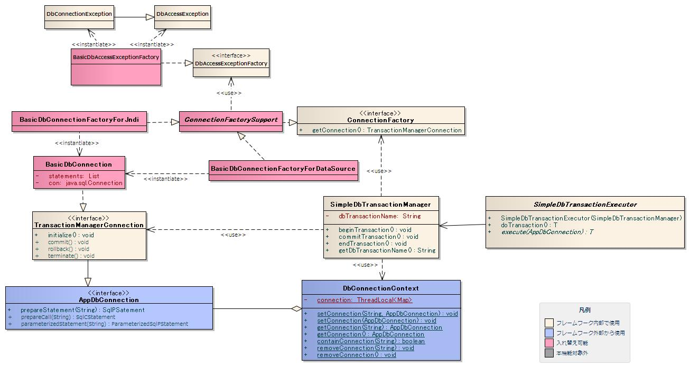
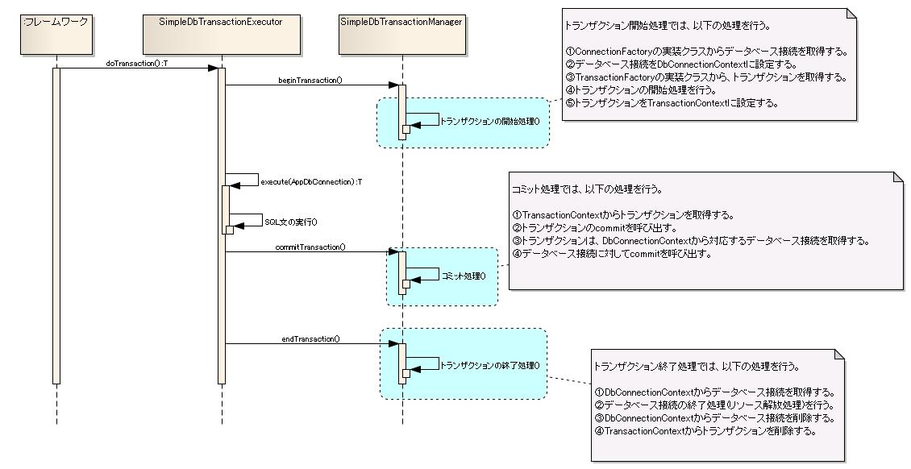

# データベース接続部品の構造

## データベース接続部品の構造



## a) SimpleDbTransactionManagerの設定

| プロパティ名 | 必須 | 説明 |
|---|---|---|
| connectionFactory | ○ | `nablarch.core.db.connection.ConnectionFactory` 実装クラスを設定する。 |
| transactionFactory | ○ | `nablarch.core.transaction.TransactionFactory` 実装クラスを設定する。 |
| dbTransactionName | | データベーストランザクション名。未設定の場合、デフォルトのトランザクション名が自動設定される。 |

## b) BasicDbConnectionFactoryForDataSourceの設定

**クラス**: `nablarch.core.db.connection.BasicDbConnectionFactoryForDataSource`

| プロパティ名 | 必須 | 説明 |
|---|---|---|
| statementReuse | ○ | Statementをキャッシュするか否か（true/false）。trueの場合、`BasicDbConnection`インスタンス単位でStatementオブジェクトがキャッシュされる。 |
| dataSource | ○ | `javax.sql.DataSource` 実装クラスを設定する。本プロパティに設定する値は、各データベースベンダーのJDBC関連ドキュメントを参照し設定すること。 |
| statementFactory | ○ | `nablarch.core.statement.StatementFactory` 実装クラスを設定する。[db-sqlstatement-label](libraries-04_Statement.md) を参照。 |
| dbAccessExceptionFactory | ○ | DBアクセス例外発生時に送出する例外を生成するクラス（`DbAccessExceptionFactory` 実装クラス）を設定する。 |

> **注意**: `statementReuse=true` はバッチ処理（同一SQL文を繰り返し実行する処理）で効果的。画面処理では同一SQL文の繰り返しが少ないためメリットは薄い。

## c) JdbcTransactionFactoryの設定

**クラス**: `nablarch.core.db.transaction.JdbcTransactionFactory`

| プロパティ名 | 必須 | 説明 |
|---|---|---|
| isolationLevel | | アイソレーションレベル。設定可能値: `READ_COMMITTED`、`READ_UNCOMMITTED`、`REPEATABLE_READ`、`SERIALIZABLE`。未設定時のデフォルトは `READ_COMMITTED`。 |
| initSqlList | | トランザクション開始時に実行するSQL文のリスト。不要な場合は設定不要。 |

> **注意**: データベースにより使用できるアイソレーションレベルが限られる。データベースベンダーのマニュアルを参照すること。

## d) BasicDbAccessExceptionFactoryの設定

**クラス**: `nablarch.core.db.connection.exception.BasicDbAccessExceptionFactory`

| プロパティ名 | 必須 | 説明 |
|---|---|---|
| sql | ○ | DB接続の有効性確認用SQL文。負荷の少ないSQL文を設定すること（例: Oracleの場合 `select '1' from dual`）。 |

<details>
<summary>keywords</summary>

データベース接続クラス図, ConnectionFactory, AppDbConnection, データベース接続部品構造, SimpleDbTransactionManager, BasicDbConnectionFactoryForDataSource, BasicDbConnection, JdbcTransactionFactory, BasicDbAccessExceptionFactory, TransactionFactory, connectionFactory, transactionFactory, dbTransactionName, statementReuse, dataSource, statementFactory, dbAccessExceptionFactory, isolationLevel, initSqlList, データベース接続設定, トランザクション設定, Statementキャッシュ, アイソレーションレベル

</details>

## 各クラスの責務

**パッケージ**: `nablarch.core.db.connection`

| インタフェース名 | 概要 |
|---|---|
| `ConnectionFactory` | データベース接続を生成するインターフェース。接続方式の追加や実装クラス（`BasicDbConnection`）の差し替えには本インターフェースの実装クラスを追加する |
| `AppDbConnection` | データベース接続を保持するインターフェース。アプリケーションはSQL文実行用オブジェクトの取得に使用する |
| `TransactionManagerConnection` | トランザクション制御を行うインタフェース（AppDbConnectionのサブインタフェース）。[リソース解放機能](libraries-04_DbAccessSpec.md) は本インタフェースの実装クラスで提供される |
| `DbAccessExceptionFactory` | SQLExceptionのエラーコード等を元にDbAccessExceptionを生成するインターフェース |

## 設定ファイル例（JNDIを使用してデータベース接続を行う場合）

JNDIに関連のない設定については、[db-connection-config-label](#s5) を参照。

**クラス**: `nablarch.core.db.connection.BasicDbConnectionFactoryForJndi`

```xml
<component class="nablarch.core.db.connection.BasicDbConnectionFactoryForJndi">
    <property name="jndiProperties">
        <map>
            <entry key="java.naming.factory.initial" value="weblogic.jndi.WLInitialContextFactory"/>
            <entry key="java.naming.provider.url" value="t3://localhost:7001"/>
        </map>
    </property>
    <property name="jndiResourceName" value="NablarchDataSource"/>
    <property name="statementFactory">
        <component name="statementFactory"
                   class="nablarch.core.db.statement.BasicStatementFactory">
            <property name="fetchSize" value="500"/>
            <property name="queryTimeout" value="600" />
            <property name="sqlStatementExceptionFactory">
                <component class="nablarch.core.db.statement.exception.BasicSqlStatementExceptionFactory">
                    <property name="duplicateErrorSqlState" value=""/>
                    <property name="duplicateErrorErrCode" value="1"/>
                </component>
            </property>
        </component>
    </property>
    <property name="statementReuse" value="true"/>
    <property name="dbAccessExceptionFactory">
        <component name="dbAccessExceptionFactory" class="nablarch.core.db.connection.exception.BasicDbAccessExceptionFactory">
            <property name="sql" value="select * from dual" />
        </component>
    </property>
</component>
```

## 設定内容詳細

| プロパティ名 | 必須 | 説明 |
|---|---|---|
| statementReuse | ○ | :ref:`BasicDbConnectionFactoryForDataSourceへの設定<db-dataSourceConnectionFactory-label>` の同一項目を参照。 |
| statementFactory | ○ | :ref:`BasicDbConnectionFactoryForDataSourceへの設定<db-dataSourceConnectionFactory-label>` の同一項目を参照。 |
| dbAccessExceptionFactory | ○ | :ref:`BasicDbConnectionFactoryForDataSourceへの設定<db-dataSourceConnectionFactory-label>` の同一項目を参照。 |
| jndiProperties | | JNDI経由でDataSourceを取得するための環境設定。Webサーバ上で稼働する場合やクラスパス配下に `jndi.properties` を配置している場合は省略可。設定例はWebLogicサーバ上にDataSourceが登録されていることを想定している（`weblogic.jndi.WLInitialContextFactory` 使用）。 |
| jndiResourceName | ○ | JNDIリソース名を設定する。例えば、WebLogicサーバの場合は、管理コンソールからDataSourceを登録する際に「JNDI Name」に入力した値を設定する。 |

<details>
<summary>keywords</summary>

ConnectionFactory, AppDbConnection, TransactionManagerConnection, DbAccessExceptionFactory, BasicDbConnection, インタフェース定義, データベース接続インタフェース, BasicDbConnectionFactoryForJndi, BasicStatementFactory, BasicSqlStatementExceptionFactory, BasicDbAccessExceptionFactory, jndiProperties, jndiResourceName, statementReuse, statementFactory, dbAccessExceptionFactory, WLInitialContextFactory, weblogic.jndi.WLInitialContextFactory, JNDI接続設定, JNDIリソース名, データベース接続（JNDI）

</details>

## nablarch.core.db.connectionパッケージ

### ConnectionFactory実装クラス（nablarch.core.db.connectionパッケージ）

| クラス名 | 概要 |
|---|---|
| `ConnectionFactorySupport` | ConnectionFactoryインタフェース実装クラスのサポートクラス。サブクラスで必要な共通設定を保持する |
| `BasicDbConnectionFactoryForJndi` | JNDI経由でデータベース接続（java.sql.Connection）を取得しBasicDbConnectionを生成するクラス。設定方法は [database-connection-config-from-jndi-label](#) を参照 |
| `BasicDbConnectionFactoryForDataSource` | javax.sql.DataSourceからデータベース接続（java.sql.Connection）を取得しBasicDbConnectionを生成するクラス。設定方法は [db-connection-config-label](#s5) を参照 |

### TransactionManagerConnection実装クラス（nablarch.core.db.connectionパッケージ）

| クラス名 | 概要 |
|---|---|
| `BasicDbConnection` | TransactionManagerConnection（AppDbConnection）の基本実装クラス。データベースベンダー非依存の実装。ベンダー依存実装が必要な場合はTransactionManagerConnectionの新規実装クラスを作成して本クラスから差し替える |

### DbAccessExceptionFactory関連クラス（nablarch.core.db.connection.exceptionパッケージ）

| クラス名 | 概要 |
|---|---|
| `BasicDbAccessExceptionFactory` | DbAccessExceptionFactoryの基本実装クラス。接続切断の判定はSQL文実行で確認（実行失敗→DbConnectionException送出、成功→DbAccessException送出） |
| `DbAccessException` | データベース接続時に発生する例外クラス |
| `DbConnectionException` | データベース接続切断時に発生する例外クラス（DbAccessExceptionのサブクラス） |

> **注意**: BasicDbAccessExceptionFactoryに設定されたSQL文が実行不可能（構文エラーやオブジェクトが存在しない場合）な場合は、必ずSQL文の実行に失敗しDbConnectionExceptionが送出される

### その他のクラス（nablarch.core.db.transactionパッケージ）

| クラス名 | 概要 |
|---|---|
| `SimpleDbTransactionManager` | 簡易トランザクション制御クラス。トランザクション開始時にAppDbConnectionを生成しDbConnectionContextに設定する |
| `SimpleDbTransactionExecutor` | SimpleDbTransactionManagerを使用してSQL文を実行するための抽象クラス。全機能で統一的な例外処理を提供 |

**nablarch.core.db.connectionパッケージ**:

| クラス名 | 概要 |
|---|---|
| `DbConnectionContext` | AppDbConnectionをThreadLocalで保持するクラス。任意の名前（データベースコネクション名）を付加して複数のAppDbConnectionを管理できる |

> **注意**: ThreadLocalでAppDbConnectionが管理されるため、アプリケーションのスレッドと同一スレッドでAppDbConnectionを設定する必要がある。マルチスレッド環境では各スレッドに対してAppDbConnectionを設定すること

データベースコネクション名の詳細は [04_TransactionConnectionName](libraries-04_TransactionConnectionName.md) を参照

<details>
<summary>keywords</summary>

ConnectionFactorySupport, BasicDbConnectionFactoryForJndi, BasicDbConnectionFactoryForDataSource, BasicDbConnection, BasicDbAccessExceptionFactory, DbAccessException, DbConnectionException, SimpleDbTransactionManager, SimpleDbTransactionExecutor, DbConnectionContext, JNDI接続, DataSource接続, ThreadLocal, データベースコネクション名

</details>

## 処理シーケンス



<details>
<summary>keywords</summary>

処理シーケンス, データベース接続シーケンス, トランザクション制御シーケンス

</details>

## Javaの実装例

> **注意**: `SimpleDbTransactionManager`はフレームワーク専用のトランザクション制御クラス。アプリケーションプログラマが`SimpleDbTransactionManager`や`SimpleDbTransactionExecutor`を直接参照する実装は行わない

`SimpleDbTransactionExecutor`を使用するのは、既に開始されている業務トランザクション以外の独立したトランザクション（Webアプリケーションの認証機能や開閉局チェック機能等）が必要な場合のみ。

```java
SimpleDbTransactionManager transactionManager = (SimpleDbTransactionManager) SystemRepository.getObject("transactionManager");

SqlResultSet resultSet = new SimpleDbTransactionExecutor<SqlResultSet>(transactionManager) {
    @Override
    public SqlResultSet execute(AppDbConnection connection) {
        SqlPStatement prepared = connection.prepareStatement(query);
        int parameterIndex = 1;
        prepared.setString(parameterIndex++, requestId);
        prepared.setString(parameterIndex, requestTableServiceAvailableOkStatus);
        return prepared.retrieve();
    }
}.doTransaction();
```

DataSourceを使用したデータベース接続の設定例（[db-connection-config-label](#s5)）：

```xml
<component name="transactionManager" class="nablarch.core.db.transaction.SimpleDbTransactionManager">
    <property name="connectionFactory">
        <component class="nablarch.core.db.connection.BasicDbConnectionFactoryForDataSource">
            <property name="statementReuse" value="true"/>
            <property name="dataSource">
                <component class="oracle.jdbc.pool.OracleDataSource">
                    <property name="user" value="ssd"/>
                    <property name="password" value="ssd"/>
                    <property name="URL" value="jdbc:oracle:thin:ssd/ssd@localhost:1521/xe"/>
                </component>
            </property>
            <property name="statementFactory">
                <component name="statementFactory" class="nablarch.core.db.statement.BasicStatementFactory">
                    <property name="fetchSize" value="500"/>
                    <property name="queryTimeout" value="600"/>
                    <property name="sqlStatementExceptionFactory">
                        <component class="nablarch.core.db.statement.exception.BasicSqlStatementExceptionFactory">
                            <property name="duplicateErrorSqlState" value=""/>
                            <property name="duplicateErrorErrCode" value="1"/>
                        </component>
                    </property>
                </component>
            </property>
            <property name="dbAccessExceptionFactory">
                <component name="dbAccessExceptionFactory" class="nablarch.core.db.connection.exception.BasicDbAccessExceptionFactory">
                    <property name="sql" value="select * from dual"/>
                </component>
            </property>
        </component>
    </property>
    <property name="transactionFactory">
        <component class="nablarch.core.db.transaction.JdbcTransactionFactory">
            <property name="isolationLevel" value="READ_COMMITTED"/>
            <property name="initSqlList">
                <list>
                    <value>ALTER SESSION SET NLS_TIMESTAMP_FORMAT = 'yyyy-mm-dd hh24:mi:ss.ff'</value>
                </list>
            </property>
        </component>
    </property>
    <property name="dbTransactionName" value="generator-transaction"/>
</component>
```

<details>
<summary>keywords</summary>

SimpleDbTransactionExecutor, SimpleDbTransactionManager, AppDbConnection, BasicDbConnectionFactoryForDataSource, BasicStatementFactory, BasicSqlStatementExceptionFactory, BasicDbAccessExceptionFactory, JdbcTransactionFactory, SqlResultSet, SqlPStatement, SystemRepository, statementReuse, fetchSize, queryTimeout, isolationLevel, initSqlList, dbTransactionName, Java実装例, XML設定例, DataSource設定

</details>
