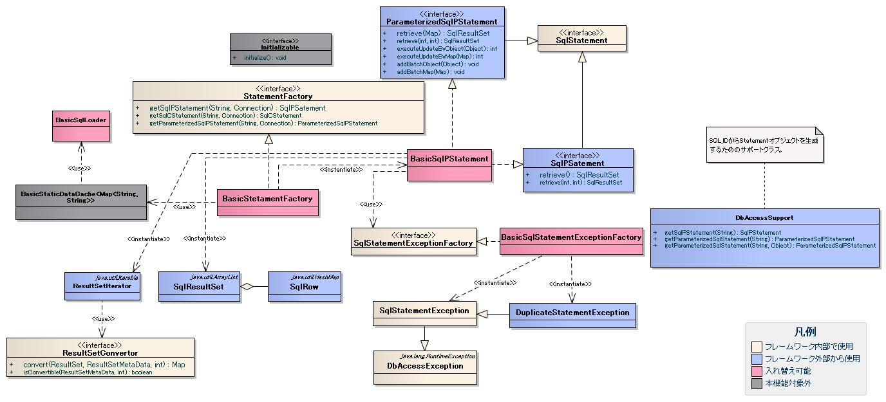

# SQL文実行部品の構造とその使用方法

## SQL文実行部品の構造とその使用方法

SQL文実行部品は、JDBCのAPIをラップする機能と簡易検索機能を提供する。



> **注意**: SQL文を直接Javaコードに記述する実装は、テーブルのスキーマ情報から動的にSQL文を組み立てる必要があるフレームワーク機能にのみ使用する。通常、アプリケーション・プログラマはSQLインジェクション対策のためSQL文を外部ファイル化するため、この実装は行わない。

**クラス**: `AppDbConnection`, `SqlPStatement`, `SqlResultSet`, `SqlRow`, `DbConnectionContext`

```java
// Statementの取得
AppDbConnection connection = DbConnectionContext.getConnection(transaction.getDbTransactionName());
SqlPStatement statement = connection.prepareStatement(
        "SELECT USER_ID, NAME, TEL, AGE FROM USER_MTR WHERE USER_ID = ?");

// 条件を設定し、SQL文を実行
statement.setObject(1, "00001");
SqlResultSet resultSet = statement.retrieve();

// 検索結果を処理する
for (SqlRow row : resultSet) {
    String userId = row.getString("user_id");
    String name = row.getString("name");
    String tel = row.getString("tel");
    String age = row.getString("age");
}
```

<details>
<summary>keywords</summary>

SQL文実行部品, JDBCラッパー, 簡易検索, StatementFactory, SqlPStatement, クラス図, AppDbConnection, SqlResultSet, SqlRow, DbConnectionContext, prepareStatement, setObject, retrieve, getString, SQL文直接指定, SQLインジェクション対策, フレームワーク内部実装

</details>

## 各クラスの責務

## インタフェース定義 (nablarch.core.db.statementパッケージ)

| インタフェース名 | 概要 |
|---|---|
| `StatementFactory` | PreparedStatementラッパー・CallableStatementラッパー・ParameterizedSqlPStatementを生成するインタフェース |
| `SqlStatement` | SqlPStatement、ParameterizedSqlPStatementの親インタフェース |
| `SqlPStatement` | PreparedStatementのラッパー機能および[簡易検索機能](libraries-04_DbAccessSpec.md)のインタフェース |
| `ResultSetConvertor` | ResultSetから値を取得するインタフェース。ResultSet#getObject以外で値取得が必要な場合に実装クラスを追加。データ型に応じてJavaオブジェクトの対応を決め打ちする場合に使用 |
| `ParameterizedSqlPStatement` | オブジェクトのフィールド値をDBに登録するインタフェース |
| `StatementExceptionFactory` | SQLException発生時に送出するExceptionを生成するインタフェース |

## クラス定義

### a) StatementFactory実装クラス (nablarch.core.db.statementパッケージ)

| クラス名 | 概要 |
|---|---|
| `BasicStatementFactory` | StatementFactoryの基本実装。BasicSqlPStatementを生成する。java.sql.StatementのラッパーはSQLインジェクション対策のため提供しない（[db-sql-injection-label](libraries-04_DbAccessSpec.md)参照）|

### b) SqlPStatement実装クラス (nablarch.core.db.statementパッケージ)

| クラス名 | 概要 |
|---|---|
| `BasicSqlPStatement` | SqlPStatement・ParameterizedSqlPStatementの基本実装。DBベンダー依存実装はないため、ベンダー依存が必要にならない限り置き換え不要。ベンダー依存が必要な場合はSqlPStatement・ParameterizedSqlPStatementの実装クラスを追加して差し替えること |

### c) StatementExceptionFactory実装クラス (nablarch.core.db.statement.exceptionパッケージ)

| クラス名 | 概要 |
|---|---|
| `BasicSqlStatementExceptionFactory` | 一意制約違反の場合はDuplicateStatementExceptionを送出。それ以外はSqlStatementExceptionを送出。判定はSQLException#getSQLStateまたはgetErrorCode（設定値は[db-basic-sqlstatementexceptionfactory-label](#)参照）。一意制約違反以外のハンドリングが必要な場合はSqlStatementExceptionのサブクラスとFactoryクラスを追加すること |

### d) 検索結果クラス (nablarch.core.db.statementパッケージ)

| クラス名 | 概要 |
|---|---|
| `ResultSetIterator` | ResultSetのラッパー。1レコード分のデータをSqlRowで取得するインタフェースを提供 |
| `SqlResultSet` | 簡易検索結果を全件メモリ上に保持するArrayListサブクラス |
| `SqlRow` | ResultSetの1レコード分のデータを格納するMapインタフェース実装クラス。SqlResultSetの各要素に格納される |

> **警告**: SqlResultSetはResultSetの結果を全件メモリに保持するため、大量データ検索時にメモリ不足になる可能性がある。大量データ検索にはPreparedStatementラッパーのexecuteQueryを使用し、ResultSetIteratorで処理すること。

**クラス**: `nablarch.core.db.statement.BasicStatementFactory`, `nablarch.core.db.statement.exception.BasicSqlStatementExceptionFactory`, `nablarch.core.db.statement.BasicSqlLoader`

```xml
<component name="statementFactory"
           class="nablarch.core.db.statement.BasicStatementFactory">
    <property name="sqlStatementExceptionFactory">
        <component class="nablarch.core.db.statement.exception.BasicSqlStatementExceptionFactory">
            <property name="duplicateErrorSqlState" value=""/>
            <property name="duplicateErrorErrCode" value="1"/>
        </component>
    </property>
    <property name="fetchSize" value="500"/>
    <property name="queryTimeout" value="600" />
    <property name="sqlLoader">
        <component class="nablarch.core.db.statement.BasicSqlLoader">
            <property name="fileEncoding" value="utf-8"/>
            <property name="extension" value="sql"/>
        </component>
    </property>
</component>
```

## a) StatementFactory

| プロパティ名 | 必須 | デフォルト値 | 説明 |
|---|---|---|---|
| sqlStatementExceptionFactory | ○ | | `SqlStatementExceptionFactory`実装クラスを設定 |
| resultSetConvertor | | | `ResultSetConvertor`実装クラスを設定。SELECT結果のカラムデータ変換が必要な場合に設定 |
| fetchSize | | 10 | プリフェッチサイズ。変更によりデータベースサーバとのラウンドトリップ数を削減でき性能改善が期待できる。Statement単位で`SqlPStatement#setFetchSize`で変更可能 |
| queryTimeout | | 0（無制限） | クエリータイムアウト秒数。Statement単位で`SqlPStatement#setQueryTimeout`で変更可能 |
| sqlLoader | | | `StaticDataLoader`実装クラスを設定 |

> **注意**: `SqlPStatement#setFetchSize`または`setQueryTimeout`で変更した値は、変更されたインスタンスでのみ有効。`AppDbConnection#prepareStatement`を呼び出した場合は設定ファイルの値が使用される。これはstatementReuse（DataSourceConnectionFactory）の設定内容に関わらず同一の振る舞いとなる。

**sqlLoaderをBasicSqlLoader以外に差し替える場合の仕様**:
- generic型を`Map<String, String>`とすること（例: `implements StaticDataLoader<Map<String, String>>`）
- `StaticDataLoader#getValue`メソッドでSQL読み込み処理を行い、それ以外はnullを返すこと
- `getValue`の返却値: KEY=SQL_ID、VALUE=SQL文の`Map<String, String>`

## b) BasicSqlStatementExceptionFactory

| プロパティ名 | 必須 | 説明 |
|---|---|---|
| duplicateErrorSqlState | どちらか一方必須 | 一意制約違反のSqlState（`SQLException#getSqlState`の返却値） |
| duplicateErrorErrCode | どちらか一方必須 | 一意制約違反のErrCode（`SQLException#getErrorCode`の返却値） |

## c) BasicSqlLoader

| プロパティ名 | デフォルト値 | 説明 |
|---|---|---|
| fileEncoding | JVMデフォルトエンコーディング | SQLファイルのエンコーディング |
| extension | sql | SQLファイルの拡張子 |

<details>
<summary>keywords</summary>

StatementFactory, SqlStatement, SqlPStatement, ResultSetConvertor, ParameterizedSqlPStatement, StatementExceptionFactory, BasicStatementFactory, BasicSqlPStatement, BasicSqlStatementExceptionFactory, ResultSetIterator, SqlResultSet, SqlRow, DuplicateStatementException, SqlStatementException, インタフェース定義, 一意制約違反, BasicSqlLoader, StaticDataLoader, SqlStatementExceptionFactory, sqlStatementExceptionFactory, resultSetConvertor, fetchSize, queryTimeout, sqlLoader, duplicateErrorSqlState, duplicateErrorErrCode, fileEncoding, extension, StatementFactory設定, 一意制約違反設定, SQLファイルロード設定, プリフェッチサイズ, クエリータイムアウト

</details>

## SQLロードクラスとサポートクラス

## BasicSqlLoader (SQL文のロードクラス)

**クラス**: `nablarch.core.db.statement.BasicSqlLoader`

クラスパス上の外部SQLファイルからSQL文を読み込むクラス。読み込んだSQL文は[../05_StaticDataCache](libraries-05_StaticDataCache.md)によりSQLファイル単位でメモリ上にキャッシュされる（KEY: SQL_ID、VALUE: SQL文）。SQL_IDはSQLファイル内で一意とすること。

**SQLファイルの記述ルール:**
1. SQL_IDとSQL文の1グループは空行で区切る（SQL文内に空行不可。異なるSQL文間は空行必須。コメント行は空行とはならない）
2. SQL文の最初の「=」までがSQL_ID
3. コメントは「--」で開始（行コメントのみ、ブロックコメント不可）
4. SQL文途中の改行可。スペース・tabでの桁揃え可

```sql
GET_XXXX_INFO =
SELECT
   COL1,
   COL2
FROM
   TEST_TABLE
WHERE
   COL1 = :col1

UPDATE_XXXX =
UPDATE
    TEST_TABLE
SET
    COL2 = :col2
WHERE
    COL1 = :col1
```

## DbAccessSupport (サポートクラス)

**クラス**: `nablarch.core.db.support.DbAccessSupport`

SQL_IDからStatementオブジェクトを生成するクラス。継承することで簡易的にStatementオブジェクトを生成可能。

**SQLファイルの命名規則**: 継承クラスの完全修飾名と一致させること。
```
クラス名:  nablarch.sample.management.user.UserRegisterService
SQLファイル: nablarch/sample/management/user/UserRegisterService.sql
```
[BasicSqlLoader](#)使用時はクラスパス配下のSQLファイルが読み込まれる。

> **注意**: 継承が使えない場合は`DbAccessSupport(Clazz<?> clazz)`コンストラクタでインスタンス化すること。デフォルトコンストラクタを使用するとDbAccessSupportクラスの完全修飾名でSQLファイルを検索するため、意図したSQLファイルが読み込まれない。

**提供メソッド:**

| メソッド | 概要 |
|---|---|
| `SqlPStatement getSqlPStatement(String sqlId)` | SQL_IDからSqlPStatementを生成 |
| `ParameterizedSqlPStatement getParameterizedSqlStatement(String sqlId)` | SQL_IDからParameterizedSqlPStatementを生成 |
| `ParameterizedSqlPStatement getParameterizedSqlStatement(String sqlId, Object condition)` | SQL_IDと条件オブジェクトから可変条件のParameterizedSqlPStatementを生成 |
| `int countByStatementSql(String sqlId)` | SQL_IDで件数取得SQLを生成・実行（条件なし） |
| `int countByParameterizedSql(String sqlId, Object condition)` | SQL_IDと条件オブジェクトで件数取得SQLを生成・実行 |
| `SqlResultSet search(String sqlId, ListSearchInfo condition) throws TooManyResultException` | 件数取得および検索を実行 |

<details>
<summary>keywords</summary>

BasicSqlLoader, DbAccessSupport, SQLファイルロード, SQL_ID, キャッシュ, サポートクラス, getSqlPStatement, getParameterizedSqlStatement, countByStatementSql, countByParameterizedSql, ListSearchInfo, TooManyResultException, search

</details>

## 簡易検索の場合の処理シーケンス

簡易検索の処理シーケンス:

1. `DbAccessSupport#getSqlPStatement(sqlId)` を呼び出してSqlPStatementを取得
2. `SqlPStatement#setString()`等で条件を設定後、`SqlPStatement#retrieve()`でSQL実行
3. `SqlResultSet`から検索結果の値を取得

> **注意**: retrieve呼び出し前に`SqlPStatement#setString()`等でSQL文の実行前に条件を設定すること。


<details>
<summary>keywords</summary>

SqlPStatement, SqlResultSet, 簡易検索シーケンス, retrieve, DbAccessSupport, getSqlPStatement

</details>

## 推奨するJavaの実装例(SQL文を外部ファイル化した場合)

データベースアクセスクラス名が`nablarch.sample.user.UserService`の場合、クラスパス配下に`nablarch/sample/user/UserService.sql`を作成する。SQL文の記述ルールは[sql-load-class-label](#)参照。

**SQLファイル:**
```sql
GET_USER_INFO =
SELECT USER_ID,
       NAME,
       TEL,
       AGE
  FROM USER_MTR
 WHERE USER_ID = ?
```

**Java実装:**
```java
package nablarch.sample.user;

public class UserService extends DbAccessSupport {

    public SqlResultSet getUserInfo(String userId) {
        SqlPStatement statement = getSqlPStatement("GET_USER_INFO");
        statement.setObject(1, "00001");
        return statement.retrieve();
    }
}
```

<details>
<summary>keywords</summary>

DbAccessSupport, getSqlPStatement, SqlPStatement, SqlResultSet, SQL外部ファイル, 実装例, UserService

</details>
