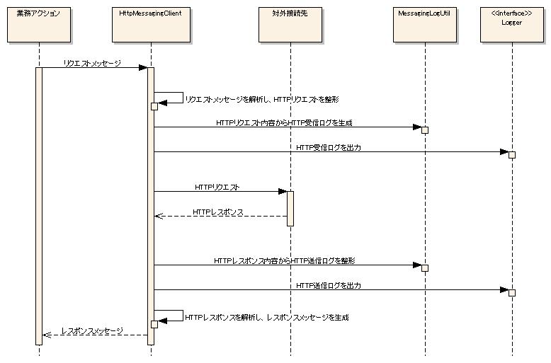

# メッセージングログの出力

メッセージングログは、フレームワークが提供するシステム間メッセージング機能の中でメッセージ送受信時に出力する。
アプリケーションでは、ログ出力の設定を行うことにより出力する。

## メッセージングログの出力方針

メッセージングログで想定している出力方針と出力項目を下記に示す。
メッセージングログは、アプリケーション全体のログ出力を行うアプリケーションログに出力する。

| ログレベル | ロガー名 |
|---|---|
| INFO | MESSAGING |

上記出力方針に対するログ出力の設定例を下記に示す。

log.propertiesの設定例

```bash
writerNames=appFile

# アプリケーションログの出力先
writer.appFile.className=nablarch.core.log.basic.FileLogWriter
writer.appFile.filePath=/var/log/app/app.log
writer.appFile.encoding=UTF-8
writer.appFile.maxFileSize=10000
writer.appFile.formatter.className=nablarch.core.log.basic.BasicLogFormatter
writer.appFile.formatter.format=<アプリケーションログ用のフォーマット>

availableLoggersNamesOrder=MESSAGING,ROO

# アプリケーションログの設定
loggers.ROO.nameRegex=.*
loggers.ROO.level=INFO
loggers.ROO.writerNames=appFile

# メッセージングログの設定
loggers.MESSAGING.nameRegex=MESSAGING
loggers.MESSAGING.level=INFO
loggers.MESSAGING.writerNames=appFile
```

## メッセージングログの出力項目

メッセージングログの出力項目を下記に示す。

| 項目名 | 説明 |
|---|---|
| 出力日時 | ログ出力時のシステム日時。 |
| 起動プロセスID | アプリケーションを起動したプロセス名。実行環境の特定に使用する。 |
| 処理方式区分 | 処理方式の特定に使用する。 |
| リクエストID | 処理を一意に識別するID。 |
| 実行時ID | 処理の実行を一意に識別するID。 |
| ユーザID | ログインユーザのユーザID。 |
| スレッド名 | 処理を実行したスレッド名。 |
| メッセージID | メッセージに設定されているメッセージID。 |
| 送信宛先 | メッセージに設定されている送信宛先。 |
| 関連メッセージID | メッセージに設定されている関連メッセージID。 |
| 応答宛先 | メッセージに設定されている応答宛先。 |
| 有効期間 | メッセージに設定されている有効期間。 |
| メッセージヘッダ | メッセージに設定されているヘッダ。 |
| メッセージボディ | メッセージボディ部のダンプ。  メッセージボディに含まれる個人情報や機密情報は、マスクして出力する。 (マスク用の設定が必要となる。) |
| メッセージボディのヘキサダンプ | メッセージボディ部のヘキサダンプ。  メッセージボディに含まれる個人情報や機密情報は、マスク文字列の ヘキサダンプを出力する。 (マスク用の設定が必要となる。) |
| メッセージボディのバイト長 | メッセージボディ部のバイト長。 |

メッセージングログの個別項目は、スレッド名からメッセージボディのバイト長までとなる。
残りの項目は、 [BasicLogFormatter](../../component/libraries/libraries-01-Log.md#log-basiclogformatter) の設定で指定する共通項目となる。
共通項目と個別項目を組み合わせたフォーマットについては、 [各種ログの共通項目のフォーマット](../../component/libraries/libraries-01-Log.md#applog-format) を参照。

## メッセージングログの出力方法

メッセージングログの出力に使用するクラスを下記に示す。


| クラス名 | 概要 |
|---|---|
| nablarch.fw.messaging.MessagingContext | MOMメッセージ送受信処理において、MOM用のメッセージと本フレームワーク内部で使用する要求および 応答メッセージとを相互に変換し、送受信を行うクラス。 実際に送受信が行われるメッセージ内容のログを出力する。 |
| nablarch.fw.messaging.handler.HttpMessagingRequestParsingHandler | HTTPメッセージ受信処理において、HTTPリクエストを解析し本フレームワーク内部で使用する要求メッセージへの変換 を行うハンドラ。 実際に受信されるメッセージ内容のログを出力する。 |
| nablarch.fw.messaging.handler.HttpMessagingResponseBuildingHandler | HTTPメッセージ受信処理において、応答メッセージをHTTPレスポンスへ変換するハンドラ 実際に送信されるメッセージ内容のログを出力する。 |
| nablarch.fw.messaging.realtime.http.client.HttpMessagingClient | HTTPメッセージ送信処理において、本フレームワーク内部で使用する要求メッセージからHTTPリクエストへの変換 およびHTTPレスポンスの応答メッセージへの変換を行うクラス。 実際に送受信が行われるメッセージ内容のログを出力する。 |
| nablarch.fw.messaging.logging.MessagingLogUtil | メッセージング処理中のログの出力内容に関連した処理を行うクラス。 |
| nablarch.fw.messaging.logging.MessagingLogFormatter | メッセージングログの個別項目をフォーマットするクラス。 |

各メッセージング処理方式におけるログ出力時の処理シーケンスを下記に示す。
ログ出力を行う各クラスは、MessagingLogUtilを使用してメッセージングログを整形し、Loggerを使用してログ出力を行う。

**MOM同期応答メッセージ受信**


MOM応答不要メッセージ受信処理では、MOM受信ログの出力および業務アクションの呼び出しまでの処理が行われる。
シーケンス図の記載は省略する。

**MOM同期応答メッセージ送信**


MOM応答不要メッセージ送信処理では、MOM送信ログの出力および要求キューメッセージの送信までの処理が行われる。
シーケンス図の記載は省略する。

**HTTPメッセージ受信**


**HTTPメッセージ送信**



## メッセージングログの設定方法

MessagingLogUtilは、プロパティファイル(app-log.properties)を読み込み、
MessagingLogFormatterオブジェクトを生成して、個別項目のフォーマット処理を委譲する。
プロパティファイルのパス指定や実行時の設定値の変更方法は、 [各種ログの設定](../../component/libraries/libraries-01-Log.md#applog-config) を参照。
メッセージングログの設定例を下記に示す。

app-log.propertiesの設定例

```bash
# MessagingLogFormatter
messagingLogFormatter.className=nablarch.fw.messaging.logging.MessagingLogFormatter
messagingLogFormatter.maskingChar=#
messagingLogFormatter.maskingPatterns=<password>(.+?)</password>,<mobilePhoneNumber>(.+?)</mobilePhoneNumber>

# MOMメッセージング用フォーマット
messagingLogFormatter.sentMessageFormat=@@@@ SENT MESSAGE @@@@\n\tthread_name    = [$threadName$]\n\tmessage_id     = [$messageId$]\n\tdestination    = [$destination$]\n\tcorrelation_id = [$correlationId$]\n\treply_to       = [$replyTo$]\n\ttime_to_live   = [$timeToLive$]\n\tmessage_body   = [$messageBody$]
messagingLogFormatter.receivedMessageFormat=@@@@ RECEIVED MESSAGE @@@@\n\tthread_name    = [$threadName$]\n\tmessage_id     = [$messageId$]\n\tdestination    = [$destination$]\n\tcorrelation_id = [$correlationId$]\n\treply_to       = [$replyTo$]\n\tmessage_body   = [$messageBody$]

# HTTPメッセージング用フォーマット
messagingLogFormatter.httpSentMessageFormat=@@@@ HTTP SENT MESSAGE @@@@\n\tthread_name    = [$threadName$]\n\tmessage_id     = [$messageId$]\n\tdestination    = [$destination$]\n\tcorrelation_id = [$correlationId$]\n\tmessage_header = [$messageHeader$]\n\tmessage_body   = [$messageBody$]
messagingLogFormatter.httpReceivedMessageFormat=@@@@ HTTP RECEIVED MESSAGE @@@@\n\tthread_name    = [$threadName$]\n\tmessage_id     = [$messageId$]\n\tdestination    = [$destination$]\n\tcorrelation_id = [$correlationId$]\n\tmessage_header = [$messageHeader$]\n\tmessage_body   = [$messageBody$]
```

プロパティの説明を下記に示す。

| プロパティ名 | 設定値 |
|---|---|
| messagingLogFormatter.className | MessagingLogFormatterのクラス名。 MessagingLogFormatterクラスを差し替える場合に指定する。 |
| messagingLogFormatter.maskingPatterns | メッセージ本文のマスク対象文字列を正規表現で指定する。  正規表現で指定された最初のキャプチャ部分(括弧で囲まれた部分)がマスク対象となる。  例えばパターンとして「<password>(.+?)</password>」と指定し、 実電文に「<password>hoge</password>」が含まれる場合、 出力される文字列は「<password>****</password>」となる。  複数指定する場合はカンマ区切り。 指定した正規表現は、Pattern.CASE_INSENSITIVEを指定してコンパイルする。 コンパイル処理の呼び出しを下記に示す。  ```java Pattern.compile(<指定した正規表現>, Pattern.CASE_INSENSITIVE) ``` |
| messagingLogFormatter.maskingChar | マスクに使用する文字。 デフォルトは'*'。 |
| messagingLogFormatter.sentMessageFormat | MOM送信メッセージのログ出力に使用するフォーマット。 |
| messagingLogFormatter.receivedMessageFormat | MOM受信メッセージのログ出力に使用するフォーマット。 |
| messagingLogFormatter.httpSentMessageFormat | HTTP送信メッセージのログ出力に使用するフォーマット。 |
| messagingLogFormatter.httpReceivedMessageFormat | HTTP受信メッセージのログ出力に使用するフォーマット。 |

フォーマットに指定可能なプレースホルダの一覧とデフォルトのフォーマットを下記に示す。
フォーマットの改行位置で改行して表示する。

### MOM送信メッセージのログ出力に使用するフォーマット

プレースホルダ一覧

| 項目名 | プレースホルダ |
|---|---|
| スレッド名 | $threadName$ |
| メッセージID | $messageId$ |
| 送信宛先 | $destination$ |
| 関連メッセージID | $correlationId$ |
| 応答宛先 | $replyTo$ |
| 有効期間 | $timeToLive$ |
| メッセージボディの内容 | $messageBody$ |
| メッセージボディのヘキサダンプ | $messageBodyHex$ |
| メッセージボディのバイト長 | $messageBodyLength$ |

デフォルトのフォーマット

```bash
@@@@ SENT MESSAGE @@@@
    \n\tthread_name    = [$threadName$]
    \n\tmessage_id     = [$messageId$]
    \n\tdestination    = [$destination$]
    \n\tcorrelation_id = [$correlationId$]
    \n\treply_to       = [$replyTo$]
    \n\ttime_to_live   = [$timeToLive$]
    \n\tmessage_body   = [$messageBody$]
```

### MOM受信メッセージのログ出力に使用するフォーマット

プレースホルダ一覧

| 項目名 | プレースホルダ |
|---|---|
| スレッド名 | $threadName$ |
| メッセージID | $messageId$ |
| 送信宛先 | $destination$ |
| 関連メッセージID | $correlationId$ |
| 応答宛先 | $replyTo$ |
| 有効期間 | $timeToLive$ |
| メッセージボディの内容 | $messageBody$ |
| メッセージボディのヘキサダンプ | $messageBodyHex$ |
| メッセージボディのバイト長 | $messageBodyLength$ |

デフォルトのフォーマット

```bash
@@@@ RECEIVED MESSAGE @@@@
    \n\tthread_name    = [$threadName$]
    \n\tmessage_id     = [$messageId$]
    \n\tdestination    = [$destination$]
    \n\tcorrelation_id = [$correlationId$]
    \n\treply_to       = [$replyTo$]
    \n\tmessage_body   = [$messageBody$]
```

### HTTP送信メッセージのログ出力に使用するフォーマット

プレースホルダ一覧

| 項目名 | プレースホルダ |
|---|---|
| スレッド名 | $threadName$ |
| メッセージID | $messageId$ |
| 送信先 | $destination$ |
| 関連メッセージID | $correlationId$ |
| メッセージボディの内容 | $messageBody$ |
| メッセージボディのヘキサダンプ | $messageBodyHex$ |
| メッセージボディのバイト長 | $messageBodyLength$ |
| メッセージのヘッダ | $messageHeader$ |

デフォルトのフォーマット

```bash
@@@@ HTTP SENT MESSAGE @@@@
    \n\tthread_name    = [$threadName$]
    \n\tmessage_id     = [$messageId$]
    \n\tdestination    = [$destination$]
    \n\tcorrelation_id = [$correlationId$]
    \n\tmessage_header = [$messageHeader$]
    \n\tmessage_body   = [$messageBody$]
```

### HTTP受信メッセージのログ出力に使用するフォーマット

プレースホルダ一覧

| 項目名 | プレースホルダ |
|---|---|
| スレッド名 | $threadName$ |
| メッセージID | $messageId$ |
| 送信先 | $destination$ |
| 関連メッセージID | $correlationId$ |
| メッセージボディの内容 | $messageBody$ |
| メッセージボディのヘキサダンプ | $messageBodyHex$ |
| メッセージボディのバイト長 | $messageBodyLength$ |
| メッセージのヘッダ | $messageHeader$ |

デフォルトのフォーマット

```bash
@@@@ HTTP RECEIVED MESSAGE @@@@
    \n\tthread_name    = [$threadName$]
    \n\tmessage_id     = [$messageId$]
    \n\tdestination    = [$destination$]
    \n\tcorrelation_id = [$correlationId$]
    \n\tmessage_header = [$messageHeader$]
    \n\tmessage_body   = [$messageBody$]
```

## メッセージングログの出力例

メッセージングログの出力例を下記に示す。
XMLデータを取り扱うHTTPメッセージ受信処理の例である。

メッセージングログの個別項目のフォーマットは、デフォルトのフォーマットに加えバイト長およびヘキサダンプを追加し、本文中のcnoタグの内容をマスク対象としている。

app-log.propertiesの設定例

```bash
# MessagingLogFormatterの設定
messagingLogFormatter.maskingChar=#
messagingLogFormatter.maskingPatterns=<cno>(.*?)</cno>
messagingLogFormatter.httpSentMessageFormat=@@@@ SENT MESSAGE @@@@\n\tthread_name    = [$threadName$]\n\tmessage_id     = [$messageId$]\n\tdestination    = [$destination$]\n\tcorrelation_id = [$correlationId$]\n\tmessage_header = [$messageHeader$]\n\tmessage_length = [$messageBodyLength$]\n\tmessage_body   = [$messageBody$]\n\tmessage_bodyhex= [$messageBodyHex$]
messagingLogFormatter.httpReceivedMessageFormat=@@@@ RECEIVED MESSAGE @@@@\n\tthread_name    = [$threadName$]\n\tmessage_id     = [$messageId$]\n\tdestination    = [$destination$]\n\tcorrelation_id = [$correlationId$]\n\tmessage_header = [$messageHeader$]\n\tmessage_length = [$messageBodyLength$]\n\tmessage_body   = [$messageBody$]\n\tmessage_bodyhex= [$messageBodyHex$]
```

log.propertiesの設定例

```bash
writerNames=appFile

# appFile
writer.appFile.className=nablarch.core.log.basic.FileLogWriter
writer.appFile.filePath=./app.log
writer.appFile.encoding=UTF-8
writer.appFile.maxFileSize=10000
writer.appFile.formatter.className=nablarch.core.log.basic.BasicLogFormatter
writer.appFile.formatter.format=$date$ -$logLevel$- $loggerName$ [$executionId$] boot_proc = [$bootProcess$] proc_sys = [$processingSystem$] req_id = [$requestId$] usr_id = [$userId$] $message$$information$$stackTrace$

availableLoggersNamesOrder=MESSAGING

# MESSAGING
loggers.MESSAGING.nameRegex=MESSAGING
loggers.MESSAGING.level=INFO
loggers.MESSAGING.writerNames=appFile
```

cnoタグの内容は、MessagingLogFormatterの設定で指定した文字にマスクして出力される。
また、ヘキサダンプされた内容もマスク文字列のヘキサダンプが出力される。

```bash
2014-06-27 11:07:51.314 -INFO- MESSAGING [null] boot_proc = [] proc_sys = [] req_id = [RM11AC0102] usr_id = [unitTest] @@@@ HTTP RECEIVED MESSAGE @@@@
    thread_name    = [main]
    message_id     = [1403834871251]
    destination    = [null]
    correlation_id = [null]
    message_header = [{x-message-id=1403834871251, MessageId=1403834871251, ReplyTo=/action/RM11AC0102}]
    message_length = [216]
    message_body   = [<?xml version="1.0" encoding="UTF-8"?><request><_nbctlhdr><userId>unitTest</userId><resendFlag>0</resendFlag></_nbctlhdr><user><id>nablarch</id><name>ナブラーク</name><cno>****************</cno></user></request>]
    message_bodyhex= [3C3F786D6C2076657273696F6E3D22312E302220656E636F64696E673D225554462D38223F3E3C726571756573743E3C5F6E6263746C6864723E3C7573657249643E756E6974546573743C2F7573657249643E3C726573656E64466C61673E303C2F726573656E64466C61673E3C2F5F6E6263746C6864723E3C757365723E3C69643E6E61626C617263683C2F69643E3C6E616D653E3F3F3F3F3F3C2F6E616D653E3C636E6F3E2A2A2A2A2A2A2A2A2A2A2A2A2A2A2A2A3C2F636E6F3E3C2F757365723E3C2F726571756573743E]
2014-06-27 11:07:51.329 -INFO- MESSAGING [null] boot_proc = [] proc_sys = [] req_id = [RM11AC0102] usr_id = [unitTest] @@@@ HTTP SENT MESSAGE @@@@
    thread_name    = [main]
    message_id     = [null]
    destination    = [/action/RM11AC0102]
    correlation_id = [1403834871251]
    message_header = [{CorrelationId=1403834871251, Destination=/action/RM11AC0102}]
    message_length = [145]
    message_body   = [<?xml version="1.0" encoding="UTF-8"?><response><_nbctlhdr><statusCode>200</statusCode></_nbctlhdr><result><msg>success</msg></result></response>]
    message_bodyhex= [3C3F786D6C2076657273696F6E3D22312E302220656E636F64696E673D225554462D38223F3E3C726573706F6E73653E3C5F6E6263746C6864723E3C737461747573436F64653E3230303C2F737461747573436F64653E3C2F5F6E6263746C6864723E3C726573756C743E3C6D73673E737563636573733C2F6D73673E3C2F726573756C743E3C2F726573706F6E73653E]
```
