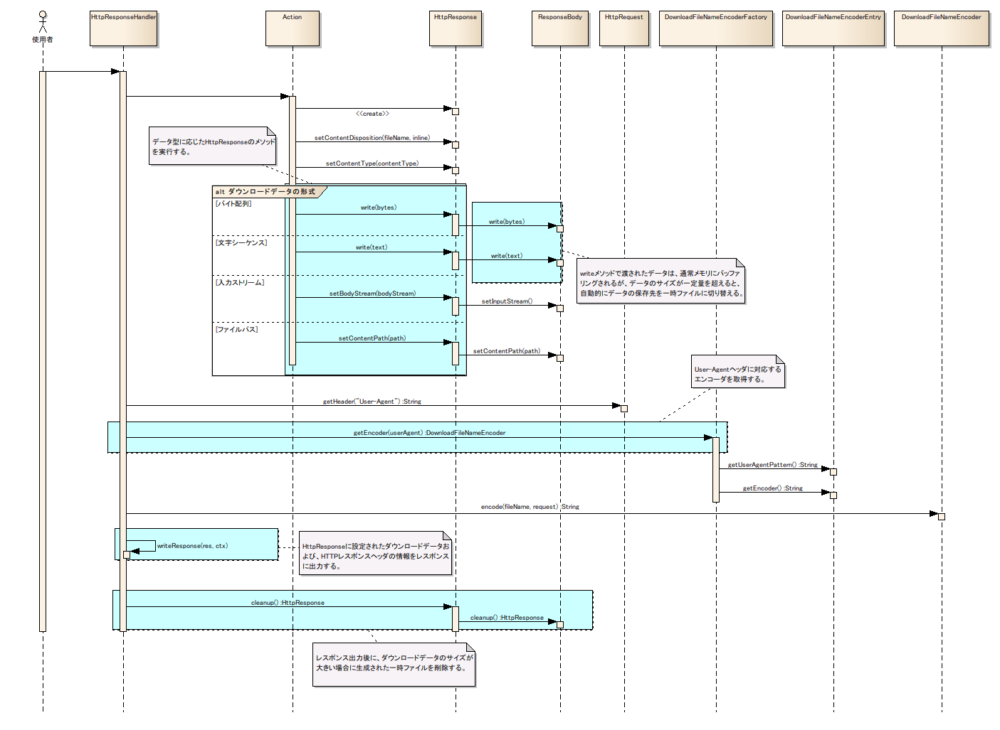

# ファイルダウンロード

## 概要

ファイルをクライアントへダウンロードする機能を提供する。

なし

<details>
<summary>keywords</summary>

ファイルダウンロード, クライアントダウンロード機能, HttpResponse, 文字シーケンスダウンロード

</details>

## 特徴

`HttpResponse` クラスのメソッドのみを使用したシンプルな実装でダウンロードを実現できる。

レスポンスデータの設定に使用するメソッド:

1. コンテンツタイプ・文字コードの設定: `HttpResponse#setContentType(String)`
2. ダウンロードファイル名・インライン表示有無の設定: `HttpResponse#setContentDisposition(String)`
3. レスポンスボディへのデータ書き込み（4種類のデータ型に対応）:
   - バイト配列: `HttpResponse#write(byte[])`
   - 文字シーケンス: `HttpResponse#write(CharSequence)`
   - 入力ストリーム: `HttpResponse#setBodyStream(InputStream)`
   - ファイルパス指定: `HttpResponse#setContentPath(String)`

> **注意**: `setContentPath`・`setBodyStream`・`write` を同時に使用した場合の優先順位: (1) setContentPath (2) setBodyStream (3) write。例えば `setBodyStream` と `write` が同時に呼ばれた場合、`setBodyStream` の内容がダウンロードされ `write` の内容は無視される。

> **注意**: `write` メソッドで文字シーケンスをダウンロードする場合、Content-Typeヘッダに設定した charset でエンコードされる。`write` 実行前に `setContentType` で文字コードを設定しておく必要がある。未設定の場合は UTF-8 でエンコードされる。

コード例（文字シーケンスを Shift_JIS でダウンロード）:

```java
public HttpResponse doDownloadCharSequence(HttpRequest req, ExecutionContext context) {
    HttpResponse res = new HttpResponse();
    res.setContentType("text/csv; charset=Shift_JIS");
    res.write("ユーザID, ユーザ名\n");
    res.write("0000001, nabla\n");
    res.write("0000002, arch\n");
    res.write("0000003, arch\n");
    res.setContentDisposition("サンプルCSVファイル.csv");
    return res;
}
```

`write` メソッドでダウンロードデータを作成する際、データサイズが一定の閾値を超えると自動的にデータの保存先をメモリから一時ファイルに切り替える。データサイズが小さい場合はメモリ経由で高速ダウンロード、大きい場合は一時ファイル経由でメモリ消費を抑制する。

**クラス**: `HttpResponse`

Shift_JISエンコードの文字シーケンスデータをCSVとしてダウンロードする実装例。

| メソッド | 用途 |
|---|---|
| `setContentType(String)` | Content-Typeとcharsetを設定する（例: `"text/csv; charset=Shift_JIS"`） |
| `write(String)` | ダウンロードデータ（文字シーケンス）を追記する |
| `setContentDisposition(String)` | ダウンロード時のファイル名を設定する |

```java
public HttpResponse doDownloadCharSequence(HttpRequest req, ExecutionContext context) {
    HttpResponse res = new HttpResponse();
    res.setContentType("text/csv; charset=Shift_JIS");
    res.write("ユーザID, ユーザ名\n");
    res.write("0000001, nabla\n");
    res.write("0000002, arch\n");
    res.write("0000003, arch\n");
    res.setContentDisposition("サンプルCSVファイル.csv");
    return res;
}
```

<details>
<summary>keywords</summary>

HttpResponse, setContentType, setContentDisposition, write, setBodyStream, setContentPath, メソッド優先順位, 文字コードエンコード, 一時ファイル切り替え, メモリバッファ, ダウンロード実装, HttpRequest, ExecutionContext, ファイルダウンロード, Content-Type設定, Content-Disposition設定, CSVダウンロード, 文字コード指定, Shift_JIS

</details>

## 要求

## 実装済み

- ファイルのダウンロード（テキストファイル・バイナリファイル対応）
- インライン表示（ブラウザ上に直接ファイルを表示）
  > **注意**: インライン表示の挙動はブラウザの種類やセキュリティ設定に依存する。
- データサイズが大きいダウンロードファイルを作成する際に、データの保存先を一時ファイルにできる
- ダウンロードファイル名に非ASCII文字（多言語）を使用可能
  > **注意**: 非ASCII文字のファイル名をサポートするブラウザは Internet Explorer・Firefox・Google Chrome の3種類。Windows版Safariは非ASCII文字未対応（ASCII文字は使用可能）。

## 未実装

- ダウンロード履歴を残すことができない

  計画されているアプローチ: ダウンロードの際に使用した一時ファイルをサーバ上に保管することで履歴管理する。byte配列・文字シーケンスだけでなく入力ストリームも保管対象とする。保管する一時ファイル名にはダウンロードファイル名（+拡張子）を含める。また、HTTPログと紐付けられるような情報を残す。

<details>
<summary>keywords</summary>

インライン表示, 非ASCII文字ファイル名, ブラウザ対応, 一時ファイル保存, ダウンロード要件, ダウンロード履歴

</details>

## 構成


| クラス/インタフェース | 概要 |
|---|---|
| `nablarch.fw.web.HttpResponse` | ダウンロードデータおよびHTTPヘッダ情報を設定するHTTPレスポンスオブジェクト。ダウンロードデータの出力・Content-Disposition・Content-Typeの設定機能を持つ。 |
| `nablarch.fw.web.ResponseBody` | ダウンロードデータを保持するクラス。データサイズが一定量を超えると保存先をメモリから一時ファイルに変更してメモリ消費を抑制する。 |
| `nablarch.fw.web.HttpResponseSetting` | レスポンスに関連する設定を保持するクラス（メモリバッファリングサイズ上限・一時ファイル出力先フォルダ・一時ファイル使用有無を設定）。コンポーネント設定ファイルで定義する（:ref:`compornentDifinitionResponse` 参照）。 |
| `nablarch.fw.web.handler.HttpResponseHandler` | HttpResponseに設定されたダウンロードデータとHTTPヘッダ情報をレスポンスに出力するハンドラ。DownloadFileNameEncoderFactoryでエンコーダを取得しファイル名をエンコードしてContent-Dispositionに設定する。一時ファイルが存在する場合はレスポンス出力後に削除する。 |
| `nablarch.fw.web.download.encorder.DownloadFileNameEncoderEntry` | User-Agentヘッダのパターンとダウンロードファイル名エンコーダの関連を保持するエントリ。 |
| `nablarch.fw.web.download.encorder.DownloadFileNameEncoderFactory` | ダウンロードファイル名のエンコーダを取得するクラス。User-Agentとエンコーダの関連はコンポーネント設定ファイルで編集可能（:ref:`compornentDifinition` 参照）。 |

<details>
<summary>keywords</summary>

HttpResponse, ResponseBody, HttpResponseSetting, HttpResponseHandler, DownloadFileNameEncoderEntry, DownloadFileNameEncoderFactory, クラス構成

</details>

## インタフェース定義

**インタフェース**: `nablarch.fw.web.download.encorder.DownloadFileNameEncoder`

ダウンロードファイル名エンコーダのインタフェース。本インタフェースの実装クラスを用いてファイル名を適切にエンコードすることで非ASCII文字の使用が可能となる。標準では URLエンコーディング方式と MIME-Bエンコーディング方式の実装クラスを提供する。URLエンコーディング方式またはMIME-Bエンコーディング方式でほとんどのブラウザに対応可能なので、通常は独自のエンコーダを実装する必要はない。

実装クラス:

| クラス名 | 概要 |
|---|---|
| `nablarch.fw.web.download.encorder.MimeBDownloadFileNameEncoder` | RFC2047の仕様に従いMIME-Bエンコード方式でダウンロードファイル名をエンコードするエンコーダ（MIME-Bエンコーダ）。 |
| `nablarch.fw.web.download.encorder.UrlDownloadFileNameEncoder` | URLエンコード方式でダウンロードファイル名をエンコードするエンコーダ（URLエンコーダ）。 |

<details>
<summary>keywords</summary>

DownloadFileNameEncoder, MimeBDownloadFileNameEncoder, UrlDownloadFileNameEncoder, エンコーダインタフェース, ファイル名エンコード

</details>

## nablarch.fw.web.HttpResponseクラスのメソッド

| メソッド名 | 概要 |
|---|---|
| `setContentType(String contentType)` | Content-Typeヘッダを設定する。省略した場合、setContentDispositionで指定されたファイル名の拡張子をもとに自動設定される。writeメソッドで文字シーケンスを作成する場合は必ずwrite前に実行し文字コードを設定する（例: `"text/csv; charset=Shift_JIS"`）。バイト配列・ストリーム・ファイルパスのデータはContent-Typeのcharsetでエンコードされずそのままデータがレスポンスに出力される。 |
| `setContentDisposition(String fileName)` | Content-Dispositionヘッダを設定する（インライン表示なし）。 |
| `setContentDisposition(String fileName, boolean inline)` | Content-Dispositionヘッダを設定する（インライン表示の有無を指定）。 |
| `write(byte[] bytes)` | ダウンロードデータとしてバイト配列を使用する。 |
| `write(CharSequence text)` | ダウンロードデータとして文字シーケンスを使用する。 |
| `setBodyStream(InputStream bodyStream)` | ダウンロードデータとして入力ストリームを使用する。引数で渡された入力ストリームがダウンロードされる。 |
| `setContentPath(String path)` | ダウンロードデータとしてファイルパスを使用する。引数で渡されたパスに存在するファイルがダウンロードされる。 |



<details>
<summary>keywords</summary>

HttpResponse, setContentType, setContentDisposition, write, setBodyStream, setContentPath, メソッド一覧, シーケンス図

</details>

## 設定の記述

## HTTPレスポンスの設定

```xml
<component name="responseSetting" class="nablarch.fw.web.HttpResponseSetting">
    <property name="bufferLimitSizeKb" value="512" />
    <property name="tempDirPath" value="/temp/download" />
</component>
```

## ファイル名のエンコーダの設定

User-Agentヘッダの内容をもとにダウンロードファイル名のエンコーダを選択する。コンポーネント設定ファイルの定義をすべて省略した場合: `.*MSIE.*`→URLエンコーダ、`.*WebKit.*`→URLエンコーダ、`.*Gecko.*`→MIME-Bエンコーダ、いずれにも一致しない場合→URLエンコーダ。

標準サポートブラウザ（IE・Chrome・Firefox）のみを想定する場合はコンポーネント設定ファイルの定義を省略しても適切にエンコードされる。

> **注意**: コンポーネント設定ファイルに独自の設定を定義する場合は、初期ハンドラ構成を変更し、HTTPレスポンスハンドラに `DownloadFileNameEncoderFactory` を設定する必要がある。初期ハンドラ構成については [web_gui](../../processing-pattern/web-application/web-application-web_gui.md) の標準ハンドラ構成を参照すること。

```xml
<list name="handlerQueue">
    <component class="nablarch.fw.web.handler.HttpResposeHandler">
        <property name="downloadFileNameEncoderFactory" ref="downloadFileNameEncoderFactory" />
    </component>
</list>

<component name="downloadFileNameEncoderFactory" class="nablarch.fw.web.download.encorder.DownloadFileNameEncoderFactory">
    <property name="downloadFileNameEncoderEntries" ref="downloadFileNameEncoderEntries" />
    <property name="defaultEncoder" ref="urlEncoder" />
</component>

<!--
  User-Agentヘッダとエンコーダの関連を保持するエントリ
  エントリに定義した順番で（上から下に）、User-Agentヘッダのパターンマッチが行われる。
  本設定例であれば、「.*MSIE.*」「.*WebKit.*」「.*Gecko.*」の順番でパターンマッチが行われる。
-->
<list name="downloadFileNameEncoderEntries">
    <component class="nablarch.fw.web.download.DownloadFileNameEncoderEntry">
        <property name="userAgentPattern" value=".*MSIE.*"/>
        <property name="encoder" ref="urlEncoder" />
    </component>
    <component class="nablarch.fw.web.download.DownloadFileNameEncoderEntry">
        <property name="userAgentPattern" value=".*WebKit.*"/>
        <property name="encoder" ref="urlEncoder" />
    </component>
    <component class="nablarch.fw.web.download.DownloadFileNameEncoderEntry">
        <property name="userAgentPattern" value=".*Gecko.*"/>
        <property name="encoder" ref="mimeBEncoder" />
    </component>
</list>

<component name="mimeBEncoder" class="nablarch.fw.web.download.encorder.MimeBDownloadFileNameEncoder">
    <property name="charset" value="UTF-8" />
</component>

<component name="urlEncoder" class="nablarch.fw.web.download.encorder.UrlDownloadFileNameEncoder">
    <property name="charset" value="UTF-8" />
</component>
```

<details>
<summary>keywords</summary>

HttpResponseSetting, DownloadFileNameEncoderFactory, User-Agentパターン, MimeBDownloadFileNameEncoder, UrlDownloadFileNameEncoder, エンコーダ設定, handlerQueue

</details>

## 設定内容詳細

`nablarch.fw.web.HttpResponseSetting` の設定:

| プロパティ名 | 必須 | デフォルト値 | 説明 |
|---|---|---|---|
| bufferLimitSizeKb | | 1024 (1MB) | データをメモリにバッファリングするサイズの上限（KB）。最小値は16KB。この値を超えるダウンロードデータは一時ファイルに保存される。 |
| tempDirPath | | OSデフォルト一時ディレクトリ | 一時ファイルが作成されるディレクトリパス。設定したパスが存在しない場合は一時ファイル作成時に例外が発生する。本番環境では省略せず、適切なサイズ設計・権限設定が行われたディレクトリを指定すること。 |

<details>
<summary>keywords</summary>

bufferLimitSizeKb, tempDirPath, HttpResponseSetting, メモリバッファサイズ上限, 一時ファイルディレクトリ

</details>

## 設定内容詳細

`nablarch.fw.web.handler.HttpResposeHandler` の設定:

| プロパティ名 | 必須 | デフォルト値 | 説明 |
|---|---|---|---|
| downloadFileNameEncoderFactory | | `DownloadFileNameEncoderFactory`（デフォルト値あり） | ダウンロードファイル名のエンコーダを取得するクラス。省略した場合 `DownloadFileNameEncoderFactory` が使用され `downloadFileNameEncoderEntries` と `defaultEncoder` にデフォルト値が設定される。詳細は :ref:`downloadFileNameEncoderFactory` 参照。 |

`nablarch.fw.web.download.encorder.DownloadFileNameEncoderFactory` の設定:

| プロパティ名 | 必須 | デフォルト値 | 説明 |
|---|---|---|---|
| downloadFileNameEncoderEntries | | 3エントリ（下記） | User-Agentパターンとエンコーダの関連エントリのList。省略時デフォルト: (1) `.*MSIE.*`→URLエンコーダ (2) `.*WebKit.*`→URLエンコーダ (3) `.*Gecko.*`→MIME-Bエンコーダ |
| defaultEncoder | | URLエンコーダ | 標準のダウンロードファイル名エンコーダ。 |

`nablarch.fw.web.download.DownloadFileNameEncoderEntry` の設定:

| プロパティ名 | 必須 | デフォルト値 | 説明 |
|---|---|---|---|
| userAgentPattern | ○ | | User-Agentヘッダにマッチするパターン。未設定の場合、DIコンテナ起動時に例外がスローされる。 |
| encoder | | URLエンコーダ | ダウンロードファイル名をエンコードするクラス。 |

`nablarch.fw.web.download.encorder.MimeBDownloadFileNameEncoder` の設定:

| プロパティ名 | 必須 | デフォルト値 | 説明 |
|---|---|---|---|
| charset | | UTF-8 | ファイル名のエンコードに使用する文字コード。 |

`nablarch.fw.web.download.encorder.UrlDownloadFileNameEncoder` の設定:

| プロパティ名 | 必須 | デフォルト値 | 説明 |
|---|---|---|---|
| charset | | UTF-8 | ファイル名のエンコードに使用する文字コード。 |

<details>
<summary>keywords</summary>

downloadFileNameEncoderFactory, downloadFileNameEncoderEntries, defaultEncoder, userAgentPattern, encoder, charset, HttpResposeHandler, DownloadFileNameEncoderFactory, DownloadFileNameEncoderEntry, MimeBDownloadFileNameEncoder, UrlDownloadFileNameEncoder

</details>
