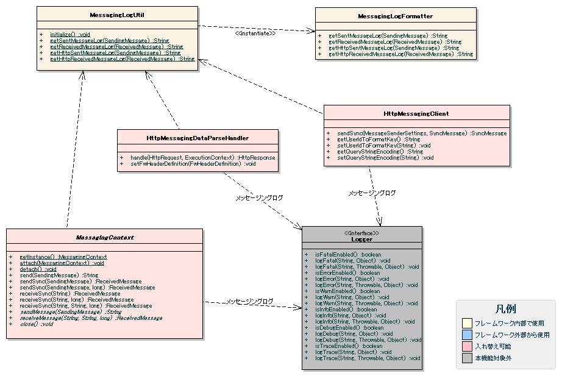
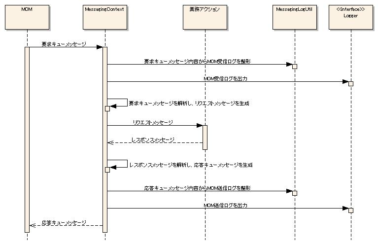
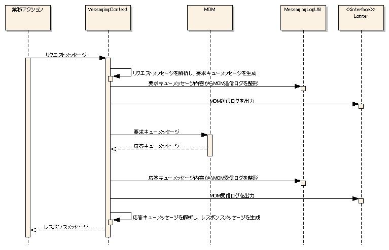
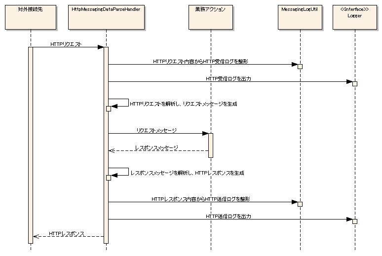

# メッセージングログの出力

## メッセージングログの出力

## 出力方針

ログレベル: INFO、ロガー名: MESSAGINGとしてアプリケーションログへ出力する。

log.propertiesの設定例:
```bash
writerNames=appFile

writer.appFile.className=nablarch.core.log.basic.FileLogWriter
writer.appFile.filePath=/var/log/app/app.log
writer.appFile.encoding=UTF-8
writer.appFile.maxFileSize=10000
writer.appFile.formatter.className=nablarch.core.log.basic.BasicLogFormatter
writer.appFile.formatter.format=<アプリケーションログ用のフォーマット>

availableLoggersNamesOrder=MESSAGING,ROO

loggers.ROO.nameRegex=.*
loggers.ROO.level=INFO
loggers.ROO.writerNames=appFile

loggers.MESSAGING.nameRegex=MESSAGING
loggers.MESSAGING.level=INFO
loggers.MESSAGING.writerNames=appFile
```

## 出力項目

| 項目名 | 説明 |
|---|---|
| 出力日時 | ログ出力時のシステム日時 |
| 起動プロセスID | アプリケーションを起動したプロセス名。実行環境の特定に使用する |
| 処理方式区分 | 処理方式の特定に使用する |
| リクエストID | 処理を一意に識別するID |
| 実行時ID | 処理の実行を一意に識別するID |
| ユーザID | ログインユーザのユーザID |
| スレッド名 | 処理を実行したスレッド名 |
| メッセージID | メッセージに設定されているメッセージID |
| 送信宛先 | メッセージに設定されている送信宛先 |
| 関連メッセージID | メッセージに設定されている関連メッセージID |
| 応答宛先 | メッセージに設定されている応答宛先 |
| 有効期間 | メッセージに設定されている有効期間 |
| メッセージヘッダ | メッセージに設定されているヘッダ |
| メッセージボディ | メッセージボディ部のダンプ。個人情報・機密情報はマスクして出力（マスク設定が必要） |
| メッセージボディのヘキサダンプ | メッセージボディ部のヘキサダンプ。マスク対象部分はマスク文字列のヘキサダンプを出力（マスク設定が必要） |
| メッセージボディのバイト長 | メッセージボディ部のバイト長 |

個別項目（スレッド名〜メッセージボディのバイト長）以外の共通項目は :ref:`Log_BasicLogFormatter` で指定する。共通項目と個別項目を組み合わせたフォーマットは :ref:`AppLog_Format` を参照。

## 出力に使用するクラス



| クラス名 | 概要 |
|---|---|
| `nablarch.fw.messaging.MessagingContext` | MOMメッセージ送受信処理で要求/応答メッセージの相互変換と送受信を行う。実際の送受信メッセージ内容をログ出力する |
| `nablarch.fw.messaging.handler.HttpMessagingRequestParsingHandler` | HTTPリクエストを解析して要求メッセージへ変換するハンドラ。受信メッセージ内容をログ出力する |
| `nablarch.fw.messaging.handler.HttpMessagingResponseBuildingHandler` | 応答メッセージをHTTPレスポンスへ変換するハンドラ。送信メッセージ内容をログ出力する |
| `nablarch.fw.messaging.realtime.http.client.HttpMessagingClient` | 要求メッセージからHTTPリクエストへの変換およびHTTPレスポンスの応答メッセージへの変換を行う。送受信メッセージ内容をログ出力する |
| `nablarch.fw.messaging.logging.MessagingLogUtil` | メッセージング処理中のログ出力内容に関連した処理を行う |
| `nablarch.fw.messaging.logging.MessagingLogFormatter` | メッセージングログの個別項目をフォーマットする |

各クラスはMessagingLogUtilを使用してメッセージングログを整形し、Loggerを使用してログ出力を行う。

処理シーケンス:
- MOM同期応答メッセージ受信: 
  - MOM応答不要メッセージ受信処理では、MOM受信ログの出力および業務アクションの呼び出しまでの処理が行われる（シーケンス図省略）
- MOM同期応答メッセージ送信: 
  - MOM応答不要メッセージ送信処理では、MOM送信ログの出力および要求キューメッセージの送信までの処理が行われる（シーケンス図省略）
- HTTPメッセージ受信: 
- HTTPメッセージ送信: 

## 設定方法

MessagingLogUtilはapp-log.propertiesを読み込みMessagingLogFormatterオブジェクトを生成して個別項目のフォーマット処理を委譲する。プロパティファイルのパス指定や実行時設定変更は :ref:`AppLog_Config` を参照。

app-log.propertiesの設定例:
```bash
messagingLogFormatter.className=nablarch.fw.messaging.logging.MessagingLogFormatter
messagingLogFormatter.maskingChar=#
messagingLogFormatter.maskingPatterns=<password>(.+?)</password>,<mobilePhoneNumber>(.+?)</mobilePhoneNumber>

messagingLogFormatter.sentMessageFormat=@@@@ SENT MESSAGE @@@@\n\tthread_name    = [$threadName$]\n\tmessage_id     = [$messageId$]\n\tdestination    = [$destination$]\n\tcorrelation_id = [$correlationId$]\n\treply_to       = [$replyTo$]\n\ttime_to_live   = [$timeToLive$]\n\tmessage_body   = [$messageBody$]
messagingLogFormatter.receivedMessageFormat=@@@@ RECEIVED MESSAGE @@@@\n\tthread_name    = [$threadName$]\n\tmessage_id     = [$messageId$]\n\tdestination    = [$destination$]\n\tcorrelation_id = [$correlationId$]\n\treply_to       = [$replyTo$]\n\tmessage_body   = [$messageBody$]
messagingLogFormatter.httpSentMessageFormat=@@@@ HTTP SENT MESSAGE @@@@\n\tthread_name    = [$threadName$]\n\tmessage_id     = [$messageId$]\n\tdestination    = [$destination$]\n\tcorrelation_id = [$correlationId$]\n\tmessage_header = [$messageHeader$]\n\tmessage_body   = [$messageBody$]
messagingLogFormatter.httpReceivedMessageFormat=@@@@ HTTP RECEIVED MESSAGE @@@@\n\tthread_name    = [$threadName$]\n\tmessage_id     = [$messageId$]\n\tdestination    = [$destination$]\n\tcorrelation_id = [$correlationId$]\n\tmessage_header = [$messageHeader$]\n\tmessage_body   = [$messageBody$]
```

| プロパティ名 | 説明 |
|---|---|
| messagingLogFormatter.className | MessagingLogFormatterのクラス名。差し替える場合に指定 |
| messagingLogFormatter.maskingPatterns | メッセージ本文のマスク対象文字列を正規表現で指定。最初のキャプチャ部分（括弧で囲まれた部分）がマスク対象。複数指定はカンマ区切り。Pattern.CASE_INSENSITIVEでコンパイルされる |
| messagingLogFormatter.maskingChar | マスクに使用する文字。デフォルトは'*' |
| messagingLogFormatter.sentMessageFormat | MOM送信メッセージのログ出力フォーマット |
| messagingLogFormatter.receivedMessageFormat | MOM受信メッセージのログ出力フォーマット |
| messagingLogFormatter.httpSentMessageFormat | HTTP送信メッセージのログ出力フォーマット |
| messagingLogFormatter.httpReceivedMessageFormat | HTTP受信メッセージのログ出力フォーマット |

## 出力例

cnoタグ内容をマスクするHTTPメッセージ受信処理の例。

app-log.propertiesの設定例:
```bash
messagingLogFormatter.maskingChar=#
messagingLogFormatter.maskingPatterns=<cno>(.*?)</cno>
messagingLogFormatter.httpSentMessageFormat=@@@@ SENT MESSAGE @@@@\n\tthread_name    = [$threadName$]\n\tmessage_id     = [$messageId$]\n\tdestination    = [$destination$]\n\tcorrelation_id = [$correlationId$]\n\tmessage_header = [$messageHeader$]\n\tmessage_length = [$messageBodyLength$]\n\tmessage_body   = [$messageBody$]\n\tmessage_bodyhex= [$messageBodyHex$]
messagingLogFormatter.httpReceivedMessageFormat=@@@@ RECEIVED MESSAGE @@@@\n\tthread_name    = [$threadName$]\n\tmessage_id     = [$messageId$]\n\tdestination    = [$destination$]\n\tcorrelation_id = [$correlationId$]\n\tmessage_header = [$messageHeader$]\n\tmessage_length = [$messageBodyLength$]\n\tmessage_body   = [$messageBody$]\n\tmessage_bodyhex= [$messageBodyHex$]
```

log.propertiesの設定例:
```bash
writerNames=appFile

writer.appFile.className=nablarch.core.log.basic.FileLogWriter
writer.appFile.filePath=./app.log
writer.appFile.encoding=UTF-8
writer.appFile.maxFileSize=10000
writer.appFile.formatter.className=nablarch.core.log.basic.BasicLogFormatter
writer.appFile.formatter.format=$date$ -$logLevel$- $loggerName$ [$executionId$] boot_proc = [$bootProcess$] proc_sys = [$processingSystem$] req_id = [$requestId$] usr_id = [$userId$] $message$$information$$stackTrace$

availableLoggersNamesOrder=MESSAGING

loggers.MESSAGING.nameRegex=MESSAGING
loggers.MESSAGING.level=INFO
loggers.MESSAGING.writerNames=appFile
```

出力例（cnoタグの内容はmaskingCharで指定した文字にマスクされ、ヘキサダンプ部分もマスク文字列のヘキサダンプが出力される）:
```
2014-06-27 11:07:51.314 -INFO- MESSAGING [null] boot_proc = [] proc_sys = [] req_id = [RM11AC0102] usr_id = [unitTest] @@@@ HTTP RECEIVED MESSAGE @@@@
    thread_name    = [main]
    message_id     = [1403834871251]
    destination    = [null]
    correlation_id = [null]
    message_header = [{x-message-id=1403834871251, MessageId=1403834871251, ReplyTo=/action/RM11AC0102}]
    message_length = [216]
    message_body   = [<?xml version="1.0" encoding="UTF-8"?><request><_nbctlhdr><userId>unitTest</userId><resendFlag>0</resendFlag></_nbctlhdr><user><id>nablarch</id><name>ナブラーク</name><cno>****************</cno></user></request>]
    message_bodyhex= [3C3F786D6C...（マスク文字列のヘキサダンプ）]
2014-06-27 11:07:51.329 -INFO- MESSAGING [null] boot_proc = [] proc_sys = [] req_id = [RM11AC0102] usr_id = [unitTest] @@@@ HTTP SENT MESSAGE @@@@
    thread_name    = [main]
    message_id     = [null]
    destination    = [/action/RM11AC0102]
    correlation_id = [1403834871251]
    message_header = [{CorrelationId=1403834871251, Destination=/action/RM11AC0102}]
    message_length = [145]
    message_body   = [<?xml version="1.0" encoding="UTF-8"?><response><_nbctlhdr><statusCode>200</statusCode></_nbctlhdr><result><msg>success</msg></result></response>]
    message_bodyhex= [3C3F786D6C...（ヘキサダンプ）]
```

<details>
<summary>keywords</summary>

MessagingLogUtil, MessagingLogFormatter, MessagingContext, HttpMessagingRequestParsingHandler, HttpMessagingResponseBuildingHandler, HttpMessagingClient, messagingLogFormatter.maskingPatterns, messagingLogFormatter.maskingChar, messagingLogFormatter.sentMessageFormat, messagingLogFormatter.receivedMessageFormat, messagingLogFormatter.httpSentMessageFormat, messagingLogFormatter.httpReceivedMessageFormat, messagingLogFormatter.className, メッセージングログ設定, メッセージボディマスク, MOMメッセージング, HTTPメッセージング, 個人情報マスク, MOM応答不要

</details>

## MOM送信メッセージのログ出力に使用するフォーマット

## プレースホルダ一覧

| 項目名 | プレースホルダ |
|---|---|
| スレッド名 | $threadName$ |
| メッセージID | $messageId$ |
| 送信宛先 | $destination$ |
| 関連メッセージID | $correlationId$ |
| 応答宛先 | $replyTo$ |
| 有効期間 | $timeToLive$ |
| メッセージボディの内容 | $messageBody$ |
| メッセージボディのヘキサダンプ | $messageBodyHex$ |
| メッセージボディのバイト長 | $messageBodyLength$ |

## デフォルトフォーマット

```bash
@@@@ SENT MESSAGE @@@@
    \n\tthread_name    = [$threadName$]
    \n\tmessage_id     = [$messageId$]
    \n\tdestination    = [$destination$]
    \n\tcorrelation_id = [$correlationId$]
    \n\treply_to       = [$replyTo$]
    \n\ttime_to_live   = [$timeToLive$]
    \n\tmessage_body   = [$messageBody$]
```

<details>
<summary>keywords</summary>

$threadName$, $messageId$, $destination$, $correlationId$, $replyTo$, $timeToLive$, $messageBody$, $messageBodyHex$, $messageBodyLength$, MOM送信メッセージフォーマット, sentMessageFormat, SENT MESSAGE

</details>

## MOM受信メッセージのログ出力に使用するフォーマット

## プレースホルダ一覧

| 項目名 | プレースホルダ |
|---|---|
| スレッド名 | $threadName$ |
| メッセージID | $messageId$ |
| 送信宛先 | $destination$ |
| 関連メッセージID | $correlationId$ |
| 応答宛先 | $replyTo$ |
| 有効期間 | $timeToLive$ |
| メッセージボディの内容 | $messageBody$ |
| メッセージボディのヘキサダンプ | $messageBodyHex$ |
| メッセージボディのバイト長 | $messageBodyLength$ |

## デフォルトフォーマット

```bash
@@@@ RECEIVED MESSAGE @@@@
    \n\tthread_name    = [$threadName$]
    \n\tmessage_id     = [$messageId$]
    \n\tdestination    = [$destination$]
    \n\tcorrelation_id = [$correlationId$]
    \n\treply_to       = [$replyTo$]
    \n\tmessage_body   = [$messageBody$]
```

<details>
<summary>keywords</summary>

$threadName$, $messageId$, $destination$, $correlationId$, $replyTo$, $timeToLive$, $messageBody$, $messageBodyHex$, $messageBodyLength$, MOM受信メッセージフォーマット, receivedMessageFormat, RECEIVED MESSAGE

</details>

## HTTP送信メッセージのログ出力に使用するフォーマット

## プレースホルダ一覧

| 項目名 | プレースホルダ |
|---|---|
| スレッド名 | $threadName$ |
| メッセージID | $messageId$ |
| 送信先 | $destination$ |
| 関連メッセージID | $correlationId$ |
| メッセージボディの内容 | $messageBody$ |
| メッセージボディのヘキサダンプ | $messageBodyHex$ |
| メッセージボディのバイト長 | $messageBodyLength$ |
| メッセージのヘッダ | $messageHeader$ |

## デフォルトフォーマット

```bash
@@@@ HTTP SENT MESSAGE @@@@
    \n\tthread_name    = [$threadName$]
    \n\tmessage_id     = [$messageId$]
    \n\tdestination    = [$destination$]
    \n\tcorrelation_id = [$correlationId$]
    \n\tmessage_header = [$messageHeader$]
    \n\tmessage_body   = [$messageBody$]
```

<details>
<summary>keywords</summary>

$threadName$, $messageId$, $destination$, $correlationId$, $messageBody$, $messageBodyHex$, $messageBodyLength$, $messageHeader$, HTTP送信メッセージフォーマット, httpSentMessageFormat, HTTP SENT MESSAGE

</details>

## HTTP受信メッセージのログ出力に使用するフォーマット

## プレースホルダ一覧

| 項目名 | プレースホルダ |
|---|---|
| スレッド名 | $threadName$ |
| メッセージID | $messageId$ |
| 送信先 | $destination$ |
| 関連メッセージID | $correlationId$ |
| メッセージボディの内容 | $messageBody$ |
| メッセージボディのヘキサダンプ | $messageBodyHex$ |
| メッセージボディのバイト長 | $messageBodyLength$ |
| メッセージのヘッダ | $messageHeader$ |

## デフォルトフォーマット

```bash
@@@@ HTTP RECEIVED MESSAGE @@@@
    \n\tthread_name    = [$threadName$]
    \n\tmessage_id     = [$messageId$]
    \n\tdestination    = [$destination$]
    \n\tcorrelation_id = [$correlationId$]
    \n\tmessage_header = [$messageHeader$]
    \n\tmessage_body   = [$messageBody$]
```

<details>
<summary>keywords</summary>

$threadName$, $messageId$, $destination$, $correlationId$, $messageBody$, $messageBodyHex$, $messageBodyLength$, $messageHeader$, HTTP受信メッセージフォーマット, httpReceivedMessageFormat, HTTP RECEIVED MESSAGE

</details>
