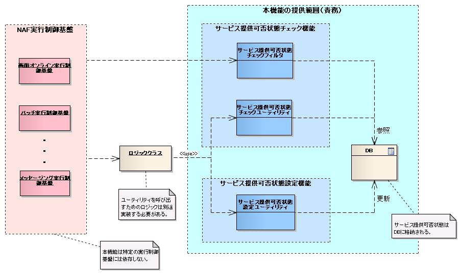
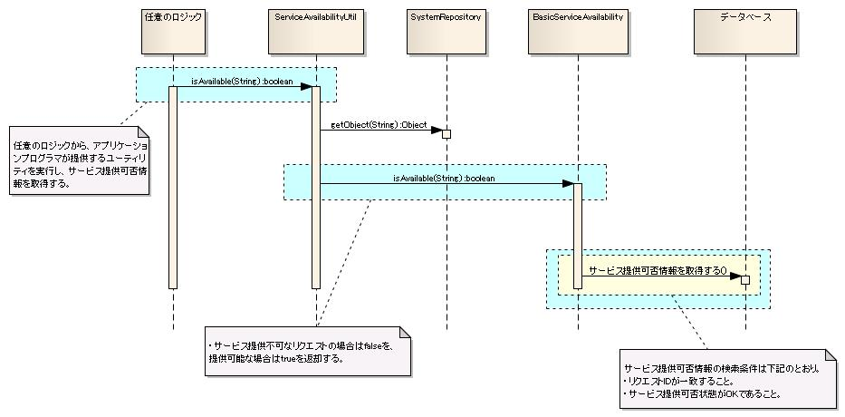

# 開閉局

## 概要

サービスの提供可否状態をチェックおよび設定（切り替え）する機能。チェックには共通ハンドラ（`ServiceAvailabilityCheckHandler`）とユーティリティ（`ServiceAvailabilityUtil`）を使用し、設定にはユーティリティを使用する。

共通ハンドラ及びユーティリティは特定の実行制御基盤に依存しないため、ハンドラ構成に組み込むだけで画面オンライン実行制御基盤でもバッチ実行制御基盤でも開閉局を実現できる。

ユーティリティは、業務アクションなどの任意のロジックからサービス提供可否状態を取得する際に使用する。

> **注意**: サービス提供可否状態の設定とはON/OFFの切り替えを指す。状態はデータベーステーブルに格納される。テーブル構造は :ref:`tableDefinition` を参照。



<details>
<summary>keywords</summary>

ServiceAvailability, 開閉局, サービス提供可否, ハンドラ, ユーティリティ, 実行制御基盤, ServiceAvailabilityCheckHandler, ServiceAvailabilityUtil

</details>

## 特徴

リクエスト、各機能（複数のリクエストの集合）、システム全体の単位でサービス提供可否状態を設定可能。

<details>
<summary>keywords</summary>

開閉局, サービス提供可否状態設定, リクエスト単位, システム全体, 機能単位

</details>

## 要求

## 実装済み

- アクション(リクエスト)単位でサービス提供可否状態をチェックできる。
- 開閉局が必要なすべての実行制御基盤でサービス提供可否状態のチェックができる。

> **注意**: サービス提供可否の切り替え方式は2種類ある。(1) フレームワーク側で指定時間に切り替える方式: フレームワークがDBの日時情報（開局時間・閉局時間・曜日）をもとに判定。機能は豊富だがアーキテクチャが複雑でテーブル構造に制約が生じ、柔軟性・カスタマイズ性が低下する。(2) 運用JOBスケジューラ側で切り替える方式: フレームワークがDBのサービス提供可否フラグをもとに判定。フレームワークのアーキテクチャがシンプルで、要件に柔軟に対応できる。本フレームワークでは(2)を採用。(1)にも対応できるインタフェースにしているため、将来(1)を追加する際もインタフェース変更は不要。

## 未実装

- アクション(リクエスト)単位でサービス提供可否状態の設定を行う機能
- 各機能（複数のリクエストの集合）単位での設定機能
- システム全体での設定機能
- 特定のイベントをトリガとした設定機能

## 未検討

- 指定時間にサービス提供可否を切り替える機能
- サービス提供可否判定結果に応じた画面項目（メニューやボタン等）の表示・非表示切り替え機能
- サービス提供不可時の個別画面遷移機能

> **注意**: 現時点での設計判断では、サービス提供不可の場合に個別画面へ遷移する要件はないと想定している。

## 取り下げ

- 各機能（複数のリクエストの集合）単位でサービス提供可否状態をチェックする機能: 柔軟性確保の観点からリクエスト単位のチェック機能のみ提供。各機能単位での一括設定機能を使用することで代替可能。

<details>
<summary>keywords</summary>

実装済み, 未実装, 開閉局要求, サービス提供可否チェック, JOBスケジューラ方式, フレームワーク方式

</details>

## 構成


## クラス・インタフェース一覧

| 種別 | クラス/インタフェース名 | 概要 |
|---|---|---|
| インタフェース | `nablarch.common.availability.ServiceAvailability` | リクエストIDをもとにサービス提供可否状態を判定。独自実装が必要な場合は本インタフェースを実装する。 |
| クラス | `nablarch.common.availability.BasicServiceAvailability` | `ServiceAvailability`の実装クラス。リクエストテーブルを参照して判定。テーブル名・カラム名は設定ファイルで変更可能。 |
| クラス | `nablarch.common.handler.ServiceAvailabilityCheckHandler` | サービス提供可否状態の判定をするハンドラ。 |
| クラス | `nablarch.common.availability.ServiceAvailabilityUtil` | サービス提供可否状態判定用ユーティリティ。アプリケーションプログラマはこのクラスを使用して容易に判定できる。 |

<details>
<summary>keywords</summary>

nablarch.common.availability.ServiceAvailability, BasicServiceAvailability, ServiceAvailabilityCheckHandler, ServiceAvailabilityUtil, クラス図, クラス定義

</details>

## インタフェース定義

**インタフェース**: `nablarch.common.availability.ServiceAvailability`

リクエストIDをもとにサービス提供可否状態を判定するインタフェース。独自のサービス提供可否状態判定の実装が必要な場合は本インタフェースを実装することで実現可能。

**クラス**: `nablarch.common.availability.BasicServiceAvailability`

リクエストIDをもとにサービス提供可否状態を判定するクラス。サービス提供可否状態の判定にはリクエストテーブルを参照する。リクエストテーブルのテーブル名・カラム名は設定ファイルにより設定可能。

<details>
<summary>keywords</summary>

ServiceAvailability, BasicServiceAvailability, インタフェース, リクエストID, サービス提供可否判定

</details>

## 全処理方式共通



<details>
<summary>keywords</summary>

ServiceAvailabilityUtil, シーケンス図, ユーティリティ使用

</details>

## 画面オンライン

- `ServiceAvailabilityCheckHandler` はリクエストIDをもとにサービス提供可否状態を判定する。
- リクエストIDは `ServiceAvailabilityCheckHandler` よりも先に処理を行うハンドラがThreadContextに設定しておく必要がある。ThreadContextへの設定は :ref:`ThreadContextHandler` が行う。
- サービス提供不可の場合、一律サービス提供不可エラー画面へ遷移する。


<details>
<summary>keywords</summary>

ServiceAvailabilityCheckHandler, ThreadContextHandler, リクエストID, ThreadContext, サービス提供不可エラー画面

</details>

## リクエスト

リクエストテーブルにはリクエストごとのサービス提供可否状態を格納する。テーブル名・カラム名は任意。データベースの型は、Javaの型に変換可能な型を選択する。


| 定義 | Javaの型 | 制約 |
|---|---|---|
| リクエストID | `java.lang.String` | PK |
| リクエスト名 | `java.lang.String` | |
| サービス提供可否状態 | `java.lang.String` | |

- 「リクエスト名」カラムは保守用途であり本機能では使用しない。
- 「サービス提供可否状態」カラムにはサービス提供可能状態を表す値を設定する。標準では値が `"1"` の場合にサービス提供可能と判定する。設定ファイルで変更可能（詳細は :ref:`basicServiceAvailabilityDetail` を参照）。

<details>
<summary>keywords</summary>

リクエストテーブル, テーブル定義, サービス提供可否状態カラム, REQUEST_ID, SERVICE_AVAILABLE

</details>

## 設定の記述

開閉局機能はリポジトリ機能を利用して設定する。

## 全処理方式共通

```xml
<!-- 開閉局機能を提供するフレームワーク基本実装 -->
<component name="serviceAvailability" class="nablarch.common.availability.BasicServiceAvailability">
    <property name="tableName" value="REQUEST"/>
    <property name="requestTableRequestIdColumnName" value="REQUEST_ID"/>
    <property name="requestTableServiceAvailableColumnName" value="SERVICE_AVAILABLE"/>
    <property name="requestTableServiceAvailableOkStatus" value="1"/>
    <property name="dbManager" ref="serviceAvailabilityDbManager"/>
</component>

<!-- DbManagerの設定 -->
<component name="dbManager" class="nablarch.core.db.transaction.SimpleDbTransactionManager">
    <property name="dbTransactionName" value="serviceAvailability" />
    <property name="transactionFactory" ref="transactionFactory" />
    <property name="connectionFactory" ref="connectionFactory" />
</component>

<!-- サービス提供可否状態を判定するハンドラ -->
<component name="serviceAvailabilityCheckHandler" class="nablarch.common.handler.ServiceAvailabilityCheckHandler">
    <property name="serviceAvailability" ref="serviceAvailability"/>
</component>
```

`BasicServiceAvailability` クラスは初期化が必要なため :ref:`repository_initialize` に記述した `Initializable` インタフェースを実装している。`serviceAvailabilityCheckHandler.serviceAvailability` が初期化されるよう以下のように設定すること。

```xml
<component name="initializer" class="nablarch.core.repository.initialization.BasicApplicationInitializer">
    <property name="initializeList">
        <list>
            <!-- 他のコンポーネントは省略 -->
            <component-ref name="serviceAvailability"/>
        </list>
    </property>
</component>
```

<details>
<summary>keywords</summary>

BasicServiceAvailability, ServiceAvailabilityCheckHandler, XML設定, dbManager, BasicApplicationInitializer, Initializable, initializeList

</details>

## 設定内容詳細

## `nablarch.common.availability.BasicServiceAvailability` の設定

| プロパティ名 | 必須 | デフォルト値 | 説明 |
|---|---|---|---|
| dbManager | ○ | | データベースへのトランザクション制御を行う `nablarch.core.db.transaction.SimpleDbTransactionManager` のインスタンス。詳細は [../01_Core/04_DbAccessSpec](libraries-04_DbAccessSpec.md) を参照。 |
| tableName | ○ | | リクエストテーブルの名前。 |
| requestTableRequestIdColumnName | ○ | | リクエストテーブルのリクエストIDカラムの名前。 |
| requestTableServiceAvailableColumnName | ○ | | リクエストテーブルのサービス提供可否状態カラムの名前。 |
| requestTableServiceAvailableOkStatus | | `"1"` | リクエストテーブルのサービス提供可否状態カラムに設定されるサービス提供可能な状態の値。省略時は `"1"` が使用される。 |

## `nablarch.common.handler.ServiceAvailabilityCheckHandler` の設定

| プロパティ名 | 必須 | デフォルト値 | 説明 |
|---|---|---|---|
| serviceAvailability | ○ | | `ServiceAvailability` インタフェースを実装したクラスを設定する。 |

<details>
<summary>keywords</summary>

BasicServiceAvailability, ServiceAvailabilityCheckHandler, tableName, requestTableRequestIdColumnName, requestTableServiceAvailableColumnName, requestTableServiceAvailableOkStatus, dbManager, serviceAvailability

</details>
