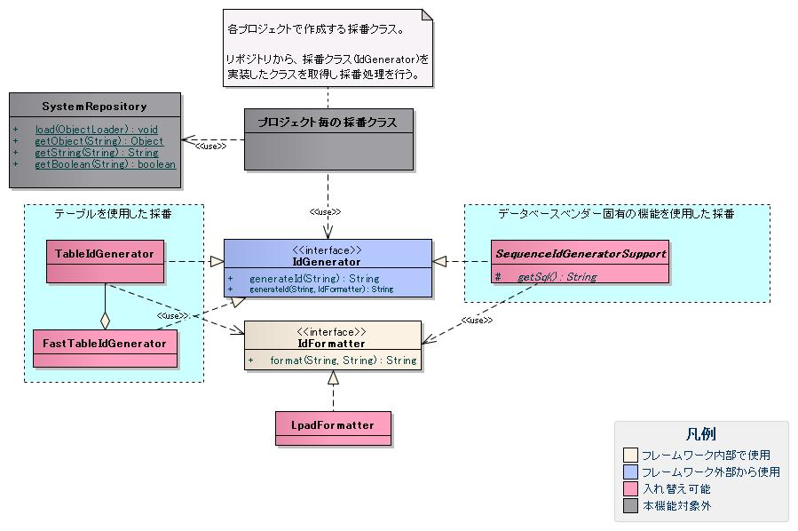
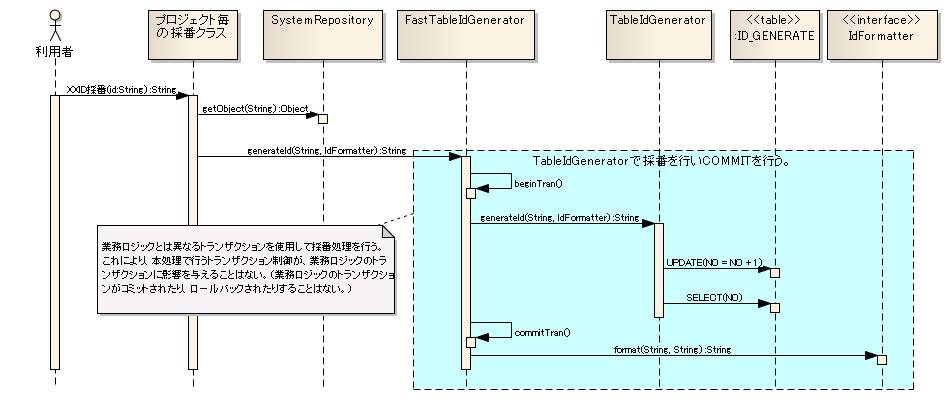

# 採番機能

## インタフェース定義

| インタフェース名 | 概要 |
|---|---|
| `nablarch.common.idgenerator.IdGenerator` | IDを採番するインタフェース。独自の採番実装が必要な場合はこのインタフェースを実装する。 |
| `nablarch.common.idgenerator.IdFormatter` | 採番したIDをフォーマットするインタフェース。独自フォーマットが必要な場合はこのインタフェースを実装する。 |

<details>
<summary>keywords</summary>

IdGenerator, IdFormatter, nablarch.common.idgenerator.IdGenerator, nablarch.common.idgenerator.IdFormatter, 採番インタフェース, フォーマットインタフェース, 独自採番実装

</details>

## クラス定義

**IdGeneratorの実装クラス**:

| クラス名 | 概要 |
|---|---|
| `nablarch.common.idgenerator.TableIdGenerator` | テーブル（採番用テーブル）を使用して抜け番を発生させずに採番。アプリケーションと同一トランザクションを使用するため、業務処理と同タイミングで採番値が確定し抜け番を防止できる。 |
| `nablarch.common.idgenerator.FastTableIdGenerator` | テーブル（採番用テーブル）を使用して高速に採番。アプリケーションとは異なるトランザクションを使用して即時コミットすることでロック待機時間を最小限に抑える。テーブル採番部分は`TableIdGenerator`に委譲し、トランザクション制御のみを実装。 |

> **警告**: `TableIdGenerator`は業務トランザクションと同一トランザクションを使用するため、採番用テーブルのロックが業務処理確定まで保持される。他の処理が同一IDを採番しようとするとロック解放待ちとなり性能劣化の原因になる。業務的に抜け番が許容されるIDには`FastTableIdGenerator`や`SequenceIdGeneratorSupport`の使用を強く推奨する。特にDB2やSQLServerではロックエスカレーション（ロック範囲がレコードからページ・テーブルへ拡大）が発生し性能劣化がより顕著となる可能性があるため注意が必要。

**IdFormatterの実装クラス**:

| クラス名 | 概要 |
|---|---|
| `nablarch.common.idgenerator.formatter.LpadFormatter` | 採番されたIDの桁数を揃えるフォーマッター。指定桁数になるまで指定文字を先頭に付加する。 |

<details>
<summary>keywords</summary>

TableIdGenerator, FastTableIdGenerator, LpadFormatter, nablarch.common.idgenerator.TableIdGenerator, nablarch.common.idgenerator.FastTableIdGenerator, nablarch.common.idgenerator.formatter.LpadFormatter, 抜け番なし採番, 高速採番, ロックエスカレーション, DB2, SQLServer, SequenceIdGeneratorSupport

</details>

## 概要

採番機能はアプリケーションで使用するID（取引明細ID等）を採番するための汎用機能。リポジトリに登録して使用し、初期化処理はリポジトリ機能が実行する。各プロジェクトのアーキテクトが作成する採番クラスから使用されることを想定しており、アプリケーションプログラマが直接使用することはない。

**特徴**:
- 採番方法を採番単位（取引IDや売上明細ID等）ごとに指定できるため、抜け番を許容するIDと許容しないIDで採番方法を切り替えることが可能
- 各データベースベンダーの採番機能（Oracleシーケンス等）への切り替えは設定ファイルの変更のみで対応可能
- 各プロジェクトで独自のフォーマットを自由に追加・拡張可能

**実装済み機能**:
- 連番（抜け番なし）採番：業務処理コミット時に採番値が確定し抜け番が発生しない
- 高速採番（抜け番あり可能性）：テーブル使用・ロック待機最小限
- フォーマット指定：採番IDの桁数揃え

**未実装機能**:
- テーブル採番のサイクリック指定
- Oracleシーケンス・DB2シーケンスを使用した採番
- HILOアルゴリズムによる高速採番（メモリ上での部分採番）
- 採番IDへの業務日付・システム日付付加
- 採番値の初期化



<details>
<summary>keywords</summary>

採番機能, 連番, 抜け番, 高速採番, フォーマット, HILOアルゴリズム, Oracleシーケンス, DB2シーケンス, 取引明細ID, 採番単位, 取引ID, 売上明細ID

</details>

## テーブルを使用した採番機能

**採番テーブルの構造**:

| カラム | 型（Oracleの場合） | 備考 |
|---|---|---|
| ID | CHAR(4) | 採番対象を識別するID（採番対象ID）を格納するカラム |
| NO | NUMBER(10) | 採番対象IDの中で採番された値の最大値を保持するカラム |

> **注意**: テーブル名やカラム名は各プロジェクトの規約に従い命名する。リポジトリ機能を使用して任意の名前を設定できる。

<details>
<summary>keywords</summary>

採番テーブル, IDカラム, NOカラム, CHAR, NUMBER, テーブル構造, 採番テーブル構造

</details>

## 抜け番を出さない採番


<details>
<summary>keywords</summary>

シーケンス図, 採番シーケンス, 抜け番なし, 連番シーケンス

</details>

## 抜け番を出す可能性のある採番



<details>
<summary>keywords</summary>

シーケンス図, 高速採番, 抜け番あり採番, FastTableIdGenerator採番フロー

</details>

## テーブルデータ例

| ID | NO | 補足説明 |
|---|---|---|
| 1101 | 0 | サンプルID用レコード |
| 1102 | 10 | サンプルID2用レコード |

<details>
<summary>keywords</summary>

採番テーブルデータ, サンプルID, サンプルデータ, テーブルデータ

</details>

## プロジェクト毎の採番クラスの実装例

アーキテクトが作成する採番クラスの実装例（アプリケーションプログラマは通常このような実装を行わない）:

```java
public class SampleGenerator {
    public static String generateSampleId() {
        // フォーマット不要の場合: tableIdGeneratorを使用
        IdGenerator generator = (IdGenerator) SystemRepository.getObject("tableIdGenerator");
        return generator.generateId("1101", null);  // 1が返却される
    }

    public static String generateSampleId2() {
        // フォーマット必要な場合: fastTableIdGeneratorを使用
        IdGenerator generator = (IdGenerator) SystemRepository.getObject("fastTableIdGenerator");
        return generator.generateId("1102", new LpadFormatter(10, '0'));  // 0000000011が返却される
    }
}
```

<details>
<summary>keywords</summary>

SampleGenerator, generateId, SystemRepository, LpadFormatter, 採番クラス実装, generateSampleId, generateSampleId2

</details>

## 設定ファイルの定義

```xml
<!-- 連番を採番するクラスの設定（抜け番を出さない採番） -->
<component name="tableIdGenerator" class="nablarch.common.idgenerator.TableIdGenerator">
    <property name="tableName" value="ID_GENERATE" />
    <property name="idColumnName" value="ID"/>
    <property name="noColumnName" value="NO"/>
</component>

<!-- 高速に採番を行うクラスの設定（抜け番を出す可能性のある採番） -->
<component name="fastTableIdGenerator" class="nablarch.common.idgenerator.FastTableIdGenerator">
    <property name="tableName" value="ID_GENERATE" />
    <property name="idColumnName" value="ID"/>
    <property name="noColumnName" value="NO"/>
    <property name="dbTransactionManager">
        <component class="nablarch.core.db.transaction.SimpleDbTransactionManager">
            <property name="dbTransactionName" value="generator"/>
        </component>
    </property>
</component>

<!-- 採番機能の初期化設定 -->
<component name="initializer" class="nablarch.core.repository.initialization.BasicApplicationInitializer">
    <property name="initializeList">
        <list>
            <component-ref name="TableIdGenerator"/>
            <component-ref name="FastTableIdGenerator"/>
        </list>
    </property>
</component>
```

**TableIdGeneratorの設定**:

| プロパティ名 | 必須 | 説明 |
|---|---|---|
| tableName | ○ | 採番テーブルのテーブル物理名 |
| idColumnName | ○ | 採番テーブルのIDカラムの物理名 |
| noColumnName | ○ | 採番テーブルのNOカラムの物理名 |
| dbTransactionName | | データベースコネクション名。ビジネスロジックで無名のDB接続を使用する場合は設定不要。 |

> **警告**: `dbTransactionName`を設定する場合（無名以外のDB接続を使用する場合）は、必ずアプリケーションで使用するデータベース接続と同一のデータベースコネクション名を設定すること。

**FastTableIdGeneratorの設定**:

| プロパティ名 | 必須 | 説明 |
|---|---|---|
| tableName | ○ | 採番テーブルのテーブル物理名 |
| idColumnName | ○ | 採番テーブルのIDカラムの物理名 |
| noColumnName | ○ | 採番テーブルのNOカラムの物理名 |
| dbTransactionManager | ○ | `nablarch.core.db.transaction.SimpleDbTransactionManager`を設定する。トランザクション制御に使用する。 |

**SimpleDbTransactionManagerの設定（FastTableIdGenerator用）**:

| プロパティ名 | 必須 | デフォルト値 | 説明 |
|---|---|---|---|
| dbTransactionName | | nablarch.common.idgenerator.FastTableIdGenerator | データベーストランザクション名。未設定時はクラス名が自動設定される。 |

> **警告**: `dbTransactionName`にはビジネスロジックで使用するトランザクション名と異なる値を設定すること。同一名を指定するとトランザクション開始時に例外が発生する。

テーブル採番を使用するクラスは初期化処理が必要なため、`BasicApplicationInitializer`の`initializeList`に`TableIdGenerator`と`FastTableIdGenerator`を登録すること。

<details>
<summary>keywords</summary>

tableName, idColumnName, noColumnName, dbTransactionManager, dbTransactionName, SimpleDbTransactionManager, BasicApplicationInitializer, initializeList, XML設定, 採番設定

</details>
