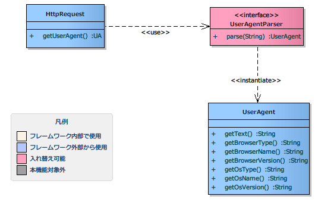

# UserAgent情報取得

## 概要

UserAgent情報取得機能はHTTPヘッダ(User-Agent)より取得した値を、
設定ファイルに記述された内容に従って解析を行う仕組みを提供する。

## 要求

### 実装済み

* HTTPヘッダ(User-Agent)を取得することができる。
* 必要に応じてUserAgentを解析するクラスを切り替えることが出来る。

> **Note:**
> 実際に、User-Agentを解析し、OSおよびブラウザの各種情報を取得する実装は、
> サンプルとして提供される。

### 未検討

* 1プロセス内で目的別に複数のパーサーを切り替える。

## 構成

### クラス図



### 各クラスの責務

#### インタフェース定義

| インタフェース名 | 概要 |
|---|---|
| nablarch.fw.web.useragent.UserAgentParser | UserAgentの解析を行うインタフェース。 本インタフェースの実装クラスを用いて、UserAgentの解析を行うことで、UserAgent内の情報を分解し、アプリケーションで利用しやすくする。 |

##### クラス定義

| クラス名 | 概要 |
|---|---|
| nablarch.fw.web.HttpRequest | HTTPプロトコルにおけるリクエストメッセージを格納するデータオブジェクト。 アプリケーションでは本クラスの `getUserAgent` メソッドよりUserAgentクラスを取得する。 |
| nablarch.fw.web.useragent.UserAgent | UserAgent解析クラスにより解析された結果を保持するクラス。 UserAgent解析クラスをカスタマイズし、任意の項目を取得したい場合、本クラスを拡張する。 |

### クラス詳細

#### nablarch.fw.web.HttpRequestクラスのメソッド

| メソッド名 | 概要 |
|---|---|
| getUserAgent() | HTTPヘッダより取得したUserAgent文字列を解析し、呼び出し元に返却する。 HTTPヘッダよりUserAgent文字列が取得できない場合は空のUserAgentオブジェクトが返却される。 本メソッドではシステムリポジトリより "userAgentParser" という名前でUserAgent解析クラスを取得し、解析を行う。 UserAgent解析クラスが取得できない場合は、全ての項目にデフォルト値が設定された空のUserAgentオブジェクトが返却される。 |

#### nablarch.fw.web.useragent.UserAgentParserインタフェースのメソッド

| メソッド名 | 概要 |
|---|---|
| parse(String userAgentText) | 引数でUserAgent文字列を受け取り、UserAgentの解析を行う。 解析した結果はUserAgentクラスまたはそのサブクラスに格納して返却する。 |

#### nablarch.fw.web.useragent.UserAgentクラスのメソッド

| メソッド名 | 概要 |
|---|---|
| getText() | 解析前のUserAgent文字列を取得する。 |
| getOsType() | OSタイプを取得する。 |
| getOsName() | OS名を取得する。 |
| getOsVersion() | OSバージョンを取得する。 |
| getBrowserType() | ブラウザタイプを取得する。 |
| getBrowserName() | ブラウザ名を取得する。 |
| getBrowserVersion() | ブラウザバージョンを取得する。 |

> **Note:**
> UserAgent解析クラスがリポジトリに登録されていない場合、またはUserAgent解析クラスで解析できなかった場合、
> UserAgentクラスには以下のデフォルト値が設定される。

> | > 項目名 | > デフォルト値 |
> |---|---|
> | > OSタイプ | > UnknownType |
> | > OS名 | > UnknownName |
> | > OSバージョン | > UnknownVersion |
> | > ブラウザタイプ | > UnknownType |
> | > ブラウザ名 | > UnknownName |
> | > ブラウザバージョン | > UnknownVersion |

### シーケンス図

本機能のシーケンス図を下記に示す。


## 設定の記述

UserAgent情報取得機能は、リポジトリ機能を利用して設定を行うことができる。

```xml
<component name="userAgentParser" class="please.change.me.fw.web.useragent.RegexUserAgentParser">
  <!-- 設定内容は省略 -->
</component>
```
