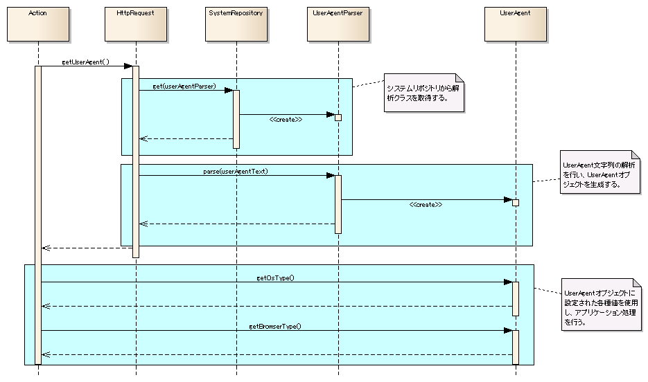

# UserAgent情報取得

## インタフェース定義

**インタフェース**: `nablarch.fw.web.useragent.UserAgentParser`
UserAgentの解析を行うインタフェース。実装クラスを用いてUserAgent内の情報を分解し、アプリケーションで利用しやすくする。

| クラス名 | 概要 |
|---|---|
| `nablarch.fw.web.HttpRequest` | HTTPリクエストメッセージを格納するデータオブジェクト。`getUserAgent()`メソッドよりUserAgentクラスを取得する。 |
| `nablarch.fw.web.useragent.UserAgent` | UserAgent解析クラスにより解析された結果を保持するクラス。カスタマイズして任意の項目を取得したい場合は本クラスを拡張する。 |

> **注意**: User-Agentを解析してOSおよびブラウザの各種情報を取得する実装は、**サンプルとして提供される**。本番環境向けの組み込み実装ではないため、利用する際はサンプルを参考に実装すること。

> **制限事項**: 1プロセス内で目的別に複数のパーサーを切り替える機能は未検討であり、現時点ではサポートされていない。

<details>
<summary>keywords</summary>

nablarch.fw.web.useragent.UserAgentParser, nablarch.fw.web.HttpRequest, nablarch.fw.web.useragent.UserAgent, getUserAgent, UserAgentParser, UserAgent解析インタフェース, クラス定義, サンプル実装, OS情報, ブラウザ情報, 制限事項

</details>

## nablarch.fw.web.HttpRequestクラスのメソッド

**クラス**: `nablarch.fw.web.HttpRequest`

| メソッド名 | 概要 |
|---|---|
| `getUserAgent()` | HTTPヘッダのUserAgent文字列を解析して返却する。UserAgent文字列が取得できない場合は空のUserAgentオブジェクトを返却する。システムリポジトリより`"userAgentParser"`という名前でUserAgent解析クラスを取得する。解析クラスが取得できない場合はデフォルト値が設定された空のUserAgentオブジェクトを返却する。 |

<details>
<summary>keywords</summary>

nablarch.fw.web.HttpRequest, getUserAgent(), userAgentParser, UserAgent取得, HTTPリクエスト

</details>

## nablarch.fw.web.useragent.UserAgentParserインタフェースのメソッド

**インタフェース**: `nablarch.fw.web.useragent.UserAgentParser`

| メソッド名 | 概要 |
|---|---|
| `parse(String userAgentText)` | UserAgent文字列を受け取り解析する。解析結果はUserAgentクラスまたはそのサブクラスに格納して返却する。 |

<details>
<summary>keywords</summary>

nablarch.fw.web.useragent.UserAgentParser, parse(String userAgentText), UserAgentParser, UserAgent解析

</details>

## nablarch.fw.web.useragent.UserAgentクラスのメソッド

**クラス**: `nablarch.fw.web.useragent.UserAgent`

| メソッド名 | 概要 |
|---|---|
| `getText()` | 解析前のUserAgent文字列を取得する。 |
| `getOsType()` | OSタイプを取得する。 |
| `getOsName()` | OS名を取得する。 |
| `getOsVersion()` | OSバージョンを取得する。 |
| `getBrowserType()` | ブラウザタイプを取得する。 |
| `getBrowserName()` | ブラウザ名を取得する。 |
| `getBrowserVersion()` | ブラウザバージョンを取得する。 |

> **注意**: UserAgent解析クラスがリポジトリに未登録または解析できなかった場合のデフォルト値: OSタイプ=`UnknownType`、OS名=`UnknownName`、OSバージョン=`UnknownVersion`、ブラウザタイプ=`UnknownType`、ブラウザ名=`UnknownName`、ブラウザバージョン=`UnknownVersion`

<details>
<summary>keywords</summary>

nablarch.fw.web.useragent.UserAgent, getText(), getOsType(), getOsName(), getOsVersion(), getBrowserType(), getBrowserName(), getBrowserVersion(), UserAgentデフォルト値, OS情報取得, ブラウザ情報取得

</details>

## シーケンス図



<details>
<summary>keywords</summary>

UserAgentシーケンス図, 処理フロー, UserAgent情報取得フロー

</details>

## 設定の記述

`userAgentParser`という名前でUserAgent解析クラスのコンポーネントを登録することで設定できる。

```xml
<component name="userAgentParser" class="please.change.me.fw.web.useragent.RegexUserAgentParser">
  <!-- 設定内容は省略 -->
</component>
```

<details>
<summary>keywords</summary>

userAgentParser, RegexUserAgentParser, コンポーネント設定, リポジトリ設定, UserAgent解析クラス設定

</details>

## クラス図


<details>
<summary>keywords</summary>

UserAgentクラス図, クラス構造, 継承関係, 依存関係, UserAgent構成図

</details>
