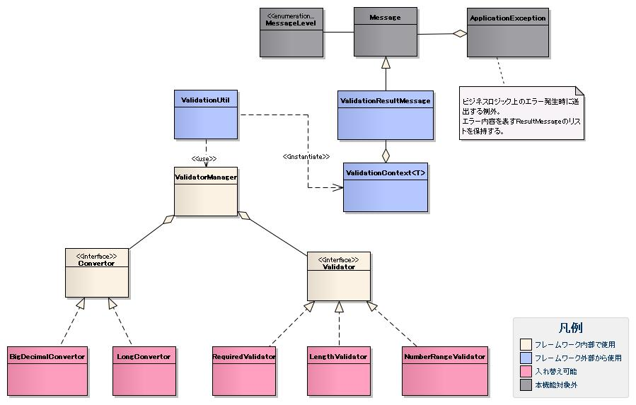

# バリデーション機能の構造

## インタフェース定義



| インタフェース名 | 概要 |
|---|---|
| `nablarch.core.validation.Convertor` | 入力値から対応するプロパティの型に変換するインタフェース。実装クラスをコンバータと呼ぶ。 |
| `nablarch.core.validation.Validator` | プロパティの値のバリデーションを行うインタフェース。実装クラスをバリデータと呼ぶ。 |
| `nablarch.core.validation.Validatable` | ValidationUtil でバリデーション可能なオブジェクトが実装するインタフェース。 |

<details>
<summary>keywords</summary>

nablarch.core.validation.Convertor, nablarch.core.validation.Validator, nablarch.core.validation.Validatable, コンバータ, バリデータ, バリデーション インタフェース, Convertor, Validator, Validatable

</details>

## クラス定義

| クラス名 | 概要 |
|---|---|
| `nablarch.core.validation.ValidationManager` | バリデーションおよび変換の処理を実行するクラス。 |
| `nablarch.core.validation.ValidationContext` | バリデーションの処理に必要な情報を保持するクラス。 |
| `nablarch.core.validation.ValidationResultMessage` | バリデーション結果のメッセージ表示に必要な情報を保持するクラス。 |
| `nablarch.core.validation.ValidationUtil` | システムリポジトリから ValidationManager を取得し呼び出しを行うユーティリティクラス。ValidationManager に処理を委譲する責務のみを持つ。 |

<details>
<summary>keywords</summary>

nablarch.core.validation.ValidationManager, nablarch.core.validation.ValidationContext, nablarch.core.validation.ValidationResultMessage, nablarch.core.validation.ValidationUtil, ValidationManager, ValidationContext, ValidationResultMessage, ValidationUtil, バリデーション クラス構成

</details>

## バリデーションの処理の流れ


バリデーションの処理は、ValidationManager が中心となってコンバータ、バリデータの呼び出しを行うことで実現している。

ValidationUtil はバリデーションの機構を容易に使用するためのユーティリティクラスであり、リポジトリから取得した ValidationManager に処理を委譲する責務のみを持つ。

コンバータおよびバリデータはそれぞれ `Convertor`、`Validator` インタフェースを実装したクラスのインスタンスであり、ValidationManager の `convertors` プロパティおよび `validators` プロパティに設定することで、ValidationManager から Form に対応付けて自動的に呼び出される。

<details>
<summary>keywords</summary>

バリデーション処理の流れ, シーケンス図, 処理フロー, ValidationManager 処理フロー, コンバータ呼び出し, バリデータ呼び出し, ValidationUtil, バリデーション シーケンス, validation_sequence

</details>

## nablarch.core.validation.ValidationManager の設定

**設定要件**: リポジトリ上で必ず `validationManager` という名称で登録する必要がある。ValidationManager は Initializable インタフェースを実装しているため、:ref:`repository_initialize` を参考に初期化設定が必要。

```xml
<component name="validationManager" class="nablarch.core.validation.ValidationManager">
    <property name="convertors">
        <list>
            <component class="nablarch.core.validation.convertor.StringConvertor">
                <property name="conversionFailedMessageId" value="MSG00001"/>
            </component>
            <component class="nablarch.core.validation.convertor.StringArrayConvertor"/>
            <component class="nablarch.core.validation.convertor.LongConvertor">
                <property name="invalidDigitsIntegerMessageId" value="MSG00031"/>
                <property name="multiInputMessageId" value="MSG00001"/>
            </component>
            <component class="nablarch.core.validation.convertor.BigDecimalConvertor">
                <property name="invalidDigitsIntegerMessageId" value="MSG00031"/>
                <property name="invalidDigitsFractionMessageId" value="MSG00032"/>
                <property name="multiInputMessageId" value="MSG00001"/>
            </component>
        </list>
    </property>
    <property name="validators">
        <list>
            <component class="nablarch.core.validation.validator.RequiredValidator">
                <property name="messageId" value="MSG00011"/>
            </component>
            <component class="nablarch.core.validation.validator.NumberRangeValidator">
                <property name="maxMessageId" value="MSG00051"/>
                <property name="maxAndMinMessageId" value="MSG00052"/>
                <property name="minMessageId" value="MSG00053"/>
            </component>
            <component class="nablarch.core.validation.validator.LengthValidator">
                <property name="maxMessageId" value="MSG00021"/>
                <property name="maxAndMinMessageId" value="MSG00022"/>
                <property name="fixLengthMessageId" value="MSG00023"/>
            </component>
        </list>
    </property>
    <property name="formDefinitionCache" ref="formDefinitionCache"/>
</component>

<component name="formDefinitionCache" class="nablarch.core.cache.BasicStaticDataCache">
    <property name="loader">
        <component class="nablarch.core.validation.FormValidationDefinitionLoader"/>
    </property>
</component>

<component name="initializer" class="nablarch.core.repository.initialization.BasicApplicationInitializer">
    <property name="initializeList">
        <list>
            <component-ref name="formDefinitionCache"/>
            <component-ref name="validationManager"/>
        </list>
    </property>
</component>
```

| プロパティ名 | 必須 | デフォルト値 | 説明 |
|---|---|---|---|
| convertors | ○ | | 使用するコンバータを List で設定。`nablarch.core.validation.Convertor` を実装したクラス。 |
| validators | ○ | | 使用するバリデータを List で設定。`nablarch.core.validation.Validator` を実装したクラス。 |
| formDefinitionCache | ○ | | FormValidationDefinition の StaticDataCache を設定。通常 `nablarch.core.cache.BasicStaticDataCache` と `nablarch.core.validation.FormValidationDefinitionLoader` を使用。 |
| invalidSizeKeyMessageId | ○ | | ValidationTarget アノテーションの sizeKey に不正な長さを指定した際のエラーメッセージID。詳細は :ref:`form_array_validation` 参照。 |
| stringResourceHolder | ○ | | `nablarch.core.message.StringResourceHolder` のインスタンス。バリデーションエラーメッセージをここから取得。通常は :ref:`__autowire` により設定ファイルへの記載を省略できる。 |
| useFormPropertyNameAsMessageId | | false | :ref:`validation_use_form_name_as_message_id` を使用するか否か。 |
| formArraySizeValueMaxLength | | 3 | Form の配列サイズ文字列の最大長。配列の添え字にこの長さを超える長さの文字列を指定したリクエストが送られた場合、ValidationManager は無条件にその項目をエラー(リクエストの改竄)と判断する。配列の最大値ではなく添え字の文字列長であることに注意。例: 999個まで許容する場合は3を設定。 |
| invalidSizeKeyMessageId | ○ | | formArraySizeValueMaxLength で設定した値を超えた配列の添え字がリクエストとして送られた際に表示するメッセージのメッセージID。 |

<details>
<summary>keywords</summary>

ValidationManager, nablarch.core.validation.ValidationManager, nablarch.core.cache.BasicStaticDataCache, nablarch.core.validation.FormValidationDefinitionLoader, convertors, validators, formDefinitionCache, invalidSizeKeyMessageId, stringResourceHolder, useFormPropertyNameAsMessageId, formArraySizeValueMaxLength, validationManager, バリデーション設定, ValidationManager 設定, StringConvertor, StringArrayConvertor, LongConvertor, BigDecimalConvertor, RequiredValidator, NumberRangeValidator, LengthValidator, BasicApplicationInitializer

</details>
