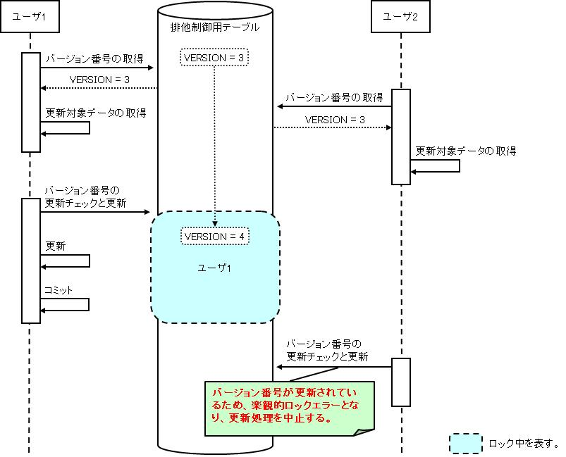
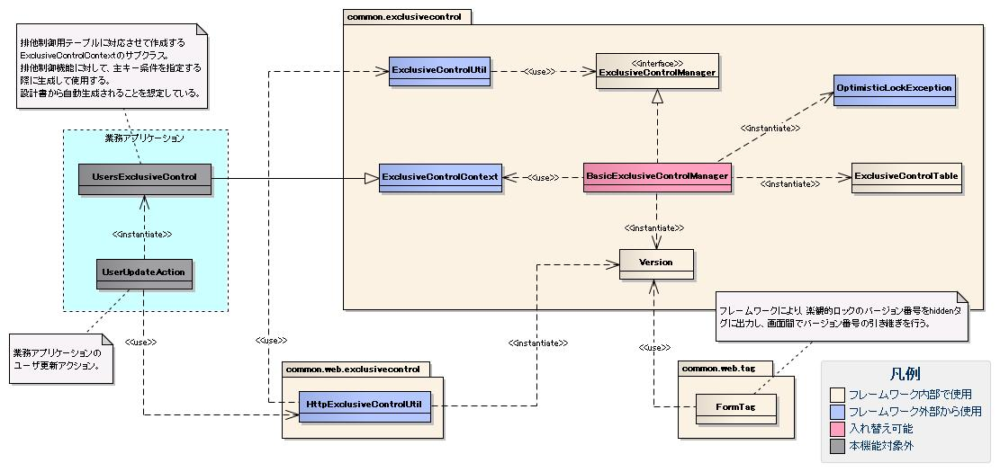
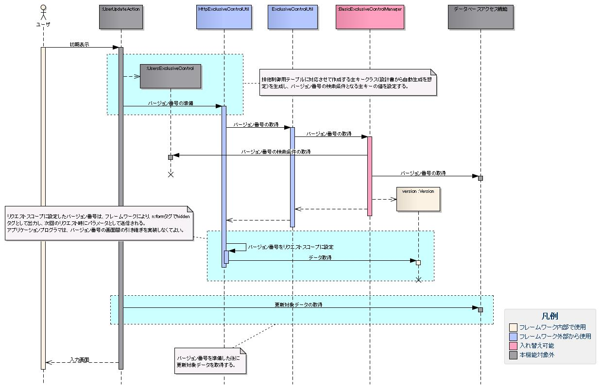
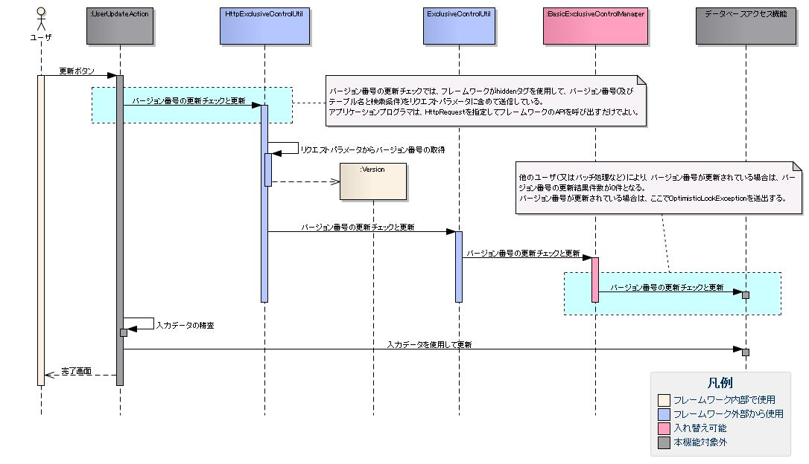

# 排他制御機能

## 概要

排他制御の手法として悲観的ロックと楽観的ロックの2種類を提供する。

| 手法 | 説明 | 採用場面 |
|---|---|---|
| 悲観的ロック | データ検索から更新まで更新対象データのロックを取得し続け、更新完了でロック解除。更新処理は確実に成功する。 | 検索から更新までにかかる時間が短い処理、またはロックを取得する時間が長くなるデメリットを差し置いても更新処理を失敗させたくない処理（検索から更新が1トランザクションのバッチ処理など） |
| 楽観的ロック | 検索時にロックを取得せず、更新時に他の処理による更新有無をチェック。更新されていた場合は更新を中止する。 | ユーザの操作待ち時間を少なくしたい画面処理 |

**クラス**: `HttpExclusiveControlUtil`

### バージョン番号の準備（prepareVersion / prepareVersions）

主キークラスを生成し、`prepareVersion(context, exclusiveControlContext)` を呼び出す。取得したバージョン番号はフレームワークによりExecutionContextに設定される。

```java
HttpExclusiveControlUtil.prepareVersion(context, new UsersExclusiveControl(user.getUserId()));
```

> **注意**: `prepareVersion` / `prepareVersions` はbooleanを返す。排他制御用テーブルに該当主キーのデータが存在しない場合（物理削除済み等）はfalseが返る。

バージョン番号が存在しない場合の処理を共通化する場合はラッパークラスを作成する。falseの場合に共通メッセージ（ApplicationException）をスローする例：

```java
public final class CommonExclusiveControlUtil {
    public static void prepareVersion(ExecutionContext context, ExclusiveControlContext exclusiveControlContext) {
        if (HttpExclusiveControlUtil.prepareVersion(context, exclusiveControlContext)) {
            return;
        }
        Message message = MessageUtil.createMessage(MessageLevel.ERROR, "M001101");
        throw new ApplicationException(message);
    }
}
```

### バージョン番号の更新チェック（checkVersions）

`checkVersions(request, context)` を呼び出す。バージョン番号はフレームワークによりHttpRequestから取得される。バージョン番号が更新されている場合は `OptimisticLockException` が送出されるため、`@OnError` で遷移先を指定する。

```java
@OnErrors({
    @OnError(type = ApplicationException.class, path = "/input.jsp"),
    @OnError(type = OptimisticLockException.class, path = "/search.jsp")
})
public HttpResponse doUU00202(HttpRequest request, ExecutionContext context) {
    HttpExclusiveControlUtil.checkVersions(request, context);
    // ...
}
```

### バージョン番号の更新チェックと更新（updateVersionsWithCheck）

`updateVersionsWithCheck(request)` を呼び出す。バージョン番号の更新チェックと更新を同時に行う。バージョン番号が更新されている場合は `OptimisticLockException` が送出される。

```java
@OnErrors({
    @OnError(type = ApplicationException.class, path = "/input.jsp"),
    @OnError(type = OptimisticLockException.class, path = "/search.jsp")
})
public HttpResponse doEXCLUS00203(HttpRequest request, ExecutionContext context) {
    HttpExclusiveControlUtil.updateVersionsWithCheck(request);
    // ...
}
```

### 一括更新処理における更新チェック（主キーが組み合わせキーではない場合）

複数レコードに対して特定のプロパティ（論理削除フラグなど）を一括更新する場合、実際の更新対象レコードのみに更新チェックを行う必要がある。`checkVersions()` および `updateVersionsWithCheck()` の引数に、更新対象レコードの主キーのリストを格納したリクエストパラメータ名を指定することで、選択されたレコードのみを対象にできる。

```html
<tr>
  <td> <checkbox name="user.deactivate" value="user001" /> </td>
  <td> ユーザ001 </td>
</tr>
<tr>
  <td> <checkbox name="user.deactivate" value="user002" /> </td>
  <td> ユーザ002 </td>
</tr>
```

```java
// 更新チェック: リクエストパラメータ "user.deactivate" に設定された主キーのみを対象とする
HttpExclusiveControlUtil.checkVersions(request, context, "user.deactivate");
```

```java
// 更新チェックと更新処理: リクエストパラメータ "user.deactivate" に設定された主キーのみを対象とする
HttpExclusiveControlUtil.updateVersionsWithCheck(request, "user.deactivate");
```

> **注意**: チェックボックスのvalue値には更新対象レコードの主キーを指定する必要がある。

### 一括更新処理における更新チェック（主キーが組み合わせキーの場合）

一括更新処理で主キーが組み合わせキーの場合は、`HttpExclusiveControlUtil.checkVersion()`（sなし）および `HttpExclusiveControlUtil.updateVersionWithCheck()`（sなし）を使用する。どちらも主キークラス（`ExclusiveControlContext`）を引数に取り、レコードごとにループで呼び出す。

例として、USER_ID・PK2・PK3からなる組み合わせキーを持つテーブルの場合：

```sql
CREATE TABLE USERS (
    USER_ID CHAR(6) NOT NULL,
    PK2     CHAR(6) NOT NULL,
    PK3     CHAR(6) NOT NULL,
    VERSION NUMBER(10) NOT NULL,
    PRIMARY KEY (USER_ID, PK2, PK3)
)
```

主キークラスの実装例：

```java
public class UsersExclusiveControl extends ExclusiveControlContext {
    private enum PK { USER_ID, PK2, PK3 }

    public UsersExclusiveControl(String userId, String pk2, String pk3) {
        setTableName("USERS");
        setVersionColumnName("VERSION");
        setPrimaryKeyColumnNames(PK.values());
        appendCondition(PK.USER_ID, userId);
        appendCondition(PK.PK2, pk2);
        appendCondition(PK.PK3, pk3);
    }
}
```

HTMLチェックボックスの例（組み合わせキーをデリミタで結合した値を設定）：

```html
<input type="checkbox" name="user.userCompositeKeys" value="user001, pk2001, pk3001" />
<input type="checkbox" name="user.userCompositeKeys" value="user002, pk2002, pk3002" />
```

> **注意**: 本フレームワークでは、組み合わせキーを扱うために `WebView_CompositeKeyCheckboxTag`・`WebView_CompositeKeyRadioButtonTag`・`nablarch.common.web.compositekey.CompositeKey` クラスを提供している。

Actionでは選択されたレコードごとにループで呼び出す：

```java
// 更新チェック
User[] deletedUsers = form.getDeletedUsers();
for (int i = 0; i < deletedUsers.length; i++) {
    User deletedUser = deletedUsers[i];
    HttpExclusiveControlUtil.checkVersion(request, context,
        new UsersExclusiveControl(deletedUser.getUserId(), deletedUser.getPk2(), deletedUser.getPk3()));
}
```

```java
// 更新チェックと更新処理
User[] deletedUsers = form.getDeletedUsers();
for (int i = 0; i < deletedUsers.length; i++) {
    User deletedUser = deletedUsers[i];
    HttpExclusiveControlUtil.updateVersionWithCheck(request,
        new ExclusiveUserCondition(deletedUser.getUserId(), deletedUser.getPk2(), deletedUser.getPk3()));
}
```

> **注意**: チェックボックスのvalue値には、更新対象レコードの主キーを区切り文字（任意、ただし主キーの値には使用できない文字）で結合した文字列を指定する。またformクラスには、リクエストパラメータから主キーを取り出す処理を実装する必要がある。

<details>
<summary>keywords</summary>

排他制御, 悲観的ロック, 楽観的ロック, バッチ処理での排他制御, 画面処理での排他制御, HttpExclusiveControlUtil, ExclusiveControlContext, ExclusiveUserCondition, OptimisticLockException, ApplicationException, @OnError, @OnErrors, prepareVersion, prepareVersions, checkVersions, updateVersionsWithCheck, checkVersion, updateVersionWithCheck, UsersExclusiveControl, CompositeKeyCheckboxTag, CompositeKeyRadioButtonTag, CompositeKey, バージョン番号準備, 楽観的ロック アクション実装, 排他制御 実装例, 一括更新 排他制御, 組み合わせキー 排他制御

</details>

## 特徴

排他制御に必要なDBアクセスや、楽観的ロックで使用するバージョン番号の画面間の引き継ぎ処理をフレームワークが行う。排他制御を使用する機能の実装はフレームワークのAPI呼び出しのみに集約される。

リポジトリに `exclusiveControlManager` というコンポーネント名で `ExclusiveControlManager` インタフェース実装クラスを登録する。

| 設定項目 | 値 | 必須 | 説明 |
|---|---|---|---|
| name (コンポーネント名) | `exclusiveControlManager` | ○ | 変更不可 |
| class | `nablarch.common.exclusivecontrol.BasicExclusiveControlManager` | ○ | カスタム実装時はExclusiveControlManagerの実装クラスを指定 |
| optimisticLockErrorMessageId | メッセージID文字列 | ○ | 楽観ロックエラーメッセージID |

```xml
<component name="exclusiveControlManager"
           class="nablarch.common.exclusivecontrol.BasicExclusiveControlManager">
    <property name="optimisticLockErrorMessageId" value="CUST0001" />
</component>
```

楽観ロック時にバージョン番号が更新されている場合、`OptimisticLockException`（`ApplicationException` を継承）が送出される。`n:errors` タグで画面にエラーメッセージを表示できる。

> **注意**: 楽観ロックエラーメッセージはアプリケーションで1つのみ指定可能。機能ごとにメッセージを変えたい場合は、ActionでOptimisticLockExceptionをキャッチして例外処理を実装する。

<details>
<summary>keywords</summary>

排他制御の実装負荷軽減, バージョン番号引き継ぎ, フレームワークによる自動管理, BasicExclusiveControlManager, ExclusiveControlManager, OptimisticLockException, optimisticLockErrorMessageId, exclusiveControlManager, n:errors, 楽観ロック設定, 排他制御 設定ファイル

</details>

## 要求

- 複数ユーザ（画面）が同一データを同時に更新することを防ぐ
- 複数バッチが同一データを同時に更新することを防ぐ
- バッチとユーザ（画面）が同一データを同時に更新することを防ぐ

<details>
<summary>keywords</summary>

排他制御の要件, 複数ユーザ同時更新防止, 複数バッチ同時更新防止

</details>

## 排他制御の実現方法

## 排他制御用テーブル

バージョン番号カラムを持つテーブル（排他制御用テーブル）を使用して排他制御を実現する。

- 悲観的ロックと楽観的ロックは同じ排他制御用テーブルを使用するため、並行して使用しても同一データの同時更新を防止できる
- 排他制御用テーブルは排他制御を行う単位ごとに定義する
- 競合が許容される最大の単位で定義することを推奨（ロック範囲が広いほど更新処理の競合可能性が高まる）
- 業務的観点で単位を定義する（売上処理と入金処理が同時更新される場合はそれらをまとめた単位で定義）
- 親子関係が明確であれば親の単位で排他制御用テーブルを定義する

> **注意**: 排他制御専用テーブルとして別テーブルに定義することも可能。この場合、排他制御対象の業務データを追加・物理削除する際は、排他制御専用テーブルにもデータの追加・物理削除が必要。`ExclusiveControlUtil`クラスがそのためのAPIを提供している。

**バージョン番号カラムを含むテーブル定義例**:

```sql
CREATE TABLE USERS (
    USER_ID CHAR(6) NOT NULL,
    VERSION NUMBER(10) NOT NULL,
    PRIMARY KEY (USER_ID)
)
```

## 排他制御用テーブルの更新順序

各テーブルのロック順序を定めることでデッドロックを防止し、更新時のデータ整合性を保証する。

> **注意**: 排他制御用テーブルに限らず個別テーブルの更新順序も決める。複数の排他制御を行う場合は実施順序も決めること（例: ユーザ排他制御→残高排他制御→XX排他制御）。一括削除など複数件を順次更新する場合は主キーのソート順を決めておくこと（コミット間隔が1件であることが保証されており、ソート処理の性能影響が大きい場合はソート不要）。

## 動作イメージ

**悲観的ロック**: 更新対象データ取得前に排他制御用テーブルのバージョン番号を更新してロックを取得する。トランザクションのコミット/ロールバックまで対象行がロックされ、他の処理はロック解除まで待機する。


**楽観的ロック**: 検索時に排他制御用テーブルのバージョン番号を取得しておき、更新時に事前取得のバージョン番号が更新されていないかチェックする。



## 悲観的ロックと楽観的ロックを並行して使用する場合の動作イメージ

悲観的ロックと楽観的ロックを並行して使用する場合（例: 楽観的ロックを使用する画面処理と悲観的ロックを使用するバッチ処理の並行稼働）の3つのシナリオを示す。

**悲観的ロック→楽観的ロックの動作イメージ**:


**楽観的ロック(バージョン番号の取得)→悲観的ロックの動作イメージ**:


**楽観的ロック(バージョン番号の更新)→悲観的ロックの動作イメージ**:


<details>
<summary>keywords</summary>

排他制御用テーブル, バージョン番号カラム, デッドロック防止, 更新順序設計, ExclusiveControlUtil, ロック範囲, 悲観的ロックと楽観的ロックの並行使用, 並行稼働シナリオ

</details>

## 構造

**クラス図**:



<details>
<summary>keywords</summary>

クラス図, ExclusiveControlManager, BasicExclusiveControlManager, HttpExclusiveControlUtil

</details>

## インタフェース定義

**インタフェース**: `nablarch.common.exclusivecontrol.ExclusiveControlManager`

排他制御（悲観的ロック・楽観的ロック）を管理するインタフェース。排他制御用テーブルを使用した排他制御機能、および排他制御用テーブルに対する行データの追加・削除機能を提供する。独自実装（SQL文変更など）が必要な場合はこのインタフェースを実装する。

<details>
<summary>keywords</summary>

ExclusiveControlManager, nablarch.common.exclusivecontrol.ExclusiveControlManager, 排他制御インタフェース

</details>

## クラス定義

| クラス名 | 概要 |
|---|---|
| `nablarch.common.exclusivecontrol.BasicExclusiveControlManager` | `ExclusiveControlManager`の基本実装クラス |
| `nablarch.common.exclusivecontrol.ExclusiveControlUtil` | 排他制御ユーティリティクラス。バッチ処理での悲観的ロック、排他制御用テーブルへのデータ追加・物理削除に使用。 |
| `nablarch.common.exclusivecontrol.ExclusiveControlContext` | 排他制御の実行に必要な情報（テーブルスキーマ情報・主キー条件）を保持するクラス |
| `nablarch.common.exclusivecontrol.OptimisticLockException` | 楽観的ロックでバージョン番号が更新されている場合に発生する例外 |
| `nablarch.common.exclusivecontrol.Version` | 排他制御用テーブルのバージョン番号を保持するクラス |
| `nablarch.common.exclusivecontrol.ExclusiveControlTable` | 排他制御用テーブルのスキーマ情報とSQL文をメモリ上にキャッシュするクラス |
| `nablarch.common.web.exclusivecontrol.HttpExclusiveControlUtil` | 画面処理における楽観的ロックのユーティリティクラス |

排他制御用テーブルに対応する**主キークラス**（例: `UsersExclusiveControl`）は`ExclusiveControlContext`を継承して作成する。設計書から自動生成することを想定している。

**主キークラスの実装例**:

```java
public class UsersExclusiveControl extends ExclusiveControlContext {
    private enum PK { USER_ID }
    public UsersExclusiveControl(String userId) {
        setTableName("USERS");
        setVersionColumnName("VERSION");
        setPrimaryKeyColumnNames(PK.values());
        appendCondition(PK.USER_ID, userId);
    }
}
```

<details>
<summary>keywords</summary>

BasicExclusiveControlManager, ExclusiveControlUtil, ExclusiveControlContext, OptimisticLockException, HttpExclusiveControlUtil, Version, ExclusiveControlTable, 主キークラス, UsersExclusiveControl

</details>

## 悲観的ロック

`ExclusiveControlUtil.updateVersion(ExclusiveControlContext)` を更新対象データの取得前に呼び出し、排他制御用テーブルの対象データをロックする。

```java
ExclusiveControlUtil.updateVersion(new UsersExclusiveControl("U00001"));
```

> **注意**: バッチ処理で複数件の更新処理を行う場合は、ロック時間を極小化するため、主キーのみを取得する前処理を設けること。本処理では前処理で取得した主キーを使用して1件ずつロック取得→データ取得→更新を行うように実装する。

<details>
<summary>keywords</summary>

ExclusiveControlUtil, updateVersion, 悲観的ロック実装, バッチ処理でのロック

</details>

## 楽観的ロック

`HttpExclusiveControlUtil`クラスの以下のメソッドを使用して実現する。

1. **バージョン番号の準備**: `HttpExclusiveControlUtil.prepareVersion()` - 排他制御用テーブルのバージョン番号を準備する
2. **バージョン番号の更新チェック**: `HttpExclusiveControlUtil.checkVersions()` - 画面間でバージョン番号を引き継ぐ
3. **バージョン番号の更新チェックと更新**: `HttpExclusiveControlUtil.updateVersions()` - バージョン番号が変更されていないかチェックし、変更されていなければバージョン番号を更新する

> **注意**: `checkVersions`を呼び出さないと画面間でバージョン番号が引き継がれない。

**シーケンス図**:

バージョン番号の準備 (`prepareVersion`):


バージョン番号の更新チェック (`checkVersions`):


バージョン番号の更新チェックと更新 (`updateVersions`):


<details>
<summary>keywords</summary>

HttpExclusiveControlUtil, prepareVersion, checkVersions, updateVersions, 楽観的ロック実装, バージョン番号引き継ぎ

</details>
