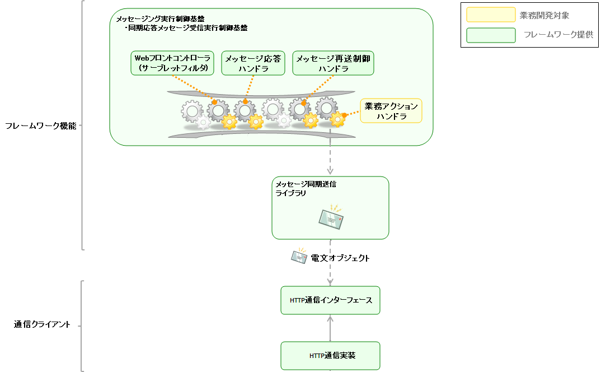
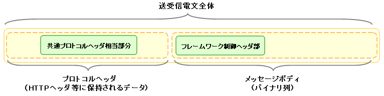
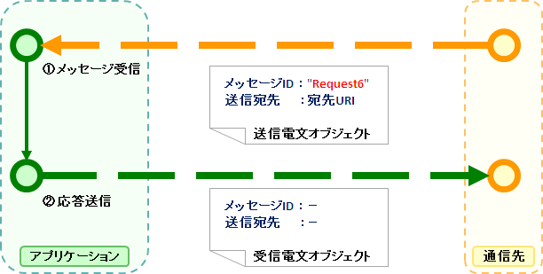
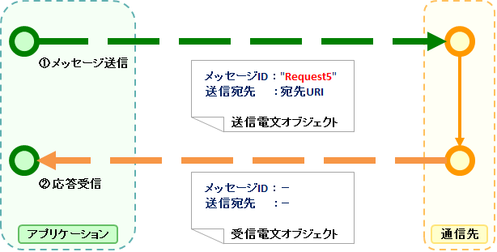

## HTTPメッセージング

### 概要

本節では、本フレームワークが提供するシステム間メッセージング機能のうち、HTTPメッセージングについて解説する。

フレームワーク利用者向けに提供されている各種機能については、 レイヤ（フレームワーク機能） を参照。

### 要求

#### 実装済み

* HTTP(S)を使用して同期通信を行うことができる。
* 以下の内容で送受信できる。

  * 任意のHTTPメソッド
  * 任意のHTTPヘッダ
  * メッセージボディにJSONまたはXML形式を利用
* HTTP接続について、以下のタイムアウトを設定できる。

  * 接続タイムアウト
  * 読み取りタイムアウト
* proxy経由で接続できる。
* 送受信時に、データを加工する実装を差し込むことができる。（例えば、特定の項目を暗号化／復号する実装を差し込むことができる）

#### 未実装

* BASIC認証、Digest認証を行うことができる。
* HTTPSの場合、プライベート認証局が発行した証明書を使って通信できる。
* 以下の内容で送受信できる。

  * パラメータをURLの一部に含めた送受信
  * パラメータをクエリストリングとした送受信
* 受信時にメッセージID/関連IDをHTTPヘッダ以外（たとえばクエリパラメータや電文本文）から取得できる。

#### 未検討

* メッセージボディをマルチパート形式にして送信する。
* FORM認証の対応
* HTTPリクエストの再送（NAF側で自動で再送は行わない。actionで再送処理を行うことは可能。）
* Keep Aliveの対応（仕向けの場合にKeep Aliveを対応することで性能向上が見込まれる。）
* 仕向け通信のレスポンスとして正常時とエラー時でフォーマットを切り替える

### 全体構成

次の図に示されるように、本機能は大きく分けると2つのレイヤによって構成されている。



#### レイヤ（フレームワーク機能）

**メッセージング基盤API** を使用して実装されたフレームワークが提供する各種機能。
これらの機能は、後述する「フレームワーク制御ヘッダ」の利用を前提として設計されている。

* [メッセージング実行制御基盤](../../processing-pattern/mom-messaging/mom-messaging-messaging.md)

  NAFの実行制御基盤の1つであり、外部から送信される要求電文に対して適切な業務アプリケーションを実行する制御基盤である。
  MOMを使用した場合と同一のインタフェースでメッセージ受信アプリケーションを実装することができる。

  以下の処理を実行するためのAPIが定義された本機能の中心となるクラス群の１つである。

  * HTTPメッセージ受信
* [同期応答メッセージ送信ユーティリティ](../../component/libraries/libraries-messaging-sender-util.md)

  対外システムに対してメッセージの同期送信を行うユーティリティクラス。
  MOMを使用した場合と同一のインタフェースでメッセージの同期送信を行うことができる。

#### レイヤ（通信クライアント）

* HTTP通信クライアント

  HTTP通信インターフェースの実装系を使用したHTTP通信の実装。
  以下の処理を実行するためのAPIが定義された本機能の中心となるクラス群の１つである。

  * HTTPメッセージ送信

-----

### データモデル

**送受信電文のデータモデル**

本機能では、送受信電文の内容を以下のようなデータモデルで表現している。



**プロトコルヘッダー**

主にWebコンテナによるメッセージ送受信処理において使用される情報を格納したヘッダー領域である。
プロトコルヘッダーはMapインターフェースでアクセスすることが可能となっている。

**共通プロトコルヘッダー**

下記のプロトコルヘッダーのうち、以下のヘッダーについては、
特定のキー名でアクセスすることができる。

| ヘッダー論理名 | キー名 | 内容 | HTTP通信実装の場合 |
|---|---|---|---|
| メッセージID | X-Message-Id | 電文ごとに一意採番される文字列。  **送信時**  送信処理の際、採番した値が設定される。  **受信時**  送信側の発番した値が設定されている。 | HTTPヘッダーの値を設定 |
| 関連メッセージID | X-Correlation-Id | 電文が関連する電文のメッセージID。 応答電文および再送要求電文で使用され、それぞれ、以下の値を 設定する。  **応答電文**  要求電文のメッセージIDを設定する。  **再送要求**  応答再送を要求する要求電文のメッセージIDを設定する。 | HTTPヘッダーの値を設定 |

**メッセージボディ**

HTTPリクエストのデータ領域をメッセージボディと呼ぶ。
フレームワーク機能は、原則としてプロトコルヘッダー領域のみを使用する。
それ以外のデータ領域については、未解析の単なるバイナリデータとして扱うものとする。

メッセージボディの解析は、 [汎用データフォーマット機能](../../component/libraries/libraries-record-format.md) によって行う。
これにより、電文の内容をフィールド名をキーとするMap形式で読み書きすることが可能である。

**フレームワーク制御ヘッダー**

本フレームワークが提供する機能の中には、電文中に特定の制御項目が定義されている
ことを前提として設計されているものが多く存在する。
そのような制御項目のことを「フレームワーク制御ヘッダ」とよぶ。

フレームワーク制御ヘッダの一覧とそれを使用するハンドラの対応は以下のとおり。

| フレームワーク制御ヘッダ | 役割 | このヘッダを使用する主要なハンドラ |
|---|---|---|
| リクエストID | この電文を受信したアプリケーションが 実行すべき業務処理を識別するためのID。 | [リクエストディスパッチハンドラ](../../component/handlers/handlers-RequestPathJavaPackageMapping.md) [リクエストハンドラエントリ](../../component/handlers/handlers-RequestHandlerEntry.md) [開閉局制御ハンドラ](../../component/handlers/handlers-ServiceAvailabilityCheckHandler.md) [認可制御ハンドラ](../../component/handlers/handlers-PermissionCheckHandler.md) [要求電文(FWヘッダ)リーダ](../../component/readers/readers-FwHeaderReader.md) ...他 |
| ユーザID | この電文の実行権限を表す文字列。 | [認可制御ハンドラ](../../component/handlers/handlers-PermissionCheckHandler.md) |
| 再送要求フラグ | 再送要求電文送信時に設定されるフラグ。 | [再送電文制御ハンドラ](../../component/handlers/handlers-MessageResendHandler.md) |
| ステータスコード | 要求電文に対する処理結果を表すコード値 応答電文に設定される。 | [電文応答制御ハンドラ](../../component/handlers/handlers-MessageReplyHandler.md) |

フレームワークヘッダーは、デフォルトの設定では、メッセージボディの最初のデータレコード中に、
それぞれ以下のフィールド名で定義されている必要がある。

| フレームワーク制御ヘッダ | フィールド名 |
|---|---|
| リクエストID | requestId |
| ユーザID | userId |
| 再送要求フラグ | resendFlag |
| ステータスコード | statusCode |

以下は、標準的なフレームワーク制御ヘッダの定義例である。

```bash
#===================================================================
# フレームワーク制御ヘッダ部 (50byte)
#===================================================================
[NablarchHeader]
1   requestId   X(10)       # リクエストID
11  userId      X(10)       # ユーザID
21  resendFlag  X(1)  "0"   # 再送要求フラグ (0: 初回送信 1: 再送要求)
22  statusCode  X(4)  "200" # ステータスコード
26 ?filler      X(25)       # 予備領域
#====================================================================
```

フォーマット定義にフレームワーク制御ヘッダ以外の項目を含めた場合、
フレームワーク制御ヘッダの任意ヘッダ項目としてアクセスすることができ、
PJ毎にフレームワーク制御ヘッダを簡易的に拡張する目的で使用することができる。

また、将来的な任意項目の追加およびフレームワークの機能追加に伴うヘッダ追加に対応するため、
予備領域を設けておくことを強く推奨する。

-----

### フレームワーク機能

ここでは、以下の2つのクラスを使用する。

* 被仕向けメッセージング基底クラス ([MessagingAction](../../javadoc/nablarch/fw/action/MessagingAction.html))

  メッセージ受信時に実行されるアクションクラスの基底クラス。業務アプリケーションは本クラスを継承する必要がある。
* 受信電文オブジェクト ([ReceivedMessage](../../javadoc/nablarch/fw/messaging/ReceivedMessage.html))

  受信した電文に関する情報を格納するクラス。

以下の説明では、本機能を使用することで実装可能な以下の処理パターンについて、
処理フローの概要とサンプルコードを示す。

**1. HTTPメッセージ受信**

通信先システムからメッセージを受信し、その応答を送信する。

以下の図は、本処理のフローを表したものである。



以下は、ここで述べた受信処理を実際に行うコードサンプルである。
受信処理はフレームワーク機能により自動的に業務アプリケーションクラスが実行される。
そのため明示的に受信処理を行うコードを記述する必要はない。

```java
public class SampleAction extends MessagingAction {
    protected ResponseMessage onReceive(RequestMessage request,
                                        ExecutionContext context) {
        // 受信データ処理
        Map<String, Object> reqData = request.getParamMap();

        // (省略)

        // 応答データ返却
        return request.reply()
                .setStatusCodeHeader("200")
                .addRecord(new HashMap() {{     // メッセージボディの内容
                     put("FIcode",     "9999");
                     put("FIname",     "ﾅﾌﾞﾗｰｸｷﾞﾝｺｳ");
                     put("officeCode", "111");
                     /*
                      * (後略)
                      */
                  }});
    }
}
```

-----

### 通信クライアント

本節では、送信処理を実行するためのAPIが定義された本機能の中心となるクラス群(通信クライアント)について解説する。

ここでは、以下の2つのクラスを使用する。

* メッセージング送信ユーティリティ ([MessageSender](../../javadoc/nablarch/fw/messaging/MessageSender.html))

  同期送信機能を実装したクラス。
* 送受信電文オブジェクト ([SyncMessage](../../javadoc/nablarch/fw/messaging/SyncMessage.html))

  送受信電文に関する情報を格納するクラス。

以下の説明では、本機能を使用することで実装可能な以下の処理パターンについて、
処理フローの概要とサンプルコードを示す。

**1. HTTPメッセージ送信**

通信先システムに対してメッセージを送信し、その応答を受信する。
応答メッセージを受信するか、待機タイムアウト時間が経過するまで待機する。

規定時間内に応答を受信できずにタイムアウトした場合は、
何らかの補償処理を行う必要がある。

以下の図は、本処理のフローを表したものである。



以下は、ここで述べた送信処理を実際に行うコードサンプルである。

```java
// 要求電文の作成
SyncMessage requestMessage = new SyncMessage("RM11AC0202")        // メッセージIDを設定
                               .addDataRecord(new HashMap() {{    // メッセージボディの内容
                                    put("FIcode",     "9999");
                                    put("FIname",     "ﾅﾌﾞﾗｰｸｷﾞﾝｺｳ");
                                    put("officeCode", "111");
                                    /*
                                     * (後略)
                                     */
                                }})
// 要求電文の送信
SyncMessage responseMessage = MessageSender.sendSync(requestMessage);
```

また、HTTPヘッダーとして独自の項目を送信したい場合は、
下記のように作成したメッセージのヘッダーレコードに設定すること。

```java
// メッセージヘッダの内容
requestMessage.getHeaderRecord().put("Accept-Charset", "UTF-8");
```

#### HTTP通信クライアント

HTTP通信プロトコル向けのHTTP通信インターフェースの実装である。
使用する場合は下記の設定をリポジトリの定義ファイルに追加すること。

**リポジトリによる初期化設定例**

```xml
<!-- HTTP通信用クライアント定義 -->
<component
  name="defaultMessageSenderClient"
  class="nablarch.fw.messaging.realtime.http.client.HttpMessagingClient">
</component>
```

messaging_sending_batch
messaging_sender_util

> **Note:**
> HttpMessagingClient.sendSync(MessageSenderSettings, SyncMessage)を用いたHTTPメッセージングにおいて、
> 通信先からHTTPステータスコードとして"302"が返却された場合、フレームワーク側ではリダイレクト処理が実施される。

> なお、フレームワーク側でのリダイレクト処理を実施を行いたくない場合は、
> 下記の例を参考にリダイレクトを許可しない設定を行う必要がある。

> コンポーネント定義

> ```xml
> <!-- プロジェクト固有のHTTP通信用クライアントを設定 -->
> <component
>   name="defaultMessageSenderClient"
>   class="please.change.me.common.CustomHttpMessagingClient">
> </component>
> ```

> プロジェクト固有のHTTP通信用クライアントのクラス

> ```java
> public class CustomHttpMessagingClient extends HttpMessagingClient {
>   protected HttpProtocolClient createHttpProtocolClient() {
>     //HTTPプロトコルの通信クライアントを差し替え
>     return new CustomHttpProtocolBasicClient();
>   }
> }
> ```

> プロジェクト固有のHTTPプロトコル通信クライアントのクラス

> ```java
> public class CustomHttpProtocolBasicClient extends HttpProtocolBasicClient {
> 
>   @Override
>   protected HttpURLConnection createHttpConnection(String targetUrl, HttpRequestMethodEnum method, Map<String, List<String>> headerInfo)
>       throws IOException {
>     HttpURLConnection httpConnection = super.createHttpConnection(targetUrl, method, headerInfo);
>     // リダイレクトを自動で許可しない設定
>     httpConnection.setInstanceFollowRedirects(false);
>     return httpConnection;
>   }
> 
> }
> ```
