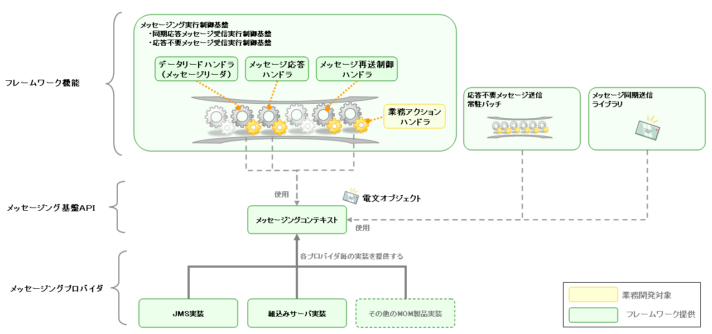
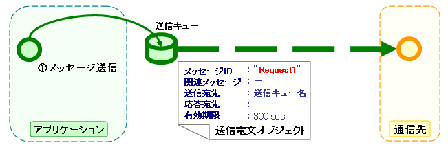

## MOMメッセージング

### 概要

本節では、本フレームワークが提供するシステム間メッセージング機能のうち、MOMメッセージングについて解説する。

フレームワーク利用者向けに提供されている各種機能については、 レイヤ（フレームワーク機能） を参照。

### 要求

#### 実装済み

* MOMを介して同期通信を行うことができる。
* MOMを介して非同期通信を行うことができる。

### 全体構成

次の図に示されるように、本機能は大きく分けると3つのレイヤによって構成されている。



#### レイヤ（フレームワーク機能）

**メッセージング基盤API** を使用して実装されたフレームワークが提供する各種機能。
これらの機能は、MOM使用時は後述する「フレームワーク制御ヘッダ」の利用を前提として設計されている。

* [メッセージング実行制御基盤](../../processing-pattern/mom-messaging/mom-messaging-messaging.md)

  NAFの実行制御基盤の1つであり、外部から送信される要求電文に対して適切な業務アプリケーションを実行する制御基盤である。
* [応答不要メッセージ送信常駐バッチ](../../component/libraries/libraries-messaging-sending-batch.md)

  特定のテーブル上の内容を定期的に監視し、各レコードの内容をもとにメッセージを作成して送信する常駐バッチ。
  応答を行わないメッセージ送信処理で用いる。
  業務側からは監視対象テーブルへの単純なINSERT文を発行するだけでメッセージを送信することができる。
* [同期応答メッセージ送信ユーティリティ](../../component/libraries/libraries-messaging-sender-util.md)

  対外システムに対してメッセージの同期送信を行うユーティリティクラス。
  フレームワーク制御ヘッダ内の再送電文フラグを利用した再送/タイムアウトの機構を使用可能である。
  なお、応答を伴わないメッセージの送信については、 [応答不要メッセージ送信常駐バッチ](../../component/libraries/libraries-messaging-sending-batch.md) を使用する。

#### レイヤ（メッセージング基盤API）

以下の4つの送受信処理を実行するためのAPIが定義された本機能の中心となるクラス群である。

* 応答不要メッセージ送信
* 同期応答メッセージ送信
* 応答不要メッセージ受信
* 同期応答メッセージ受信

#### レイヤ（メッセージングプロバイダ）

**メッセージング基盤API** の実装系を与えるモジュールである。
現時点では、以下の実装系が用意されている。

* JMS メッセージングプロバイダ

  JMSインターフェースの実装系を使用したメッセージングコンテキストの実装。
  メッセージングミドルウェアがJMS互換であれば、このクラスを経由して利用することができる。
* 組込みメッセージングプロバイダ

  JVM上の1つのサブスレッドとして動作するMOMを使用するメッセージングプロバイダ。
  自動テストで使用する。

### データモデル

**送受信電文のデータモデル**

本機能では、送受信電文の内容を以下のようなデータモデルで表現している。


**プロトコルヘッダー**

主にMOMによるメッセージ送受信処理において使用される情報を格納したヘッダー領域である。
プロトコルヘッダーはMapインターフェースでアクセスすることが可能となっている。

**共通プロトコルヘッダー**

プロトコルヘッダーのうち、メッセージングコンテキストが使用する以下のヘッダーについては、
特定のキー名でアクセスすることができる。

| ヘッダー論理名 | キー名 | 内容 | JMSメッセージングプロバイダでの実装 |
|---|---|---|---|
| メッセージID | MessageId | MOMによって電文ごとに一意採番される文字列。  **送信時**  送信処理の際、MOMが採番した値が設定される。  **受信時**  送信側のMOMが発番した値が設定されている。 | MessageID JMSヘッダーの値を設定 |
| 関連メッセージID | CorrelationId | 電文が関連する電文のメッセージID 応答電文および再送要求電文で使用され、それぞれ、以下の値を 設定する。  **応答電文**  要求電文のメッセージIDを設定する。  **再送要求**  応答再送を要求する要求電文のメッセージIDを設定する。 | CorrelationID JMSヘッダーの値を設定 |
| 送信宛先 | Destination | 電文の送信宛先を表す論理名。  **送信時**  送信キューの論理名を指定する。  **受信時**  受信キューの論理名が設定されている。 | 送信キューのDestinationオブジェクトに 紐付けられた論理名を設定 |
| 応答宛先 | ReplyTo | この電文に応答を送信する際に使用する宛先を表す論理名。  **送信時**  同期応答処理の場合は応答受信キューの論理名を設定する。 応答不要送信の場合は設定不要。  **受信時**  同期応答受信の場合は、応答宛先キューの論理名が 設定されている。 応答不要受信の場合は、通常は何も設定されていない。 | 応答受信キューのDestinationオブジェクトに 紐付けられた論理名を設定 |
| 有効期間 | TimeToLive | 送信処理開始時点を起点とする電文の有効期間(msec)  **送信時**  送信電文の有効期間を設定する。  **受信時**  何も設定されない。 | Expiration JMSヘッダー に、 (送信処理実行時点での時刻 + 有効期間) を設定 |

共通プロトコルヘッダー以外のヘッダーについては、各メッセージングプロバイダ側で任意に定義することが可能である。
このようなヘッダーは **個別プロトコルヘッダ** と呼ばれる。
例えば、JMSメッセージングプロバイダの場合、全てのJMSヘッダー、JMS拡張ヘッダーおよび任意属性は、個別プロトコルヘッダとして扱われる。

**メッセージボディ**

プロトコルヘッダーを除いた電文のデータ領域をメッセージボディと呼ぶ。
メッセージングプロバイダ、メッセージングコンテキストは、原則としてプロトコルヘッダー領域のみを使用する。
それ以外のデータ領域については、未解析の単なるバイナリデータとして扱うものとする。

メッセージボディの解析は、 [汎用データフォーマット機能](../../component/libraries/libraries-record-format.md) によって行う。
これにより、電文の内容をフィールド名をキーとするMap形式で読み書きすることが可能である。

**フレームワーク制御ヘッダー**

本フレームワークが提供する機能の中には、電文中に特定の制御項目が定義されている
ことを前提として設計されているものが多く存在する。
そのような制御項目のことを「フレームワーク制御ヘッダ」とよぶ。

フレームワーク制御ヘッダの一覧とそれを使用するハンドラの対応は以下のとおり。

| フレームワーク制御ヘッダ | 役割 | このヘッダを使用する主要なハンドラ |
|---|---|---|
| リクエストID | この電文を受信したアプリケーションが 実行すべき業務処理を識別するためのID。 | [リクエストディスパッチハンドラ](../../component/handlers/handlers-RequestPathJavaPackageMapping.md) [リクエストハンドラエントリ](../../component/handlers/handlers-RequestHandlerEntry.md) [開閉局制御ハンドラ](../../component/handlers/handlers-ServiceAvailabilityCheckHandler.md) [認可制御ハンドラ](../../component/handlers/handlers-PermissionCheckHandler.md) [要求電文(FWヘッダ)リーダ](../../component/readers/readers-FwHeaderReader.md) ...他 |
| ユーザID | この電文の実行権限を表す文字列。 | [認可制御ハンドラ](../../component/handlers/handlers-PermissionCheckHandler.md) |
| 再送要求フラグ | 再送要求電文送信時に設定されるフラグ。 | [再送電文制御ハンドラ](../../component/handlers/handlers-MessageResendHandler.md) |
| ステータスコード | 要求電文に対する処理結果を表すコード値 応答電文に設定される。 | [電文応答制御ハンドラ](../../component/handlers/handlers-MessageReplyHandler.md) |

フレームワークヘッダーは、デフォルトの設定では、メッセージボディの最初のデータレコード中に、
それぞれ以下のフィールド名で定義されている必要がある。

| フレームワーク制御ヘッダ | フィールド名 |
|---|---|
| リクエストID | requestId |
| ユーザID | userId |
| 再送要求フラグ | resendFlag |
| ステータスコード | statusCode |

以下は、標準的なフレームワーク制御ヘッダの定義例である。

```bash
#===================================================================
# フレームワーク制御ヘッダ部 (50byte)
#===================================================================
[NablarchHeader]
1   requestId   X(10)       # リクエストID
11  userId      X(10)       # ユーザID
21  resendFlag  X(1)  "0"   # 再送要求フラグ (0: 初回送信 1: 再送要求)
22  statusCode  X(4)  "200" # ステータスコード
26 ?filler      X(25)       # 予備領域
#====================================================================
```

フォーマット定義にフレームワーク制御ヘッダ以外の項目を含めた場合、
フレームワーク制御ヘッダの任意ヘッダ項目としてアクセスすることができ、
PJ毎にフレームワーク制御ヘッダを簡易的に拡張する目的で使用することができる。

また、将来的な任意項目の追加およびフレームワークの機能追加に伴うヘッダ追加に対応するため、
予備領域を設けておくことを強く推奨する。

-----

### メッセージング基盤API

本節では、送受信処理を実行するためのAPIが定義された本機能の中心となるクラス群(メッセージング基盤API)について解説する。

ここでは、以下の3つのクラスを使用する。

* メッセージングコンテキスト ([MessagingContext](../../javadoc/nablarch/fw/messaging/MessagingContext.html))

  送受信機能を実装したクラス。メッセージングプロバイダによって生成される。
* 送信電文オブジェクト ([SendingMessage](../../javadoc/nablarch/fw/messaging/SendingMessage.html))

  送信前の電文に関する情報を格納するクラス。
* 受信電文オブジェクト ([ReceivedMessage](../../javadoc/nablarch/fw/messaging/ReceivedMessage.html))

  受信した電文に関する情報を格納するクラス。

以下の説明では、本機能を使用することで実装可能な以下の4つの送受信パターンについて、
処理フローの概要とサンプルコードを示す。

**1. 応答不要メッセージ送信**

外部システムに対してメッセージを送信する。

次の 同期応答メッセージ送信 とは異なり、
送信電文が受け付けられた時点(ローカルキューへのPUTが完了した時点)でリターンするため、
対向システム側に電文が正常に送信されるかどうかは判断できない。
場合によっては、補償電文などの仕組みと組み合わせる必要がある。
以下の図は、本処理のフローを表したものである。



送信メッセージに設定するプロトコルヘッダーの内容を以下に示す。
設定する必要があるのは、基本的に送信宛先ヘッダーのみである。

| プロトコルヘッダー | 設定内容 |
|---|---|
| メッセージID | [設定不要(送信後に採番される)] |
| 関連メッセージID | [設定不要] |
| **送信宛先** | **送信先論理名を設定** |
| 応答宛先 | [設定不要] |
| 有効期間 | 任意 |

以下は、ここで述べた送信処理を実際に行うコードサンプルである。

```java
// メッセージボディ部のフォーマット定義
DataRecordFormatter formatter = createFormatter();

// メッセージングプロバイダ (初期化方法については後述)
MessagingProvider provider = createProvider();

// プロバイダからメッセージングコンテキストを生成
MessagingContext context = provider.createContext();

// 送信キューの論理名 (実体はプロバイダ側に定義する)
String sendQueueName = "QUEUE.SEND";

// メッセージを送信し、送信時に採番されたメッセージIDを取得する。
String messageId = context.sendSync(new SendingMessage()
                       .setDestination(sendQueueName)  // 送信宛先ヘッダーを設定
                       .setTimeToLive(300)             // 有効期間ヘッダーを設定
                       .setFormatter(formatter)        // メッセージボディのフォーマッター
                       .addRecord(new HashMap() {{     // メッセージボディの内容
                            put("FIcode",     "9999");
                            put("FIname",     "ﾅﾌﾞﾗｰｸｷﾞﾝｺｳ");
                            put("officeCode", "111");
                            /*
                             * (後略)
                             */
                         }})
                     );
```

**2. 同期応答メッセージ送信**

通信先システムに対してメッセージを送信し、その応答を待機する。
応答メッセージを受信するか、待機タイムアウト時間が経過するまでブロックする。

応答不要メッセージ送信 とは異なり、応答電文を受信するので、
通信先で処理が正しく行われることをある程度保証することができる。
ただし、何らかの問題により、規定時間内に応答を受信できずにタイムアウトした場合は、
何らかの補償処理を行う必要がある。

以下の図は、本処理のフローを表したものである。


送信メッセージに設定するプロトコルヘッダーの内容は以下のとおり。
送信宛先ヘッダーに加え、応答時の送信宛先となる応答宛先ヘッダーを設定しておく必要がある。

| プロトコルヘッダー | 設定内容 |
|---|---|
| メッセージID | [設定不要(送信後に採番される)] |
| 関連メッセージID | [設定不要] |
| **送信宛先** | **送信宛先の論理名を設定** |
| **応答宛先** | **応答宛先の論理名を設定** |
| 有効期間 | 任意 |

送信処理完了後、アプリケーションは、送信した電文のメッセージIDと同じ関連メッセージIDをもつ電文が
応答宛先上で受信されるまで待機する。
そのため、通信先のシステムが作成する応答電文のプロトコルヘッダーは
以下のように設定されている必要がある。

| プロトコルヘッダー | 受信内容 |
|---|---|
| メッセージID | 送信先システム側で採番された一意文字列が設定される。 |
| **関連メッセージID** | 送信電文の **メッセージIDヘッダ** の値が設定される。 |
| **送信宛先** | 送信電文の **応答宛先ヘッダ** の値が設定される。 |
| 応答宛先 | [N/A] |
| 有効期間 | 任意 |

以下は、ここで述べた送信処理を実際に行うコードサンプルである。

```java
// メッセージボディ部のフォーマット定義
DataRecordFormatter formatter = createFormatter();

// メッセージングプロバイダ (初期化方法については後述)
MessagingProvider provider = createProvider();

// プロバイダからメッセージングコンテキストを生成
MessagingContext context = provider.createContext();

// 送信キューの論理名 (実体はプロバイダ側に定義する)
String sendQueueName = "QUEUE.SEND";

// 応答受信キューの論理名 (実体はプロバイダ側に定義する)
String replyQueueName = "QUEUE.REPLY";

// 応答タイムアウト (60sec)
long timeout = 60000;

// メッセージを送信し、その応答電文を取得する。
// (タイムアウトした場合はnullが返される。)
ReceivedMessage reply = context.sendSync(new SendingMessage()
                            .setDestination(sendQueueName) // 送信宛先ヘッダーを設定
                            .setReplyTo(replyQueueName)    // 応答宛先ヘッダーを設定
                            .setTimeToLive(300)            // 有効期間ヘッダーを設定
                            .setFormatter(formatter)       // メッセージボディのフォーマッター
                            .addRecord(new HashMap() {{    // メッセージボディの内容
                                 put("FIcode",     "9999");
                                 put("FIname",     "ﾅﾌﾞﾗｰｸｷﾞﾝｺｳ");
                                 put("officeCode", "111");
                                 /*
                                  * (後略)
                                  */
                             }}), timeout
                         );
```

**3. 応答不要メッセージ受信**

特定の宛先に送信されるメッセージを受信する。
メッセージを受信するか待機タイムアウト時間が経過するまでブロックする。


| プロトコルヘッダー | 受信内容 |
|---|---|
| メッセージID | 送信先システム側で採番された一意文字列が設定される。 |
| 関連メッセージID | [N/A] |
| 送信宛先 | 宛先の論理名 |
| 応答宛先 | [N/A] |
| 有効期間 | 任意 |

以下は、ここで述べた受信処理を実際に行うコードサンプルである。

```java
// メッセージングプロバイダ (初期化方法については後述)
MessagingProvider provider = createProvider();

// プロバイダからメッセージングコンテキストを生成
MessagingContext context = provider.createContext();

// 受信キューの論理名 (実体はプロバイダ側に定義する)
String queueName = "QUEUE.RECEIVE";

// 受信タイムアウト(60sec)
long timeout = 60000;

// 受信キュー上のメッセージを1件取得する。
// (タイムアウトした場合はnullが返される。)
ReceivedMessage incomingRequest = context.receiveSync(queueName, timeout);
```

**4. 同期応答メッセージ受信**

通信先から特定の宛先に送信されるメッセージを受信し、そこに設定されていた応答宛先に対して
応答電文を送信する。

このとき、受信した電文のメッセージIDヘッダの値を、応答電文の関連メッセージIDヘッダに設定する。


| プロトコルヘッダー | 設定内容 |
|---|---|
| メッセージID | [設定不要(送信後に採番される)] |
| **関連メッセージID** | 受信電文の **メッセージIDヘッダ** の値を設定する。 |
| **送信宛先** | 受信電文の **応答宛先ヘッダ** の値を設定する。 |
| 応答宛先 | [設定不要] |
| 有効期間 | 任意 |

以下は、ここで述べた受信処理を実際に行うコードサンプルである。

```java
// メッセージボディ部のフォーマット定義
DataRecordFormatter formatter = createFormatter();

// メッセージングプロバイダ (初期化方法については後述)
MessagingProvider provider = createProvider();

// プロバイダからメッセージングコンテキストを生成
MessagingContext context = provider.createContext();

// 受信キューの論理名 (実体はプロバイダ側に定義する)
String queueName = "QUEUE.RECEIVE";

// 受信タイムアウト(60sec)
long timeout = 60000;

// 受信キュー上のメッセージを1件取得する。
// (タイムアウトした場合はnullが返される。)
ReceivedMessage incomingRequest = messaging.receiveSync(queueName, timeout);

// 受信電文の送信宛先に向けて送信される電文オブジェクトを作成する。
SendingMessage reply = incomingRequest.reply();

// 応答電文を送信
context.sendSync(reply.setFormatter(formatter)
                        .addRecord(new HashMap() {{
                             put("data1", "value1");
                             /*以下略*/
                         }})
                  );
```

-----

### メッセージングプロバイダ

メッセージング基盤API の実装系を与えるモジュールである。
ここでは、次の2つのメッセージングプロバイダについて、詳細およびリポジトリによる初期化方法について述べる。

#### JMS メッセージングプロバイダ

JMSインターフェースの実装系を使用したメッセージングコンテキストの実装である。
メッセージングミドルウェアがJMS互換であれば、このクラスを経由して利用することができる。
各JMSプロバイダが実装する `ConnectionFactory` および `Queue` オブジェクトを設定
することにより、メッセージング機能が利用可能となる。

**Poison電文の退避**

このプロバイダではPoison電文の退避処理を独自に実装している。
ただし、この機能はJMS拡張ヘッダである `JMSXDeliveryCountヘッダ` に依存しているため、同ヘッダを
サポートしない一部のMOM製品/バージョンでは利用できない。
なお、以下のMOMについては最新版における同ヘッダのサポートを確認している。

* Websphere MQ
* WebLogic MQ
* ActiveMQ

**設定項目**

以下は、このメッセージングプロバイダにおける設定項目の一覧である。

| 設定項目 | プロパティ名 | データ型 | 備考 |
|---|---|---|---|
| JMSコネクションファクトリ | connectionFactoryJndiName | String | JNDI名を設定。 (必須設定) |
| JMS宛先テーブル | destinationNamePairs | Map<String, String> | キューの論理名とJNDI名のMapを設定。 (必須設定) |
| デフォルト応答タイムアウト(msec) | defaultResponseTimeout | long | 同期送信時の応答タイムアウトのデフォルト値。 (任意設定: デフォルト値=5分) |
| デフォルト送信電文有効期間(msec) | defaultTimeToLive | long | 送信電文に設定される電文有効期間のデフォルト値。 (任意設定: デフォルト値=1分) |
| MOMによる受信リトライ上限 | redeliveryLimit | int | MOMによる受信リトライの上限回数を設定する。 受信メッセージのJMSXDeliveryCountヘッダの値がこの上限値を越えると、 メッセージを退避キューに転送した上で、実行時例外を送出する。 この値が0以下の数値であった場合は、退避処理自体が無効化される。 (任意設定: デフォルト値=0) |
| デフォルト退避キュー名 | defaultPoisonQueue | String | デフォルトで使用する受信退避キューの論理名を設定する。 (任意設定: デフォルト値="DEFAULT.POISON") |
| 退避キューの論理名パターン | poisonQueueNamePattern | String | 各受信キューに対する退避キューの論理名を決定する際に使用する パターン文字列を設定する。 (任意設定: デフォルト値="%s.POISON" [(受信キュー名).POISON]) |

以下は [リポジトリ](../02_FunctionDemandSpecifications/01_Core/02_Repository.html) による初期化設定の例である。(WebLogicMQを利用した場合の例)

```xml
<!-- メッセージングプロバイダ定義 -->
<component name="messagingProvider"
           class="nablarch.fw.messaging.provider.JndiLookingUpJmsMessagingProvider">
    <!-- 本クラス独自のプロパティ（JNDI関連）-->
    <!-- JNDIルックアップのための情報 -->
    <property name="jndiHelper">
        <component class="nablarch.core.repository.jndi.JndiHelper">
            <property name="jndiProperties">
                <map>
                    <entry key="java.naming.factory.initial" value="weblogic.jndi.WLInitialContextFactory"/>
                    <entry key="java.naming.provider.url"    value="t3://192.168.160.125:7001"/>
                </map>
            </property>
        </component>
    </property>
    <!-- javax.jms.ConnectionFactory実装クラスをルックアップするためのJNDI名 -->
    <property name="connectionFactoryJndiName" value="javax.jms.QueueConnectionFactory"/>

    <!-- FWで使用するキュー論理名と、java.jms.Queue実装クラスをルックアップするためのJNDI名のペア -->
    <property name="destinationNamePairs">
        <map>
            <!-- key=キュー論理名、value=キューJNDI名 -->
            <entry key="TEST.REQUEST"  value="TEST.REQUEST"/>
            <entry key="TEST.RESPONSE" value="TEST.RESPONSE"/>
        </map>
    </property>
    <!-- その他のプロパティは親クラス(JmsMessagingProvider)と同じ -->
</component>
```

#### 組込みメッセージングプロバイダ

開発環境でテスト用に使用することを想定したメッセージングプロバイダであり、
JVM上の1つのサブスレッドとして動作するMOMを使用する。

外部的な接続が不要で、ローカルキューを必要に応じて作成することが可能なため、
以下のように使用するキューの論理名を設定するだけで動作させることができる。

**リポジトリによる初期化設定例**

```xml
<!-- メッセージングプロバイダ定義 -->
<component
  name  = "messagingProvider"
  class = "nablarch.test.core.messaging.EmbeddedMessagingProvider">
  <!-- キュー定義 -->
  <property
    name = "queueNames">
    <list>
      <!-- サービス側にある要求受信キューの論理名 -->
      <value>TEST.REQUEST</value>         <!-- 要求受信キュー -->
      <value>TEST.REQUEST.POISON</value>  <!-- 要求電文退避キュー -->
      <value>TEST.RESPONSE</value>        <!-- 応答受信キュー -->
      <value>TEST.RESPONSE.POISON</value> <!-- 応答電文退避キュー -->
    </list>
  </property>
  <!-- 送信メッセージの有効期間 (テスト用のため消さない。)-->
  <property name="defaultTimeToLive" value="0" />
</component>
```

-----
