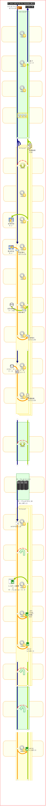

## システム間メッセージング機能

### 概要

本節では、本フレームワークが提供するシステム間メッセージング機能について解説する。

### 全体構成

システム間メッセージング機能は、実行形式により大きく2つの形態に分類される。

| 実行形式 | 内容 |
|---|---|
| [MOMメッセージング](../../component/libraries/libraries-enterprise-messaging-mom.md) | MOMを使用して外部システムとメッセージの送受信を行う形式。 以下の4つのメッセージングを行うことができる。  * 応答不要メッセージ送信 * 同期応答メッセージ送信 * 応答不要メッセージ受信 * 同期応答メッセージ受信 |
| [HTTPメッセージング](../../component/libraries/libraries-enterprise-messaging-http.md) | HTTPを使用して外部システムとメッセージの送受信を行う形式。 以下の2つのメッセージングを行うことができる。  * HTTPメッセージ送信 * HTTPメッセージ受信 |

さらに、次の表に示されるように、本機能は大きく分けると4つのレイヤによって構成されている。
各レイヤについてMOMメッセージングとHTTPメッセージングで使用有無が異なる。

| レイヤ | 内容 | MOM | HTTP |
|---|---|---|---|
| フレームワーク機能 | メッセージング基盤APIを使用して実装されたフレームワークが 提供する各種機能。 | ○ | ○ |
| メッセージング基盤API | メッセージング基盤APIはメッセージ送受信処理を実行する 本機能の中心となるクラス群である。 | ○ | × |
| メッセージングプロバイダ | メッセージング基盤APIの実装系を与えるモジュールである。 | ○ | × |
| 通信クライアント | HTTP通信インターフェースの実装系を使用したHTTP通信の実装。 | × | ○ |

基本的に各レイヤの内部的な実装が異なるだけで、業務アプリケーションが実装するアクションクラスや、
業務アプリケーションから使用されるAPIについては共通であるため、
業務アプリケーション開発者はメッセージの通信経路がMOMであることやHTTPであることを意識する必要はない。

### 機能詳細

各機能の詳細について、機能ごとに解説する。

* [MOMメッセージング](../../component/libraries/libraries-enterprise-messaging-mom.md)
* [HTTPメッセージング](../../component/libraries/libraries-enterprise-messaging-http.md)

enterprise_messaging_mom
enterprise_messaging_http
