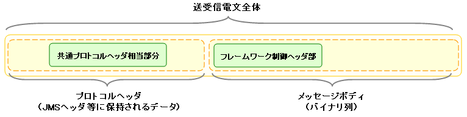

# MOMメッセージング

## 概要

MOMを使用したシステム間メッセージング機能。同期通信・非同期通信の両方をサポートする。

## 主要クラス

- **クラス**: `MessagingContext` — 送受信機能を実装したクラス。メッセージングプロバイダから生成する。
- **クラス**: `SendingMessage` — 送信前の電文情報を格納するクラス。
- **クラス**: `ReceivedMessage` — 受信した電文情報を格納するクラス。

## 送受信パターン

### 1. 応答不要メッセージ送信

ローカルキューへのPUTが完了した時点でリターンする。対向システムへの正常送信は保証されないため、補償電文の仕組みと組み合わせる必要がある場合がある。

**プロトコルヘッダー設定**:

| プロトコルヘッダー | 設定内容 |
|---|---|
| 送信宛先 | 送信先論理名を設定（必須） |
| 有効期間 | 任意 |
| メッセージID・関連メッセージID・応答宛先 | 設定不要 |

```java
DataRecordFormatter formatter = createFormatter();
MessagingContext context = provider.createContext();
String messageId = context.sendSync(new SendingMessage()
    .setDestination(sendQueueName)
    .setTimeToLive(300)
    .setFormatter(formatter)
    .addRecord(new HashMap() {{ put("FIcode", "9999"); /* ... */ }})
);
```

### 2. 同期応答メッセージ送信

送信後、応答電文受信またはタイムアウトまでブロック。タイムアウト時は `null` を返す。タイムアウト発生時は補償処理が必要。

**プロトコルヘッダー設定（送信電文）**:

| プロトコルヘッダー | 設定内容 |
|---|---|
| 送信宛先 | 送信先論理名を設定（必須） |
| 応答宛先 | 応答宛先論理名を設定（必須） |
| 有効期間 | 任意 |

**応答電文のプロトコルヘッダー（通信先が設定）**:

| プロトコルヘッダー | 受信内容 |
|---|---|
| メッセージID | 送信先システム側で採番された一意文字列 |
| 関連メッセージID | 送信電文のメッセージIDヘッダの値 |
| 送信宛先 | 送信電文の応答宛先ヘッダの値 |
| 応答宛先 | [N/A] |
| 有効期間 | 任意 |

```java
DataRecordFormatter formatter = createFormatter();
ReceivedMessage reply = context.sendSync(new SendingMessage()
    .setDestination(sendQueueName)
    .setReplyTo(replyQueueName)
    .setTimeToLive(300)
    .setFormatter(formatter)
    .addRecord(new HashMap() {{ put("FIcode", "9999"); /* ... */ }}),
    timeout
);
// タイムアウト時はnullが返される
```

### 3. 応答不要メッセージ受信

特定宛先へのメッセージを受信。受信またはタイムアウトまでブロック。タイムアウト時は `null` を返す。

**プロトコルヘッダー（受信内容）**:

| プロトコルヘッダー | 受信内容 |
|---|---|
| メッセージID | 送信先システム側で採番された一意文字列 |
| 関連メッセージID | [N/A] |
| 送信宛先 | 宛先の論理名 |
| 応答宛先 | [N/A] |
| 有効期間 | 任意 |

```java
ReceivedMessage incomingRequest = context.receiveSync(queueName, timeout);
```

### 4. 同期応答メッセージ受信

受信電文の応答宛先に向けて応答電文を送信する。受信電文のメッセージIDヘッダの値を応答電文の関連メッセージIDヘッダに設定する。

**応答電文のプロトコルヘッダー設定**:

| プロトコルヘッダー | 設定内容 |
|---|---|
| 関連メッセージID | 受信電文のメッセージIDヘッダの値（必須） |
| 送信宛先 | 受信電文の応答宛先ヘッダの値（必須） |

```java
DataRecordFormatter formatter = createFormatter();
ReceivedMessage incomingRequest = messaging.receiveSync(queueName, timeout);
SendingMessage reply = incomingRequest.reply();
context.sendSync(reply.setFormatter(formatter)
    .addRecord(new HashMap() {{ put("data1", "value1"); /* ... */ }})
);
```

<details>
<summary>keywords</summary>

MOMメッセージング, システム間メッセージング, 同期通信, 非同期通信, MOM, MessagingContext, SendingMessage, ReceivedMessage, DataRecordFormatter, sendSync, receiveSync, 応答不要メッセージ送信, 同期応答メッセージ送信, 応答不要メッセージ受信, 同期応答メッセージ受信, プロトコルヘッダー設定, メッセージング送受信パターン

</details>

## 要求

実装済み機能:

- MOMを介した同期通信
- MOMを介した非同期通信

メッセージング基盤APIの実装系を与えるモジュールである。ここでは、次の2つのメッセージングプロバイダについて、詳細およびリポジトリによる初期化方法について述べる。

- JMS メッセージングプロバイダ
- 組込みメッセージングプロバイダ

<details>
<summary>keywords</summary>

MOM同期通信, MOM非同期通信, 実装済み機能, メッセージングプロバイダ, MessagingProvider

</details>

## 全体構成

本機能は3つのレイヤで構成される。

## レイヤ（フレームワーク機能）

メッセージング基盤APIを使用して実装されたフレームワーク提供機能。MOM使用時は「フレームワーク制御ヘッダ」の利用を前提として設計されている。

- [../architectural_pattern/messaging](../../processing-pattern/mom-messaging/mom-messaging-messaging.md) — 外部からの要求電文に対して適切な業務アプリケーションを実行するNAFの実行制御基盤。
- [messaging_sending_batch](libraries-messaging_sending_batch.md) — 特定テーブルを定期的に監視し、レコード内容をもとにメッセージを作成・送信する常駐バッチ。応答不要メッセージ送信で使用。業務側は監視対象テーブルへINSERT文を発行するだけでよい。
- [messaging_sender_util](libraries-messaging_sender_util.md) — 対外システムへのメッセージ同期送信ユーティリティ。フレームワーク制御ヘッダの再送電文フラグを使った再送/タイムアウト機構が使用可能。応答不要送信には [messaging_sending_batch](libraries-messaging_sending_batch.md) を使う。

## レイヤ（メッセージング基盤API）

以下4つの送受信処理を実行するためのAPIを定義したクラス群:

1. 応答不要メッセージ送信
2. 同期応答メッセージ送信
3. 応答不要メッセージ受信
4. 同期応答メッセージ受信

## レイヤ（メッセージングプロバイダ）

メッセージング基盤APIの実装系を提供するモジュール。

- **JMSメッセージングプロバイダ** — JMSインターフェースの実装系を使用したメッセージングコンテキスト。メッセージングミドルウェアがJMS互換であれば利用可能。
- **組込みメッセージングプロバイダ** — JVM上の1つのサブスレッドとして動作するMOM。自動テストで使用する。

## JMS メッセージングプロバイダ

**クラス**: `nablarch.fw.messaging.provider.JndiLookingUpJmsMessagingProvider`

JMSインターフェースの実装系を使用。JMS互換のメッセージングミドルウェアに対応。`ConnectionFactory` および `Queue` オブジェクトを設定することで利用可能。

> **注意**: Poison電文退避は `JMSXDeliveryCount` ヘッダに依存。同ヘッダをサポートしない一部のMOM製品/バージョンでは利用不可。サポート確認済みMOM: Websphere MQ, WebLogic MQ, ActiveMQ。

**設定項目**:

| プロパティ名 | 型 | 必須 | デフォルト値 | 説明 |
|---|---|---|---|---|
| connectionFactoryJndiName | String | ○ | | JMSコネクションファクトリのJNDI名 |
| destinationNamePairs | Map<String, String> | ○ | | キューの論理名とJNDI名のMap |
| defaultResponseTimeout | long | | 5分 | 同期送信時の応答タイムアウトのデフォルト値(msec) |
| defaultTimeToLive | long | | 1分 | 送信電文有効期間のデフォルト値(msec) |
| redeliveryLimit | int | | 0 | MOMによる受信リトライ上限。上限超過時は退避キューに転送後、実行時例外を送出。0以下は退避処理無効 |
| defaultPoisonQueue | String | | "DEFAULT.POISON" | デフォルト退避キューの論理名 |
| poisonQueueNamePattern | String | | "%s.POISON" | 各受信キューの退避キュー論理名パターン |

**設定例 (WebLogicMQ)**:

```xml
<component name="messagingProvider"
           class="nablarch.fw.messaging.provider.JndiLookingUpJmsMessagingProvider">
    <property name="jndiHelper">
        <component class="nablarch.core.repository.jndi.JndiHelper">
            <property name="jndiProperties">
                <map>
                    <entry key="java.naming.factory.initial" value="weblogic.jndi.WLInitialContextFactory"/>
                    <entry key="java.naming.provider.url"    value="t3://192.168.160.125:7001"/>
                </map>
            </property>
        </component>
    </property>
    <property name="connectionFactoryJndiName" value="javax.jms.QueueConnectionFactory"/>
    <property name="destinationNamePairs">
        <map>
            <entry key="TEST.REQUEST"  value="TEST.REQUEST"/>
            <entry key="TEST.RESPONSE" value="TEST.RESPONSE"/>
        </map>
    </property>
</component>
```

## 組込みメッセージングプロバイダ

**クラス**: `nablarch.test.core.messaging.EmbeddedMessagingProvider`

開発/テスト用。JVM上のサブスレッドとして動作するMOMを使用。外部接続不要でローカルキューを動的に作成可能。

**設定例**:

```xml
<component name="messagingProvider"
           class="nablarch.test.core.messaging.EmbeddedMessagingProvider">
    <property name="queueNames">
        <list>
            <value>TEST.REQUEST</value>
            <value>TEST.REQUEST.POISON</value>
            <value>TEST.RESPONSE</value>
            <value>TEST.RESPONSE.POISON</value>
        </list>
    </property>
    <property name="defaultTimeToLive" value="0" />
</component>
```

<details>
<summary>keywords</summary>

メッセージング基盤API, メッセージングプロバイダ, JMSメッセージングプロバイダ, 組込みメッセージングプロバイダ, messaging_sending_batch, messaging_sender_util, フレームワーク機能レイヤ, 応答不要メッセージ送信, 同期応答メッセージ送信, 応答不要メッセージ受信, 同期応答メッセージ受信, フレームワーク制御ヘッダ, JndiLookingUpJmsMessagingProvider, EmbeddedMessagingProvider, JndiHelper, connectionFactoryJndiName, destinationNamePairs, defaultResponseTimeout, defaultTimeToLive, redeliveryLimit, defaultPoisonQueue, poisonQueueNamePattern, queueNames, Poison電文退避, JMSXDeliveryCount

</details>

## データモデル（概要・プロトコルヘッダー）

## 送受信電文のデータモデル



### プロトコルヘッダー

MOMによるメッセージ送受信処理で使用する情報を格納したヘッダー領域。Mapインターフェースでアクセス可能。

<details>
<summary>keywords</summary>

送受信電文, データモデル, プロトコルヘッダー, Mapインターフェース

</details>

## 共通プロトコルヘッダー

### 共通プロトコルヘッダー

メッセージングコンテキストが使用する以下のヘッダーは特定のキー名でアクセス可能。

| ヘッダー論理名 | キー名 | 内容 | JMSメッセージングプロバイダでの実装 |
|---|---|---|---|
| メッセージID | MessageId | MOMによって電文ごとに一意採番される文字列。送信時: MOMが採番した値が設定。受信時: 送信側MOMが発番した値。 | MessageID JMSヘッダーの値を設定 |
| 関連メッセージID | CorrelationId | 関連電文のメッセージID。応答電文: 要求電文のMessageIdを設定。再送要求: 応答再送を要求する要求電文のMessageIdを設定。 | CorrelationID JMSヘッダーの値を設定 |
| 送信宛先 | Destination | 電文の送信宛先論理名。送信時: 送信キューの論理名を指定。受信時: 受信キューの論理名が設定されている。 | 送信キューのDestinationオブジェクトに紐付けられた論理名を設定 |
| 応答宛先 | ReplyTo | 応答送信先の論理名。送信時（同期応答）: 応答受信キューの論理名を設定。送信時（応答不要）: 設定不要。受信時（同期応答）: 応答宛先キューの論理名が設定。受信時（応答不要）: 通常は何も設定されない。 | 応答受信キューのDestinationオブジェクトに紐付けられた論理名を設定 |
| 有効期間 | TimeToLive | 送信処理開始時点を起点とする電文の有効期間(msec)。受信時: 設定なし。 | Expiration JMSヘッダーに、(送信処理実行時点での時刻 + 有効期間)を設定 |

共通プロトコルヘッダー以外のヘッダーは **個別プロトコルヘッダ** として各メッセージングプロバイダが任意定義可能。JMSメッセージングプロバイダの場合、全JMSヘッダー・JMS拡張ヘッダー・任意属性が個別プロトコルヘッダとして扱われる。

<details>
<summary>keywords</summary>

共通プロトコルヘッダー, MessageId, CorrelationId, Destination, ReplyTo, TimeToLive, 個別プロトコルヘッダ, JMSヘッダー

</details>

## メッセージボディ

### メッセージボディ

プロトコルヘッダーを除いた電文のデータ領域。メッセージングプロバイダとメッセージングコンテキストは原則プロトコルヘッダー領域のみ使用し、それ以外は未解析のバイナリデータとして扱う。メッセージボディの解析は [record_format](libraries-record_format.md) で行い、フィールド名をキーとするMap形式で読み書き可能。

<details>
<summary>keywords</summary>

メッセージボディ, record_format, バイナリデータ, フィールド名, Map形式

</details>

## フレームワーク制御ヘッダー

### フレームワーク制御ヘッダー

本フレームワークの多くの機能は、電文中に特定の制御項目（フレームワーク制御ヘッダ）の存在を前提として設計されている。

| フレームワーク制御ヘッダ | 役割 | 主要ハンドラ |
|---|---|---|
| リクエストID | 実行すべき業務処理識別ID | [../handler/RequestPathJavaPackageMapping](../handlers/handlers-RequestPathJavaPackageMapping.md), [../handler/RequestHandlerEntry](../handlers/handlers-RequestHandlerEntry.md), [../handler/ServiceAvailabilityCheckHandler](../handlers/handlers-ServiceAvailabilityCheckHandler.md), [../handler/PermissionCheckHandler](../handlers/handlers-PermissionCheckHandler.md), [../reader/FwHeaderReader](../readers/readers-FwHeaderReader.md) 他 |
| ユーザID | 実行権限を表す文字列 | [../handler/PermissionCheckHandler](../handlers/handlers-PermissionCheckHandler.md) |
| 再送要求フラグ | 再送要求電文送信時に設定されるフラグ | [../handler/MessageResendHandler](../handlers/handlers-MessageResendHandler.md) |
| ステータスコード | 要求電文に対する処理結果コード値（応答電文に設定） | [../handler/MessageReplyHandler](../handlers/handlers-MessageReplyHandler.md) |

デフォルトのフィールド名マッピング:

| フレームワーク制御ヘッダ | フィールド名 |
|---|---|
| リクエストID | requestId |
| ユーザID | userId |
| 再送要求フラグ | resendFlag |
| ステータスコード | statusCode |

標準的なフレームワーク制御ヘッダ定義例 (50byte):

```bash
#===================================================================
# フレームワーク制御ヘッダ部 (50byte)
#===================================================================
[NablarchHeader]
1   requestId   X(10)       # リクエストID
11  userId      X(10)       # ユーザID
21  resendFlag  X(1)  "0"   # 再送要求フラグ (0: 初回送信 1: 再送要求)
22  statusCode  X(4)  "200" # ステータスコード
26 ?filler      X(25)       # 予備領域
#====================================================================
```

> **補足**: フォーマット定義にフレームワーク制御ヘッダ以外の項目を含めた場合、任意ヘッダ項目としてアクセス可能。PJ毎のフレームワーク制御ヘッダ簡易拡張に使用できる。将来的な任意項目追加・機能追加に伴うヘッダ追加に対応するため、予備領域を設けることを強く推奨する。

<details>
<summary>keywords</summary>

フレームワーク制御ヘッダー, requestId, userId, resendFlag, statusCode, NablarchHeader, リクエストID, 再送要求フラグ, ステータスコード, RequestPathJavaPackageMapping, RequestHandlerEntry, ServiceAvailabilityCheckHandler, PermissionCheckHandler, FwHeaderReader, MessageResendHandler, MessageReplyHandler

</details>
