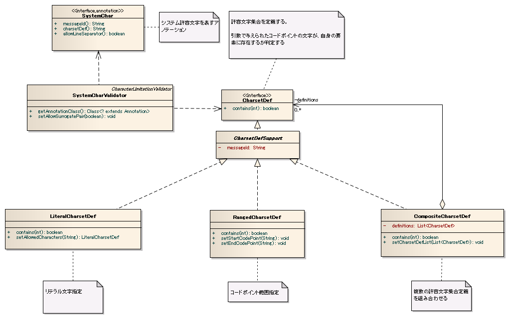

# 基本バリデータ・コンバータ

## 基本バリデータ・コンバータ一覧

**バリデータ**

| バリデータクラス名 | アノテーション | 説明 |
|---|---|---|
| `nablarch.core.validation.validator.RequiredValidator` | `@Required` | 必須入力チェック |
| `nablarch.core.validation.validator.LengthValidator` | `@Length` | String#length()による文字列長チェック |
| `nablarch.core.validation.validator.NumberRangeValidator` | `@NumberRange` | 数値型プロパティが指定数値範囲内かチェック |
| `nablarch.core.validation.validator.unicode.SystemCharValidator` | `@SystemChar` | システム許容文字からなる文字列かチェック |

> **注意**: `@Length`は長さ0の文字列を常に受け付ける。長さ0の入力チェックは`@Required`で行うこと。

**コンバータ** (パッケージ: `nablarch.core.validation.convertor`)

| コンバータクラス名 | 変換後の型 | 変換可能なオブジェクト | 説明 |
|---|---|---|---|
| `StringConvertor` | `java.lang.String` | `java.lang.String`、`java.lang.String[]`（要素数1のみ） | 前後スペースをtrimできる |
| `StringArrayConvertor` | `java.lang.String[]` | `java.lang.String[]` | String[]プロパティへの変換 |
| `BigDecimalConvertor` | `java.math.BigDecimal` | `java.lang.Numberのサブクラス`、`java.lang.String`、`java.lang.String[]`（要素数1のみ） | **@Digits必須** |
| `IntegerConvertor` | `java.lang.Integer` | `java.lang.Numberのサブクラス`、`java.lang.String`、`java.lang.String[]`（要素数1のみ） | 9桁まで変換可。9桁超はLongConvertorまたはBigDecimalConvertor使用。**@Digits必須** |
| `LongConvertor` | `java.lang.Long` | `java.lang.Numberのサブクラス`、`java.lang.String`、`java.lang.String[]`（要素数1のみ） | 18桁まで変換可。18桁超はBigDecimalConvertor使用。**@Digits必須** |

> **注意**: `BigDecimalConvertor`、`IntegerConvertor`、`LongConvertor`には`@Digits`アノテーション設定が必須。セッタに設定すること（[convert_property](libraries-08_02_validation_usage.md) 参照）。

```java
@PropertyName("認証失敗回数")
@Required
@NumberRange(min = 0, max = 9)
@Digits(integer = 1, fraction = 0)
public void setFailedCount(Integer failedCount) {
    this.failedCount = failedCount;
}
```

## nablarch.core.validation.convertor.StringConvertor

**クラス**: `nablarch.core.validation.convertor.StringConvertor`

| プロパティ名 | 必須 | 説明 |
|---|---|---|
| conversionFailedMessageId | ○ | 変換失敗時のデフォルトエラーメッセージID。例: "{0}の値が不正です。" |
| allowNullValue | | 変換対象の値にnullを許容するか否か。省略時はnull不許容。 |
| trimPolicy | | トリムポリシー。"trimAll"（全文字トリム）または"noTrim"（トリムなし）。省略時は"noTrim"と同様。 |
| extendedStringConvertors | | String型変換後に追加変換を行う`ExtendedStringConvertor`実装クラスのリスト。省略時は追加変換なし。 |

> **注意**: `allowNullValue`はデフォルトでnull不許容。バッチアプリケーションでSqlRow（Mapインタフェース実装）をバリデーションする場合はnull許容に設定する。画面処理（HTTPリクエスト）ではnullを許可してはならない。nullを許可するとKEYがクライアントから送信されていない場合に精査エラーで処理を停止できない。

> **注意**: `trimPolicy`のトリムは`String#trim()`を使用。'\u0020'以下のコード（半角スペース、タブ、改行コード等）を削除。全角スペースはトリムされないため、全角スペースのトリムが必要な場合はアクションで処理するか専用コンバータを作成すること。

`extendedStringConvertors`設定例（:ref:`ExtendedValidation_yyyymmddConvertor`使用時）:

```xml
<component class="nablarch.core.validation.convertor.StringConvertor">
  <property name="conversionFailedMessageId" value="MSG90001"/>
  <property name="extendedStringConvertors">
    <list>
      <component class="nablarch.common.date.YYYYMMDDConvertor">
        <property name="parseFailedMessageId" value="MSG90001" />
      </component>
    </list>
  </property>
</component>
```

Formクラス（追加変換を行うプロパティのセッタに対応するアノテーションを付与）:

```java
@PropertyName("日付")
@YYYYMMDD(allowFomat = "yyyy/MM/dd")
public void setDate(String date) {
    this.date = date;
}
```

<details>
<summary>keywords</summary>

RequiredValidator, LengthValidator, NumberRangeValidator, SystemCharValidator, @Required, @Length, @NumberRange, @SystemChar, @Digits, StringConvertor, StringArrayConvertor, BigDecimalConvertor, IntegerConvertor, LongConvertor, nablarch.core.validation.validator, nablarch.core.validation.convertor, バリデータ一覧, コンバータ一覧, 必須入力チェック, 文字列長チェック, 数値範囲チェック, nablarch.core.validation.convertor.StringConvertor, conversionFailedMessageId, allowNullValue, trimPolicy, extendedStringConvertors, YYYYMMDDConvertor, nablarch.common.date.YYYYMMDDConvertor, ExtendedStringConvertor, @YYYYMMDD, @PropertyName, 文字列変換, トリムポリシー, trimAll, noTrim

</details>

## システム許容文字のバリデーション - 概要・インタフェース・クラス定義

システムが許容する文字集合をUnicodeコードポイントで定義し、その和集合をシステム許容文字として`@SystemChar`アノテーションでバリデーションする。

> **注意**: サロゲートペアを許容する場合、文字列中のchar値の数と実際の文字数が合わなくなる問題が発生する。




**インタフェース**: `nablarch.core.validation.validator.unicode.CharsetDef` — 許容文字集合を定義するインタフェース

**クラス**:

| クラス名 | 概要 |
|---|---|
| `nablarch.core.validation.validator.unicode.CharsetDefSupport` | CharsetDef実装クラスのサポートクラス（messageID保持のみ） |
| `nablarch.core.validation.validator.unicode.RangedCharsetDef` | コードポイント範囲指定による許容文字集合定義 |
| `nablarch.core.validation.validator.unicode.LiteralCharsetDef` | リテラル文字列指定による許容文字集合定義 |
| `nablarch.core.validation.validator.unicode.CompositeCharsetDef` | 許容文字集合の組み合わせによる許容文字集合定義 |
| `nablarch.core.validation.validator.unicode.CachingCharsetDef` | 許容文字判定結果のキャッシュ |
| `nablarch.core.validation.validator.unicode.SystemChar` | システム許容文字であることを表すアノテーション |
| `nablarch.core.validation.validator.unicode.SystemCharValidator` | システム許容文字チェッカー |

## nablarch.core.validation.convertor.StringArrayConvertor

**クラス**: `nablarch.core.validation.convertor.StringArrayConvertor`

設定値なし。

<details>
<summary>keywords</summary>

CharsetDef, CharsetDefSupport, RangedCharsetDef, LiteralCharsetDef, CompositeCharsetDef, CachingCharsetDef, SystemChar, SystemCharValidator, @SystemChar, nablarch.core.validation.validator.unicode, システム許容文字, Unicodeコードポイント, 文字集合定義, StringArrayConvertor, nablarch.core.validation.convertor.StringArrayConvertor, 文字列配列変換

</details>

## 許容文字集合の定義方法

**コードポイント範囲指定 (RangedCharsetDef)**: Unicodeコードポイントの開始・終了位置で範囲内の文字を許容。
```xml
<component name="asciiWithoutControlCode" class="nablarch.core.validation.validator.unicode.RangedCharsetDef">
  <property name="startCodePoint" value="U+0020" />
  <property name="endCodePoint" value="U+007F" />
  <property name="messageId" value="MSG00092" />
</component>
```
> **注意**: コードポイントはUnicode標準の`U+n`表記を使用する。

**リテラル文字列指定 (LiteralCharsetDef)**: コードポイント上に散在する文字集合を文字列で簡便に定義。
```xml
<component name="literal" class="nablarch.core.validation.validator.unicode.LiteralCharsetDef">
  <property name="allowedCharacters" value="A1あ" />
  <property name="messageId" value="MSG00092" />
</component>
```
> **注意**: 許容文字リテラルはconfig-file要素で外部化を推奨（:ref:`repository_import_override_priority` 参照）。

**組み合わせ (CompositeCharsetDef)**: 複数の許容文字集合を組み合わせて定義。`charsetDefList`プロパティにリストで設定する。
```xml
<component name="composite" class="nablarch.core.validation.validator.unicode.CompositeCharsetDef">
  <property name="charsetDefList">
    <list>
      <component-ref name="asciiWithoutControlCode"/>
      <component-ref name="kana"/>
    </list>
  </property>
</component>
```
> **注意**: 判定はリストの設定順に実施される。出現頻度が高い文字集合を先頭に配置すると性能が向上する。

**判定結果のキャッシュ (CachingCharsetDef)**: 多数のCharsetDefを組み合わせる場合、特に多種の文字を許容しかつ各文字の出現頻度に偏りが少ない場合は性能が劣化しやすい。このような場合に判定結果をキャッシュすることで性能を改善できる。処理時間のバラつきを抑えたい場合にも有効。
```xml
<component name="charsetDefCache" class="nablarch.core.validation.validator.unicode.CachingCharsetDef">
  <property name="charsetDef" ref="composite"/>
</component>
```

## nablarch.core.validation.convertor.BigDecimalConvertor

**クラス**: `nablarch.core.validation.convertor.BigDecimalConvertor`

| プロパティ名 | 必須 | 説明 |
|---|---|---|
| invalidDigitsIntegerMessageId | ○ | 小数部未指定時の桁数不正エラーメッセージID。例: "{0}には{1}桁の数値を入力してください。" |
| invalidDigitsFractionMessageId | ○ | 小数部指定時の桁数不正エラーメッセージID。例: "{0}には整数部{1}桁、小数部{2}桁の数値を入力してください。" |
| multiInputMessageId | ○ | 入力値に複数文字列が設定された場合のエラーメッセージID。例: "{0}の値が不正です。" |
| allowNullValue | | 詳細は:ref:`StringConvertor#allowNullValue<permit-null-value>`参照。 |

<details>
<summary>keywords</summary>

RangedCharsetDef, LiteralCharsetDef, CompositeCharsetDef, CachingCharsetDef, startCodePoint, endCodePoint, allowedCharacters, charsetDefList, charsetDef, コードポイント範囲指定, リテラル文字列指定, 許容文字集合の組み合わせ, 許容文字キャッシュ, BigDecimalConvertor, nablarch.core.validation.convertor.BigDecimalConvertor, invalidDigitsIntegerMessageId, invalidDigitsFractionMessageId, multiInputMessageId, allowNullValue, 小数変換, 桁数不正

</details>

## SystemCharValidatorの設定と精査エラーメッセージID

**SystemCharValidatorへの登録**: 定義した許容文字集合をSystemCharValidatorの`defaultCharsetDef`プロパティに設定することで、`@SystemChar`アノテーションによるチェックが有効になる。
```xml
<component class="nablarch.core.validation.validator.unicode.SystemCharValidator">
  <property name="defaultCharsetDef" ref="systemPermittedCharset"/>
  <property name="messageId" value="MSG90001"/>
</component>
```

**精査エラー時のメッセージID指定（優先順位順）**:
1. `@SystemChar`アノテーションに指定（個別機能でメッセージを切り替えたい場合）
2. `CharsetDef`に指定（精査の種別毎にメッセージを切り替えるシステム）
3. `SystemCharValidator`に指定（システムでメッセージを統一したい場合）

> **注意**: `SystemCharValidator`のmessageIdは`@SystemChar`および`CharsetDef`にmessageIdの指定がない場合のデフォルト値であり、**必ず指定すること**。

`@SystemChar`実装例:
```java
@PropertyName("パスワード")
@Required
@SystemChar(charsetDef = "alphaCharacter", messageId = "PASSWORD")
@Length(max = 20)
public void setConfirmPassword(String confirmPassword) {
    this.confirmPassword = confirmPassword;
}
```

`CharsetDef`へのmessageId設定例:
```xml
<component name="alphaCharacter" class="nablarch.core.validation.validator.unicode.RangedCharsetDef">
  <property name="startCodePoint" value="U+0061" />
  <property name="endCodePoint" value="U+007A" />
  <property name="messageId" value="MSG00002" />
</component>
```

## nablarch.core.validation.convertor.IntegerConvertor

**クラス**: `nablarch.core.validation.convertor.IntegerConvertor`

| プロパティ名 | 必須 | 説明 |
|---|---|---|
| invalidDigitsIntegerMessageId | ○ | 桁数不正時のエラーメッセージID。例: "{0}には{1}桁の数値を入力してください。" |
| multiInputMessageId | ○ | 入力値に複数文字列が設定された場合のエラーメッセージID。例: "{0}の値が不正です。" |
| allowNullValue | | 詳細は:ref:`StringConvertor#allowNullValue<permit-null-value>`参照。 |

<details>
<summary>keywords</summary>

SystemCharValidator, defaultCharsetDef, messageId, @SystemChar, 精査エラーメッセージID, 許容文字集合の登録方法, charsetDef, alphaCharacter, IntegerConvertor, nablarch.core.validation.convertor.IntegerConvertor, invalidDigitsIntegerMessageId, multiInputMessageId, allowNullValue, 整数変換

</details>

## LongConvertor の設定値

## nablarch.core.validation.convertor.LongConvertor

**クラス**: `nablarch.core.validation.convertor.LongConvertor`

| プロパティ名 | 必須 | 説明 |
|---|---|---|
| invalidDigitsIntegerMessageId | ○ | 桁数不正時のエラーメッセージID。例: "{0}には{1}桁の数値を入力してください。" |
| multiInputMessageId | ○ | 入力値に複数文字列が設定された場合のエラーメッセージID。例: "{0}の値が不正です。" |
| allowNullValue | | 詳細は:ref:`StringConvertor#allowNullValue<permit-null-value>`参照。 |

<details>
<summary>keywords</summary>

LongConvertor, nablarch.core.validation.convertor.LongConvertor, invalidDigitsIntegerMessageId, multiInputMessageId, allowNullValue, Long変換

</details>

## RequiredValidator の設定値

## nablarch.core.validation.validator.RequiredValidator

**クラス**: `nablarch.core.validation.validator.RequiredValidator`

| プロパティ名 | 必須 | 説明 |
|---|---|---|
| messageId | ○ | デフォルトエラーメッセージID。例: "{0}は必ず入力してください。" |

<details>
<summary>keywords</summary>

RequiredValidator, nablarch.core.validation.validator.RequiredValidator, messageId, 必須バリデータ, 必須入力チェック

</details>

## LengthValidator の設定値

## nablarch.core.validation.validator.LengthValidator

**クラス**: `nablarch.core.validation.validator.LengthValidator`

| プロパティ名 | 必須 | 説明 |
|---|---|---|
| maxMessageId | ○ | 最大文字列長超過エラー時（最小未指定）のエラーメッセージID。例: "{0}は{2}文字以下で入力してください。" |
| maxAndMinMessageId | ○ | 最大文字列長超過エラー時（最小指定あり）のエラーメッセージID。例: "{0}は{1}文字以上{2}文字以下で入力してください。" |
| fixLengthMessageId | ○ | 固定桁数チェック（maxとminに同値設定）のエラーメッセージID。例: "{0}は{1}文字で入力してください。" |

<details>
<summary>keywords</summary>

LengthValidator, nablarch.core.validation.validator.LengthValidator, maxMessageId, maxAndMinMessageId, fixLengthMessageId, 文字列長バリデータ, 文字数チェック, 固定桁数

</details>

## NumberRangeValidator の設定値

## nablarch.core.validation.validator.NumberRangeValidator

**クラス**: `nablarch.core.validation.validator.NumberRangeValidator`

| プロパティ名 | 必須 | 説明 |
|---|---|---|
| maxMessageId | ○ | 最大値のみ指定時のエラーメッセージID。例: "{0}は{2}以下で入力してください。" |
| maxAndMinMessageId | ○ | 最大値・最小値両方指定時のエラーメッセージID。例: "{0}は{1}以上{2}以下で入力してください。" |
| minMessageId | ○ | 最小値のみ指定時のエラーメッセージID。例: "{0}は{1}以上で入力してください。" |

<details>
<summary>keywords</summary>

NumberRangeValidator, nablarch.core.validation.validator.NumberRangeValidator, maxMessageId, maxAndMinMessageId, minMessageId, 数値範囲バリデータ, 数値範囲チェック

</details>

## SystemCharValidator の設定値

## nablarch.core.validation.validator.unicode.SystemCharValidator

**クラス**: `nablarch.core.validation.validator.unicode.SystemCharValidator`

| プロパティ名 | 必須 | 説明 |
|---|---|---|
| messageId | ○ | 有効文字以外の入力エラーメッセージID。例: "{0}に許容されない文字が含まれてています。" |
| defaultCharsetDef | ○ | 許容文字集合定義の名称が未指定時に使用するデフォルトの許容文字集合定義。 |

<details>
<summary>keywords</summary>

SystemCharValidator, nablarch.core.validation.validator.unicode.SystemCharValidator, messageId, defaultCharsetDef, 許容文字集合, システム許容文字バリデータ, 文字種チェック

</details>
