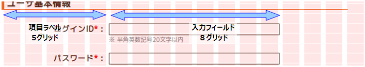

# CSSフレームワーク

**公式ドキュメント**: [CSSフレームワーク](http://fortawesome.github.io/Font-Awesome/icons/)

## 概要

CSSフレームワークはUI標準に定義されたレイアウト・デザインを実装するスタイルシート群。

<details>
<summary>keywords</summary>

CSSフレームワーク, UI標準, スタイルシート, レイアウト, デザイン

</details>

## 表示モード切替え

3つのCSSファイルをCSS Media Queryで動的に切り替えることで、UI標準「2.1 端末の画面サイズと表示モード」を実現する。

- `wide.css`: ワイド表示用（min-width: 980px）
- `compact.css`: コンパクト表示用（min-width: 640px〜max-width: 979px）
- `narrow.css`: ナロー表示用（max-width: 639px）

> **注意**: IE8以下はCSS Media Queryをサポートしないため、IEコンディショナルコメントを使用し常にワイドモードで表示する。

<details>
<summary>keywords</summary>

表示モード, CSS Media Query, wide.css, compact.css, narrow.css, IE8, ワイド, コンパクト, ナロー, IEコンディショナルコメント

</details>

## ファイル構成

CSSファイルはすべてLESSファイル形式で記述する。

- LESSからCSSへのコンパイルおよびファイル結合は [executing_ui_build](ui-framework-initial_setup.md) で行う（詳細: [ui_genless](ui-framework-plugin_build.md)）。
- コンパイル済みCSSは `/css/built/` 配下に配置され、各画面から外部参照される。
- `<link>` タグは `/WEB-INF/tags/device/media.tag`（`/include/html_head.jsp` から利用）に定義されている。

`/WEB-INF/tags/device/media.tag` の定義:

```jsp
<%@tag pageEncoding="UTF-8" description="表示モードによってスタイルを読み込むウィジェット" %>
<%@taglib prefix="n" uri="http://tis.co.jp/nablarch" %>
<%@taglib prefix="c" uri="http://java.sun.com/jsp/jstl/core" %>

<!--[if lte IE 8]>
<n:link rel="stylesheet" type="text/css" href="/css/built/wide-minify.css" />
<![endif]-->

<!--[if gte IE 9]>
<n:link rel="stylesheet" type="text/css" href="/css/built/wide-minify.css"    media="screen and (min-width: 980px)" />
<n:link rel="stylesheet" type="text/css" href="/css/built/compact-minify.css" media="screen and (min-width: 640px) and (max-width: 979px)" />
<n:link rel="stylesheet" type="text/css" href="/css/built/narrow-minify.css"  media="screen and (max-width: 639px)" />
<![endif]-->

<!--[if !IE]> -->
<n:link rel="stylesheet" type="text/css" href="/css/built/wide-minify.css"    media="screen and (min-width: 980px)" />
<n:link rel="stylesheet" type="text/css" href="/css/built/compact-minify.css" media="screen and (min-width: 640px) and (max-width: 979px) and (orientation: portrait)" />
<n:link rel="stylesheet" type="text/css" href="/css/built/compact-minify.css" media="screen and (min-width: 640px) and (max-width: 979px) and (max-height: 979px) and (orientation: landscape)" />
<n:link rel="stylesheet" type="text/css" href="/css/built/narrow-minify.css"  media="screen and (max-width: 639px)" />
<n:link rel="stylesheet" type="text/css" href="/css/built/wide-minify.css"    media="screen and (device-width: 768px) and (device-height: 1024px) and (orientation:landscape)" />
<!-- <![endif]-->
```

<details>
<summary>keywords</summary>

LESS, LESSファイル, css/built, media.tag, html_head.jsp, CSSコンパイル, executing_ui_build, ui_genless

</details>

## 構成ファイル一覧

動作環境の凡例:

| 記号 | 意味 |
|---|---|
| ○ | 使用する |
| △ | 直接は使用しないがミニファイしたファイルの一部として使用する |
| × | 使用しない |

> **注意**: ミニファイ済みと未ミニファイのCSSファイルの違いはコメントの有無のみ。常にミニファイ済みファイル（`*-minify.css`）を使用し、未ミニファイファイルは使用しない。

<details>
<summary>keywords</summary>

構成ファイル, ミニファイ, minify, 動作環境, ローカル, サーバ

</details>

## ビルド済みCSSファイル

| ファイル | パス | 説明 |
|---|---|---|
| ワイドモードスタイル（minify済） | `/css/built/wide-minify.css` | ワイドモード時に使用するCSSファイル |
| コンパクトモードスタイル（minify済） | `/css/built/compact-minify.css` | コンパクトモード時に使用するCSSファイル |
| ナローモードスタイル（minify済） | `/css/built/narrow-minify.css` | ナローモード時に使用するCSSファイル |

<details>
<summary>keywords</summary>

wide-minify.css, compact-minify.css, narrow-minify.css, ビルド済みCSS, ワイドモードスタイル, コンパクトモードスタイル, ナローモードスタイル

</details>

## LESSファイル

| ファイル | パス | 説明 |
|---|---|---|
| CSS3互換ルール | `/css/core/css3.less` | ブラウザ間で仕様の異なるスタイルに対して単一の記述で対応できるルール |
| デフォルトスタイルリセット | `/css/core/reset.less` | ブラウザ間で仕様の異なるデフォルトスタイルをすべてリセット |
| グリッドレイアウトシステム | `/css/core/grid.less` | グリッドレイアウトを実装する基本ルール群 |
| 基本スタイル定義 | `/css/style/base.less` | HTMLの各タグのスタイル定義を標準化 |
| 業務画面領域スタイル定義 | `/css/template/*.less` | 各業務画面領域のスタイル定義。各表示モード用（`base-wide.less`、`base-compact.less`、`base-narrow.less` 等）も提供 |
| UI部品ウィジェットスタイル | `/css/button/*.less`、`/css/field/*.less`、`/css/box/*.less`、`/css/table/*.less`、`/css/column/*.less` | 各UI部品ウィジェットのスタイル定義。表示モード用スタイル定義も提供 |
| JavaScript UI部品スタイル | `/css/ui/*.less` | 各JavaScript UI部品のスタイル定義 |

<details>
<summary>keywords</summary>

css3.less, reset.less, grid.less, base.less, LESSソース, CSS3互換, デフォルトスタイルリセット, グリッドレイアウトシステム, UI部品ウィジェットスタイル, JavaScript UI部品スタイル

</details>

## グリッドベースレイアウト

グリッドベースレイアウトはページ全体に縦罫と横罫を定め、それに沿ってコンテンツを配置するレイアウト手法。

ワイド表示モードの業務画面は横幅965pxで、これを24のグリッド単位に分割する。画面内のオブジェクトの配置は原則としてグリッド単位で定める。


<details>
<summary>keywords</summary>

グリッドレイアウト, 965px, 24グリッド, ワイドモード, 縦罫, 横罫, コンテンツ配置

</details>

## グリッドレイアウトフレームワークの使用方法

グリッドレイアウトを使用するには、HTML要素に以下のCSSクラスを指定する:

| クラス名 | 用途 |
|---|---|
| `.grid-row` | グリッドの横列を定義するブロック要素に指定。ページ全幅分の領域を固定確保する |
| `.content-row` | 業務コンテンツ部での横列を定義するブロック要素に指定 |
| `.grid-col-(横幅)` | グリッドの横列内コンテンツに指定。横幅をグリッド数で指定 |
| `.grid-offset-(左余白)` | グリッドの横列内コンテンツに指定。左余白をグリッド数で指定 |

> **注意**: `.grid-row` はページの全幅分の領域を固定で確保するため、業務コンテンツ部などページ全幅より狭い領域で使用すると行が領域からはみ出し横スクロールバーが表示される原因となる。

JSP実装例:

```jsp
<div class="content-row">
  <label class="grid-col-5">ログインID：</label>
  <n:text name="11AC_W11AC01.loginId" size="25" maxlength="20" cssClass="grid-col-8" />
</div>
<div class="content-row">
  <label class="grid-col-5">パスワード：</label>
  <n:password name="11AC_W11AC01.kanjiName" size="25" maxlength="20" cssClass="grid-col-8" />
  <n:error name="11AC_W11AC01.kanjiName"/>
</div>
```

> **注意**: 通常は [../internals/jsp_widgets](ui-framework-jsp_widgets.md) を利用して実装するため、上記のようなコードを直接記述することはない。



<details>
<summary>keywords</summary>

grid-row, content-row, grid-col, grid-offset, CSSクラス, グリッド配置, 横スクロールバー

</details>

## アイコンの使用

`<i>` タグの `class` 属性に `fa` と `fa-` で始まるアイコン名を指定することでアイコンを表示できる。

```html
<h3>
  <i class="fa fa-bar-chart-o"></i> 統計表示
</h3>
```

アイコンは画像ではなくフォントとして実装されており、通常の文字と同様にサイズ・色・配置を調整可能。

使用可能なアイコン名: [Font Awesome Icons](http://fortawesome.github.io/Font-Awesome/icons/)

<details>
<summary>keywords</summary>

Font Awesome, fa, iタグ, アイコン, フォントアイコン

</details>
