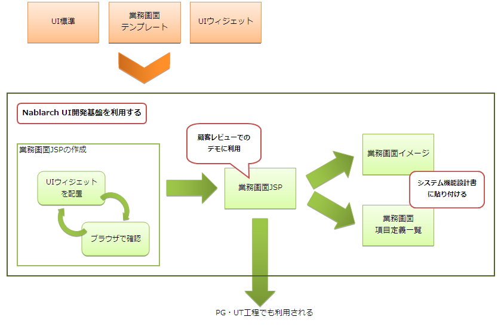

# JSP/HTML作成ガイド

この文書では、業務画面JSPの作成方法について記載する。

## 業務画面JSP作成フロー

UI開発基盤を利用し、業務画面JSPを作成する際の開発概要を以下に示す。

作成する業務画面JSPは、ブラウザで開くことで画面遷移も含めた動作確認を行うことができる。
また、画面に表示されている項目からシステム機能設計書に記載する項目定義を生成することもできる。

なお、ここで作成された業務画面JSPにPG/UT工程でサーバサイドでの処理に必要な情報が追加され、本番環境で動作する業務画面JSPとなる。

## 業務画面JSP作成に利用する開発環境

業務画面JSPを作成する際に、ブラウザで動作確認を行うためには指定されたディレクトリ構造でファイルを配置する必要がある。

ディレクトリ構造の詳細については、以下を参照。

* [業務画面JSP作成時のディレクトリ構造](../../component/ui-framework/ui-framework-project-structure.md)

業務画面JSPは、統合開発環境(IDE)を利用して作成することを推奨している。

統合開発環境での開発方法は以下を参照。

* [統合開発環境を利用して業務画面JSPを作成する](../../component/ui-framework/ui-framework-develop-environment.md)

また、下記ドキュメントを参考にEclipseのテンプレートを導入すると、より効率的に開発を行うことができる。

* [UI部品の実装サンプルで提供しているEclipse補完テンプレート](../../component/ui-framework/ui-framework-template-list.md)

## 業務画面JSPの作成方法

開発環境を構築した後は、業務画面テンプレートと、UI部品（JavaScript、ウィジェット）を利用して業務画面JSPを作成していく。

* [業務画面テンプレートとUI部品を利用して業務画面JSPを作成する](../../component/ui-framework/ui-framework-create-with-widget.md)

## 画面項目定義一覧の作成方法

作成した業務画面JSPから、システム機能設計書に張り付ける画面項目定義を作成する。

* [業務画面JSPから画面項目定義を作成する](../../component/ui-framework/ui-framework-create-screen-item-list.md)

## フォームクラスの自動生成方法

作成した業務画面JSPから、サーバサイドの実装時に使用するフォームクラスのJavaソースコードを生成する。

* [業務画面JSPからフォームクラスを生成する](../../component/ui-framework/ui-framework-widget-usage-generating-form-class.md)
