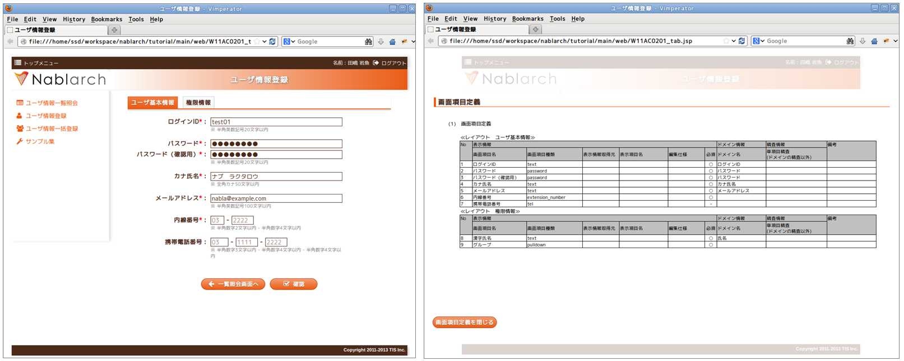

# 業務画面JSPローカル表示機能

## 概要

[業務画面JSPローカル表示機能](../../component/ui-framework/ui-framework-inbrowser-jsp-rendering.md) とは、ローカルディスク上の
業務画面JSPファイルを通常のブラウザで直接開けるようにする仕組みである。

これにより、開発用アプリケーションサーバーが用意されていない
設計工程の最初期においても画面のイメージや動作デモを簡単に実施することができる。
また、JSPの内容に応じた画面項目の一覧を表示することができる。
次の図は、以下のJSPをブラウザで直接開いて表示した例である。

**ブラウザで直接開いた結果(左: 画面プレビュー表示 / 右:画面項目定義書表示**



**ソースコード**

```jsp
<!DOCTYPE HTML PUBLIC "-//W3C//DTD HTML 4.01 Transitional//EN" "http://www.w3.org/TR/html4/loose.dtd">
<!-- <%/* --><script src="js/devtool.js"></script><meta charset="utf-8"><body><!-- */%> -->
<%@ taglib prefix="c" uri="http://java.sun.com/jsp/jstl/core" %>
<%@ taglib prefix="n" uri="http://tis.co.jp/nablarch" %>
<%@ taglib prefix="field" tagdir="/WEB-INF/tags/widget/field" %>
<%@ taglib prefix="button" tagdir="/WEB-INF/tags/widget/button" %>
<%@ taglib prefix="t" tagdir="/WEB-INF/tags/template" %>
<%@ taglib prefix="tab" tagdir="/WEB-INF/tags/widget/tab" %>
<%@ page language="java" contentType="text/html; charset=UTF-8" pageEncoding="UTF-8" %>

<t:page_template
    title="ユーザ情報登録"
    confirmationPageTitle="ユーザ情報登録確認">
  <jsp:attribute name="contentHtml">

  <n:form windowScopePrefixes="W11AC02,11AC_W11AC01">
    <tab:group name="tab">
    <tab:content title="ユーザ基本情報" selected="true">
      <field:text title="ログインID"
                  domain="LOGIN_ID"
                  required="true"
                  maxlength="20"
                  hint="半角英数記号20文字以内"
                  name="W11AC02.systemAccount.loginId"
                  sample="test01">
      </field:text>
      <field:password title="パスワード"
                      domain="PASSWORD"
                      required="true"
                      maxlength="20"
                      name="W11AC02.newPassword"
                      sample="password">
      </field:password>
      <field:password title="パスワード（確認用）"
                      domain="PASSWORD"
                      required="true"
                      maxlength="20"
                      name="W11AC02.confirmPassword"
                      sample="password">
      </field:password>
      <field:hint>半角英数記号20文字以内</field:hint>
    </tab:content>

    <tab:content title="権限情報">
      <field:text title="漢字氏名"
                  domain="KANJI_NAME"
                  required="true"
                  maxlength="50"
                  hint="全角50文字以内"
                  name="W11AC02.users.kanjiName"
                  sample="名部　楽太郎">
      </field:text>
      <field:pulldown title="グループ"
                      required="true"
                      name="W11AC02.ugroupSystemAccount.ugroupId"
                      listName="allGroup"
                      elementLabelProperty="ugroupName"
                      elementValueProperty="ugroupId"
                      hint="所属グループを選択してください。"
                      sample="[お客様グループ]|一般グループ">
      </field:pulldown>
    </tab:content>
    </tab:group>

    <button:block>
      <button:back
            label="一覧照会画面へ"
            size="4"
            uri="/action/ss11AC/W11AC01Action/${searchRequestId}">
        </button:back>
        <button:check
            uri="/action/ss11AC/W11AC02Action/RW11AC0202">
        </button:check>
   </button:block>
  </n:form>
  </jsp:attribute>
</t:page_template>
```

ローカルデモ用のJSPレンダリング処理を行う際に必要となる資源は、大きく分けて以下の3つである。

1. **ローカルデモの対象となる業務画面JSPファイル**
2. **UI共通部品群(UI部品ウィジェット/業務画面テンプレート/JavaScript UI部品)**
3. **ローカルデモ用JSPレンダリングエンジン**

上記のうち **1.** と **2.** は、実際の開発で使用しているものをそのまま用いる。
つまり、デモ用に何かを作成したりする必要はなく、サーバ開発でそのまま使用する成果物を用いて
ローカルレンダリングを行うことができる。

以下は、これらの3つの資源の関係を表した図である。


### ローカルJSPレンダリング機能の有効化

業務画面JSPファイルの冒頭に以下のソースコードを記述することで、ローカルJSPレンダリング機能が有効となる。

```jsp
<!DOCTYPE HTML PUBLIC "-//W3C//DTD HTML 4.01 Transitional//EN" "http://www.w3.org/TR/html4/loose.dtd">
<!-- <%/* --><script src="js/devtool.js"></script><meta charset="utf-8"><body><!-- */%> -->
```

### 業務画面JSPを記述する際の制約事項

本機能を利用するには、業務画面JSPの記述に関して以下の制約事項が存在する。

なお、これらの制約はブラウザで直接開くJSPに対するものなので、
[UI部品ウィジェット](../../component/ui-framework/ui-framework-jsp-widgets.md) や [業務画面テンプレート](../../component/ui-framework/ui-framework-jsp-page-templates.md) には影響しない。

1. 明示的な閉じタグが必ず必要

本機能を使用するには、業務画面JSP内の全てのJSPタグについて、明示的に閉じタグを記述する必要がある。
閉じタグを記述しない場合、以降のタグがレンダリングされなくなる。

**正しい例**

```jsp
<n:set name="var" value="val"></n:set>
```

**誤った例**

```jsp
<n:set name="var" value="val" />
```

1. disabled属性値の内容が無視される(IE8限定)

IE8では、タグ上に **disabled** 属性が設定されていた場合、その属性値の内容に関わらず
常に disabled="disabled" が設定されているものとみなされる。
このため disabled="false" のように記述した場合に意図した通りの表示とならない。
このような場合は単に **disabled** 属性を削除すること。

## ローカル表示の仕組み

本機能は大きく以下の2つの部分に分けることができる。

1. 業務画面JSPパーサー([/js/jsp.js](../_static/yuidoc/files/nablarch-dev-ui_demo-core_ui_local_js_jsp.js.html))
2. タグライブラリ スタブJS  (/js/jsp/taglib/*.js)

前者は業務画面JSPファイル内のJSPをパースし、タグライブラリごとに後者のスタブJSを呼び出す機能である。
後者の機能はタグライブラリごとに、ローカル表示時の挙動を実装するものである。

標準では以下のタグライブラリについてスタブJSを実装しており、
[業務画面テンプレート](../../component/ui-framework/ui-framework-jsp-page-templates.md) や [UI部品ウィジェット](../../component/ui-framework/ui-framework-jsp-widgets.md) を使用して業務画面JSPを作成しているのであれば
問題なくローカル表示が可能である。

| 名前空間 | スタブJSの仕様(APIドキュメント) |
|---|---|
| **jsp:** | [JSPタグライブラリJSスタブ](../_static/yuidoc/classes/jsp.taglib.jsp.html) |
| **c:** | [JSTL coreタグライブラリJSスタブ](../_static/yuidoc/classes/jsp.taglib.jstl.html) |
| **fn:** | [JSTL FunctionsタグライブラリJSスタブ](../_static/yuidoc/classes/jsp.taglib.function.html) |
| **n:** | [NablarchタグライブラリJSスタブ](../_static/yuidoc/classes/jsp.taglib.nablarch.html) |

ただし、新規の [UI部品ウィジェット](../../component/ui-framework/ui-framework-jsp-widgets.md) を追加したり、外部のタグライブラリを使用したりする場合は、
必要に応じてプロジェクト側で タグライブラリスタブJS を追加する必要がある。

## 構造

### 構成ファイル一覧

| 名称 | 動作環境 [2] |  | パス | 内容 |
|---|---|---|---|---|
| ミニファイ済みスクリプト | ○ | × | /js/devtool.js | ローカルレンダリングに必要な資源をミニファイしたもの |
| 初期ロードスクリプト | △ | × | /js/devtool-loader.js | ローカルレンダリングに必要なスクリプト群を初期ロード するスクリプト また、JSPのレンダリングが完了するまでの一定期間、 画面の表示を隠すなどの初期処理もあわせて行う。 |
| ミニファイ対象資源一覧 | × | × | /js/build/devtool_conf.js | プロジェクト内で使用しているタグファイルや インクルードファイルなどの資源の一覧。 JSPローカルレンダリングではこれらの資源の内容を参照 するため、ミニファイ処理の事前処理として自動作成される。 |
| ローカルデモUI | △ | × | /js/devtool/*.js | ローカルレンダリングに付随するUI機能。 主に画面項目定義の表示機能と、それを操作するためのUI が含まれる。 |
| 設計書画面テンプレート | △ | × | /specsheet_template/ SpecSheetTemplate.htm | 画面詳細設計書のExcelシートを「Webページ」として保存した もの。設計書ビューの表示機能では、このテンプレートを 使用してJSP上の設計情報を表示する。 |
| タグ定義 | △ | × | /js/devtool/resource/ タグ定義.js | 各JSPウィジェットのローカル表示及び設計書ビューの 表示を行うために必要な捕捉情報を記述する設定ファイル。 JSPウィジェットを追加した場合は ここの定義を追加する必要がある。 記述書式などの詳細については [UI開発基盤設定ファイル](../../component/ui-framework/ui-framework-configuration-files.md) を参照すること。 |
| JSPローカルレンダラ | △ | × | /js/jsp.js | JSPのローカルレンダリングを行うメインスクリプト 一応、jQueryプラグインの形態をとっている。 |
| コンテキスト変数設定 | △ | × | /js/jsp/context.js | JSPのローカルレンダリングを行う際に、参照する セッション・リクエスト・ページの各コンテキスト変数 のダミー定義を記述する。 |
| EL式簡易パーサ | △ | × | /js/jsp/el.js | EL式の簡易パーサ |
| タグライブラリスタブ | △ | × | /js/jsp/taglib/nablarch.js /js/jsp/taglib/jstl.js /js/jsp/taglib/jsp.js /js/jsp/taglib/html.js /js/jsp/taglib/field.js /js/jsp/taglib/button.js /js/jsp/taglib/link.js /js/jsp/taglib/template.js /js/jsp/taglib/table.js /js/jsp/taglib/column.js /js/jsp/taglib/tab.js /js/jsp/taglib/event.js | 各タグファイル・タグライブラリのスタブ動作を実装する スクリプト群。 **/js/jsp.js** から呼ばれる。 タグライブラリの名前空間毎に別スクリプトとなっている。 |

**「サーバ」:**
実働環境にデプロイして使用するかどうか
**「ローカル」:**
ローカル動作時に使用するかどうか
**○ :**
使用する
**△ :**
直接は使用しないがミニファイしたファイルの一部として使用する。
**× :**
使用しない
