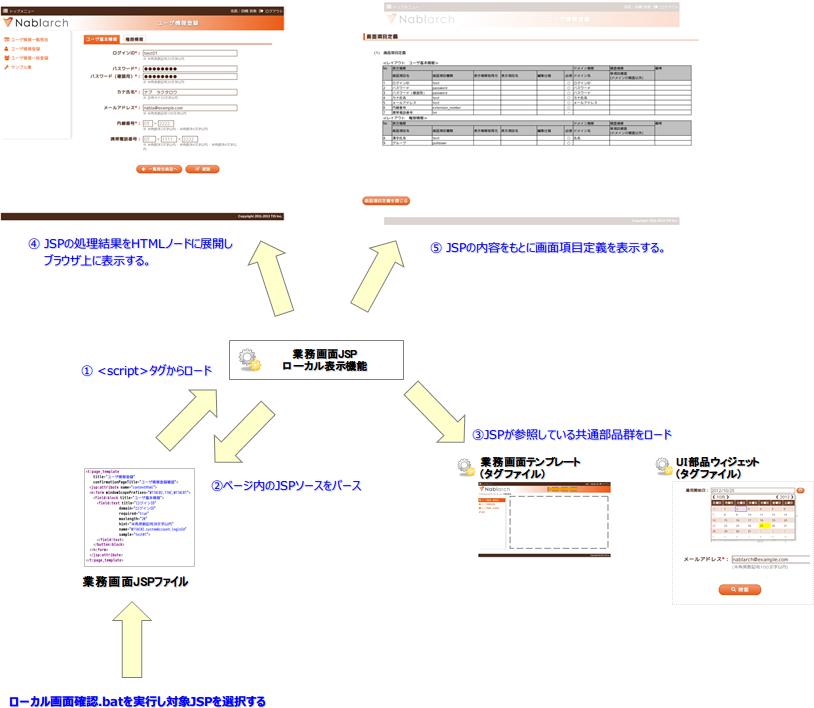

# 業務画面JSPローカル表示機能

## 

なし

<details>
<summary>keywords</summary>

業務画面JSPローカル表示機能, JSPローカルレンダリング概要

</details>

## 概要

[inbrowser_jsp_rendering](ui-framework-inbrowser_jsp_rendering.md) は、ローカルディスク上の業務画面JSPファイルを通常のブラウザで直接開けるようにする仕組み。開発用アプリサーバーが不要な設計工程初期でも、画面プレビューと画面項目定義書の表示が可能。

ローカルデモに必要な3つの資源:
1. **業務画面JSPファイル**: 実際の開発で使用するものをそのまま使用
2. **UI共通部品群** (UI部品ウィジェット/業務画面テンプレート/JavaScript UI部品): 実際の開発で使用するものをそのまま使用
3. **ローカルデモ用JSPレンダリングエンジン**

> **補足**: デモ専用ファイルを作成する必要はなく、サーバ開発でそのまま使用する成果物を用いてローカルレンダリングが可能。



<details>
<summary>keywords</summary>

業務画面JSPローカル表示, ローカルレンダリング, 画面プレビュー, 画面項目定義書, UI共通部品群

</details>

## ローカルJSPレンダリング機能の有効化

業務画面JSPファイルの冒頭に以下を記述することでローカルJSPレンダリング機能が有効になる:

```jsp
<!DOCTYPE HTML PUBLIC "-//W3C//DTD HTML 4.01 Transitional//EN" "http://www.w3.org/TR/html4/loose.dtd">
<!-- <%/* --><script src="js/devtool.js"></script><meta charset="utf-8"><body><!-- */%> -->
```

<details>
<summary>keywords</summary>

ローカルJSPレンダリング有効化, devtool.js, JSP冒頭設定

</details>

## 業務画面JSPを記述する際の制約事項

これらの制約はブラウザで直接開く業務画面JSPに対するものであり、[jsp_widgets](ui-framework-jsp_widgets.md) や [jsp_page_templates](ui-framework-jsp_page_templates.md) には影響しない。

1. **明示的な閉じタグが必須**: 業務画面JSP内の全JSPタグに明示的な閉じタグが必要。閉じタグがない場合、以降のタグがレンダリングされなくなる。
   - 正: `<n:set name="var" value="val"></n:set>`
   - 誤: `<n:set name="var" value="val" />`

2. **disabled属性値が無視される(IE8限定)**: IE8では `disabled` 属性の値に関わらず常に `disabled="disabled"` として扱われる。`disabled="false"` は意図通りに動作しないため、`disabled` 属性自体を削除すること。

<details>
<summary>keywords</summary>

明示的閉じタグ, disabled属性IE8, JSP記述制約, ローカル表示制約

</details>

## ローカル表示の仕組み

ローカル表示は以下の2つのコンポーネントで構成される:

1. **業務画面JSPパーサー** (`/js/jsp.js`): JSPをパースし、タグライブラリごとのスタブJSを呼び出す
2. **タグライブラリスタブJS** (`/js/jsp/taglib/*.js`): タグライブラリごとにローカル表示時の挙動を実装

標準で以下のタグライブラリのスタブJSが実装されている:

| 名前空間 | スタブJSの仕様 |
|---|---|
| **jsp:** | [JSPタグライブラリJSスタブ](../_static/yuidoc/classes/jsp.taglib.jsp.html) |
| **c:** | [JSTL coreタグライブラリJSスタブ](../_static/yuidoc/classes/jsp.taglib.jstl.html) |
| **fn:** | [JSTL FunctionsタグライブラリJSスタブ](../_static/yuidoc/classes/jsp.taglib.function.html) |
| **n:** | [NablarchタグライブラリJSスタブ](../_static/yuidoc/classes/jsp.taglib.nablarch.html) |

[jsp_page_templates](ui-framework-jsp_page_templates.md) や [jsp_widgets](ui-framework-jsp_widgets.md) を使用した業務画面JSPはローカル表示が可能。新規の [jsp_widgets](ui-framework-jsp_widgets.md) 追加や外部タグライブラリ使用時は、プロジェクト側でタグライブラリスタブJSを追加する必要がある。

<details>
<summary>keywords</summary>

JSPパーサー, タグライブラリスタブJS, jsp.js, 名前空間, タグライブラリスタブ追加

</details>

## 構造

なし

<details>
<summary>keywords</summary>

構造, 構成ファイル, JSPレンダリング構成

</details>

## 構成ファイル一覧

凡例: ○=使用する、△=直接は使用しないがミニファイしたファイルの一部として使用、×=使用しない

| 名称 | ローカル | サーバ | パス | 内容 |
|---|---|---|---|---|
| ミニファイ済みスクリプト | ○ | × | /js/devtool.js | ローカルレンダリングに必要な資源をミニファイしたもの |
| 初期ロードスクリプト | △ | × | /js/devtool-loader.js | ローカルレンダリングに必要なスクリプト群を初期ロードするスクリプト。JSPレンダリング完了まで画面の表示を隠す初期処理も実行 |
| ミニファイ対象資源一覧 | × | × | /js/build/devtool_conf.js | 使用タグファイル等の資源一覧。ミニファイ処理の事前処理として自動作成 |
| ローカルデモUI | △ | × | /js/devtool/*.js | 画面項目定義の表示機能とそれを操作するUI |
| 設計書画面テンプレート | △ | × | /specsheet_template/SpecSheetTemplate.htm | 画面詳細設計書のExcelシートをWebページとして保存したもの。設計書ビューの表示に使用 |
| タグ定義 | △ | × | /js/devtool/resource/タグ定義.js | 各JSPウィジェットのローカル表示・設計書ビュー表示に必要な設定ファイル。JSPウィジェット追加時は定義の追加が必要。詳細は [./configuration_files](ui-framework-configuration_files.md) 参照 |
| JSPローカルレンダラ | △ | × | /js/jsp.js | JSPのローカルレンダリングを行うメインスクリプト (jQueryプラグイン形態) |
| コンテキスト変数設定 | △ | × | /js/jsp/context.js | セッション・リクエスト・ページの各コンテキスト変数のダミー定義 |
| EL式簡易パーサ | △ | × | /js/jsp/el.js | EL式の簡易パーサ |
| タグライブラリスタブ | △ | × | /js/jsp/taglib/(nablarch/jstl/jsp/html/field/button/link/template/table/column/tab/event).js | タグファイル・タグライブラリのスタブ動作を実装するスクリプト群。/js/jsp.jsから呼ばれる。名前空間毎に別スクリプト |

<details>
<summary>keywords</summary>

構成ファイル一覧, devtool.js, devtool-loader.js, jsp.js, タグライブラリスタブ, タグ定義.js, context.js, el.js

</details>
