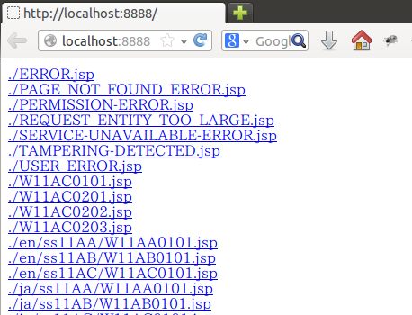
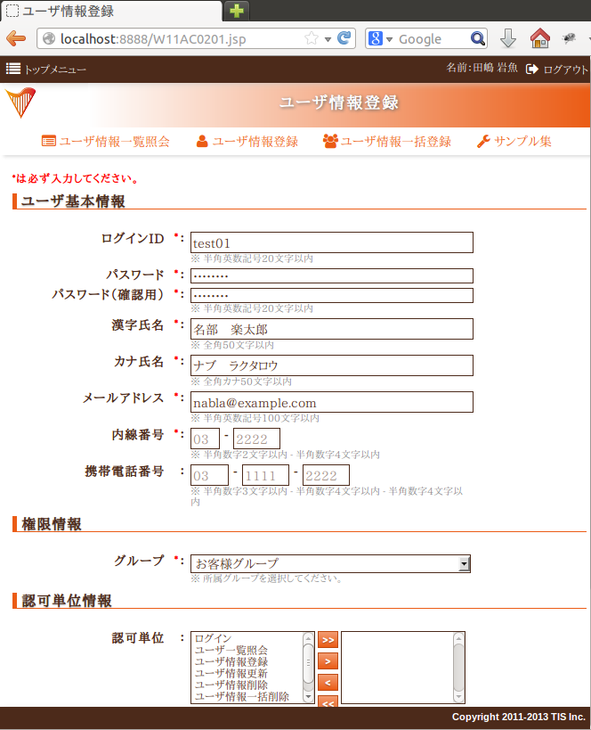
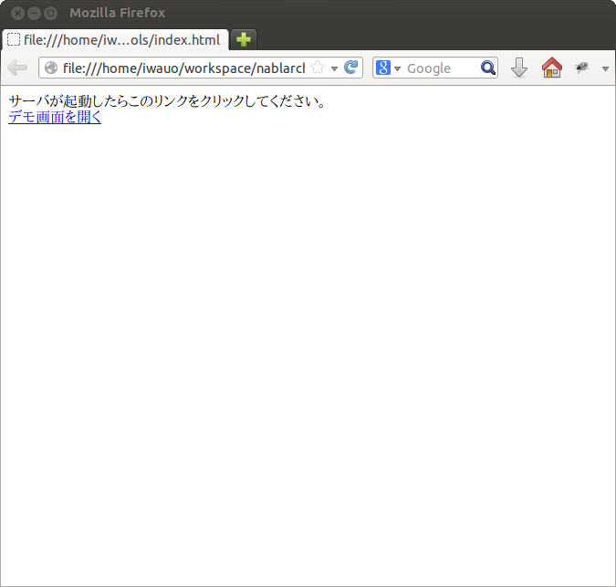
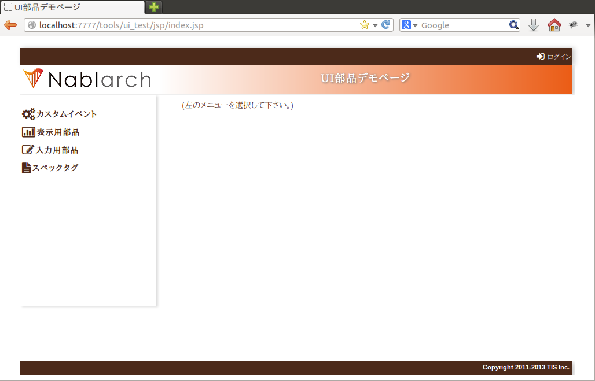

# UI開発基盤の導入

本節では、Nablarch UI開発基盤をプロジェクトの開発環境に導入する手順を述べる。
UI開発基盤の導入時に以下の手順を実施すればよく、各担当者が個別に実施する必要はない。

以下の手順で使用するイントール用コマンドの詳細仕様については、
[プラグインビルドコマンド仕様](../../component/ui-framework/ui-framework-plugin-build.md) を参照すること。

> **Note:**
> 本節は、Nablarchのチュートリアルプロジェクトを例としてUI開発基盤の導入手順を記載している。
> チュートリアルプロジェクトでは、 [CSSフレームワーク](../../component/ui-framework/ui-framework-css-framework.md) を使用しているが、
> [マルチレイアウト用CSSフレームワーク](../../component/ui-framework/ui-framework-multicol-css-framework.md) を使用する場合には、 [マルチレイアウトモードの適用方法](../../component/ui-framework/ui-framework-multicol-css-framework.md#apply-multicol-layout)
> を参考に導入用の設定を行うこと。

## 0. 事前準備

本項の作業を行うには Node.js のインストールが必要である。
インストールイメージを下記URL(2014/09時点)から取得し、インストールする。

[http://nodejs.org/dist/v0.10.26/](http://nodejs.org/dist/v0.10.26/)

バージョンによってはUI開発基盤が動作しないため、動作検証済みのバージョンである 0.10.26 の使用を推奨する。

> **Note:**
> なお **Node.js** を必要とするのは初期環境構築作業を行うアーキテクトのみである。
> 通常の設計・開発を行う担当者はインストール不要である。

## 1. UI開発基盤の取得と展開

Nablarch配布アーカイブから、以下の2つのアーカイブを取得する。

* (Nablarch標準プラグインバンドルアーカイブ)
* (チュートリアルプロジェクトアーカイブ)

ローカルマシン上の任意の場所にプロジェクトルートとなるディレクトリを新規作成する。

> **Note:**
> ここでは、プロジェクト名は仮想のプロジェクト名(tutorial_project)で示す。

アーカイブをこのディレクトリの直下に配置し、それぞれ展開する。
展開後のディレクトリ構成は以下のようになる。

```bash
プロジェクトルート/
      │
      ├── nablarch_plugins_bundle/
      │     ├── bin/
      │     │     ├── setup.bat
      │     │     └── install.bat
      │     ├── node_modules/
      │     │     ├── nablarch-css-base
      │     │     ├── nablarch-css-color-default
      │     │     ├── nablarch-css-common
      │     │     │
      │     │ ## 後略 ##
      │     │
      │     └── package.json
      │
      └── tutorial_project/
            ├── tutorial/
            ├── ui_demo/
            ├── ui_plugins/
            │     └── package.json
            └── ui_test/
```

> **Note:**
> ここで展開される各ディレクトリの内容については
> [標準プロジェクト構成](../../component/ui-framework/ui-framework-directory-layout.md) で解説する。

## 2. Nablarch UI開発基盤のインストール

下記手順を実行することにより、Nablarch標準プラグインバンドルの内容と、
各プラグインが依存するサードパーティ製ライブラリがプロジェクトルート配下に取り込まれる。

### 1. サードパーティライブラリの取得(要オンライン)

nablarch_plugins_bundle/bin/setup.bat を実行する。

> **Note:**
> この作業はオンライン環境での実施が必要である。
> オフライン環境でインストールする場合は、事前にオンライン環境で上記スクリプトを実行し、
> nablarch_plugins_bundle/node_modules/ 配下の内容を転送すること。

> また、プロキシ配下でインターネットに接続している場合には、
> 以下の環境変数にプロキシのアドレスを設定すること。

> * >   **http_proxy** ：例）http_proxy=http://proxy.example.com:8080
> * >   **https_proxy** ：例）https_proxy=http://proxy.example.com:8080

以下のようなログが表示され、サードパーティ製ライブラリが
nablarch_plugins_bundle/node_modules/ 配下にインストールされる。

```bash
> setup.bat

npm WARN package.json nablarch-css-base@1.0.0 No repository field.
npm WARN package.json nablarch-css-base@1.0.0 No README data

### 中略 ###

npm http 200 https://registry.npmjs.org/boom
npm http GET https://registry.npmjs.org/delayed-stream/0.0.5
npm http 304 https://registry.npmjs.org/delayed-stream/0.0.5
shelljs@0.2.6 node_modules/shelljs

requirejs@2.1.11 node_modules/requirejs

sugar@1.4.1 node_modules/sugar

jquery@1.11.0 node_modules/jquery

less@1.4.2 node_modules/less
├── mkdirp@0.3.5
├── mime@1.2.11
├── ycssmin@1.0.1
└── request@2.34.0

font-awesome@4.0.3 node_modules/font-awesome
>
```

この処理により nablarch_plugins_bundle/node_modules 配下に
サードパーティプラグインが追加される。

```bash
プロジェクトルート/
      │
      ├── nablarch_plugins_bundle/
      │     ├── bin/
      │     │     ├── setup.bat
      │     │     └── install.bat
      │     ├── doc/
      │     ├── guide/
      │     ├── node_modules/
      │     │     ├── es6-promise   # (追加)
      │     │     ├── font-awesome  # (追加)
      │     │     ├── jquery        # (追加)
      │     │     ├── less          # (追加)
      │     │     ├── nablarch-css-base
      │     │     ├── nablarch-css-color-default
      │     │     ├── nablarch-css-common
      │     │     │
    ## (後略) ##
```

### 2. プロジェクトで使用するプラグインの選定

tutorial_project/ui_plugins/package.json を任意のテキストエディタで開く。

このファイルは以下のような構造を持ち、プロジェクトで使用する
[UIプラグイン](../../component/ui-framework/ui-framework-plugins.md) の名称とそのバージョンが列挙されている。

```javascript
//---- 前略 ----//

"dependencies":
{ "requirejs"    : "2.1.11"
, "sugar"        : "1.4.1"
, "jquery"       : "1.11.0"
, "nablarch-css-color-default": "1.0.0"
, "nablarch-css-core": "1.0.0"
, "nablarch-css-conf-wide": "1.0.0"
, "nablarch-css-conf-compact": "1.0.0"
, "nablarch-css-conf-narrow": "1.0.0"

//---- 中略 ----//

, "nablarch-template-head": "1.0.0"
, "nablarch-template-js_include": "1.0.0"
, "nablarch-template-page": "1.0.0"
}

//---- 後略 ----//
```

このエントリを削除することによって、プロジェクト側で使用しないプラグインを
インストールの対象から除去することができる。
各プラグインの内容については [UIプラグイン](../../component/ui-framework/ui-framework-plugins.md) の項を参照すること。

削除したプラグインがlessファイルを含んでいる場合、プロジェクトではそのlessファイルも
使用できなくなるため、 [lessインポート定義ファイル](../../component/ui-framework/ui-framework-plugin-build.md#lessimport-less) から、当該プラグインのlessファイルの
import定義を削除する必要がある。

[lessインポート定義ファイル](../../component/ui-framework/ui-framework-plugin-build.md#lessimport-less) には、以下のようにプロジェクトが各表示モードで使用するlessファイルの
import定義が列挙されている。

```css
@import "../../node_modules/nablarch-css-core/ui_public/css/core/reset";
@import "../../node_modules/nablarch-css-core/ui_public/css/core/css3";
@import "../../node_modules/nablarch-css-core/ui_public/css/core/grid";

 //---- 中略 ----//

@import "../../node_modules/tutorial-template-app_nav/ui_public/css/template/topnav";
@import "../../node_modules/tutorial-template-app_nav/ui_public/css/template/topnav-wide";
@import "../../node_modules/tutorial-template-error/ui_public/css/template/errorpage";
```

上記で削除したプラグインに対応するlessファイルは、それぞれの [lessインポート定義ファイル](../../component/ui-framework/ui-framework-plugin-build.md#lessimport-less) から削除する必要がある。
チュートリアルプロジェクトの場合は、以下の6ファイルから削除する。

* tutorial_project/ui_plugins/css/ui_local/compact.less
* tutorial_project/ui_plugins/css/ui_local/narrow.less
* tutorial_project/ui_plugins/css/ui_local/wide.less
* tutorial_project/ui_plugins/css/ui_public/compact.less
* tutorial_project/ui_plugins/css/ui_public/narrow.less
* tutorial_project/ui_plugins/css/ui_public/wide.less

> **Note:**
> 使用するプラグインの選別は、開発中であっても随時実施することが可能である。
> ただ、その場合でも、開発チーム側での誤用を避けるため、
> 使用しないプラグインはなるべく早い段階で除いておくことが望ましい。

### 3. プロジェクトへのプラグインインストール

nablarch_plugins_bundle/bin/install.bat を実行する。
(コマンドの詳細については [プラグインビルドコマンド仕様](../../component/ui-framework/ui-framework-plugin-build.md) を参照)

> **Warning:**
> 初期のinstall.batはPROJECT_ROOTが設定されていないため、実行前にインストールするPJ名を設定すること。

> **Note:**
> なお、このスクリプトは完了までに通常5から10分程度の時間がかかる。

以下のようなログが表示される。

```bash
> install.bat
setup plugin: ../node_modules/es6-promise
setup plugin: ../node_modules/font-awesome
setup plugin: ../node_modules/jquery
setup plugin: ../node_modules/less

## (中略) ##

npm http 200 http://127.0.0.1:3000/nablarch-css-conf-compact/-/nablarch-css-conf-compact-1.0.0/package.tgz
npm http 200 http://127.0.0.1:3000/nablarch-css-conf-wide/-/nablarch-css-conf-wide-1.0.0/package.tgz
nablarch-css-conf-compact@1.0.0 node_modules/nablarch-css-conf-compact
nablarch-css-conf-narrow@1.0.0 node_modules/nablarch-css-conf-narrow
nablarch-css-conf-wide@1.0.0 node_modules/nablarch-css-conf-wide

halting local repository ...

... local repository shutdown.
>
```

この処理により、先の手順で **package.json** に指定されていたプラグインが
tutorial_project/ui_plugins/node_modules 配下にインストールされる。
また、開発作業用の各種コマンドが、
tutorial_project/ui_plugins/bin 配下にインストールされる。

```bash
プロジェクトルート/
      │
      ├── nablarch_plugins_bundle/
      │     │
      │     │
      │   ##(後略)##
      │
      └── tutorial_project/
            ├── tutorial/
            ├── ui_demo/
            ├── ui_plugins/
            │     ├── .npm/  # (追加)
            │     ├── package.json
            │     ├── bin/
            │     │     ├── ui_build.bat # (追加)
            │     │     ├── ui_build.sh  # (追加)
            │     │     │
            │     │
            │     └── node_modules/
            │           ├── jquery/                       # (追加)
            │           ├── less/                         # (追加)
            │           ├── nablarch-css-base/            # (追加)
            │           ├── nablarch-css-color-default/   # (追加)
            │           ├── nablarch-css-common/          # (追加)
            │           │
            │       ##(後略)##
            │
            └── ui_test/
```

### 4. UI部品のビルドと配置

先の手順でインストールされた tutorial_project/ui_plugins/bin/ui_build.bat を実行する。
(コマンドの詳細については [プラグインビルドコマンド仕様](../../component/ui-framework/ui-framework-plugin-build.md) を参照)

これにより tutorial_project 配下の以下のディレクトリに各プラグインから抽出された
UI資源が展開される。

| パス | 名称 | 用途 |
|---|---|---|
| ui_demo/ | 業務画面モック開発用プロジェクト | 主に設計工程で作成する業務画面JSPを格納するプロジェクト。 サーバサイドの仕組みなしで、画面の表示や動作のデモを行うことができる。 使用方法については、 **JSP/HTML作成ガイド** を参照すること。 |
| ui_test/ | UI開発基盤テスト用プロジェクト | UI開発基盤自体の開発に用いるテストスイートを格納するプロジェクト。 プロジェクト側でUI基盤のカスタマイズを行う際に、既存機能への影響を確認する場合に 使用することができる。 また、UI基盤部品で問題が発生した場合に、Nablarchの標準プラグインの問題なのか、 PJ側でのカスタマイズの問題なのかを確認する際にも利用する。 |
| tutorial/ | チュートリアルプロジェクト | サーバサイド側も含め、完全に動作するアプリケーションサンプル。 プロジェクトの雛形としても利用することができる。 |

### 5. UIローカルデモ用プロジェクトの動作確認

tutorial_project/ui_demo/ローカル画面確認.bat
を実行すると、ブラウザが起動し、以下の画面が表示される。



この画面には tutorial_project/ui_demo 配下にある全てのJSPファイルへのリンクが
表示される。
各リンクを開くことで、当該画面のJSPがJavaScriptによって解釈され、
下記のようなデモ画面を表示することができる。



### 6. UI開発基盤テスト用プロジェクトの動作確認

tutorial_project/ui_test/サーバ動作確認.bat
を実行すると、ブラウザが起動し、以下の画面が表示される。



コマンドを実行したコンソール内に以下のようなメッセージが表示されるのを確認できるまで待つ。

```bash
2014-05-05 16:28:24.022:INFO::Logging to STDERR via org.mortbay.log.StdErrLog
2014-05-05 16:28:24.058:INFO::jetty-6.1.24
2014-05-05 16:28:24.300 -INFO- ROO [null] load component config file. file = classpath:web-component-configuration.xml
2014-05-05 16:28:24.331 -INFO- ROO [null] [nablarch.fw.web.servlet.NablarchServletContextListener#contextInitialized] initialization completed.
2014-05-05 16:28:24.383:INFO::Started SocketConnector@0.0.0.0:7777
```

メッセージが確認できたら
ブラウザに表示されているリンクを押すと、以下のような画面に遷移する。



左のメニューから、各UI部品の動作確認用ページに遷移することができる。

### 7. 開発リポジトリへの登録

ここまでセットアップした開発基盤を、リポジトリに登録する。

> **Warning:**
> ここでリポジトリへの登録を怠ると、以降のプロジェクト側で行うカスタマイズと、
> Nablarch開発元で行う改修とを正しくマージすることが困難、もしくは不可能となるので、
> 必ず実施すること。

**1. UI開発基盤インストール作業ファイルの削除**

下記のディレクトリおよびその配下のファイルについては、
インストール作業完了後は不要となるので、コミット前に削除しておく。

* **nablarch_plugins_bundle/**
* **tutorial_project/ui_plugins/.npm/**

**2. コミット**

上述の削除により、プロジェクトのファイル構成は以下の図のようになる。
これをプロジェクトのリポジトリにコミットする。

```bash
プロジェクトルート/
      │
      └── tutorial_project/
            ├── tutorial/
            │     ├── .project
            │     ├── .classpath
            │     │
            │   ##(後略)##
            │
            ├── ui_demo/
            │     ├── .project
            │     │
            │   ##(後略)##
            │
            ├── ui_plugins/
            │     ├── package.json
            │     ├── bin/
            │     │     ├── ui_build.bat
            │     │     ├── ui_build.sh
            │     │     │
            │     │
            │     └── node_modules/
            │           ├── jquery/
            │           ├── less/
            │           ├── nablarch-css-base/
            │           ├── nablarch-css-color-default/
            │           ├── nablarch-css-common/
            │           │
            │       ##(後略)##
            │
            └── ui_test/
                  ├── .project
                  ├── .classpath
                  │
                ##(後略)##
```
