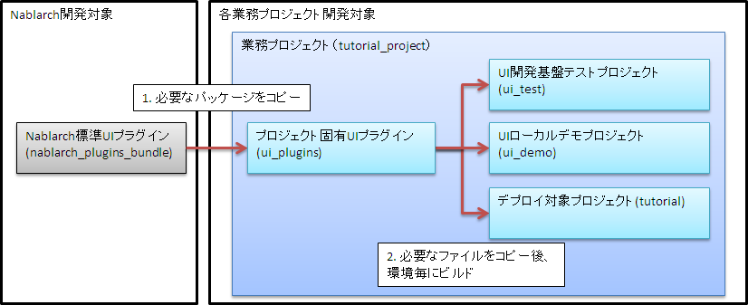
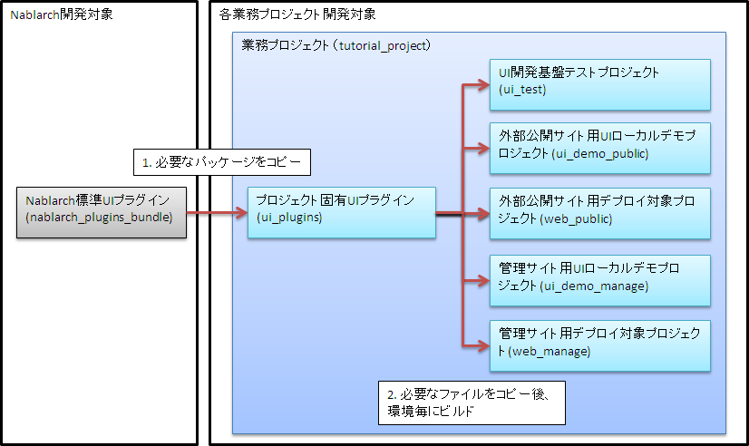
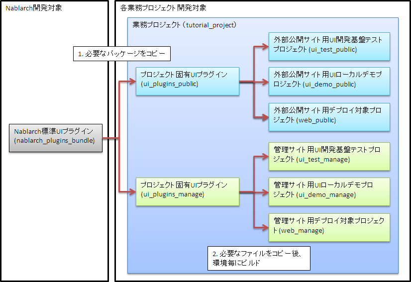
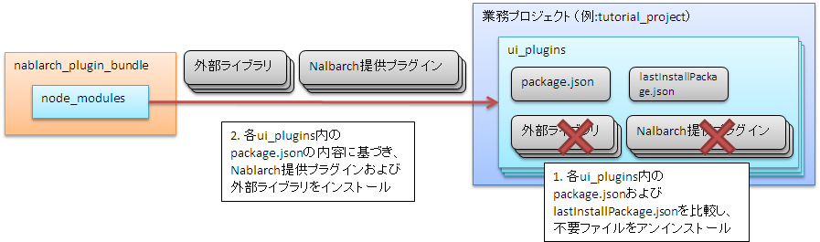
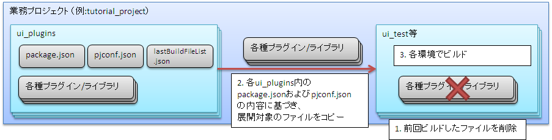

# プラグインビルドコマンド仕様

## 概要

本章では [想定されるプロジェクト構成ごとの設定例](../../component/ui-framework/ui-framework-plugin-build.md#project-structure) および [プラグインビルドで使用するコマンドや設定ファイルの詳細仕様](../../component/ui-framework/ui-framework-plugin-build.md#config-command-detail) を示す。

プラグインビルドコマンドが使用されるプロジェクトの標準的な構成については [標準プロジェクト構成](../../component/ui-framework/ui-framework-directory-layout.md) を、
開発時のフローについては [UI開発基盤の導入](../../component/ui-framework/ui-framework-initial-setup.md) を参照。

## 想定されるプロジェクト構成ごとの設定例

想定されるプロジェクト構成について、プラグインビルドコマンドの設定ファイルや実行ファイルの具体的な設定例を示す。
下記の設定例に示していない項目については、後述する [設定ファイル](../../component/ui-framework/ui-framework-plugin-build.md#config-file) や [ビルドコマンド](../../component/ui-framework/ui-framework-plugin-build.md#build-command) を参照し、必要に応じて修正すること。

### デプロイ対象プロジェクトが１つの場合

以下にプロジェクトの構成図および設定例を示す。

本構成は全ての画面で共通のプラグインを使用する場合に使用する。

**構成図**

Nablarch標準UIプラグイン、プロジェクト固有UIプラグイン、UIローカルデモ用プロジェクト、UI開発基盤テスト用プロジェクト、デプロイ対象プロジェクトがそれぞれ１つずつ配置される。



**設定例**

* [インストールコマンド](../../component/ui-framework/ui-framework-plugin-build.md#install) の設定

  本構成では、以下のファイルとなる。

  /nablarch_plugins_bundle/bin/install.bat

  プロジェクトルートおよびプロジェクト固有UIプラグインのフォルダを設定する。

  | 環境変数名 | 設定値 | 備考 |
  |---|---|---|
  | PROJECT_ROOT | "../../tutorial_project" | コマンドの起動フォルダはnablarch_plugins_bundle/binとなるため、そこからの相対パス |
  | UI_PLUGINS_DIRS | "ui_plugins" |  |
* [ビルドコマンド用設定ファイル](../../component/ui-framework/ui-framework-plugin-build.md#pjconf-json) の設定

  本構成では、以下のファイルとなる。

  /tutorial_project/ui_plugins/pjconf.json

  プロジェクトルートおよび各プロジェクトのフォルダを設定する。

  | 設定項目 | 設定値 | 備考 |
  |---|---|---|
  | pathSettings/projectRootPath | "../.." | コマンドの起動フォルダはtutorial_project/ui_plugins/binとなるため、そこからの相対パス |
  | pathSettings/webProjectPath | "tutorial/main/web" |  |
  | pathSettings/demoProjectPath | "ui_demo" |  |
  | pathSettings/testProjectPath | "ui_test" |  |
  | pathSettings/pluginProjectPath | "ui_plugins" |  |

### デプロイ対象プロジェクト複数の場合(プラグインは共通)

以下にプロジェクトの構成図および設定例を示す。

本構成は外部公開サイトと管理用サイト等、いくつかの画面単位でデプロイ対象プロジェクトを分割する場合で、
サイト間で基本的な画面レイアウト等が大きく変化しないような場合（同一のUI標準を適用する場合）に使用する。

**構成図**

Nablarch標準UIプラグイン、プロジェクト固有UIプラグイン、UI開発基盤テスト用プロジェクトがそれぞれ１つ、
UIローカルデモ用プロジェクト、デプロイ対象プロジェクトが外部公開サイト用および管理サイト用でそれぞれ２つずつ配置される。



**設定例**

* [インストールコマンド](../../component/ui-framework/ui-framework-plugin-build.md#install) の設定

  本構成では、以下のファイルとなる。

  /nablarch_plugins_bundle/bin/install.bat

  プロジェクトルートおよびプロジェクト固有UIプラグインのフォルダを設定する。

  | 環境変数名 | 設定値 | 備考 |
  |---|---|---|
  | PROJECT_ROOT | "../../tutorial_project" | コマンドの起動フォルダはnablarch_plugins_bundle/binとなるため、そこからの相対パス |
  | UI_PLUGINS_DIRS | "ui_plugins" |  |
* [ビルドコマンド用設定ファイル](../../component/ui-framework/ui-framework-plugin-build.md#pjconf-json) の設定(外部公開サイト用)

  本構成では、以下のファイルとなる。

  /tutorial_project/ui_plugins/pjconf_public.json (標準のpjconf.jsonファイルをコピーする)

  プロジェクトルートおよび各プロジェクトのフォルダを設定する。

  | 設定項目 | 設定値 | 備考 |
  |---|---|---|
  | pathSettings/projectRootPath | "../.." | コマンドの起動フォルダはtutorial_project/ui_plugins/binとなるため、そこからの相対パス |
  | pathSettings/webProjectPath | "web_public/main/web" |  |
  | pathSettings/demoProjectPath | "ui_demo_public" | 業務画面は個別で作成するため、管理サイトと分ける |
  | pathSettings/testProjectPath | "ui_test" | プラグインは共通のため、UI開発基盤テスト用プロジェクトは管理サイト用と共用 |
  | pathSettings/pluginProjectPath | "ui_plugins" | プラグインは共通のため、プロジェクト固有UIプラグインは管理サイト用と共用 |
* [UIビルドコマンド](../../component/ui-framework/ui-framework-plugin-build.md#ui-build) の設定(外部公開サイト用)

  本構成では、以下のファイルとなる。

  /tutorial_project/ui_plugins/bin/ui_build_public.bat (標準のui_build.batコマンドをコピーする)

  外部公開サイト用プロジェクト設定ファイルを設定する。

  | 環境変数名 | 設定値 | 備考 |
  |---|---|---|
  | PROJECT_CONF | "../pjconf_public.json" | コマンドの起動フォルダはnablarch_plugins_bundle/binとなるため、そこからの相対パス |
* [ビルドコマンド用設定ファイル](../../component/ui-framework/ui-framework-plugin-build.md#pjconf-json) の設定(管理サイト用)

  本構成では、以下のファイルとなる。

  /tutorial_project/ui_plugins/pjconf_manage.json (標準のpjconf.jsonファイルをコピーする)

  プロジェクトルートおよび各プロジェクトのフォルダを設定する。

  | 設定項目 | 設定値 | 備考 |
  |---|---|---|
  | pathSettings/projectRootPath | "../.." | コマンドの起動フォルダはtutorial_project/ui_plugins/binとなるため、そこからの相対パス |
  | pathSettings/webProjectPath | "web_manage/main/web" |  |
  | pathSettings/demoProjectPath | "ui_demo_manage" | 業務画面は個別で作成するため、外部公開サイトと分ける |
  | pathSettings/testProjectPath | "ui_test" | プラグインは共通のため、UI開発基盤テスト用プロジェクトは外部公開サイト用と共用 |
  | pathSettings/pluginProjectPath | "ui_plugins" | プラグインは共通のため、プロジェクト固有UIプラグインは外部公開サイト用と共用 |
* [UIビルドコマンド](../../component/ui-framework/ui-framework-plugin-build.md#ui-build) の設定(管理サイト用)

  本構成では、以下のファイルとなる。

  /tutorial_project/ui_plugins/bin/ui_build_manage.bat (標準のui_build.batコマンドをコピーする)

  管理サイト用プロジェクト設定ファイルを設定する。

  | 環境変数名 | 設定値 | 備考 |
  |---|---|---|
  | PROJECT_CONF | "../pjconf_manage.json" | コマンドの起動フォルダはnablarch_plugins_bundle/binとなるため、そこからの相対パス |

### デプロイ対象プロジェクト複数の場合(プラグインも個別)

以下にプロジェクトの構成図および設定例を示す。

本構成は外部公開サイトと管理用サイト等、いくつかの画面単位でデプロイ対象プロジェクトを分割する場合で、
サイト間で基本的な画面レイアウト等が大きく変化するような場合（適用するUI標準が変化する場合）に使用する。

**構成図**

Nablarch標準UIプラグインがそれぞれ１つ、
プロジェクト固有UIプラグイン、UI開発基盤テスト用プロジェクト、UIローカルデモ用プロジェクト、デプロイ対象プロジェクトが外部公開サイト用および管理サイト用でそれぞれ２つずつ配置される。



**設定例**

* [インストールコマンド](../../component/ui-framework/ui-framework-plugin-build.md#install) の設定

  本構成では、以下のファイルとなる。

  /nablarch_plugins_bundle/bin/install.bat

  プロジェクトルートおよびプロジェクト固有UIプラグインのフォルダを設定する。

  | 環境変数名 | 設定値 | 備考 |
  |---|---|---|
  | PROJECT_ROOT | "../../tutorial_project" | コマンドの起動フォルダはnablarch_plugins_bundle/binとなるため、そこからの相対パス |
  | UI_PLUGINS_DIRS | "ui_plugins_public,ui_plugins_manage" |  |
* [ビルドコマンド用設定ファイル](../../component/ui-framework/ui-framework-plugin-build.md#pjconf-json) の設定(外部公開サイト用)

  本構成では、以下のファイルとなる。

  /tutorial_project/ui_plugins_public/pjconf.json (標準のui_pluginsフォルダ全体をコピーする)

  プロジェクトルートおよび各プロジェクトのフォルダを設定する。

  | 設定項目 | 設定値 | 備考 |
  |---|---|---|
  | pathSettings/projectRootPath | "../.." | コマンドの起動フォルダはtutorial_project/ui_plugins_public/binとなるため、そこからの相対パス |
  | pathSettings/webProjectPath | "web_public/main/web" |  |
  | pathSettings/demoProjectPath | "ui_demo_public" | 業務画面は個別で作成するため、管理サイトと分ける |
  | pathSettings/testProjectPath | "ui_test_public" | プラグインも個別のため、UI開発基盤テスト用プロジェクトも管理サイトと分ける |
  | pathSettings/pluginProjectPath | "ui_plugins_public" | プラグインも個別のため、プロジェクト固有UIプラグインも管理サイトと分ける |
* [ビルドコマンド用設定ファイル](../../component/ui-framework/ui-framework-plugin-build.md#pjconf-json) の設定(管理サイト用)

  本構成では、以下のファイルとなる。

  /tutorial_project/ui_plugins_manage/pjconf.json (標準のui_pluginsフォルダ全体をコピーする)

  プロジェクトルートおよび各プロジェクトのフォルダを設定する。

  | 設定項目 | 設定値 | 備考 |
  |---|---|---|
  | pathSettings/projectRootPath | "../.." | コマンドの起動フォルダはtutorial_project/ui_plugins_manage/binとなるため、そこからの相対パス |
  | pathSettings/webProjectPath | "web_manage/main/web" |  |
  | pathSettings/demoProjectPath | "ui_demo_manage" | 業務画面は個別で作成するため、外部公開サイトと分ける |
  | pathSettings/testProjectPath | "ui_test_manage" | プラグインも個別のため、UI開発基盤テスト用プロジェクトも外部公開サイトと分ける |
  | pathSettings/pluginProjectPath | "ui_plugins_manage" | プラグインも個別のため、プロジェクト固有UIプラグインも外部公開サイトと分ける |

## プラグインビルドで使用するコマンドや設定ファイルの詳細仕様

以降はプラグインビルドで使用するコマンドや設定ファイルについての詳細として、以下の項目について記述する。

* [設定ファイル](../../component/ui-framework/ui-framework-plugin-build.md#config-file)
* [ファイルの自動生成](../../component/ui-framework/ui-framework-plugin-build.md#generate-file)
* [プラグイン、外部ライブラリの展開](../../component/ui-framework/ui-framework-plugin-build.md#build-file)
* [ビルドコマンド](../../component/ui-framework/ui-framework-plugin-build.md#build-command)

## 設定ファイル

以下にプラグインビルドコマンドで使用する設定ファイルを示す。

| ファイル名 | 実ファイル名 | ファイル概要 |
|---|---|---|
| [ビルドコマンド用設定ファイル](../../component/ui-framework/ui-framework-plugin-build.md#pjconf-json) | pjconf.json | 環境毎のファイル展開設定ファイル。 |
| [lessインポート定義ファイル](../../component/ui-framework/ui-framework-plugin-build.md#lessimport-less) | ${cssMode}.less | 表示モードごとにインポートするファイルの定義。 |

### ビルドコマンド用設定ファイル

**設定ファイル**

| 配置フォルダ | ファイル名 |
|---|---|
| ui_plugins ( [インストールコマンド](../../component/ui-framework/ui-framework-plugin-build.md#install) で任意のフォルダに変更可能) | pjconf.json ( [UIビルドコマンド](../../component/ui-framework/ui-framework-plugin-build.md#ui-build) で任意のフォルダに変更可能) |

**ファイル概要**

プラグインの展開先ごとに定義する環境毎のビルドコマンド用設定ファイル。

以下の形式で定義する。

```json
{ "pathSettings" :
  { "projectRootPath"   : "<プロジェクトルートパス(絶対パスまたは起動フォルダからの相対パス)>"
  , "webProjectPath"    : "<Webプロジェクトのパス(プロジェクトルートからの相対パス)>"
  , "demoProjectPath"   : "<ui_demoプロジェクトのパス(プロジェクトルートからの相対パス)>"
  , "testProjectPath"   : "<ui_testプロジェクトのパス(プロジェクトルートからの相対パス)>"
  , "pluginProjectPath" : "<プラグインプロジェクトのパス(プロジェクトルートからの相対パス)>"
  }
, "cssMode" : "<ビルド対象のCSSのモードリスト>"
, "plugins" : "<展開対象のプラグインリスト>"
, "libraryDeployMappings":
    { "<パッケージ名>" :
      { "展開元のファイル(orフォルダ)": "展開先のファイル(orフォルダ)" }
    }
, "imgcopy" :
  { "fromdirs" : "<画像ファイルコピー元ディレクトリ名リスト>"
  , "todirs"   : "<画像ファイルコピー先ディレクトリ名リスト>"
  }
, "excludedirs" : "<コピー対象外ディレクトリ名リスト>"
}
```

以下に各設定値の定義方法を示す。

| 設定項目 | 必須 | 設定内容 |
|---|---|---|
| pathSettings/projectRootPath | 必須 | 以下のオプションで示す各パスを指定する。  \| オプション \| 必須 \| 設定内容 \| \|---\|---\|---\| \| projectRootPath \| 必須 \| プロジェクトルートパス。 絶対パスまたは起動ディレクトリからの相対パスで指定する。 \| \| webProjectPath \| 必須 \| デプロイ対象プロジェクトのパス。 プロジェクトルートからの相対パスで指定する。 \| \| demoProjectPath \| 任意 \| UIローカルデモプロジェクトのパス。 プロジェクトルートからの相対パスで指定する。 省略した場合は"ui_demo"となる。 \| \| testProjectPath \| 任意 \| UI開発基盤テストプロジェクトのパス。 プロジェクトルートからの相対パスで指定する。 省略した場合は"ui_test"となる。 \| \| pluginProjectPath \| 任意 \| プラグインプロジェクトのパス。 プロジェクトルートからの相対パスで指定する。 省略した場合は"ui_plugins"となる。 \| |
| cssMode | 任意 | ビルド対象のCSSのモードを配列で指定する。 省略した場合は["wide", "compact", "narrow"]となる。 |
| plugins | 任意 | 展開対象のプラグインリストをオブジェクトで指定する。 省略した場合は全てのプラグインおよびファイルが展開対象となる。 各プラグインはこのリストで定義された順に展開される。 オブジェクトの値は以下のオプションを指定する。  \| オプション \| 必須 \| 設定内容 \| \|---\|---\|---\| \| pattern \| 必須 \| 展開対象のプラグイン名を正規表現で指定する。 \| \| exclude \| 任意 \| プラグイン内で展開しないファイルを正規表現の配列で指定する。 省略した場合はプラグイン内の全てのファイルが展開対象となる。 \| |
| libraryDeployMappings | 任意 | サードパーティライブラリで展開するファイルを設定する。 対象のパッケージ名をキーとして、値にはファイルの展開元、展開先を定義したオブジェクトを設定する。 展開元のファイルはパッケージ内の相対パスで指定する。 展開元のファイルとしてフォルダが指定された場合、フォルダ配下のファイルが全て展開される。 展開先のファイルは展開先(ui_test等)からの相対パスで指定する。 この時展開元と異なるファイル名を指定することでリネームして配置することが可能である。 |
| imgcopy | 任意 | 画像ファイルのコピーを行うディレクトリを指定する。 展開時に高解像度版の画像ファイルを低解像度版の画像ファイルディレクトリにコピーする際に使用される。 省略した場合は画像ファイルのコピーが行われない。  \| オプション \| 必須 \| 設定内容 \| \|---\|---\|---\| \| fromdirs \| 必須 \| コピー元ディレクトリを配列で指定する。 \| \| todirs \| 必須 \| コピー先ディレクトリを配列で指定する。 \| |
| excludedirs | 任意 | 展開時に共通的に除外されるディレクトリを指定する場合、ディレクトリ名を配列で指定する。 省略した場合は隠しディレクトリ（.始まり）が除外対象となる。 |

**設定例**

以下に本設定ファイルの設定例を示す。

```json
{ "pathSettings" :
  { "projectRootPath"   : "../.."
  , "webProjectPath"    : "tutorial/main/web"
  , "demoProjectPath"   : "ui_demo"
  , "testProjectPath"   : "ui_test"
  , "pluginProjectPath" : "ui_plugins"
  }
, "cssMode" : ["wide", "compact", "narrow"]
, "plugins" :
  [ { "pattern": "nablarch-.*", "exclude" : [ "hogeRegExp1", "hogeRegExp2" ] }
  , { "pattern": "tutorial-.*" }
  , { "pattern": "requirejs" }
  , { "pattern": "sugar" }
  , { "pattern": "jquery" }
  , { "pattern": "requirejs-text" }
  , { "pattern": "font-awesome" }
  , { "pattern": "less" }
  ]
, "libraryDeployMappings":
  { "jquery" :
    { "dist/jquery.js": "js/jquery.js"
    }
  , "requirejs" :
    { "require.js": "js/require.js"
    }
  , "sugar" :
    { "release/sugar-full.development.js": "js/sugar.js"
    }
  , "font-awesome":
    { "fonts/fonts*": "fonts/fonts*"
    , "css/font-awesome.min.css": "css/font-awesome.min.css"}
  }
, "imgcopy":
  { "fromdirs": [ "img/narrow/high", "img/wide/high" ]
  , "todirs":   [ "img/wide/low", "img/narrow/high", "img/narrow/low" ]
  }
, "excludedirs" : [ "hoge" ]
}
```

### lessインポート定義ファイル

**設定ファイル**

| 配置フォルダ | ファイル名 |
|---|---|
| ui_plugins/css/${デプロイ先種別} ( [インストールコマンド](../../component/ui-framework/ui-framework-plugin-build.md#install) で任意のフォルダに変更可能) | ${表示モード}.less |

**ファイル概要**

表示モードごとにインポートするファイルの定義。
デプロイ先種別ごと、表示モードごとにファイルを作成する。
（表示モードおよびlessファイルの内容については [CSSフレームワーク](../../component/ui-framework/ui-framework-css-framework.md) 参照）

デプロイ先種別として指定可能な値とデプロイ先を以下に示す。

| デプロイ先種別 | デプロイ先 |
|---|---|
| ui_public | デプロイ対象プロジェクトのルートフォルダ(tutorial) |
| ui_test | UI開発基盤テスト用フォルダ(ui_test) UIローカルデモ用フォルダ(ui_demo) |

lessファイルは [ビルドコマンド用設定ファイル](../../component/ui-framework/ui-framework-plugin-build.md#pjconf-json) の"cssMode"で指定されたモードと対応するファイルをそれぞれ作成する必要がある。
例えば"cssMode"で["wide", "compact", "narrow"]を指定した場合、以下のファイルを作成する。

```bash
ui_plugins/
 └── css/
      ├── ui_public/
      │    ├── wide.less
      │    ├── compact.less
      │    └── narrow.less
      └── ui_test/
           ├── wide.less
           ├── compact.less
           └── narrow.less
```

lessファイルは以下の形式で定義する。

```css
@import "インポート対象ファイル名";
@import "インポート対象ファイル名";
                ：
```

インポート対象ファイル名はファイルの配置フォルダからの相対パスで指定する。

以下に定義例を示す。

```css
@import "../../node_modules/nablarch-widget-field-base/ui_public/css/field/base";
@import "../../node_modules/nablarch-widget-field-base/ui_public/css/field/base-wide";
```

なお、lessファイルは [lessインポート定義雛形生成コマンド](../../component/ui-framework/ui-framework-plugin-build.md#ui-genless) を使用して各プラグインからlessファイルを抽出した雛形を作成することができる。
複数のlessファイル内で同一のセレクタが記述されている場合、後に記述されたセレクタの内容で上書きされる。
そのためlessファイルをインポートする順序が大きな意味を持ち、作成された雛形を適宜修正する必要がある。

## ファイルの自動生成

本プラグインビルドコマンドではプラグインや外部ライブラリをui_test、ui_demoなどの環境毎に展開後、CSSおよびJavaScriptファイルの一部を各環境毎に自動生成する。

### CSSの自動生成

**CSS自動生成ファイル一覧**

以下に自動生成されるCSSファイルの一覧を示す。

| 生成先フォルダ | 生成ファイル | 元になるファイル | 備考 |
|---|---|---|---|
| css/built | ${cssMode}-minify.css | [lessインポート定義ファイル](../../component/ui-framework/ui-framework-plugin-build.md#lessimport-less) で定義されたされたcssファイル。 |  |

**CSSファイル生成イメージ**

以下に自動生成されるCSSファイルの生成イメージを示す。


**CSSのモードについて**

ファイル展開設定ファイルの"cssMode"で指定されたCSS表示モードのみが生成対象となる。
（表示モードおよびlessファイルの内容については [CSSフレームワーク](../../component/ui-framework/ui-framework-css-framework.md) 参照）

プラグインに含まれるlessファイルをインポートした [lessインポート定義ファイル](../../component/ui-framework/ui-framework-plugin-build.md#lessimport-less) を参照し、各cssファイルを作成する。
例えば"cssMode"で["wide", "compact", "narrow"]を指定した場合、以下のファイルが生成される。

```bash
css/
 └── built/
      ├── wide-minify.css
      ├── compact-minify.css
      └── narrow-minify.css
```

### JavaScriptの自動生成

**JavaScript自動生成ファイル一覧**

以下に自動生成されるJavaScriptファイルの一覧を示す。表の記述順にファイルが生成される。

| 生成先フォルダ | 生成ファイル | 元になるファイル | 備考 |
|---|---|---|---|
| js/nablarch | ui.js | js/nablarch/ui配下のJavaScriptファイル。 |  |
| js | nablarch-minify.js | 業務画面から参照されるJavaScriptファイル。 |  |
| js/build | devtool_conf.js | autoconf.jsで検出されたJavaScriptファイル。 |  |
| js | devtool.js | devtool_conf.jsで定義されたJavaScriptファイル。 |  |

**JavaScriptファイル生成イメージ**

以下に自動生成されるJavaScriptファイルの生成イメージを示す。


## プラグイン、外部ライブラリの展開

本プラグインビルドコマンドではプラグインや外部ライブラリを各種設定ファイルの内容に基づきui_test、ui_demoなどの環境毎に展開する。

### プラグインの展開

**参照設定ファイル**

* [ビルドコマンド用設定ファイル](../../component/ui-framework/ui-framework-plugin-build.md#pjconf-json)

**展開仕様**

各プラグインに含まれるフォルダごとに以下のように展開する。

| プラグイン内のフォルダ | プロジェクト上の配布先 |
|---|---|
| ui_public | UIローカルデモ用プロジェクト, UI開発基盤テスト用プロジェクト, デプロイ対象プロジェクト |
| ui_local | UIローカルデモ用プロジェクト, UI開発基盤テスト用プロジェクト |
| ui_test | UI開発基盤テスト用プロジェクト |

ただし、各プラグインに含まれるlessファイルは展開されず、自動生成された*-minify.cssファイルのみ展開される。
自動生成ファイルについては [ファイルの自動生成](../../component/ui-framework/ui-framework-plugin-build.md#generate-file) を参照。

> **Note:**
> プラグイン間で同一の展開先となるファイルを検出した場合、重複ファイルとして下記フォーマットでコマンド終了時に該当ファイルの一覧が表示される。

> ```json
> duplicate file detected!!
> {
>   "<展開先ファイル名>": [
>     "<プラグイン1>",
>     "<プラグイン2>",
>       :
>     "<プラグインn>
>   ]
> }
> ```

> 各ファイルの最後に表示されたプラグインに含まれるファイルが適用されている。
> 問題がある場合は [ビルドコマンド用設定ファイル](../../component/ui-framework/ui-framework-plugin-build.md#pjconf-json) を見直し反映順序を制御するか、プラグイン内のファイル構成を見直す必要がある。

### 外部ライブラリの展開

**参照設定ファイル**

* [ビルドコマンド用設定ファイル](../../component/ui-framework/ui-framework-plugin-build.md#pjconf-json)

**展開仕様**

[ビルドコマンド用設定ファイル](../../component/ui-framework/ui-framework-plugin-build.md#pjconf-json) に定義されている"libraryDeployMappings"の内容に従い、
ライブラリ内の必要なファイルのみを配布する。
"libraryDeployMappings"の内容については [ビルドコマンド用設定ファイル](../../component/ui-framework/ui-framework-plugin-build.md#pjconf-json) を参照。

## ビルドコマンド

プラグインビルドコマンド用のコマンドとして以下のコマンドが提供されている。

| コマンド名 | Windows用実行ファイル名 | 概要 |
|---|---|---|
| [インストールコマンド](../../component/ui-framework/ui-framework-plugin-build.md#install) | install.bat | Nablarch提供プラグインおよび外部ライブラリをプロジェクトフォルダ配下に取り込む。 |
| [UIビルドコマンド](../../component/ui-framework/ui-framework-plugin-build.md#ui-build) | ui_build.bat | Nablarch提供プラグイン、プロジェクト開発プラグインおよび外部ライブラリをプロジェクトフォルダ内の各フォルダに展開する。 同時に各環境固有の自動生成ファイルを生成する。 |
| [lessインポート定義雛形生成コマンド](../../component/ui-framework/ui-framework-plugin-build.md#ui-genless) | ui_genless.bat | 各表示モード毎のlessインポート定義ファイルの雛形を作成する。 |
| [ローカル動作確認用サーバ起動コマンド](../../component/ui-framework/ui-framework-plugin-build.md#localserver) | ローカル画面確認.bat | ローカル動作確認用のサーバを起動する。 |
| [サーバ動作確認用サーバ起動コマンド](../../component/ui-framework/ui-framework-plugin-build.md#ui-demo) | サーバ動作確認.bat | サーバ動作確認用のサーバを起動する。 |

それぞれのコマンドについて詳細を示す。

### インストールコマンド

**実行ファイル**

| 配置プロジェクト | 配置フォルダ | Windows用実行ファイル名 | Linux用実行ファイル名 |
|---|---|---|---|
| nablarch_plugins_bundle | /bin | install.bat | install.sh |

**設定項目**

| 環境変数名 | 必須 | 設定内容 |
|---|---|---|
| PROJECT_ROOT | 必須 | インストール先業務プロジェクトのルートフォルダを指定する。 本書の例ではtutorial_projectにあたる。 |
| UI_PLUGINS_DIRS | 任意 | プラグインのインストール先をプロジェクトルートフォルダからの相対パスで指定する。 複数存在する場合はカンマ区切りで指定する。 省略した場合"ui_plugins"となる。 |

**処理内容詳細**

Nablarch提供プラグインおよび外部ライブラリを以下の手順でプロジェクトフォルダ配下に取り込む。

* 配布先プロジェクトのpackage.jsonとlastInstallPackage.jsonを比較し、不要となったパッケージを削除する。
  また、配布先プロジェクトに登録されているキャッシュ情報を削除する。
* 配布先プロジェクトにキャッシュとして全てのプラグインを登録する。
  また、ローカルのレジストリサーバを起動し、配布先プロジェクトのpackage.jsonに定義されている
  "dependencies"および"devDependencies"の内容に従い、必要なパッケージをインストールする。

> **Note:**
> install.batを利用して、変更管理済みのpluginを削除するとIDE上からコミットできないことがある。
> その場合、別のクライアントを利用してコミットすること。



### UIビルドコマンド

**実行ファイル**

| 配置プロジェクト | 配置フォルダ | Windows用実行ファイル名 | Linux用実行ファイル名 |
|---|---|---|---|
| 業務プロジェクト(tutorial_project) | /ui_plugins/bin | ui_build.bat | ui_build.sh |

**設定項目**

| 環境変数名 | 必須 | 設定内容 |
|---|---|---|
| PROJECT_CONF | 必須 | 使用するファイル展開設定ファイルのパスを指定する。 |

**処理内容詳細**

配布されたプラグインおよびプロジェクト開発プラグインを、以下の手順でプロジェクトフォルダ内の各フォルダに展開および自動生成する。

* 前回ビルドファイルの削除
* Nablarch提供プラグインの展開
* 外部ライブラリの展開
* JavaScriptの自動生成
* CSSの自動生成
* ドキュメントの生成
* 画像ファイルのコピー
* 重複ファイルの表示



### lessインポート定義雛形生成コマンド

**実行ファイル**

| 配置プロジェクト | 配置フォルダ | Windows用実行ファイル名 | Linux用実行ファイル名 |
|---|---|---|---|
| 業務プロジェクト(tutorial_project) | /ui_plugins/bin | ui_genless.bat | ui_genless.sh |

**設定項目**

| 環境変数名 | 必須 | 設定内容 |
|---|---|---|
| PROJECT_CONF | 必須 | 使用するファイル展開設定ファイルのパスを指定する。 |

**処理内容詳細**

配布されたプラグインおよびプロジェクト開発プラグインからlessファイルを抽出し、lessインポート定義ファイルの雛形を自動生成する。
lessファイルはインポートする順序が大きな意味を持つため、作成された雛形を適宜修正する必要がある。

インポート定義は以下の順でソートされる。

* nablarch-css-core/**/reset.less
* nablarch-css-core/**/*.less
* nablarch-css-*/**/*.less
* (プラグイングループ)-base/**/*.less
* (プラグイングループ)-base/**/*-(表示モード).less
* (プラグイングループ)-*/**/*.less
* (プラグイングループ)-*/**/*-(表示モード).less

プラグイングループはプラグイン名の最後のハイフンより前でグルーピングされたものである。
例えば、nablarch-widget-box-base, nablarch-widget-box-content, nablarch-widget-box-imgはnablarch-widget-boxとして同一のグループとみなされる。
また、nablarch-css-*以外の各プラグインは [ビルドコマンド用設定ファイル](../../component/ui-framework/ui-framework-plugin-build.md#pjconf-json) のpluginsで指定された順序でソートされる。

### ローカル動作確認用サーバ起動コマンド

**実行ファイル**

| 配置プロジェクト | 配置フォルダ | Windows用実行ファイル名 | Linux用実行ファイル名 |
|---|---|---|---|
| 業務プロジェクト(tutorial_project) | /ui_test /ui_demo | ローカル画面確認.bat | localServer.sh |

**処理内容詳細**

ローカル動作確認用のサーバを起動する。

### サーバ動作確認用サーバ起動コマンド

**実行ファイル**

| 配置プロジェクト | 配置フォルダ | Windows用実行ファイル名 | Linux用実行ファイル名 |
|---|---|---|---|
| 業務プロジェクト(tutorial_project) | /ui_test | サーバ動作確認.bat | uiTestServer.sh |

**処理内容詳細**

サーバ動作確認用のサーバを起動する。
