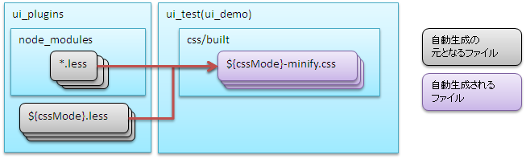

# プラグインビルドコマンド仕様

## 概要

本章では [project-structure](#s1) および [config-command-detail](#s5) を示す。

- プロジェクトの標準的な構成: [structure/directory_layout](ui-framework-directory_layout.md)
- 開発時のフロー: [development_environment/initial_setup](ui-framework-initial_setup.md)

**配置場所**: `ui_plugins/pjconf.json`（[install](#s9) で配置フォルダ変更可、[ui_build](#) でファイル名変更可）

| 設定項目 | 必須 | デフォルト値 | 説明 |
|---|---|---|---|
| pathSettings/projectRootPath | ○ | | プロジェクトルートパス。絶対パスまたは起動ディレクトリからの相対パスで指定 |
| pathSettings/webProjectPath | ○ | | デプロイ対象プロジェクトのパス（プロジェクトルートからの相対パス） |
| pathSettings/demoProjectPath | | `ui_demo` | UIローカルデモプロジェクトのパス |
| pathSettings/testProjectPath | | `ui_test` | UI開発基盤テストプロジェクトのパス |
| pathSettings/pluginProjectPath | | `ui_plugins` | プラグインプロジェクトのパス |
| cssMode | | `["wide", "compact", "narrow"]` | ビルド対象CSSモードの配列 |
| plugins | | 全プラグイン・ファイル | 展開対象プラグインリスト。定義順に展開される。各要素: `pattern`（必須、正規表現）、`exclude`（任意、除外ファイルの正規表現配列） |
| libraryDeployMappings | | | サードパーティライブラリの展開定義。パッケージ名をキー、展開元→展開先マッピングを値に指定。展開元のファイルはパッケージ内の相対パスで指定する。展開元としてフォルダを指定した場合、フォルダ配下のファイルが全て展開される。展開先のファイルは展開先（ui_test等）からの相対パスで指定する。展開先と異なるファイル名を指定することでリネーム配置可能 |
| imgcopy | | 画像コピーなし | 高解像度→低解像度版画像コピーのディレクトリ設定。`fromdirs`（必須: コピー元配列）、`todirs`（必須: コピー先配列） |
| excludedirs | | 隠しディレクトリ（`.`始まり） | 展開時に共通的に除外するディレクトリ名の配列 |

設定例:
```json
{
  "pathSettings": {
    "projectRootPath": "../..",
    "webProjectPath": "tutorial/main/web",
    "demoProjectPath": "ui_demo",
    "testProjectPath": "ui_test",
    "pluginProjectPath": "ui_plugins"
  },
  "cssMode": ["wide", "compact", "narrow"],
  "plugins": [
    { "pattern": "nablarch-.*", "exclude": ["hogeRegExp1", "hogeRegExp2"] },
    { "pattern": "tutorial-.*" },
    { "pattern": "requirejs" },
    { "pattern": "jquery" }
  ],
  "libraryDeployMappings": {
    "jquery": { "dist/jquery.js": "js/jquery.js" },
    "requirejs": { "require.js": "js/require.js" },
    "sugar": { "release/sugar-full.development.js": "js/sugar.js" },
    "font-awesome": { "fonts/fonts*": "fonts/fonts*", "css/font-awesome.min.css": "css/font-awesome.min.css" }
  },
  "imgcopy": {
    "fromdirs": ["img/narrow/high", "img/wide/high"],
    "todirs": ["img/wide/low", "img/narrow/high", "img/narrow/low"]
  },
  "excludedirs": ["hoge"]
}
```

## インストールコマンド

**実行ファイル**

| 配置プロジェクト | 配置フォルダ | Windows | Linux |
|---|---|---|---|
| nablarch_plugins_bundle | /bin | install.bat | install.sh |

**環境変数**

| 環境変数名 | 必須 | 設定内容 |
|---|---|---|
| PROJECT_ROOT | ○ | インストール先業務プロジェクトのルートフォルダ |
| UI_PLUGINS_DIRS | | プラグインのインストール先（プロジェクトルートからの相対パス）。複数はカンマ区切り。省略時は`ui_plugins` |

**処理内容**

1. package.jsonとlastInstallPackage.jsonを比較し不要パッケージを削除、キャッシュ情報を削除
2. 全プラグインをキャッシュとして登録し、ローカルレジストリサーバを起動。package.jsonのdependencies/devDependenciesに従いパッケージをインストール

> **注意**: install.batで変更管理済みのpluginを削除するとIDE上からコミットできないことがある。その場合、別のクライアントを利用してコミットすること。

<details>
<summary>keywords</summary>

プラグインビルドコマンド, プロジェクト構成, 設定ファイル概要, 開発フロー, pjconf.json, pathSettings, cssMode, plugins, libraryDeployMappings, imgcopy, excludedirs, ビルド設定, プロジェクトパス設定, プラグイン展開設定, インストールコマンド, install.bat, install.sh, PROJECT_ROOT, UI_PLUGINS_DIRS, プラグインインストール, キャッシュ削除, nablarch_plugins_bundle

</details>

## 想定されるプロジェクト構成ごとの設定例

想定されるプロジェクト構成ごとのプラグインビルドコマンド設定例を示す。設定例に示していない項目は [config-file](#s6) や [build-command](#s8) を参照して必要に応じて修正すること。

**配置場所**: `ui_plugins/css/${デプロイ先種別}/${表示モード}.less`

デプロイ先種別として指定可能な値:

| デプロイ先種別 | デプロイ先 |
|---|---|
| `ui_public` | デプロイ対象プロジェクトのルートフォルダ |
| `ui_test` | UI開発基盤テスト用フォルダ（ui_test）、UIローカルデモ用フォルダ（ui_demo） |

[pjconf_json](#s7) の`cssMode`で指定されたモードに対応するlessファイルをデプロイ先種別ごとに作成する必要がある。例えば`["wide", "compact", "narrow"]`の場合、以下のファイルが必要:
```bash
ui_plugins/
 └── css/
      ├── ui_public/
      │    ├── wide.less
      │    ├── compact.less
      │    └── narrow.less
      └── ui_test/
           ├── wide.less
           ├── compact.less
           └── narrow.less
```

lessファイルのフォーマット（インポート対象ファイル名はファイル配置フォルダからの相対パスで指定）:
```css
@import "../../node_modules/nablarch-widget-field-base/ui_public/css/field/base";
@import "../../node_modules/nablarch-widget-field-base/ui_public/css/field/base-wide";
```

> **注意**: 複数のlessファイル内で同一セレクタが記述されている場合、後に記述されたセレクタの内容で上書きされる。そのためlessファイルをインポートする順序が重要であり、[ui_genless](#) で生成した雛形を適宜修正する必要がある。

## UIビルドコマンド

**実行ファイル**

| 配置プロジェクト | 配置フォルダ | Windows | Linux |
|---|---|---|---|
| 業務プロジェクト(tutorial_project) | /ui_plugins/bin | ui_build.bat | ui_build.sh |

**環境変数**

| 環境変数名 | 必須 | 設定内容 |
|---|---|---|
| PROJECT_CONF | ○ | 使用するファイル展開設定ファイルのパス |

**処理内容**

1. 前回ビルドファイルの削除
2. Nablarch提供プラグインの展開
3. 外部ライブラリの展開
4. JavaScriptの自動生成
5. CSSの自動生成
6. ドキュメントの生成
7. 画像ファイルのコピー
8. 重複ファイルの表示

<details>
<summary>keywords</summary>

プロジェクト構成設定例, config-file, build-command, 設定ファイル参照, less, lessインポート, ui_public, ui_test, @import, 表示モード, CSSモード, デプロイ先種別, UIビルドコマンド, ui_build.bat, ui_build.sh, PROJECT_CONF, UIビルド, JavaScript自動生成, CSS自動生成

</details>

## デプロイ対象プロジェクトが１つの場合

全ての画面で共通のプラグインを使用する場合の構成。Nablarch標準UIプラグイン、プロジェクト固有UIプラグイン、UIローカルデモ用プロジェクト、UI開発基盤テスト用プロジェクト、デプロイ対象プロジェクトがそれぞれ１つずつ配置される。


### [install](#s9) の設定

ファイル: `/nablarch_plugins_bundle/bin/install.bat`

| 環境変数名 | 設定値 | 備考 |
|---|---|---|
| PROJECT_ROOT | "../../tutorial_project" | コマンドの起動フォルダはnablarch_plugins_bundle/binとなるため、そこからの相対パス |
| UI_PLUGINS_DIRS | "ui_plugins" | |

### [pjconf_json](#s7) の設定

ファイル: `/tutorial_project/ui_plugins/pjconf.json`

| 設定項目 | 設定値 | 備考 |
|---|---|---|
| pathSettings/projectRootPath | "../.." | コマンドの起動フォルダはtutorial_project/ui_plugins/binとなるため、そこからの相対パス |
| pathSettings/webProjectPath | "tutorial/main/web" | |
| pathSettings/demoProjectPath | "ui_demo" | |
| pathSettings/testProjectPath | "ui_test" | |
| pathSettings/pluginProjectPath | "ui_plugins" | |

プラグインや外部ライブラリを各環境（ui_test、ui_demoなど）に展開後、CSSおよびJavaScriptファイルの一部を各環境毎に自動生成する。CSS自動生成はCSSの自動生成（[generate-file](#)）、JavaScript自動生成はJavaScriptの自動生成（[generate_javascript](#)）を参照。

## lessインポート定義雛形生成コマンド

**実行ファイル**

| 配置プロジェクト | 配置フォルダ | Windows | Linux |
|---|---|---|---|
| 業務プロジェクト(tutorial_project) | /ui_plugins/bin | ui_genless.bat | ui_genless.sh |

**環境変数**

| 環境変数名 | 必須 | 設定内容 |
|---|---|---|
| PROJECT_CONF | ○ | 使用するファイル展開設定ファイルのパス |

**処理内容**

lessファイルを抽出しlessインポート定義ファイルの雛形を自動生成する。lessファイルはインポート順序が重要なため、生成された雛形を適宜修正すること。

インポート定義のソート順:

1. nablarch-css-core/**/reset.less
2. nablarch-css-core/**/*.less
3. nablarch-css-*/**/*.less
4. (プラグイングループ)-base/**/*.less
5. (プラグイングループ)-base/**/*-(表示モード).less
6. (プラグイングループ)-*/**/*.less
7. (プラグイングループ)-*/**/*-(表示モード).less

プラグイングループ: プラグイン名の最後のハイフンより前の部分（例: nablarch-widget-box-base, nablarch-widget-box-content, nablarch-widget-box-imgは`nablarch-widget-box`として同一グループ）。

nablarch-css-*以外のプラグインは [pjconf_json](#s7) のpluginsで指定された順序でソートされる。

<details>
<summary>keywords</summary>

デプロイ対象プロジェクト単一, 共通プラグイン, install.bat, pjconf.json, PROJECT_ROOT, UI_PLUGINS_DIRS, pathSettings/projectRootPath, pathSettings/webProjectPath, pathSettings/demoProjectPath, pathSettings/testProjectPath, pathSettings/pluginProjectPath, 自動生成, CSS生成, JavaScript生成, プラグイン展開後処理, lessインポート定義, ui_genless.bat, ui_genless.sh, PROJECT_CONF, lessファイル, インポート順序, プラグイングループ

</details>

## デプロイ対象プロジェクト複数の場合(プラグインは共通)

デプロイ対象プロジェクトを複数（外部公開サイト用・管理サイト用等）に分割するが、サイト間でUI標準が共通（基本的な画面レイアウト等が大きく変化しない）場合の構成。Nablarch標準UIプラグイン・プロジェクト固有UIプラグイン・UI開発基盤テスト用プロジェクトが各１つ、UIローカルデモ用プロジェクト・デプロイ対象プロジェクトが外部公開サイト用および管理サイト用でそれぞれ２つずつ配置される。


### [install](#s9) の設定

ファイル: `/nablarch_plugins_bundle/bin/install.bat`

| 環境変数名 | 設定値 | 備考 |
|---|---|---|
| PROJECT_ROOT | "../../tutorial_project" | コマンドの起動フォルダはnablarch_plugins_bundle/binとなるため、そこからの相対パス |
| UI_PLUGINS_DIRS | "ui_plugins" | |

### [pjconf_json](#s7) の設定（外部公開サイト用）

ファイル: `/tutorial_project/ui_plugins/pjconf_public.json`（標準のpjconf.jsonをコピー）

| 設定項目 | 設定値 | 備考 |
|---|---|---|
| pathSettings/projectRootPath | "../.." | コマンドの起動フォルダはtutorial_project/ui_plugins/binとなるため、そこからの相対パス |
| pathSettings/webProjectPath | "web_public/main/web" | |
| pathSettings/demoProjectPath | "ui_demo_public" | 業務画面は個別で作成するため、管理サイトと分ける |
| pathSettings/testProjectPath | "ui_test" | プラグインは共通のため、管理サイト用と共用 |
| pathSettings/pluginProjectPath | "ui_plugins" | プラグインは共通のため、管理サイト用と共用 |

### [ui_build](#) の設定（外部公開サイト用）

ファイル: `/tutorial_project/ui_plugins/bin/ui_build_public.bat`（標準のui_build.batをコピー）

| 環境変数名 | 設定値 | 備考 |
|---|---|---|
| PROJECT_CONF | "../pjconf_public.json" | コマンドの起動フォルダはnablarch_plugins_bundle/binとなるため、そこからの相対パス |

### [pjconf_json](#s7) の設定（管理サイト用）

ファイル: `/tutorial_project/ui_plugins/pjconf_manage.json`（標準のpjconf.jsonをコピー）

| 設定項目 | 設定値 | 備考 |
|---|---|---|
| pathSettings/projectRootPath | "../.." | コマンドの起動フォルダはtutorial_project/ui_plugins/binとなるため、そこからの相対パス |
| pathSettings/webProjectPath | "web_manage/main/web" | |
| pathSettings/demoProjectPath | "ui_demo_manage" | 業務画面は個別で作成するため、外部公開サイトと分ける |
| pathSettings/testProjectPath | "ui_test" | プラグインは共通のため、外部公開サイト用と共用 |
| pathSettings/pluginProjectPath | "ui_plugins" | プラグインは共通のため、外部公開サイト用と共用 |

### [ui_build](#) の設定（管理サイト用）

ファイル: `/tutorial_project/ui_plugins/bin/ui_build_manage.bat`（標準のui_build.batをコピー）

| 環境変数名 | 設定値 | 備考 |
|---|---|---|
| PROJECT_CONF | "../pjconf_manage.json" | コマンドの起動フォルダはnablarch_plugins_bundle/binとなるため、そこからの相対パス |

**CSS自動生成ファイル**:

| 生成先フォルダ | 生成ファイル | 元ファイル |
|---|---|---|
| `css/built` | `${cssMode}-minify.css` | :ref:`lessImport_less` で定義されたCSSファイル |

[pjconf_json](#s7) の`cssMode`で指定されたモードのみが生成対象。例えば`["wide", "compact", "narrow"]`を指定した場合:
```bash
css/
 └── built/
      ├── wide-minify.css
      ├── compact-minify.css
      └── narrow-minify.css
```



## ローカル動作確認用サーバ起動コマンド

**実行ファイル**

| 配置プロジェクト | 配置フォルダ | Windows | Linux |
|---|---|---|---|
| 業務プロジェクト(tutorial_project) | /ui_test, /ui_demo | ローカル画面確認.bat | localServer.sh |

**処理内容**

ローカル動作確認用のサーバを起動する。

<details>
<summary>keywords</summary>

デプロイ対象プロジェクト複数, 共通プラグイン, 外部公開サイト, 管理サイト, pjconf_public.json, pjconf_manage.json, ui_build_public.bat, ui_build_manage.bat, PROJECT_CONF, pathSettings/projectRootPath, pathSettings/webProjectPath, pathSettings/demoProjectPath, pathSettings/testProjectPath, pathSettings/pluginProjectPath, CSS自動生成, minify.css, cssMode, css/built, lessファイル, ローカル動作確認サーバ, localServer.sh, ローカル画面確認.bat, ローカルサーバ起動, ui_test, ui_demo

</details>

## デプロイ対象プロジェクト複数の場合(プラグインも個別)

デプロイ対象プロジェクトを複数（外部公開サイト用・管理サイト用等）に分割し、サイト間でUI標準が大きく異なる（適用するUI標準が変化する）場合の構成。Nablarch標準UIプラグインが１つ、プロジェクト固有UIプラグイン・UI開発基盤テスト用プロジェクト・UIローカルデモ用プロジェクト・デプロイ対象プロジェクトが外部公開サイト用および管理サイト用でそれぞれ２つずつ配置される。


### [install](#s9) の設定

ファイル: `/nablarch_plugins_bundle/bin/install.bat`

| 環境変数名 | 設定値 | 備考 |
|---|---|---|
| PROJECT_ROOT | "../../tutorial_project" | コマンドの起動フォルダはnablarch_plugins_bundle/binとなるため、そこからの相対パス |
| UI_PLUGINS_DIRS | "ui_plugins_public,ui_plugins_manage" | |

### [pjconf_json](#s7) の設定（外部公開サイト用）

ファイル: `/tutorial_project/ui_plugins_public/pjconf.json`（標準のui_pluginsフォルダ全体をコピー）

| 設定項目 | 設定値 | 備考 |
|---|---|---|
| pathSettings/projectRootPath | "../.." | コマンドの起動フォルダはtutorial_project/ui_plugins_public/binとなるため、そこからの相対パス |
| pathSettings/webProjectPath | "web_public/main/web" | |
| pathSettings/demoProjectPath | "ui_demo_public" | 業務画面は個別で作成するため、管理サイトと分ける |
| pathSettings/testProjectPath | "ui_test_public" | プラグインも個別のため、管理サイトと分ける |
| pathSettings/pluginProjectPath | "ui_plugins_public" | プラグインも個別のため、管理サイトと分ける |

### [pjconf_json](#s7) の設定（管理サイト用）

ファイル: `/tutorial_project/ui_plugins_manage/pjconf.json`（標準のui_pluginsフォルダ全体をコピー）

| 設定項目 | 設定値 | 備考 |
|---|---|---|
| pathSettings/projectRootPath | "../.." | コマンドの起動フォルダはtutorial_project/ui_plugins_manage/binとなるため、そこからの相対パス |
| pathSettings/webProjectPath | "web_manage/main/web" | |
| pathSettings/demoProjectPath | "ui_demo_manage" | 業務画面は個別で作成するため、外部公開サイトと分ける |
| pathSettings/testProjectPath | "ui_test_manage" | プラグインも個別のため、外部公開サイトと分ける |
| pathSettings/pluginProjectPath | "ui_plugins_manage" | プラグインも個別のため、外部公開サイトと分ける |

**JavaScript自動生成ファイル**（表の記述順に生成）:

| 生成先フォルダ | 生成ファイル | 元ファイル |
|---|---|---|
| `js/nablarch` | `ui.js` | `js/nablarch/ui`配下のJavaScriptファイル |
| `js` | `nablarch-minify.js` | 業務画面から参照されるJavaScriptファイル |
| `js/build` | `devtool_conf.js` | `autoconf.js`で検出されたJavaScriptファイル |
| `js` | `devtool.js` | `devtool_conf.js`で定義されたJavaScriptファイル |


## サーバ動作確認用サーバ起動コマンド

**実行ファイル**

| 配置プロジェクト | 配置フォルダ | Windows | Linux |
|---|---|---|---|
| 業務プロジェクト(tutorial_project) | /ui_test | サーバ動作確認.bat | uiTestServer.sh |

**処理内容**

サーバ動作確認用のサーバを起動する。

<details>
<summary>keywords</summary>

デプロイ対象プロジェクト複数, 個別プラグイン, 外部公開サイト, 管理サイト, ui_plugins_public, ui_plugins_manage, UI_PLUGINS_DIRS, pathSettings/projectRootPath, pathSettings/webProjectPath, pathSettings/demoProjectPath, pathSettings/pluginProjectPath, pathSettings/testProjectPath, JavaScript自動生成, ui.js, nablarch-minify.js, devtool_conf.js, devtool.js, autoconf.js, サーバ動作確認, uiTestServer.sh, サーバ動作確認.bat, 動作確認サーバ起動, ui_test

</details>

## プラグインビルドで使用するコマンドや設定ファイルの詳細仕様

プラグインビルドで使用するコマンドおよび設定ファイルの詳細仕様:

- [config-file](#s6)
- [generate-file](#)
- [build-file](#)
- [build-command](#s8)

各種設定ファイルの内容に基づき、プラグインや外部ライブラリをui_test、ui_demoなどの環境毎に展開する。プラグインの展開仕様は[build-file](#)、外部ライブラリの展開仕様は外部ライブラリの展開を参照。

<details>
<summary>keywords</summary>

コマンド詳細仕様, 設定ファイル詳細, config-file, generate-file, build-file, build-command, プラグイン展開, 外部ライブラリ展開, ui_test, ui_demo, 環境展開

</details>

## 設定ファイル

プラグインビルドコマンドで使用する設定ファイル一覧:

| ファイル名 | 実ファイル名 | 概要 |
|---|---|---|
| [pjconf_json](#s7) | pjconf.json | 環境毎のファイル展開設定ファイル |
| :ref:`lessImport_less` | ${cssMode}.less | 表示モードごとにインポートするファイルの定義 |

**参照設定ファイル**: [pjconf_json](#s7)

各プラグイン内フォルダに応じた展開先:

| プラグイン内のフォルダ | 展開先プロジェクト |
|---|---|
| `ui_public` | UIローカルデモ用プロジェクト、UI開発基盤テスト用プロジェクト、デプロイ対象プロジェクト |
| `ui_local` | UIローカルデモ用プロジェクト、UI開発基盤テスト用プロジェクト |
| `ui_test` | UI開発基盤テスト用プロジェクトのみ |

> **注意**: lessファイルは展開されない。自動生成された`*-minify.css`ファイルのみが展開される（[generate-file](#) 参照）。

> **注意**: プラグイン間で同一展開先のファイルが検出された場合、重複ファイルとしてコマンド終了時に以下のフォーマットで一覧表示される:
> ```
> duplicate file detected!!
> {
>   "<展開先ファイル名>": [
>     "<プラグイン1>",
>     "<プラグイン2>",
>     ...
>   ]
> }
> ```
> 最後に表示されたプラグインのファイルが適用される。問題がある場合は[pjconf_json](#s7)で反映順序を制御するか、プラグイン内のファイル構成を見直す必要がある。

<details>
<summary>keywords</summary>

設定ファイル一覧, pjconf.json, cssMode.less, 環境毎ファイル展開設定, 表示モード, lessImport, ui_public, ui_local, ui_test, プラグイン展開仕様, 重複ファイル検出, minify.css展開

</details>

## 外部ライブラリの展開

**参照設定ファイル**: [pjconf_json](#s7)

[pjconf_json](#s7) の`libraryDeployMappings`定義に従い、ライブラリ内の必要なファイルのみを配布する。`libraryDeployMappings`の定義方法は[pjconf_json](#s7)を参照。

<details>
<summary>keywords</summary>

libraryDeployMappings, 外部ライブラリ, サードパーティ, ライブラリ展開

</details>

## ビルドコマンド

| コマンド名 | Windows実行ファイル | 概要 |
|---|---|---|
| [install](#s9) | `install.bat` | Nablarch提供プラグインおよび外部ライブラリをプロジェクトフォルダ配下に取り込む |
| [ui_build](#) | `ui_build.bat` | Nablarch提供プラグイン・プロジェクト開発プラグイン・外部ライブラリを各フォルダに展開し、環境固有の自動生成ファイルを生成 |
| [ui_genless](#) | `ui_genless.bat` | 各表示モードのlessインポート定義ファイルの雛形を作成 |
| :ref:`localServer` | `ローカル画面確認.bat` | ローカル動作確認用サーバを起動 |
| [ui_demo](#) | `サーバ動作確認.bat` | サーバ動作確認用サーバを起動 |

<details>
<summary>keywords</summary>

install.bat, ui_build.bat, ui_genless.bat, ローカル画面確認.bat, サーバ動作確認.bat, ビルドコマンド一覧

</details>
