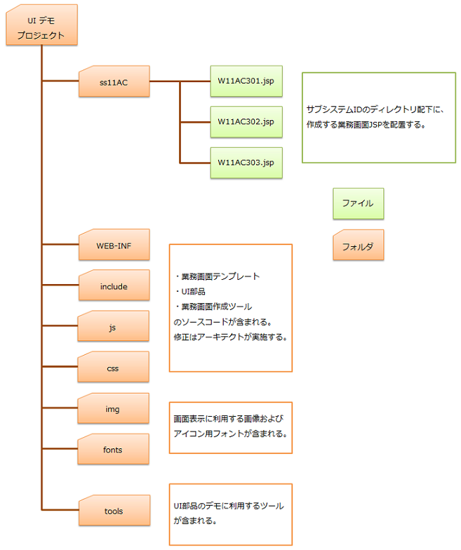

# 業務画面JSP作成時のディレクトリ構造

## 業務画面JSP作成時のディレクトリ構造

業務画面JSPのレイアウト・動作をブラウザで確認するには、以下のディレクトリ構造に従ってファイルを配置し、「ローカル画面確認.bat」を実行する。

| ファイル・ディレクトリ | 内容 |
|---|---|
| 業務画面JSP | サブシステムIDのディレクトリ直下（`ss11AC/` など）に配置。ファイル名は `画面ID.jsp`。モック動作させる場合、サブディレクトリへの配置は不可。 |
| WEB-INF | サーバ上の構成と同じ。業務画面テンプレート・ウィジェットを含む。業務設計者・業務開発者は直接修正しない。 |
| include | 業務画面内の共通領域JSPファイル群。テンプレートからインクルードされる。業務設計者・業務開発者は直接修正しない。 |
| js | ブラウザ上で動作するスクリプト。業務設計者・業務開発者は直接修正しない。 |
| css | CSSファイル。業務設計者・業務開発者は直接修正しない。 |
| img | 画面表示用画像ファイル。業務設計者・業務開発者は直接修正しない。 |
| fonts | 画面表示用アイコンフォント。業務設計者・業務開発者は直接修正しない。 |
| tools | UI部品動作デモ用ツール。業務設計者・業務開発者は直接修正しない。 |

keywords

ディレクトリ構造, 業務画面JSP, ローカル画面確認, WEB-INF, サブシステムID, ウィジェット, モック動作

