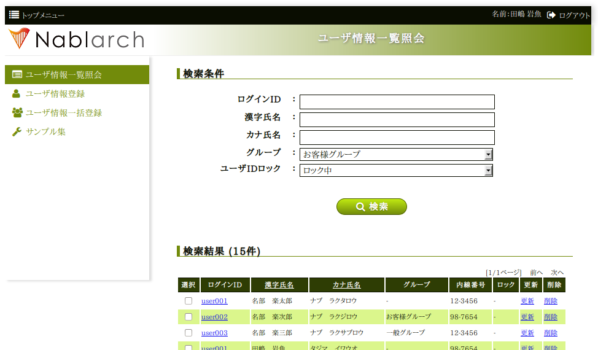

# UI標準修正事例一覧

本章では、UI標準に対する主要な修正要望に関して、以下の観点で解説している。

1. 具体的に何をどのように修正すればよいか。
2. 修正による影響範囲とコストはどの程度か。

## UI標準1.1. 対応する端末とブラウザ

### 対応ブラウザを追加したい

この章の冒頭で述べているように、一般的なWEB標準に準拠するブラウザであれば、多少の表示上の差異があっても
動作上の問題はさほどないと考えられるが、プロジェクト側で対応ブラウザを追加する場合は、
当該の端末でのテストを十分に実施する必要がある。

テストの結果、修正を要する問題が検出された場合、当該のソースコード(プラグイン)を直接修正すると、
既存の対応ブラウザ上の挙動に問題を生じさせる危険性がある。

このため、ブラウザ固有の特性や不具合に起因する問題への対処は [特定端末向けパッチプラグイン](../../component/ui-framework/ui-framework-reference-ui-plugin.md#特定端末向けパッチプラグイン)
としてまとめられている。
これらのプラグインでは **nablarch-device-fix-base** が出力する環境固有のCSSクラスや
グローバル変数を参照することにより、既存コードに影響しない形で特定環境向けの対応を行なっている。

新規対応ブラウザ向けの対処を行う場合は、既存の [特定端末向けパッチプラグイン](../../component/ui-framework/ui-framework-reference-ui-plugin.md#特定端末向けパッチプラグイン)
を参考にして新規にプラグインを追加すること。

### どうしてもIE6/7はサポートできないのか?

現状のUI標準およびUI開発基盤ではIE6/7をサポートしていない。
だが、プロジェクトの要件としてどうしても必要であれば、
これらのブラウザをサポートすることは技術的には可能である。

ただし、IE6/7をサポートする場合、対応コストの増大に加えて、以下の制約が発生する。

**1. アイコンが表示できない**

IE6では Web Font をサポートしていないので、アイコンを表示することができない。

**2. マウスオーバ時の背景色反転ができない。**

UI標準ではボタンやメニュー上にマウスが移動した場合に背景表示色を
反転させるとしているが、IE6ではリンク要素以外での :hover 擬似セレクタをサポートしていないため、
そのような効果は発生しない。

なお、IE8の制約(ボタンの角丸表現、陰影表現ができない)はIE6/7にも当てはまる。
実際にIE6のサポートが必要な場合は、ADCのNablarch担当窓口まで問い合わせを行うこと。

### 表示モードを変更したい

[UI標準2.1. 端末の画面サイズと表示モード](../../component/ui-framework/ui-framework-reference-ui-standard.md#ui標準21-端末の画面サイズと表示モード) を参照。

## UI標準1.2. 使用技術

### 使用するJavaScriptライブラリを追加したい

外部のスタイルシートおよびJavaScriptを追加する場合は
下記のプラグインを修正すること。

| 修正内容 | 修正対象プラグイン |
|---|---|
| 外部スタイルシートの追加 | **nablarch-template-head** |
| JavaScriptの追加(minifyなし) | **nablarch-template-js_include** |
| JavaScriptの追加(minifyあり) | **nablarch-dev-tool-ui-build** |

## UI標準2. 画面構成

### 画面の配色を変更したい

画面の全体的な配色は **nablarch-css-color-default** プラグイン内のスタイル定義により
一括変更することができる。

デフォルトの配色は以下のような設定になっている。

```css
// Nablarchブランドカラーを基調とした配色設定
@baseColor  : rgb(255, 255, 255); // 白
@mainColor1 : rgb(235, 92,  21);  // オレンジ
@mainColor2 : rgb(76,  42,  26);  // こげ茶
@subColor   : rgb(170, 10,  10);  // 赤
```

各パラメータの役割は以下のとおり。

**@baseColor**

背景色

**@mainColor1**

前景色1 : メニューや見出し、入力部品などの主要要素の配色として使用

**@mainColor2**

前景色2 : 主に文字色として使用

**@subColor**

差し色 : 上記の3色以外で特にアクセントが必要な場合に使用

> **Note:**
> **[配色のポイント]**

> **@mainColor2** が基本文字色になるので
> **@mainColor1** の **@baseColor** に対するコントラストよりも、
> **@mainColor2** の **@baseColor** に対するコントラストのほうが強くなるように設定するとよい。

以下は配色の調整例である。
左上のロゴは画像なので、別途差し替えが必要である。

```css
@baseColor  : rgb(255, 255, 255);              // 白
@mainColor1 : darken(rgb(173, 210,  16), 15%); // 薄い緑
@mainColor2 : darken(rgb(82,  108,   8), 20%); // 濃い緑
@subColor   : rgb(348, 99, 8);                 // オレンジ
```



### システムロゴ画像を差し替えたい

画面左上に表示されるシステムロゴ画像は **nablarch-template-app_header** に含まれているので、
これを差し替えればよい。

### ヘッダー領域の表示内容を修正したい

トップナビゲーション部は **nablarch-template-app_nav** プラグインの内容を、
それ以外の部分は **nablarch-template-app_header**  プラグインの内容をそれぞれ修正すること。

### サイドメニュー領域の表示内容を修正したい

**nablarch-template-app_aside** プラグインの内容を修正すること。

省スペース化のため、ナロー、コンパクトモード時にサイドメニューをスライド表示したい場合は、
**nablarch-widget-slide_menu** プラグインをサンプルで提供しているため、必要に応じて利用すること。

> **Attention:**
> **nablarch-widget-slide_menu** プラグインは **nablarch-template-app_aside** に依存しているため、利用する際には両方のプラグインが必要になる。

### フッター領域の表示内容を修正したい

**nablarch-template-app_aside** プラグインの内容を修正すること。

### 共通エラー・メッセージ表示領域の表示を調整したい

**共通エラーメッセージの表示スタイル**

**nablarch-css-common** プラグインの **ui_public/css/common/nablarch.less** を修正する。

**共通エラーメッセージの表示内容**

**nablarch-template-page** プラグインの **ui_public/include/app_error.jsp** を修正する。

**共通エラーメッセージの表示位置**

**nablarch-template-page** プラグインの **ui_public/WEB-INF/tags/template/page_template.tag** を修正する。
(上記インクルードファイルの読み込み位置を修正する。)

## UI標準2.1. 端末の画面サイズと表示モード

### 表示モードの切替条件を変更したい

デフォルトのUI標準では、デバイスもしくはウィンドウの横幅(論理ピクセル数)によって表示モードを決定する。

表示モードの切替条件は、 **nablarch-device-media_query** プラグイン内のタグファイル
( **/ui_public/WEB-INF/tags/device/media.tag** )内に **CSS Media Query** の条件として定義されている。
切替え条件を変更したい場合や特定の表示モードを無効化したい場合などは、
このプラグインをカスタマイズすること。

> **Note:**
> **nablarch-template-head** の **/ui_public/include/html_head.jsp** で使用されることで、
> htmlのheadタグ内にmedia.tagの内容が出力される。

### 表示モードの切替えを無効化したい

PJの要件としてデスクトップ・ラップトップのみをサポートすればよい場合など、
表示モードの切替え自体が不要な場合は **ui_public/include/html_head.jsp**
の中で下記の2行以外の全ての **<n:link>** タグとIEコンディショナルコメントを削除すること。

こうすることで、ウィンドウサイズにかかわらず常にワイドモードで表示するようになる。

```jsp
<n:link rel="stylesheet" type="text/css" href="/css/font-awesome.min.css" />
<n:link rel="stylesheet" type="text/css" href="/css/built/wide-minify.css" />
```

## UI標準2.2. ワイド表示モードの画面構成

### ワイドモードにおける画面内の要素のサイズを全体的に調整したい

ワイドモードにおける画面要素の共通的なサイズは **nablarch-css-conf-wide** プラグイン
の中で既定されている。

* 1ページ内のグリッド数
* 1グリッドの横幅
* グリッド間の間隔
* フォントサイズ
* 入力フィールドやテーブルのグリッド数

これらの設定値を変更することで、全体的なサイズ調整が可能である。

### 特定の画面要素についてワイドモードでの表示を調整したい

ファイル名の末尾が **-wide.less** となっているスタイル定義はワイドモードでのみ読み込まれる。
ワイドモードでのみ必要な表示調整を行う場合は、各プラグインに含まれる上記のようなファイルを修正する。

例えば、以下は **nablarch-template-app_header** の内容である。

```bash
nablarch-template-app_header/
   ├── package.json
   └── ui_public
          ├── css
          │     └── template
          │            ├── header-compact.less
          │            ├── header.less
          │            ├── header-narrow.less
          │            └── header-wide.less
          └── include
                 ├── app_header.jsp
                 └── subwindow_app_header.jsp
```

このプラグインのスタイル定義は、各表示モードで以下のように読み込まれる。

| 表示モード | 読み込まれるスタイルファイル |
|---|---|
| ワイド | header.less header-wide.less |
| コンパクト | header.less header-compact.less |
| ナロー | header.less header-narrow.less |

## UI標準2.3. コンパクト表示モードの画面構成

### コンパクトモードでの表示内容を調整したい

各プラグイン内のスタイルファイルの内、ファイル名の末尾が **-compact.less** で終わるものは
コンパクト表示モードでしか読み込まれない。

コンパクトモードでの表示調整を行う場合は、当該プラグインの上記条件に合致するスタイルファイルを修正すること。
もし、そのようなスタイルファイルが無い場合は新たに追加してもよい。

## UI標準2.4. ナロー表示モードの画面構成

### ナローモードでの表示内容を調整したい

各プラグイン内のスタイルファイルの内、ファイル名の末尾が **-narrow.less** で終わるものは
ナロー表示モードでしか読み込まれない。

ナローモードでの表示調整を行う場合は、当該プラグインの上記条件に合致するスタイルファイルを修正すること。
もし、そのようなスタイルファイルが無い場合は新たに追加すること。

### テーブル表示で横スクロールが発生しないようにしたい

設定により、ナロー表示時に、カラムの一部をデフォルト非表示にし、
タップ操作で表示・非表示を切り替えることができる。(下図参照)


詳細は [ラベル表示用カラムウィジェット](../../component/ui-framework/ui-framework-column-label.md)
の **additional** 属性の解説を参照すること。

## UI標準2.5.画面内の入出力項目に関する共通仕様

### ドメイン型に応じて入出力項目の表示を調整したい

各入出力項目には設計情報としてドメイン型のIDを指定するための **domain** 属性が定義されている。

この属性値は当該項目の **class** 属性にそのまま追加されるので、
ドメインIDと同名のスタイルクラスを定義することにより、
そのドメイン型の入出力項目のスタイルを一括指定できる。

例えば、プロジェクトで定める金額のドメイン型が "Money" で、その表示を一律右寄せで表示するのであれば、
以下のようなスタイル定義を追加すればよい。

```css
.Money {
  align: right;
}
```

### タブキーによるフォーカス移動順番を制御したい

[業務画面ベースレイアウト](../../component/ui-framework/ui-framework-jsp-page-templates.md#業務画面ベースレイアウト) の **tagIndexOrder** 属性により指定することができる。
詳細は当該属性の解説を参照すること。

> **Note:**
> 各画面ごとにタブ移動順序を定義するのは、特にテスト工数への影響が大きいので、
> 顧客側の特段の要望がない限りは、UI標準どおり、ブラウザ既定の動作とすること。

### 入力内容の注記部分の表示を調整したい

注記自体の表示については **nablarch-widget-field-hint** プラグインの各ファイルを修正すること。
フィールド内での注記の表示位置を調整する場合は、 **nablarch-widget-field-base** プラグインの
**ui_public/WEB-INF/tags/widget/field/inputbase.tag** を修正すること。
( **<field:internal_hint>** の配置を変更する。)

### 必須入力項目の表示形式を変更したい

必須入力項目の表示は **nablarch-widget-field-base** プラグイン内の
**ui_public/WEB-INF/tags/widget/base.tag** 内で定義されているので、これを修正すること。

### 単項目精査エラーメッセージの表示を変更したい

フィールド内におけるエラーメッセージの表示位置を調整する場合は、
**nablarch-widget-field-base** プラグインの
**ui_public/WEB-INF/tags/widget/field/inputbase.tag** を修正すること。
( **<div class="fielderror">** の配置を変更する。)

また、エラーメッセージの表示スタイルを変更したい場合は、
同プラグイン内の **ui_public/css/field/base.less** の当該クラス(**.fielderror**)の内容を修正すること。

### ナロー表示モードでのボタン表示順を変更したい

ナローモードのボタン表示順の制御は **nablarch-widget-button** プラグイン内の
**ui_public/css/button/base-narrow.less** で行なっているのでこれを修正すること。

### 認可権限がない場合のボタン／リンクの表示方法を変更したい

認可権限がない場合のボタン／リンクの表示制御は **nablarch-widet-button** プラグイン内の
**ui_public/WEB-INF/tags/widget/button/*.tag** にて行っている。

表示制御を変更する場合はtagファイルの **displayMethod** の内容を修正すること。

## UI標準2.6. WEB標準に準拠しないブラウザでの表示制約

### ブラウザ間の表示差異を極小化したい(IE8の表示に他のブラウザをあわせたい)

IE8でサポートされていない陰影表現および角丸ボックス表示は、
**nablarch-css-core** プラグイン内の **ui_public/css/core/css3.less** 内に定義されている。

ここで定義しているスタイルルール **.border-radius** **.rounded** **.drop-shadow** **.box-shadow**
の内容をそれぞれ削除することによって、全てのブラウザで陰影表現および角丸ボックス表示が無効化される。

## UI標準2.11. 共通エラー画面の構成

### 共通エラー画面の構成を変更したい

共通エラー画面のテンプレートは **nablarch-template-error** プラグインで定義されているので、
このプラグイン内の各ファイルを修正すること。

## UI標準3. UI部品 (UI部品カタログ)

### UI部品の表示・挙動を修正したい

各UI部品は以下の表にあるプラグインで実装されている。
UI部品を修正する場合は、対応するプラグインをそれぞれ修正すること。

**データ表示部品**

| UI部品 | UIウィジェット | 修正対象プラグイン |
|---|---|---|
| テーブル | [一覧テーブルウィジェット](../../component/ui-framework/ui-framework-table-plain.md) | **nablarch-widget-table-plain** |
|  | [検索結果テーブルウィジェット](../../component/ui-framework/ui-framework-table-search-result.md) | **nablarch-widget-table-search_result** |
|  | [マルチレイアウトテーブル](../../component/ui-framework/ui-framework-table-row.md) | **nablarch-widget-table-row** |
|  | [ラベル表示用カラムウィジェット](../../component/ui-framework/ui-framework-column-label.md) | **nablarch-widget-column-label** |
|  | [リンク表示用カラムウィジェット](../../component/ui-framework/ui-framework-column-link.md) | **nablarch-widget-column-link** |
|  | [テーブル複数行選択用チェックボックスカラムウィジェット](../../component/ui-framework/ui-framework-column-checkbox.md) | **nablarch-widget-column-checkbox** |
|  | [テーブル行選択用ラジオボタンカラムウィジェット](../../component/ui-framework/ui-framework-column-radio.md) | **nablarch-widget-column-radio** |
| 画像 | [画像表示ウィジェット](../../component/ui-framework/ui-framework-box-img.md) | **nablarch-widget-box-img** |
| 階層(ツリー)表示 | [階層(ツリー)表示テーブルウィジェット](../../component/ui-framework/ui-framework-table-treelist.md) | **nablarch-widget-table-tree** |

**入力フォーム部品**

| UI部品 | UIウィジェット | 修正対象プラグイン |
|---|---|---|
| チェックボックス | [チェックボックス入力項目ウィジェット](../../component/ui-framework/ui-framework-field-checkbox.md) | **nablarch-widget-field-checkbox** |
|  | [コード値チェックボックス入力項目ウィジェット](../../component/ui-framework/ui-framework-field-code-checkbox.md) |  |
| ラジオボタン | [ラジオボタン入力項目ウィジェット](../../component/ui-framework/ui-framework-field-radio.md) | **nablarch-widget-field-radio** |
|  | [コード値ラジオボタン入力項目ウィジェット](../../component/ui-framework/ui-framework-field-code-radio.md) |  |
| プルダウンリスト | [プルダウン入力項目ウィジェット](../../component/ui-framework/ui-framework-field-pulldown.md) | **nablarch-widget-field-pulldown** |
|  | [コード値プルダウン入力項目ウィジェット](../../component/ui-framework/ui-framework-field-code-pulldown.md) |  |
| リストビルダー | [リストビルダー入力項目ウィジェット](../../component/ui-framework/ui-framework-field-listbuilder.md) | **nablarch-widget-field-listbuilder** |
| 単行テキスト入力 | [単行テキスト入力項目ウィジェット](../../component/ui-framework/ui-framework-field-text.md) | **nablarch-widget-field-text** |
| 複数行テキスト入力 | [複数行テキスト入力項目ウィジェット](../../component/ui-framework/ui-framework-field-textarea.md) | **nablarch-widget-field-textarea** |
| パスワード入力 | [パスワード入力ウィジェット](../../component/ui-framework/ui-framework-field-password.md) | **nablarch-widget-field-password** |
| ファイル選択 | [ファイル選択ウィジェット](../../component/ui-framework/ui-framework-field-file.md) | **nablarch-widget-field-file** |
| カレンダー日付入力 | [カレンダー日付入力ウィジェット](../../component/ui-framework/ui-framework-field-calendar.md) | **nablarch-widget-field-calendar** |
| 自動集計 |  | **nablarch-widget-event-autosum** |
| フォーカス移動制御 | [業務画面ベースレイアウト](../../component/ui-framework/ui-framework-jsp-page-templates.md#業務画面ベースレイアウト) (**tabIndexOrder** 属性値の解説を参照) | **nablarch-template-base** |

**コントロール部品**

| UI部品 | UIウィジェット | 修正対象プラグイン |
|---|---|---|
| ボタン | [ボタン配置ブロック](../../component/ui-framework/ui-framework-button-block.md) [ボタンウィジェット](../../component/ui-framework/ui-framework-button-submit.md) | **nablarch-widget-button** |
| リンク | [リンクウィジェット](../../component/ui-framework/ui-framework-link-submit.md) | **nablarch-widget-link** |

## 開閉可能領域

### 精査エラー時の開閉可能領域の制御を変更したい

開閉可能領域は **nablarch-widget-collapsible** にて実装されている。

入力項目に紐づくエラー(単項目精査エラーなど)がある場合、その入力項目のform内にある開閉可能領域、
入力項目に紐づかないエラー(ページ上部のエラー表示)がある場合、業務領域にある開閉可能領域が開くようになっている。

この制御を変更したい場合は、 **nablarch-widget-collapsible** を修正すること。
