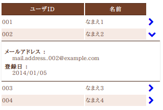

# UI標準修正事例一覧

## UI標準1.1. 対応する端末とブラウザ

## 対応ブラウザを追加したい

プロジェクト側で対応ブラウザを追加する場合は、当該の端末でのテストを十分に実施すること。

テストの結果修正が必要な問題が検出された場合、**当該のソースコード（プラグイン）を直接修正すると、既存の対応ブラウザ上の挙動に問題を生じさせる危険性がある**。このため、ブラウザ固有の特性や不具合に起因する問題への対処は [nablarch-device-fix](ui-framework-reference_ui_plugin.md) としてまとめられている。

**nablarch-device-fix** プラグインは **nablarch-device-fix-base** が出力する環境固有のCSSクラスやグローバル変数を参照することで、既存コードに影響しない形で特定環境向けの対応を行っている。

新規対応ブラウザ向けの対処を行う場合は、既存の [nablarch-device-fix](ui-framework-reference_ui_plugin.md) を参考にして新規プラグインを追加すること。

## IE6/7サポートの制約

現状のUI標準およびUI開発基盤ではIE6/7をサポートしていない。ただし、プロジェクトの要件としてどうしても必要であれば、これらのブラウザをサポートすることは技術的には可能である。

IE6/7をサポートする場合、**対応コストの増大**に加えて、以下の制約が発生する。

1. **アイコンが表示できない**: IE6では `Web Font` をサポートしていないため、アイコンを表示できない。
2. **マウスオーバ時の背景色反転ができない**: IE6ではリンク要素以外での `:hover` 擬似セレクタをサポートしていないため、マウスオーバ時の背景色反転が発生しない。

IE8の制約（ボタンの角丸表現・陰影表現不可）はIE6/7にも適用される。実際にIE6のサポートが必要な場合は、ADCのNablarch担当窓口まで問い合わせを行うこと。

## 表示モードを変更したい

[ui_standard_2_1](#s3) を参照。

## 共通エラー画面の構成を変更したい

共通エラー画面のテンプレートは **nablarch-template-error** プラグインで定義されている。変更する場合はこのプラグイン内の各ファイルを修正する。

<details>
<summary>keywords</summary>

対応ブラウザ追加, IE6/7制約, nablarch-device-fix, Web Font非対応, :hover疑似セレクタ, nablarch-device-fix-base, 表示モード切替, プラグイン直接修正禁止, ADCサポート窓口, 共通エラー画面, nablarch-template-error, エラー画面テンプレート, エラー画面カスタマイズ

</details>

## UI標準1.2. 使用技術

## 使用するJavaScriptライブラリを追加したい

| 修正内容 | 修正対象プラグイン |
|---|---|
| 外部スタイルシートの追加 | **nablarch-template-head** |
| JavaScriptの追加（minifyなし） | **nablarch-template-js_include** |
| JavaScriptの追加（minifyあり） | **nablarch-dev-tool-ui-build** |

## UI部品の表示・挙動を修正したい

各UI部品を修正する場合は、対応するプラグインを修正する。

**データ表示部品**

| UI部品 | UIウィジェット | 修正対象プラグイン |
|---|---|---|
| テーブル | [../reference_jsp_widgets/table_plain](ui-framework-table_plain.md) | **nablarch-widget-table-plain** |
| テーブル | [../reference_jsp_widgets/table_search_result](ui-framework-table_search_result.md) | **nablarch-widget-table-search_result** |
| テーブル | [../reference_jsp_widgets/table_row](ui-framework-table_row.md) | **nablarch-widget-table-row** |
| テーブル | [../reference_jsp_widgets/column_label](ui-framework-column_label.md) | **nablarch-widget-column-label** |
| テーブル | [../reference_jsp_widgets/column_link](ui-framework-column_link.md) | **nablarch-widget-column-link** |
| テーブル | [../reference_jsp_widgets/column_checkbox](ui-framework-column_checkbox.md) | **nablarch-widget-column-checkbox** |
| テーブル | [../reference_jsp_widgets/column_radio](ui-framework-column_radio.md) | **nablarch-widget-column-radio** |
| 画像 | [../reference_jsp_widgets/box_img](ui-framework-box_img.md) | **nablarch-widget-box-img** |
| 階層(ツリー)表示 | [../reference_jsp_widgets/table_treelist](ui-framework-table_treelist.md) | **nablarch-widget-table-tree** |

**入力フォーム部品**

| UI部品 | UIウィジェット | 修正対象プラグイン |
|---|---|---|
| チェックボックス | [../reference_jsp_widgets/field_checkbox](ui-framework-field_checkbox.md), [../reference_jsp_widgets/field_code_checkbox](ui-framework-field_code_checkbox.md) | **nablarch-widget-field-checkbox** |
| ラジオボタン | [../reference_jsp_widgets/field_radio](ui-framework-field_radio.md), [../reference_jsp_widgets/field_code_radio](ui-framework-field_code_radio.md) | **nablarch-widget-field-radio** |
| プルダウンリスト | [../reference_jsp_widgets/field_pulldown](ui-framework-field_pulldown.md), [../reference_jsp_widgets/field_code_pulldown](ui-framework-field_code_pulldown.md) | **nablarch-widget-field-pulldown** |
| リストビルダー | [../reference_jsp_widgets/field_listbuilder](ui-framework-field_listbuilder.md) | **nablarch-widget-field-listbuilder** |
| 単行テキスト入力 | [../reference_jsp_widgets/field_text](ui-framework-field_text.md) | **nablarch-widget-field-text** |
| 複数行テキスト入力 | [../reference_jsp_widgets/field_textarea](ui-framework-field_textarea.md) | **nablarch-widget-field-textarea** |
| パスワード入力 | [../reference_jsp_widgets/field_password](ui-framework-field_password.md) | **nablarch-widget-field-password** |
| ファイル選択 | [../reference_jsp_widgets/field_file](ui-framework-field_file.md) | **nablarch-widget-field-file** |
| カレンダー日付入力 | [../reference_jsp_widgets/field_calendar](ui-framework-field_calendar.md) | **nablarch-widget-field-calendar** |
| 自動集計 | — | **nablarch-widget-event-autosum** |
| フォーカス移動制御 | [base_layout_tag](ui-framework-jsp_page_templates.md) (**tabIndexOrder** 属性値の解説を参照) | **nablarch-template-base** |

**コントロール部品**

| UI部品 | UIウィジェット | 修正対象プラグイン |
|---|---|---|
| ボタン | [../reference_jsp_widgets/button_block](ui-framework-button_block.md), [../reference_jsp_widgets/button_submit](ui-framework-button_submit.md) | **nablarch-widget-button** |
| リンク | [../reference_jsp_widgets/link_submit](ui-framework-link_submit.md) | **nablarch-widget-link** |

<details>
<summary>keywords</summary>

JavaScriptライブラリ追加, 外部スタイルシート追加, nablarch-template-head, nablarch-template-js_include, nablarch-dev-tool-ui-build, minify, UI部品カタログ, UIウィジェット, データ表示部品, 入力フォーム部品, コントロール部品, nablarch-widget-table-plain, nablarch-widget-field-checkbox, nablarch-widget-field-pulldown, nablarch-widget-button, nablarch-widget-event-autosum, nablarch-template-base, nablarch-widget-link, テーブル, 画像, 階層(ツリー)表示, チェックボックス, ラジオボタン, プルダウンリスト, リストビルダー, 単行テキスト入力, 複数行テキスト入力, パスワード入力, ファイル選択, カレンダー日付入力, 自動集計, フォーカス移動制御, ボタン, リンク, tabIndexOrder

</details>

## UI標準2. 画面構成

## 画面の配色を変更したい

**nablarch-css-color-default** プラグイン内のスタイル定義で全体的な配色を一括変更できる。

| パラメータ | 役割 |
|---|---|
| `@baseColor` | 背景色 |
| `@mainColor1` | 前景色1（メニュー・見出し・入力部品などの主要要素の配色） |
| `@mainColor2` | 前景色2（主に文字色） |
| `@subColor` | 差し色（上記3色以外のアクセント） |

> **注意**: `@mainColor2` が基本文字色となるため、`@mainColor1` より `@mainColor2` の `@baseColor` に対するコントラストが強くなるように設定すること。

デフォルト設定:

```css
@baseColor  : rgb(255, 255, 255); // 白
@mainColor1 : rgb(235, 92,  21);  // オレンジ
@mainColor2 : rgb(76,  42,  26);  // こげ茶
@subColor   : rgb(170, 10,  10);  // 赤
```

以下は配色の調整例（緑系配色）。左上のロゴは画像のため、別途差し替えが必要。

```css
@baseColor  : rgb(255, 255, 255);              // 白
@mainColor1 : darken(rgb(173, 210,  16), 15%); // 薄い緑
@mainColor2 : darken(rgb(82,  108,   8), 20%); // 濃い緑
@subColor   : rgb(348, 99, 8);                 // オレンジ
```

## システムロゴ画像を差し替えたい

**nablarch-template-app_header** プラグインに含まれているので、これを差し替えること。

## ヘッダー領域の表示内容を修正したい

- トップナビゲーション部: **nablarch-template-app_nav** プラグイン
- それ以外の部分: **nablarch-template-app_header** プラグイン

## サイドメニュー領域の表示内容を修正したい

**nablarch-template-app_aside** プラグインを修正すること。ナロー・コンパクトモード時のスライド表示には **nablarch-widget-slide_menu** プラグインを利用できる。

> **警告**: **nablarch-widget-slide_menu** は **nablarch-template-app_aside** に依存しているため、利用する際は両方のプラグインが必要。

## フッター領域の表示内容を修正したい

**nablarch-template-app_aside** プラグインを修正すること。

## 共通エラー・メッセージ表示領域の表示を調整したい

| 調整対象 | 修正ファイル |
|---|---|
| 表示スタイル | **nablarch-css-common** の `ui_public/css/common/nablarch.less` |
| 表示内容 | **nablarch-template-page** の `ui_public/include/app_error.jsp` |
| 表示位置 | **nablarch-template-page** の `ui_public/WEB-INF/tags/template/page_template.tag`（インクルードファイルの読み込み位置を修正） |

## 精査エラー時の開閉可能領域の制御を変更したい

開閉可能領域は **nablarch-widget-collapsible** で実装されている。

制御ロジック:
- 入力項目に紐づくエラー（単項目精査エラーなど）がある場合: その入力項目のform内にある開閉可能領域が開く
- 入力項目に紐づかないエラー（ページ上部のエラー表示）がある場合: 業務領域にある開閉可能領域が開く

変更する場合は **nablarch-widget-collapsible** を修正する。

<details>
<summary>keywords</summary>

画面配色変更, nablarch-css-color-default, @baseColor, @mainColor1, @mainColor2, @subColor, darken, nablarch-template-app_header, nablarch-template-app_nav, nablarch-template-app_aside, nablarch-widget-slide_menu, nablarch-template-page, nablarch-css-common, システムロゴ差替, サイドメニュー修正, 共通エラーメッセージ表示, 開閉可能領域, nablarch-widget-collapsible, 精査エラー, 単項目精査エラー, コリアプシブル, エラー時開閉制御

</details>

## UI標準2.1. 端末の画面サイズと表示モード

## 表示モードの切替条件を変更したい

**nablarch-device-media_query** プラグインの `/ui_public/WEB-INF/tags/device/media.tag` 内にCSS Media Queryの条件として定義されている。切替条件の変更や特定表示モードの無効化はこのプラグインをカスタマイズすること。

> **注意**: **nablarch-template-head** の `/ui_public/include/html_head.jsp` で使用されることで、htmlのheadタグ内にmedia.tagの内容が出力される。

## 表示モードの切替えを無効化したい

常にワイドモードで表示する場合、`ui_public/include/html_head.jsp` 内で以下の2行以外の全ての `<n:link>` タグとIEコンディショナルコメントを削除すること。

```jsp
<n:link rel="stylesheet" type="text/css" href="/css/font-awesome.min.css" />
<n:link rel="stylesheet" type="text/css" href="/css/built/wide-minify.css" />
```

<details>
<summary>keywords</summary>

表示モード切替条件変更, nablarch-device-media_query, CSS Media Query, html_head.jsp, ワイドモード固定, 表示モード無効化, media.tag

</details>

## UI標準2.2. ワイド表示モードの画面構成

## ワイドモードにおける画面内の要素のサイズを全体的に調整したい

**nablarch-css-conf-wide** プラグインで以下を設定する。値の変更で全体的なサイズ調整が可能。

- 1ページ内のグリッド数
- 1グリッドの横幅
- グリッド間の間隔
- フォントサイズ
- 入力フィールドやテーブルのグリッド数

## 特定の画面要素についてワイドモードでの表示を調整したい

ファイル名末尾が **-wide.less** のスタイルファイルはワイドモードでのみ読み込まれる。各プラグインのそのようなファイルを修正すること。

各表示モードで読み込まれるスタイルファイル（**nablarch-template-app_header** の例）:

| 表示モード | 読み込まれるスタイルファイル |
|---|---|
| ワイド | header.less、header-wide.less |
| コンパクト | header.less、header-compact.less |
| ナロー | header.less、header-narrow.less |

<details>
<summary>keywords</summary>

ワイドモード表示調整, nablarch-css-conf-wide, グリッド数, フォントサイズ, -wide.less, 全体サイズ調整

</details>

## UI標準2.3. コンパクト表示モードの画面構成

## コンパクトモードでの表示内容を調整したい

ファイル名末尾が **-compact.less** のスタイルファイルはコンパクト表示モードでのみ読み込まれる。該当プラグインのそのようなファイルを修正すること。該当ファイルがない場合は新規追加してよい。

<details>
<summary>keywords</summary>

コンパクトモード, -compact.less, コンパクト表示調整

</details>

## UI標準2.4. ナロー表示モードの画面構成

## ナローモードでの表示内容を調整したい

ファイル名末尾が **-narrow.less** のスタイルファイルはナロー表示モードでのみ読み込まれる。該当プラグインのそのようなファイルを修正すること。該当ファイルがない場合は新規追加すること。

## テーブル表示で横スクロールが発生しないようにしたい

ナロー表示時に、カラムの一部をデフォルト非表示にしてタップ操作で表示・非表示を切り替えることができる。詳細は [../reference_jsp_widgets/column_label](ui-framework-column_label.md) の **additional** 属性を参照すること。



<details>
<summary>keywords</summary>

ナローモード, -narrow.less, テーブル横スクロール抑制, additional属性, カラム非表示, column_label

</details>

## UI標準2.5.画面内の入出力項目に関する共通仕様

## ドメイン型に応じて入出力項目の表示を調整したい

`domain` 属性値はその項目の `class` 属性にそのまま追加されるため、ドメインIDと同名のスタイルクラスを定義することでそのドメイン型の入出力項目のスタイルを一括指定できる。

```css
.Money {
  align: right;
}
```

## タブキーによるフォーカス移動順番を制御したい

[base_layout_tag](ui-framework-jsp_page_templates.md) の **tagIndexOrder** 属性で制御できる。

> **注意**: 各画面ごとにタブ移動順序を定義するとテスト工数への影響が大きいため、顧客側の特段の要望がない限りブラウザ既定の動作とすること。

## 入力内容の注記部分の表示を調整したい

- 注記自体の表示: **nablarch-widget-field-hint** プラグインの各ファイルを修正
- フィールド内での注記の表示位置: **nablarch-widget-field-base** の `ui_public/WEB-INF/tags/widget/field/inputbase.tag` を修正（`<field:internal_hint>` の配置を変更）

## 必須入力項目の表示形式を変更したい

**nablarch-widget-field-base** の `ui_public/WEB-INF/tags/widget/base.tag` を修正すること。

## 単項目精査エラーメッセージの表示を変更したい

- 表示位置: **nablarch-widget-field-base** の `ui_public/WEB-INF/tags/widget/field/inputbase.tag` を修正（`<div class="fielderror">` の配置を変更）
- 表示スタイル: 同プラグインの `ui_public/css/field/base.less` の `.fielderror` クラスを修正

## ナロー表示モードでのボタン表示順を変更したい

**nablarch-widget-button** の `ui_public/css/button/base-narrow.less` を修正すること。

## 認可権限がない場合のボタン／リンクの表示方法を変更したい

**nablarch-widet-button** の `ui_public/WEB-INF/tags/widget/button/*.tag` で表示制御を行っている。`displayMethod` の内容を修正すること。

<details>
<summary>keywords</summary>

ドメイン型, domain属性, タブフォーカス移動順, tagIndexOrder, base_layout_tag, nablarch-widget-field-hint, nablarch-widget-field-base, 必須入力項目, 単項目精査エラーメッセージ, nablarch-widget-button, 認可権限, displayMethod, inputbase.tag

</details>

## UI標準2.6. WEB標準に準拠しないブラウザでの表示制約

## ブラウザ間の表示差異を極小化したい（IE8の表示に他のブラウザをあわせたい）

**nablarch-css-core** の `ui_public/css/core/css3.less` 内で定義されている以下のスタイルルールを削除することで、全ブラウザで陰影表現および角丸ボックス表示が無効化される。

- `.border-radius`
- `.rounded`
- `.drop-shadow`
- `.box-shadow`

<details>
<summary>keywords</summary>

IE8, nablarch-css-core, css3.less, .border-radius, .rounded, .drop-shadow, .box-shadow, 陰影表現無効化, 角丸ボックス無効化, ブラウザ表示差異極小化

</details>
