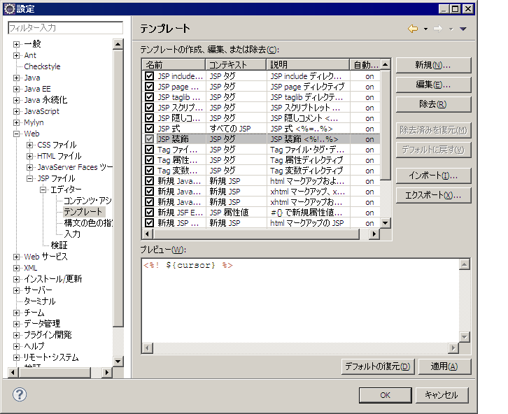
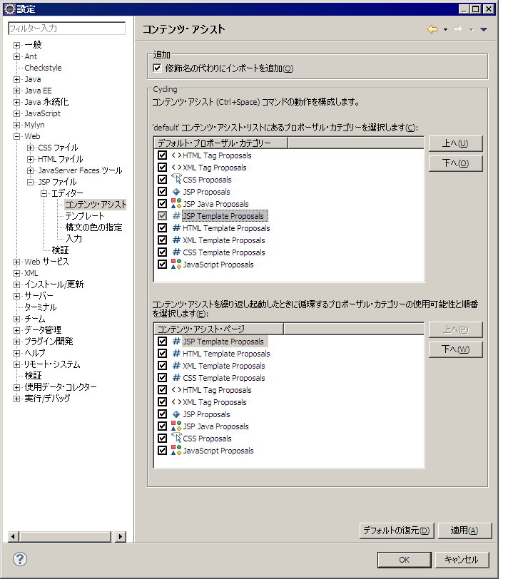

# UI部品の実装サンプルで提供しているEclipse補完テンプレート

## Eclipse補完テンプレートの導入方法

1. [Eclipse補完テンプレートの定義ファイル](../../../knowledge/component/ui-framework/assets/ui-framework-template_list/templates.xml) をダウンロードする。
2. Eclipseの設定画面（ウィンドウ>設定）で、「Web」>「JSPファイル」>「エディター」>「テンプレート」を選択する。
   
3. 「インポート」ボタンをクリックし、上記からダウンロードしたファイルを選択する。
4. 設定画面の「Web」>「JSPファイル」>「エディター」>「コンテンツ・アシスト」を選択する。
   
5. 「デフォルト・プロポーザル・カテゴリー」のうち、「JSP Template Proposal」を一番上に移動する。
   

keywords

Eclipse補完テンプレート, テンプレートのインポート, JSPファイル設定, コンテンツ・アシスト, JSP Template Proposal, templates.xml

## Eclipse補完テンプレートの一覧

テンプレート名を入力し、`C-SPC` を入力することでテンプレートの内容が展開される。

## 入力・表示系ウィジェット

| テンプレート名 | 出力タグ |
|---|---|
| カレンダー日付入力UI部品 | field:calendar |
| チェックボックス | field:checkbox |
| チェックボックス（コード） | field:code_checkbox |
| テキスト | field:text |
| テキストラベル（コード） | field:label_code |
| パスワード | field:password |
| ファイル選択 | field:file |
| プルダウン | field:pulldown |
| プルダウン(コード) | field:code_pulldown |
| ブロック | field:block |
| ラジオボタン | field:radio |
| ラジオボタン（コード） | field:code_radio |
| ラベル | field:label |
| ラベルブロック | field:label_block |
| リストビルダー | field:listbuilder |
| 入力時の留意点を表示する領域 | field:hint |
| 複数行テキスト | field:textarea |
| ID値と名称（VALUE）を「:」で連結 | field:label_id_value |

## テーブル系ウィジェット

| テンプレート名 | 出力タグ |
|---|---|
| テーブル | table:plain |
| 検索結果テーブル | table:search_result |
| ツリーリスト | table:treelist |
| マルチ行レイアウト | table:row |
| コード列 | column:code |
| チェックボックス列 | column:checkbox |
| ラジオボタン列 | column:radio |
| ラベル列 | column:label |
| リンク列 | column:link |

## ボタン・リンク系ウィジェット

| テンプレート名 | 出力タグ |
|---|---|
| 確認ボタン | button:check |
| 確定ボタン | button:confirm |
| 検索ボタン | button:search |
| 更新ボタン | button:update |
| 削除ボタン | button:delete |
| 送信ボタン | button:submit |
| 戻るボタン | button:back |
| キャンセルボタン | button:cancel |
| 閉じるボタン | button:close |
| ダウンロードボタン | button:download |
| ポップアップ画面用ボタン | button:popup |
| ボタン用ブロック | button:block |
| サブミット用リンク | link:submit |

## タブ系ウィジェット

| テンプレート名 | 出力タグ |
|---|---|
| タブによる表示内容切り替え(Content) | tab:content |
| タブによる表示内容切り替え(Group) | tab:group |
| タブ型リンク | tab:link |

## 表示領域系ウィジェット

| テンプレート名 | 出力タグ |
|---|---|
| 任意コンテンツ配置領域 | box:content |
| タイトル配置領域 | box:title |
| 画像配置領域 | box:img |

## 入力画面・確認画面切り替え

| テンプレート名 | 出力タグ |
|---|---|
| 確認画面用 | n:forConfirmationPage |
| 入力画面用 | n:forInputPage |

## JSPファイルテンプレート

| テンプレート名 | 説明 |
|---|---|
| 検索画面JSPテンプレート | 検索画面のJSPファイルテンプレート |
| エラー画面JSPテンプレート | エラー画面のJSPファイルテンプレート |
| 登録画面JSPテンプレート | 登録画面のJSPファイルテンプレート |
| 確認画面JSPテンプレート | 確認画面のJSPファイルテンプレート |
| 完了画面JSPテンプレート | 完了画面のJSPファイルテンプレート |

## 設計情報用タグ

| テンプレート名 | 出力タグ |
|---|---|
| 画面レイアウト | spec:layout |
| 画面表示パターン | spec:condition |
| 設計情報コメント | spec:desc |
| 精査仕様定義 | spec:validation |
| 設計メタ情報 | 設計のメタ情報(作成者、日付など) |

keywords

Eclipse補完テンプレート一覧, field:calendar, field:checkbox, field:text, field:pulldown, table:plain, table:search_result, button:submit, n:forConfirmationPage, n:forInputPage, spec:layout, UIウィジェットテンプレート, C-SPC

