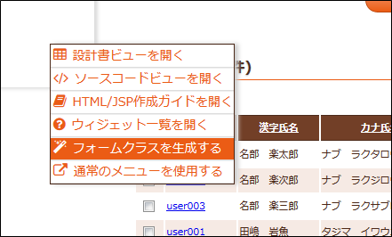

# 業務画面JSPからフォームクラスを生成する

## 概要

本項では、設計工程で作成した業務画面JSPから、フォームクラスのJavaソースコードを生成する方法について説明する。

> **Warning:**
> 本機能を使用する前に、全ての入力フィールドについてname属性を設定すること。

## 使用方法

本機能は、業務画面JSPをローカル表示して、右クリックで開かれるコンテキストメニューから実行することができる。(下図)

このメニューの「フォームクラスを生成する」を選択すると、ブラウザのダウンロードダイアログが開かれ、
生成されたソースコードをローカルディスク上の任意の場所に保存することができる。

生成されたソースコードには、業務画面の入力項目に対応したフィールド定義、アクセサ、単項目精査を定義する
アノテーションが含まれている。

それ以外の下記に挙げる内容については、このクラスを継承したサブクラス側に実装する。

* ウィンドウスコープ上の画面間引き回し用変数や、hidden項目などの単項目精査処理
* 項目間精査処理
* **<jsp:include>** などを用いて共通化された項目に対する精査処理

  > **Note:**
> 共通項目に対する精査処理は各フォームに個別に実装するのではなく、
  > 共通コンポーネントとして提供し、各フォームから利用する形とすること。
