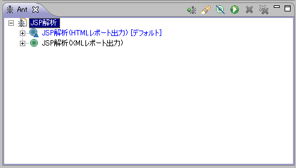

# JSP静的解析ツール インストールガイド

[JSP静的解析ツール](../../development-tools/java-static-analysis/java-static-analysis-04-JspStaticAnalysis.md) のインストール方法について説明する。

## 前提条件

* Nablarch開発環境構築ガイドに従ってNablarchサンプルアプリケーションがインストールされていること。

## インストール

本ツールはNablarchサンプルアプリケーションの <プロジェクトルート>/tool/jspanalysis 直下に配置した状態で配布されている。
ディレクトリごと任意の場所にコピーすればインストールは完了する。

## ツール構成

ツールの構成は下表の通り。

| ファイル名 | 説明 |
|---|---|
| jsp-analysis-build.properties | Antビルドファイル用設定ファイル |
| jsp-analysis-build.xml | Antビルドファイル |
| config.txt | JSP静的解析ツール設定ファイル |
| transform-to-html.xsl | JSP静的解析結果XMLをHTMLに変換する際の定義ファイル |

## Antビルドファイル用設定ファイルの書き換え

Antビルドファイル用設定ファイルを実行環境にあわせて修正する。

| 設定プロパティ | 説明 |
|---|---|
| project.test | プロジェクトのテストディレクトリのパスを設定する。  例:  ``` ./test ``` |
| project.test.lib | テスト用のライブラリが配置されたディレクトリを設定する。  例:  ``` ${project.test}/lib ``` |
| checkjspdir | チェック対象JSPディレクトリパスもしくはファイルパスを設定する。  CI環境のように一括でチェックを実行する場合には、 ディレクトリパスを設定する。  例:  ``` ./main/web ```  ディレクトリを指定した場合は、再帰的にチェックが実行される。 |
| xmloutput | チェック結果のXMLレポートファイルの出力パスを設定する。  例:  ``` ./build/reports/jsp/report.xml ``` |
| htmloutput | チェック結果のHTMLレポートファイルの出力パスを設定する。  例:  ``` ./build/reports/jsp/report.html ``` |
| checkconfig | JSP静的解析ツール設定ファイルのファイルパスを設定する。  例:  ``` ./tool/jspanalysis/config.txt ``` |
| charset | チェック対象JSPファイルの文字コードを設定する。  例:  ``` utf-8 ``` |
| lineseparator | チェック対象JSPファイルで使用されている改行コードを設定する。  例:  ``` \\n ``` |
| xsl | チェック結果のXMLをHTMLファイルに変換する際のXSLTファイルパスを設定する。  例:  ``` ./tool/jspanalysis/transform-to-html.xsl ``` |
| additionalext | チェック対象とするJSPファイルの拡張子を設定する。  複数の拡張子を指定する場合には、カンマ(,)区切りで指定する。 この設定値の内容にかかわらず、拡張子が `jsp` のファイルは必ず チェック対象となる。  例:  ``` tag ``` |
| excludePatterns | チェック対象外とするディレクトリ（ファイル）名を正規表現で設定する。  複数のパターンを設定する場合には、カンマ(,)区切りで指定する。  例:  ``` ui_local,ui_test,ui_test/.*/set.tag ``` |

> **Note:**
> ファイルパス(ディレクトリパス)は、絶対パスでの指定も可能となっている。

## Eclipseとの連携設定

以下に、Eclipseから本ツールを起動する手順を示す。

### Antビュー起動

ツールバーから、ウィンドウ(Window)→設定(Show View)を選択し、Antビューを開く。


### ビルドファイル登録

＋印のアイコンを押下し、ビルドスクリプトを選択する。


Antビルドファイル(jsp_analysis_build.xml)を選択する。


Antビューに登録したビルドファイルが表示されることを確認する。


